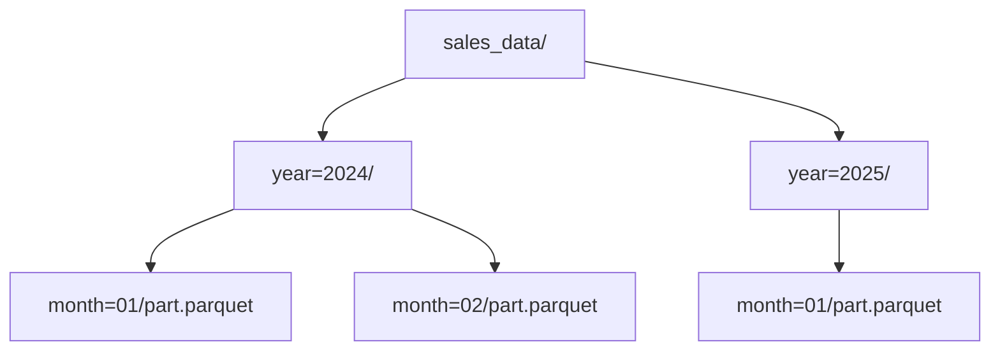

## Reading and Writing Parquet Files

### Overview

Parquet is a columnar, binary storage format designed for efficient storage and fast analytical reads, in contrast to row-oriented text formats like CSV or JSON. Pandas provides `read_parquet()` and `to_parquet()`, both of which delegate to an external engine library rather than implementing Parquet parsing natively.

### Required Dependencies

Parquet support requires one of two engine packages:

```bash
pip install pyarrow
```
or
```bash
pip install fastparquet
```

[Unverified] Current default engine selection behavior (which engine Pandas picks automatically if both are installed) depends on the installed Pandas version, and I cannot confirm the exact current default without checking documentation for a specific version.

### Basic Reading

```python
import pandas as pd

df = pd.read_parquet("data.parquet")
```

Parquet files embed their own schema (column names and types), so unlike CSV, no `dtype` inference from raw text is needed — types are read directly from the file's metadata.

### Basic Writing

```python
df.to_parquet("output.parquet", engine="pyarrow", index=False)
```

**Key Points**
- `index=False` avoids writing the DataFrame's row index as a stored column; `index=None` (default) lets the engine decide based on index type.
- Because Parquet stores a schema, all columns must have well-defined, engine-supported dtypes at write time; some exotic or mixed-type object columns may raise errors or require explicit conversion first.

### Column Selection on Read

A key structural advantage of Parquet is that it is stored column-by-column, so reading a subset of columns can avoid loading the rest of the file into memory.

```python
df = pd.read_parquet("data.parquet", columns=["id", "value", "timestamp"])
```

[Inference] This selective-column read is generally more memory- and time-efficient than loading the full file, because columnar storage allows the engine to skip unrequested column blocks — this follows from Parquet's documented columnar layout, but I have not benchmarked it directly here.

### Partitioned Parquet Datasets

Parquet is commonly stored not as a single file but as a directory of partitioned files, split by one or more column values:



Writing a partitioned dataset:

```python
df.to_parquet("sales_data/", engine="pyarrow", partition_cols=["year", "month"])
```

Reading it back (pointing at the directory, not a single file):

```python
df = pd.read_parquet("sales_data/")
```

**Key Points**
- `partition_cols` values become directory-encoded columns rather than being stored inside each individual Parquet file's binary column data.
- Reading a partitioned directory can filter at the partition level before decoding file contents, using the `filters` argument (pyarrow engine):

```python
df = pd.read_parquet(
    "sales_data/",
    filters=[("year", "=", 2025)]
)
```

[Inference] Filtering via the `filters` argument at read time is generally more efficient than reading all partitions and filtering afterward in Pandas, since unmatched partition directories can be skipped entirely without being opened — this follows from how partition pruning is documented to work, but exact performance depends on file layout and engine version, which I have not tested here.

### Compression

Parquet supports several compression codecs applied per column chunk:

```python
df.to_parquet("output.parquet", compression="snappy")
```

Common values: `"snappy"` (default in many setups), `"gzip"`, `"brotli"`, `"zstd"`, or `None` for uncompressed.

[Unverified] The exact default compression codec depends on the engine and version in use; I do not have a confirmed, version-specific default to state here.

**Key Points**
- `"snappy"` is optimized for speed over compression ratio.
- `"gzip"` and `"zstd"` generally compress smaller at the cost of more CPU time during read/write. [Inference] This is a general characteristic of these codecs' design tradeoffs, not a benchmark run on this data.

### Data Type Preservation

Unlike CSV or JSON, Parquet preserves Pandas/NumPy dtypes more precisely across a round trip, including:

- Distinct integer types (`int32`, `int64`)
- Timezone-aware datetimes
- Categorical dtypes (when using the `pyarrow` engine, which supports Arrow's dictionary-encoded type)
- Nullable extension types (`Int64`, `boolean`) [Unverified] — exact support depends on the engine and installed library versions, and I do not have a verified compatibility matrix to cite here.

```python
df["category_col"] = df["category_col"].astype("category")
df.to_parquet("output.parquet")

df2 = pd.read_parquet("output.parquet")
print(df2["category_col"].dtype)
```

### Schema Consistency Considerations

When appending or combining multiple Parquet files (e.g., across partitions written at different times), mismatched schemas — a column present in one file but not another, or stored as a different type — can cause errors or silent type coercion on read, depending on the engine.

I cannot verify the exact behavior across every engine/version combination without testing specific files, so I will not state a general rule here beyond: schema mismatches across partition files are a documented source of read errors in partitioned Parquet workflows generally.

### Common Errors and Causes

| Error | Likely cause |
|---|---|
| `ImportError: Unable to find a usable engine` | Neither `pyarrow` nor `fastparquet` installed |
| `ArrowInvalid: Schema mismatch` | Partitioned files have inconsistent column types |
| `ValueError: Mixed types` on write | Object column contains non-uniform Python types (e.g., strings and ints mixed) |
| Silent categorical-to-object conversion | Occurs with some engine/version combinations; [Unverified] exact trigger conditions not confirmed here |

### Parquet vs. CSV vs. JSON — Comparative Notes

| Aspect | Parquet | CSV | JSON |
|---|---|---|---|
| Storage layout | Columnar, binary | Row-based, text | Row-based, text |
| Schema stored in file | Yes | No | No (implicit) |
| Typical file size | Smaller (compressed) | Larger | Larger |
| Human-readable | No | Yes | Yes |
| Partial column reads | Efficient | Requires full row parse | Requires full parse |
| Native external dependency | Yes (pyarrow/fastparquet) | No | No |

[Inference] Parquet is commonly preferred for intermediate storage in ML pipelines with large tabular datasets, based on its columnar layout and schema preservation being suited to repeated partial reads — this reflects a documented design rationale for the format rather than a claim I have benchmarked myself.

### Diagram: Row-Oriented vs. Columnar Storage

<svg xmlns="http://www.w3.org/2000/svg" viewBox="0 0 760 260">
  <text x="380" y="24" text-anchor="middle" font-size="15" font-weight="bold" fill="#222">Row-Oriented vs Columnar Layout (svg_diagram)</text>

  <text x="160" y="55" text-anchor="middle" font-size="12" font-weight="bold" fill="#333">CSV (row-oriented)</text>
  <rect x="40" y="65" width="240" height="30" fill="#eef2fb" stroke="#4a6fa5" />
  <text x="160" y="85" text-anchor="middle" font-size="10">1, Alice, 30</text>
  <rect x="40" y="95" width="240" height="30" fill="#eef2fb" stroke="#4a6fa5" />
  <text x="160" y="115" text-anchor="middle" font-size="10">2, Bob, 25</text>
  <rect x="40" y="125" width="240" height="30" fill="#eef2fb" stroke="#4a6fa5" />
  <text x="160" y="145" text-anchor="middle" font-size="10">3, Carol, 40</text>
  <text x="160" y="175" text-anchor="middle" font-size="10" fill="#555">Read row = read all fields</text>

  <text x="580" y="55" text-anchor="middle" font-size="12" font-weight="bold" fill="#333">Parquet (columnar)</text>
  <rect x="440" y="65" width="70" height="90" fill="#e5f5e0" stroke="#4a9159" />
  <text x="475" y="82" text-anchor="middle" font-size="10">id</text>
  <text x="475" y="100" text-anchor="middle" font-size="9">1</text>
  <text x="475" y="118" text-anchor="middle" font-size="9">2</text>
  <text x="475" y="136" text-anchor="middle" font-size="9">3</text>

  <rect x="520" y="65" width="90" height="90" fill="#fdf3d7" stroke="#b8952f" />
  <text x="565" y="82" text-anchor="middle" font-size="10">name</text>
  <text x="565" y="100" text-anchor="middle" font-size="9">Alice</text>
  <text x="565" y="118" text-anchor="middle" font-size="9">Bob</text>
  <text x="565" y="136" text-anchor="middle" font-size="9">Carol</text>

  <rect x="620" y="65" width="80" height="90" fill="#f5e0e8" stroke="#a54a72" />
  <text x="660" y="82" text-anchor="middle" font-size="10">age</text>
  <text x="660" y="100" text-anchor="middle" font-size="9">30</text>
  <text x="660" y="118" text-anchor="middle" font-size="9">25</text>
  <text x="660" y="136" text-anchor="middle" font-size="9">40</text>

  <text x="580" y="175" text-anchor="middle" font-size="10" fill="#555">Read column = skip other blocks</text>
</svg>

### Related Topics

- Reading and writing Feather/Arrow IPC format
- Choosing between `pyarrow` and `fastparquet` engines in practice
- Schema evolution strategies for long-lived partitioned datasets
- Using `pyarrow.dataset` directly for advanced filtering/predicate pushdown
- Combining Parquet with Dask or Polars for out-of-core / larger-than-memory processing
- Compression codec tradeoffs (snappy vs. zstd vs. gzip) for storage vs. speed