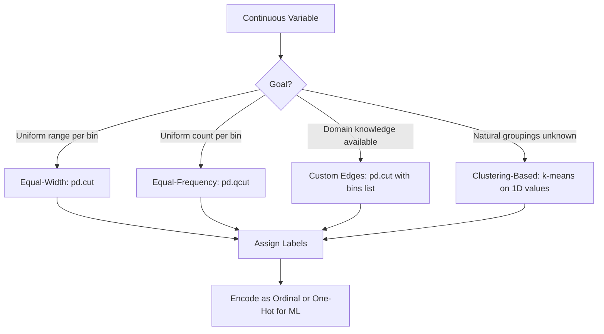

## Binning and Discretization of Continuous Variables

### Overview

Binning (also called discretization) is the process of converting continuous numerical variables into discrete categorical intervals, or "bins." Each continuous value is mapped to the bin it falls into, and the resulting variable can be treated as ordinal or categorical data. This technique is used in exploratory data analysis, feature engineering for machine learning, and simplifying noisy or high-cardinality continuous features.

### Why Binning Is Used

- **Noise reduction**: Grouping values into ranges can reduce the effect of small fluctuations or measurement errors.
- **Nonlinear relationship handling**: Some models (particularly linear models) cannot capture nonlinear relationships between a continuous feature and the target; binning can help expose such patterns as separate categories.
- **Interpretability**: Age groups (e.g., "18–25", "26–35") are often easier to interpret than raw ages in reports or models.
- **Handling outliers**: Extreme values can be grouped into an edge bin rather than distorting a model that is sensitive to magnitude.
- **Compatibility with categorical algorithms**: Some algorithms or encoding schemes work only with categorical or ordinal inputs.

[Inference] Whether binning improves a specific model's performance depends on the algorithm, the data distribution, and the binning strategy chosen. This is not guaranteed to hold across all datasets or model types.

### Types of Binning

#### 1. Equal-Width Binning

Divides the range of the variable into $n$ intervals of equal size.

$$\text{bin width} = \frac{\max(x) - \min(x)}{n}$$

Each bin covers the same span of values, but the number of observations per bin can vary significantly if the data is not uniformly distributed.

#### 2. Equal-Frequency Binning (Quantile Binning)

Divides the data so that each bin contains (approximately) the same number of observations. Bin widths vary, but the count per bin is balanced.

#### 3. Custom / Domain-Based Binning

Bin edges are defined manually based on domain knowledge (e.g., age brackets: 0–18, 19–35, 36–60, 60+).

#### 4. Clustering-Based Binning

[Inference] Techniques such as k-means can be used to determine bin boundaries based on the natural grouping of data points, rather than fixed-width or fixed-frequency rules. This approach depends on the clustering algorithm's convergence and initialization, and results may vary between runs unless a fixed random seed is used.

### Equal-Width Binning with Pandas — `pd.cut()`

`pd.cut()` bins values into discrete intervals based on the value itself.

```python
import pandas as pd
import numpy as np

data = pd.DataFrame({
    'age': [12, 25, 34, 45, 52, 67, 78, 89, 5, 41]
})

# Equal-width binning into 4 bins
data['age_bin'] = pd.cut(data['age'], bins=4)
print(data)
```

**Output**

```
   age          age_bin
0   12   (4.916, 26.0]
1   25   (4.916, 26.0]
2   34    (26.0, 47.0]
3   45    (26.0, 47.0]
4   52    (47.0, 68.0]
5   67    (47.0, 68.0]
6   78    (68.0, 89.0]
7   89    (68.0, 89.0]
8    5   (4.916, 26.0]
9   41    (26.0, 47.0]
```

By default, `pd.cut()` creates equal-width intervals. Intervals are shown as mathematical ranges, using `(` for exclusive boundaries and `]` for inclusive boundaries.

### Custom Bin Edges and Labels

```python
bin_edges = [0, 18, 35, 60, 100]
bin_labels = ['Minor', 'Young Adult', 'Adult', 'Senior']

data['age_group'] = pd.cut(
    data['age'],
    bins=bin_edges,
    labels=bin_labels,
    right=True,          # interval is (lower, upper]
    include_lowest=True  # ensures the lowest value is included
)
print(data[['age', 'age_group']])
```

**Output**

```
   age    age_group
0   12        Minor
1   25  Young Adult
2   34  Young Adult
3   45        Adult
4   52        Adult
5   67       Senior
6   78       Senior
7   89       Senior
8    5        Minor
9   41        Adult
```

**Key Points**

- `bins` can be an integer (equal-width bins computed automatically) or a list of explicit edges.
- `labels` assigns human-readable names to each interval; if omitted, Pandas shows the interval ranges.
- `right` controls whether the right edge of each bin is inclusive (default `True`).
- `include_lowest` ensures the minimum value in the data is not excluded when `right=True`.

### Equal-Frequency Binning with Pandas — `pd.qcut()`

`pd.qcut()` divides data into bins with (approximately) equal numbers of observations, using quantiles to determine bin edges.

```python
data['age_quantile'] = pd.qcut(data['age'], q=4)
print(data[['age', 'age_quantile']])
```

**Output**

```
   age      age_quantile
0   12    (4.999, 22.75]
1   25    (22.75, 39.5]
2   34    (22.75, 39.5]
3   45    (39.5, 58.75]
4   52    (39.5, 58.75]
5   67   (58.75, 89.0]
6   78   (58.75, 89.0]
7   89   (58.75, 89.0]
8    5    (4.999, 22.75]
9   41    (39.5, 58.75]
```

Each bin here contains approximately 2–3 observations, unlike the equal-width bins from `pd.cut()`, which had uneven counts.

**Key Points**

- `q` can be an integer (number of quantile-based bins) or a list of quantile edges (e.g., `[0, 0.25, 0.5, 0.75, 1]`).
- `pd.qcut()` is sensitive to duplicate values; if too many identical values fall on a bin edge, Pandas may raise an error or produce fewer bins than requested. Use `duplicates='drop'` to handle this.

```python
data['age_quantile'] = pd.qcut(data['age'], q=4, duplicates='drop')
```

### Binning with NumPy — `np.digitize()`

NumPy's `np.digitize()` returns the index of the bin each value belongs to, given a set of bin edges. It does not label bins directly but is useful when integrating binning into custom numerical pipelines.

```python
import numpy as np

ages = np.array([12, 25, 34, 45, 52, 67, 78, 89, 5, 41])
bin_edges = np.array([0, 18, 35, 60, 100])

bin_indices = np.digitize(ages, bin_edges)
print(bin_indices)
```

**Output**

```
[1 2 2 3 3 4 4 4 1 3]
```

Each value in the output represents the index of the bin (1-based relative to `bin_edges`) that the corresponding age falls into.

**Key Points**

- `np.digitize()` is often faster than `pd.cut()` for large arrays because it operates directly on NumPy arrays without the overhead of Pandas' `Categorical` type.
- [Unverified] Relative performance differences between `np.digitize()` and `pd.cut()` depend on array size, data type, and hardware; no universal benchmark applies to all cases.
- The `right` parameter in `np.digitize()` controls whether bin edges are inclusive on the right or left side, similar to `pd.cut()`.

### Visualizing Bin Assignment

<svg xmlns="http://www.w3.org/2000/svg" viewBox="0 0 720 260" font-family="sans-serif">
<text x="360" y="24" text-anchor="middle" font-size="16" font-weight="bold" fill="#222">Equal-Width vs Equal-Frequency Binning (svg_diagram)</text>

<line x1="60" y1="80" x2="660" y2="80" stroke="#333" stroke-width="2" />
<text x="30" y="85" font-size="12" fill="#333">Values</text>

<circle cx="80" cy="80" r="5" fill="#2266cc" />
<circle cx="120" cy="80" r="5" fill="#2266cc" />
<circle cx="180" cy="80" r="5" fill="#2266cc" />
<circle cx="260" cy="80" r="5" fill="#2266cc" />
<circle cx="300" cy="80" r="5" fill="#2266cc" />
<circle cx="420" cy="80" r="5" fill="#2266cc" />
<circle cx="470" cy="80" r="5" fill="#2266cc" />
<circle cx="560" cy="80" r="5" fill="#2266cc" />
<circle cx="600" cy="80" r="5" fill="#2266cc" />
<circle cx="630" cy="80" r="5" fill="#2266cc" />


<text x="30" y="130" font-size="12" fill="#333">Equal-Width</text>

<rect x="60" y="115" width="150" height="30" fill="none" stroke="`#cc3333`" stroke-width="1.5" />

<rect x="210" y="115" width="150" height="30" fill="none" stroke="`#cc3333`" stroke-width="1.5" />

<rect x="360" y="115" width="150" height="30" fill="none" stroke="`#cc3333`" stroke-width="1.5" />

<rect x="510" y="115" width="150" height="30" fill="none" stroke="`#cc3333`" stroke-width="1.5" />

<text x="120" y="135" text-anchor="middle" font-size="11" fill="`#cc3333`">2 pts</text>

<text x="270" y="135" text-anchor="middle" font-size="11" fill="`#cc3333`">2 pts</text>

<text x="420" y="135" text-anchor="middle" font-size="11" fill="`#cc3333`">2 pts</text>

<text x="570" y="135" text-anchor="middle" font-size="11" fill="`#cc3333`">4 pts</text>


<text x="20" y="190" font-size="12" fill="#333">Equal-Frequency</text>

<rect x="60" y="175" width="130" height="30" fill="none" stroke="`#228833`" stroke-width="1.5" />

<rect x="190" y="175" width="150" height="30" fill="none" stroke="`#228833`" stroke-width="1.5" />

<rect x="340" y="175" width="140" height="30" fill="none" stroke="`#228833`" stroke-width="1.5" />

<rect x="480" y="175" width="180" height="30" fill="none" stroke="`#228833`" stroke-width="1.5" />

<text x="125" y="195" text-anchor="middle" font-size="11" fill="`#228833`">2–3 pts</text>

<text x="265" y="195" text-anchor="middle" font-size="11" fill="`#228833`">2–3 pts</text>

<text x="410" y="195" text-anchor="middle" font-size="11" fill="`#228833`">2–3 pts</text>

<text x="570" y="195" text-anchor="middle" font-size="11" fill="`#228833`">2–3 pts</text>

<text x="360" y="240" text-anchor="middle" font-size="11" fill="#555">Equal-width bins have uniform ranges; equal-frequency bins have uniform counts.</text>

</svg>

### Binning Workflow (Decision Path)



### Encoding Binned Variables for Machine Learning

Once a continuous variable is binned, the resulting categorical variable typically needs further encoding before being used in most machine learning algorithms.

```python
# Ordinal encoding (if bins have a natural order)
data['age_group_ordinal'] = data['age_group'].cat.codes

# One-hot encoding (if no ordinal relationship should be assumed by the model)
one_hot = pd.get_dummies(data['age_group'], prefix='age_group')
data = pd.concat([data, one_hot], axis=1)
print(data.head())
```

**Key Points**

- `.cat.codes` converts a Pandas `Categorical` column into integer codes based on category order.
- `pd.get_dummies()` creates binary indicator columns for each category, avoiding the assumption of ordinal relationships between bins.
- [Inference] The choice between ordinal and one-hot encoding for binned variables should generally reflect whether the bins have a meaningful order that a model should exploit; this is a modeling decision that depends on context and is not universally fixed.

### Handling Edge Cases

- **Values outside bin range**: Values falling outside the defined `bins` range in `pd.cut()` are assigned `NaN`. These should be checked for and handled explicitly (e.g., via `dropna()`, imputation, or extending bin edges with `-np.inf` / `np.inf`).

```python
bin_edges_open = [-np.inf, 18, 35, 60, np.inf]
data['age_group_safe'] = pd.cut(data['age'], bins=bin_edges_open, labels=bin_labels)
```

- **Duplicate bin edges in `qcut`**: As shown earlier, use `duplicates='drop'` to avoid errors when quantile boundaries coincide.
- **Sparse bins**: Bins with very few observations can create unstable estimates in downstream models. [Inference] Merging sparse bins with adjacent bins is a common mitigation strategy, though the appropriate threshold for "sparse" depends on dataset size and use case.

### Binning and Information Loss

Discretization inherently reduces the granularity of information contained in a continuous variable. Two data points at the extreme ends of the same bin are treated identically after binning, even though their original values differed.

$$H(X_{\text{binned}}) \leq H(X_{\text{continuous}})$$

[Inference] This inequality reflects the general information-theoretic principle that discretization cannot increase the information content of a variable, though the practical impact on a specific model's predictive performance is not guaranteed and depends on the modeling context. [Unverified] The magnitude of this effect for any particular dataset would require empirical testing rather than assumption.

### Practical Considerations

- Binning should be fit on training data only, and the same bin edges should be applied to validation/test data to avoid data leakage.
- Use `pd.cut()` with pre-computed edges (from the training set) rather than recomputing bins with `qcut()` separately on test data.

```python
# Fit bins on training data
train_data['age'] = pd.cut(train_data['age_raw'], bins=4, retbins=False)
_, bin_edges = pd.cut(train_data['age_raw'], bins=4, retbins=True)

# Apply the same edges to test data
test_data['age'] = pd.cut(test_data['age_raw'], bins=bin_edges)
```

**Key Points**

- `retbins=True` returns the computed bin edges alongside the binned Series, allowing reuse on other datasets.
- Applying inconsistent bin edges between training and test sets is a common source of data leakage or evaluation errors in ML pipelines.

### Conclusion

Binning transforms continuous variables into discrete categories using strategies such as equal-width (`pd.cut()`), equal-frequency (`pd.qcut()`), custom domain-based edges, or clustering-based methods. Each approach involves trade-offs between interpretability, information retention, and suitability for specific modeling tasks. [Inference] Selecting a binning strategy generally requires understanding both the data distribution and the requirements of the downstream model, and no single method is universally preferable across use cases.

**Related Topics**

- One-hot encoding and ordinal encoding of categorical variables
- Feature scaling: normalization and standardization
- Handling skewed distributions with log and power transforms
- Feature engineering for tree-based models vs. linear models
- Data leakage prevention in preprocessing pipelines
- Entropy-based (supervised) discretization methods
- Handling missing values before and after binning