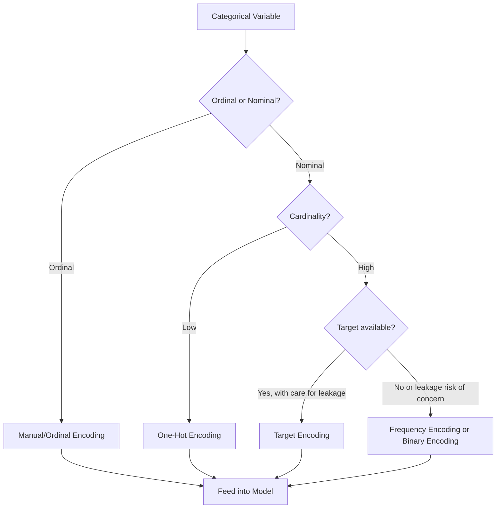

## Encoding Categorical Variables

### Overview

Categorical variables represent data that takes on a limited set of discrete values, such as labels, categories, or classes (e.g., "red," "blue," "green" or "low," "medium," "high"). Most machine learning algorithms require numerical input, so categorical variables must be converted into a numerical representation before being used in a model. This process is called encoding.

### Types of Categorical Variables

#### Nominal Variables

Categories with no inherent order (e.g., "cat," "dog," "bird"). No category is greater or lesser than another.

#### Ordinal Variables

Categories with a meaningful order or ranking (e.g., "low," "medium," "high"). The relative order carries information that the encoding should generally preserve.

[Inference] Whether a variable should be treated as ordinal or nominal depends on the specific domain and how the categories relate to one another; this determination is not automatic and typically requires human judgment.

### Why Encoding Matters

- Most ML algorithms (e.g., linear regression, SVMs, neural networks) operate on numerical inputs and cannot process string labels directly.
- Some algorithms (e.g., certain tree-based implementations) can handle categorical splits natively, but many popular libraries still expect numeric input.
- The choice of encoding method can affect model performance, interpretability, and the risk of introducing unintended ordinal relationships.

[Inference] The specific impact of an encoding choice on model performance depends on the algorithm, dataset, and cardinality of the categorical variable. This is not a fixed or universal effect, and outcomes may vary across datasets.

### Label Encoding

Label encoding assigns a unique integer to each category.

```python
import pandas as pd
from sklearn.preprocessing import LabelEncoder

data = pd.DataFrame({
    'color': ['red', 'blue', 'green', 'blue', 'red']
})

encoder = LabelEncoder()
data['color_encoded'] = encoder.fit_transform(data['color'])
print(data)
```

**Output**

```
   color  color_encoded
0    red              2
1   blue              0
2  green              1
3   blue              0
4    red              2
```

**Key Points**

- `LabelEncoder` assigns integers in alphabetical order by default.
- Label encoding introduces an implicit ordinal relationship (e.g., 2 > 1 > 0) even when the underlying categories are nominal. [Inference] This can mislead algorithms that interpret numeric magnitude as meaningful, such as linear models, though the practical effect depends on the specific algorithm and how it uses the feature.
- Label encoding is generally more appropriate for ordinal variables where the assigned order matches the natural order of the categories, or for tree-based models that split on thresholds rather than assuming linear relationships.

### Manual Ordinal Encoding

When a categorical variable has a genuine order, mapping categories manually preserves the intended ranking rather than relying on alphabetical assignment.

```python
size_data = pd.DataFrame({
    'size': ['small', 'medium', 'large', 'medium', 'small']
})

size_mapping = {'small': 0, 'medium': 1, 'large': 2}
size_data['size_encoded'] = size_data['size'].map(size_mapping)
print(size_data)
```

**Output**

```
     size  size_encoded
0   small             0
1  medium             1
2   large             2
3  medium             1
4   small             0
```

**Key Points**

- Manual mapping via `.map()` gives explicit control over the assigned order, which is important for ordinal variables.
- Any category not present in the mapping dictionary will be encoded as `NaN`; this should be checked for explicitly.

### One-Hot Encoding

One-hot encoding creates a new binary column for each category, indicating presence (1) or absence (0).

```python
data_onehot = pd.get_dummies(data[['color']], prefix='color')
print(data_onehot)
```

**Output**

```
   color_blue  color_green  color_red
0       False        False       True
1        True        False      False
2       False         True      False
3        True        False      False
4       False        False       True
```

**Key Points**

- One-hot encoding avoids introducing false ordinal relationships between nominal categories.
- It increases dimensionality significantly for high-cardinality categorical variables (many unique categories), which can lead to sparse data and increased memory usage.
- `drop_first=True` can be used to drop one category and avoid multicollinearity (the "dummy variable trap") in linear models.

```python
data_onehot_dropped = pd.get_dummies(data[['color']], prefix='color', drop_first=True)
print(data_onehot_dropped)
```

**Output**

```
   color_green  color_red
0        False       True
1        False      False
2         True      False
3        False      False
4        False       True
```

### One-Hot Encoding with Scikit-learn

```python
from sklearn.preprocessing import OneHotEncoder
import numpy as np

encoder = OneHotEncoder(sparse_output=False)
encoded_array = encoder.fit_transform(data[['color']])
print(encoded_array)
print(encoder.get_feature_names_out())
```

**Output**

```
[[0. 0. 1.]
 [1. 0. 0.]
 [0. 1. 0.]
 [1. 0. 0.]
 [0. 0. 1.]]
['color_blue' 'color_green' 'color_red']
```

**Key Points**

- `OneHotEncoder` from scikit-learn integrates directly into ML pipelines (e.g., `Pipeline`, `ColumnTransformer`) and supports consistent transformation of unseen data in test sets.
- The `handle_unknown='ignore'` parameter allows the encoder to handle categories in test data that were not seen during training, encoding them as all zeros instead of raising an error.

```python
encoder = OneHotEncoder(sparse_output=False, handle_unknown='ignore')
```

### Ordinal Encoding with Scikit-learn

```python
from sklearn.preprocessing import OrdinalEncoder

ordinal_data = pd.DataFrame({
    'size': ['small', 'medium', 'large', 'medium', 'small']
})

encoder = OrdinalEncoder(categories=[['small', 'medium', 'large']])
ordinal_data['size_encoded'] = encoder.fit_transform(ordinal_data[['size']])
print(ordinal_data)
```

**Output**

```
     size  size_encoded
0   small           0.0
1  medium           1.0
2   large           2.0
3  medium           1.0
4   small           0.0
```

**Key Points**

- The `categories` parameter allows explicit specification of category order, avoiding the default alphabetical ordering used when categories are not specified.
- `OrdinalEncoder` is designed for feature columns (2D input), while `LabelEncoder` is designed for target/label columns (1D input); using them interchangeably is a common point of confusion.

### Frequency / Count Encoding

Replaces each category with the frequency (or count) of its occurrence in the dataset.

```python
freq_data = pd.DataFrame({
    'city': ['NY', 'LA', 'NY', 'SF', 'LA', 'NY']
})

freq_map = freq_data['city'].value_counts(normalize=True)
freq_data['city_freq_encoded'] = freq_data['city'].map(freq_map)
print(freq_data)
```

**Output**

```
  city  city_freq_encoded
0   NY           0.500000
1   LA           0.333333
2   NY           0.500000
3   SF           0.166667
4   LA           0.333333
5   NY           0.500000
```

**Key Points**

- Frequency encoding avoids the dimensionality explosion of one-hot encoding for high-cardinality variables.
- [Inference] A limitation of this approach is that two different categories with the same frequency will be encoded identically, potentially losing distinguishing information; whether this matters depends on the dataset and model.
- This method does not inherently introduce ordinal relationships based on category identity, but it does introduce a relationship based on frequency, which may or may not be meaningful depending on the context.

### Target Encoding (Mean Encoding)

Replaces each category with a statistic (commonly the mean) of the target variable for that category.

```python
target_data = pd.DataFrame({
    'city': ['NY', 'LA', 'NY', 'SF', 'LA', 'NY'],
    'target': [1, 0, 1, 0, 1, 0]
})

target_means = target_data.groupby('city')['target'].mean()
target_data['city_target_encoded'] = target_data['city'].map(target_means)
print(target_data)
```

**Output**

```
  city  target  city_target_encoded
0   NY       1              0.666667
1   LA       0              0.500000
2   NY       1              0.666667
3   SF       0              0.000000
4   LA       1              0.500000
5   NY       0              0.666667
```

**Key Points**

- Target encoding can introduce data leakage if computed on the full dataset (including validation/test rows) before splitting; it should generally be computed only on training data and then applied to validation/test sets.
- [Inference] Cross-validation-based target encoding schemes (e.g., k-fold target encoding) are commonly used to reduce leakage and overfitting risk, though this does not eliminate the risk entirely and effectiveness depends on implementation details.
- This technique is often used in gradient boosting contexts, but [Unverified] its comparative effectiveness against other encoding methods depends on the specific dataset, target distribution, and model, and no single source is being cited here for a general performance ranking.

### Binary Encoding

Converts categories into integer codes, then represents those integers in binary form, splitting the binary digits into separate columns. This reduces dimensionality compared to one-hot encoding while avoiding some of the ordinal assumptions of label encoding.

```python
# Requires the category_encoders library
import category_encoders as ce

binary_data = pd.DataFrame({
    'city': ['NY', 'LA', 'SF', 'NY', 'LA']
})

encoder = ce.BinaryEncoder(cols=['city'])
binary_encoded = encoder.fit_transform(binary_data)
print(binary_encoded)
```

**Output**

```
   city_0  city_1
0       0       1
1       1       0
2       1       1
3       0       1
4       1       0
```

**Key Points**

- Binary encoding requires the third-party `category_encoders` library, which is not part of core Pandas or scikit-learn.
- [Unverified] The exact bit assignments shown depend on the internal ordering logic of `category_encoders` and may differ between versions of the library; the output above illustrates the general structure rather than a guaranteed exact result.

### Comparison of Encoding Methods



### Visualizing Encoding Dimensionality

<svg xmlns="http://www.w3.org/2000/svg" viewBox="0 0 720 300" font-family="sans-serif">
<text x="360" y="24" text-anchor="middle" font-size="16" font-weight="bold" fill="#222">Encoding Method vs Output Dimensionality (svg_diagram)</text>

<line x1="80" y1="250" x2="680" y2="250" stroke="#333" stroke-width="2" />
<line x1="80" y1="250" x2="80" y2="50" stroke="#333" stroke-width="2" />
<text x="380" y="280" text-anchor="middle" font-size="12" fill="#333">Encoding Method</text>
<text x="30" y="150" text-anchor="middle" font-size="12" fill="#333" transform="rotate(-90 30 150)">Output Columns</text>

<rect x="120" y="230" width="70" height="20" fill="#2266cc" />
<text x="155" y="245" text-anchor="middle" font-size="10" fill="white">1</text>
<text x="155" y="270" text-anchor="middle" font-size="11" fill="#333">Label</text>
<rect x="230" y="230" width="70" height="20" fill="#2266cc" />
<text x="265" y="245" text-anchor="middle" font-size="10" fill="white">1</text>
<text x="265" y="270" text-anchor="middle" font-size="11" fill="#333">Ordinal</text>
<rect x="340" y="215" width="70" height="35" fill="#cc8822" />
<text x="375" y="235" text-anchor="middle" font-size="10" fill="white">2</text>
<text x="375" y="270" text-anchor="middle" font-size="11" fill="#333">Binary</text>
<rect x="450" y="210" width="70" height="40" fill="#cc8822" />
<text x="485" y="235" text-anchor="middle" font-size="10" fill="white">1</text>
<text x="485" y="270" text-anchor="middle" font-size="11" fill="#333">Frequency</text>
<rect x="560" y="100" width="70" height="150" fill="#cc3333" />
<text x="595" y="180" text-anchor="middle" font-size="10" fill="white">N cats</text>
<text x="595" y="270" text-anchor="middle" font-size="11" fill="#333">One-Hot</text>

<text x="380" y="40" text-anchor="middle" font-size="10" fill="#555">Bar heights are illustrative, not measured from a specific dataset.</text>

</svg>

### Practical Considerations for Machine Learning Pipelines

- **Fit on training data only**: Encoders (especially target and frequency encoders) should be fit on training data and applied to validation/test data using the same mapping, to avoid data leakage.
- **Unseen categories**: Test or production data may contain categories not seen during training. Handling strategies include assigning a default value, using `handle_unknown='ignore'` (scikit-learn), or grouping rare categories into an "other" bucket before encoding.
- **High-cardinality features**: For variables with many unique categories (e.g., zip codes, user IDs), one-hot encoding can produce very large, sparse feature matrices. [Inference] Frequency encoding, target encoding, or embedding-based approaches (in deep learning contexts) are commonly used alternatives, though the best choice depends on the dataset size, model type, and computational constraints.
- **Tree-based models vs. linear models**: [Inference] Tree-based models (e.g., decision trees, random forests, gradient boosting) can sometimes work reasonably well with label-encoded or ordinal-encoded nominal variables because they split on thresholds rather than assuming linear numeric relationships, whereas linear models and distance-based models (e.g., k-NN, SVM with certain kernels) are generally more sensitive to false ordinal assumptions. This is a general tendency, not a fixed rule, and behavior can vary by implementation and dataset.

### Encoding and Missing Values

Missing values in categorical columns should generally be handled before or during encoding, rather than left unaddressed.

```python
data_with_na = pd.DataFrame({
    'color': ['red', 'blue', None, 'blue', 'red']
})

# Option 1: Treat missing values as their own category
data_with_na['color_filled'] = data_with_na['color'].fillna('missing')
encoded_na = pd.get_dummies(data_with_na[['color_filled']], prefix='color')
print(encoded_na)
```

**Output**

```
   color_blue  color_missing  color_red
0       False          False       True
1        True          False      False
2       False           True      False
3        True          False      False
4       False          False       True
```

**Key Points**

- Treating missing values as an explicit category can be informative if "missingness" itself correlates with the target variable, but [Inference] whether this is appropriate depends on why the data is missing (e.g., missing completely at random vs. missing not at random), which is a judgment call based on domain knowledge.
- Alternative approaches include imputing missing categorical values with the mode, or using a separate missing-value indicator column alongside another imputation strategy.

### Conclusion

Encoding categorical variables converts non-numeric labels into numeric representations that machine learning algorithms can process. The choice among label encoding, ordinal encoding, one-hot encoding, frequency encoding, target encoding, and binary encoding depends on factors such as whether the variable is ordinal or nominal, the cardinality of the categories, the algorithm being used, and the risk of data leakage. [Inference] No single encoding method is universally optimal; selection generally requires considering the dataset and modeling context rather than applying a default choice in all situations.

**Related Topics**

- Handling high-cardinality categorical features
- Feature hashing for categorical variables
- Embeddings for categorical variables in deep learning
- Data leakage prevention in preprocessing pipelines
- Binning and discretization of continuous variables (previous topic)
- Handling missing data in categorical and numerical columns
- Building preprocessing pipelines with `ColumnTransformer`