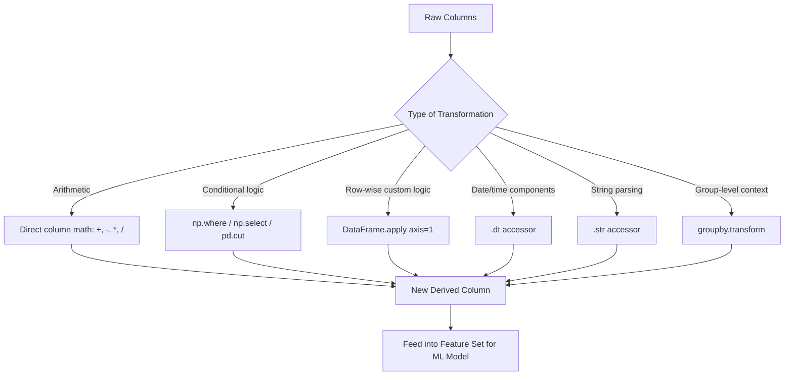

## Creating Derived and Computed Columns

### Overview

Derived (or computed) columns are new columns generated from one or more existing columns through arithmetic operations, logical conditions, string manipulation, or function application. Creating derived columns is a core part of feature engineering, allowing raw data to be transformed into forms that better capture patterns relevant to a machine learning task.

### Why Derived Columns Matter

- Raw features may not directly capture the relationships a model needs; derived columns can expose those relationships explicitly.
- Combining multiple columns (e.g., ratios, differences, interaction terms) can surface signal that individual columns do not show on their own.
- Domain knowledge often suggests specific transformations (e.g., converting birthdate to age, or computing body mass index from height and weight).

[Inference] Whether a specific derived column improves model performance depends on the dataset, the target variable, and the algorithm used. This is not guaranteed and should generally be evaluated empirically rather than assumed.

### Arithmetic Derived Columns

```python
import pandas as pd

data = pd.DataFrame({
    'height_cm': [170, 165, 180, 175],
    'weight_kg': [65, 59, 80, 72]
})

# Derived column: BMI = weight (kg) / height (m)^2
data['height_m'] = data['height_cm'] / 100
data['bmi'] = data['weight_kg'] / (data['height_m'] ** 2)
print(data)
```

**Output**

```
   height_cm  weight_kg  height_m        bmi
0        170         65      1.70  22.491349
1        165         59      1.65  21.671247
2        180         80      1.80  24.691358
3        175         72      1.75  23.510204
```

**Key Points**

- Vectorized arithmetic operations in Pandas (e.g., `+`, `-`, `*`, `/`, `**`) are applied element-wise across an entire column without explicit loops.
- Intermediate columns (like `height_m` here) can be dropped after use with `.drop(columns=[...])` if not needed downstream.

### Difference and Ratio Columns

```python
sales_data = pd.DataFrame({
    'revenue': [1000, 1500, 1200, 1800],
    'cost': [700, 900, 850, 1100]
})

sales_data['profit'] = sales_data['revenue'] - sales_data['cost']
sales_data['profit_margin'] = sales_data['profit'] / sales_data['revenue']
print(sales_data)
```

**Output**

```
   revenue  cost  profit  profit_margin
0     1000   700     300       0.300000
1     1500   900     600       0.400000
2     1200   850     350       0.291667
3     1800  1100     700       0.388889
```

**Key Points**

- Ratio columns can introduce division-by-zero issues if the denominator column contains zeros; this should be checked for explicitly (e.g., using `replace(0, np.nan)` or conditional logic) before computing ratios.

### Conditional (Logical) Derived Columns

```python
import numpy as np

data['bmi_category'] = np.where(data['bmi'] < 18.5, 'Underweight',
                          np.where(data['bmi'] < 25, 'Normal',
                          np.where(data['bmi'] < 30, 'Overweight', 'Obese')))
print(data[['bmi', 'bmi_category']])
```

**Output**

```
         bmi bmi_category
0  22.491349       Normal
1  21.671247       Normal
2  24.691358       Normal
3  23.510204       Normal
```

**Key Points**

- `np.where(condition, value_if_true, value_if_false)` is commonly nested to implement multi-branch logic, though deeply nested `np.where()` calls can become difficult to read.
- `pd.cut()` (covered in the binning topic) is often a cleaner alternative when the conditions correspond to numeric ranges, as shown here with BMI categories.

### Using `apply()` for Row-Wise or Column-Wise Logic

```python
def categorize_bmi(row):
    if row['bmi'] < 18.5:
        return 'Underweight'
    elif row['bmi'] < 25:
        return 'Normal'
    elif row['bmi'] < 30:
        return 'Overweight'
    else:
        return 'Obese'

data['bmi_category_apply'] = data.apply(categorize_bmi, axis=1)
print(data[['bmi', 'bmi_category_apply']])
```

**Output**

```
         bmi bmi_category_apply
0  22.491349              Normal
1  21.671247              Normal
2  24.691358              Normal
3  23.510204              Normal
```

**Key Points**

- `axis=1` applies the function row-wise, passing each row as a Series to the function.
- [Inference] `.apply()` with `axis=1` is generally slower than vectorized operations like `np.where()` or direct arithmetic, because it iterates over rows in Python rather than using optimized array operations. The actual performance difference depends on data size, function complexity, and Pandas version, so this should not be treated as a fixed benchmark.

### Derived Columns from Multiple Conditions — `np.select()`

```python
conditions = [
    data['bmi'] < 18.5,
    (data['bmi'] >= 18.5) & (data['bmi'] < 25),
    (data['bmi'] >= 25) & (data['bmi'] < 30),
    data['bmi'] >= 30
]
choices = ['Underweight', 'Normal', 'Overweight', 'Obese']

data['bmi_category_select'] = np.select(conditions, choices, default='Unknown')
print(data[['bmi', 'bmi_category_select']])
```

**Output**

```
         bmi bmi_category_select
0  22.491349               Normal
1  21.671247               Normal
2  24.691358               Normal
3  23.510204               Normal
```

**Key Points**

- `np.select()` is generally more readable than deeply nested `np.where()` calls when there are more than two or three conditions.
- The `default` parameter specifies the fallback value when none of the conditions are met, which helps catch unexpected or malformed input data.

### Date and Time Derived Columns

```python
dates_data = pd.DataFrame({
    'signup_date': pd.to_datetime(['2023-01-15', '2023-06-20', '2024-03-10'])
})

dates_data['signup_year'] = dates_data['signup_date'].dt.year
dates_data['signup_month'] = dates_data['signup_date'].dt.month
dates_data['days_since_signup'] = (pd.Timestamp('2026-07-04') - dates_data['signup_date']).dt.days
print(dates_data)
```

**Output**

```
  signup_date  signup_year  signup_month  days_since_signup
0  2023-01-15         2023             1                1266
1  2023-06-20         2023             6                1110
2  2024-03-10         2024             3                 847
```

**Key Points**

- The `.dt` accessor provides access to date/time components (year, month, day, weekday, etc.) for datetime-typed columns.
- Reference dates used in calculations like `days_since_signup` should be chosen deliberately (e.g., a fixed analysis date vs. the current date), since using `pd.Timestamp.now()` will produce different results depending on when the code is run.

### String-Based Derived Columns

```python
names_data = pd.DataFrame({
    'full_name': ['John Smith', 'Jane Doe', 'Alex Johnson']
})

names_data['first_name'] = names_data['full_name'].str.split(' ').str[0]
names_data['last_name'] = names_data['full_name'].str.split(' ').str[1]
names_data['name_length'] = names_data['full_name'].str.len()
print(names_data)
```

**Output**

```
      full_name first_name last_name  name_length
0    John Smith       John     Smith           10
1      Jane Doe       Jane       Doe            8
2  Alex Johnson       Alex   Johnson           12
```

**Key Points**

- The `.str` accessor provides vectorized string operations (split, length, case conversion, pattern extraction, etc.) on string-typed Pandas Series.
- [Inference] This simple split-based approach assumes a consistent "first last" name format; names with middle names, single names, or other formats would require additional handling logic specific to the dataset.

### Interaction Terms (Feature Crosses)

Interaction terms capture the combined effect of two or more variables, which may not be captured by considering each variable independently.

```python
interaction_data = pd.DataFrame({
    'rooms': [3, 4, 2, 5],
    'bathrooms': [2, 2, 1, 3]
})

interaction_data['rooms_bathrooms_interaction'] = (
    interaction_data['rooms'] * interaction_data['bathrooms']
)
print(interaction_data)
```

**Output**

```
   rooms  bathrooms  rooms_bathrooms_interaction
0      3          2                            6
1      4          2                            8
2      2          1                            2
3      5          3                           15
```

**Key Points**

- [Inference] Interaction terms are commonly used in linear models to capture combined effects that a purely additive model cannot represent, since linear models otherwise assume features contribute independently to the outcome. Whether a specific interaction term improves a given model is dataset-dependent and would need to be validated rather than assumed.
- Scikit-learn's `PolynomialFeatures` can automatically generate interaction terms (and polynomial terms) across multiple columns.

```python
from sklearn.preprocessing import PolynomialFeatures

poly = PolynomialFeatures(degree=2, interaction_only=True, include_bias=False)
poly_features = poly.fit_transform(interaction_data[['rooms', 'bathrooms']])
print(poly_features)
print(poly.get_feature_names_out())
```

**Output**

```
[[ 3.  2.  6.]
 [ 4.  2.  8.]
 [ 2.  1.  2.]
 [ 5.  3. 15.]]
['rooms' 'bathrooms' 'rooms_bathrooms_interaction']
```

### Aggregation-Based Derived Columns (Group-Level Features)

```python
group_data = pd.DataFrame({
    'department': ['Sales', 'Sales', 'IT', 'IT', 'HR'],
    'salary': [50000, 55000, 70000, 72000, 48000]
})

group_data['dept_avg_salary'] = group_data.groupby('department')['salary'].transform('mean')
group_data['salary_vs_dept_avg'] = group_data['salary'] - group_data['dept_avg_salary']
print(group_data)
```

**Output**

```
  department  salary  dept_avg_salary  salary_vs_dept_avg
0      Sales   50000          52500.0              -2500.0
1      Sales   55000          52500.0               2500.0
2         IT   70000          71000.0              -1000.0
3         IT   72000          71000.0               1000.0
4         HR   48000          48000.0                  0.0
```

**Key Points**

- `.transform()` returns a result aligned to the original DataFrame's index (unlike `.groupby().agg()`, which collapses rows), making it well-suited for creating group-level derived columns without losing row-level granularity.
- [Inference] Group-level derived features like deviation from a group average are often used to capture relative standing within a category, which can be informative in contexts such as salary analysis or sports statistics, though usefulness depends on the specific task.

### Derived Columns via Custom Functions with `apply()` and `lambda`

```python
temp_data = pd.DataFrame({
    'temp_celsius': [0, 20, 37, 100]
})

temp_data['temp_fahrenheit'] = temp_data['temp_celsius'].apply(lambda c: (c * 9/5) + 32)
print(temp_data)
```

**Output**

```
   temp_celsius  temp_fahrenheit
0             0             32.0
1            20             68.0
2            37             98.6
3           100            212.0
```

**Key Points**

- `lambda` functions are convenient for simple, one-line transformations applied via `.apply()`, but for large datasets, [Inference] a direct vectorized formula (e.g., `temp_data['temp_celsius'] * 9/5 + 32`) is generally faster than `.apply()` with a lambda, since it avoids per-row Python function call overhead. The exact performance difference depends on data size and is not being presented here as a measured benchmark.

### Visualizing the Derived Column Workflow



### Visualizing Derived Feature Relationships

<svg xmlns="http://www.w3.org/2000/svg" viewBox="0 0 700 260" font-family="sans-serif">
<text x="350" y="24" text-anchor="middle" font-size="16" font-weight="bold" fill="#222">Raw Columns to Derived Feature (svg_diagram)</text>

<rect x="40" y="60" width="140" height="50" rx="6" fill="#e8f0fe" stroke="#2266cc" stroke-width="1.5" />
<text x="110" y="90" text-anchor="middle" font-size="13" fill="#222">height_cm</text>
<rect x="40" y="150" width="140" height="50" rx="6" fill="#e8f0fe" stroke="#2266cc" stroke-width="1.5" />
<text x="110" y="180" text-anchor="middle" font-size="13" fill="#222">weight_kg</text>

<line x1="180" y1="85" x2="290" y2="120" stroke="#555" stroke-width="1.5" marker-end="url(#arrow)" />
<line x1="180" y1="175" x2="290" y2="140" stroke="#555" stroke-width="1.5" marker-end="url(#arrow)" />
<rect x="300" y="105" width="150" height="50" rx="6" fill="#fdece8" stroke="#cc3333" stroke-width="1.5" />
<text x="375" y="135" text-anchor="middle" font-size="13" fill="#222">bmi (derived)</text>

<line x1="450" y1="130" x2="540" y2="130" stroke="#555" stroke-width="1.5" marker-end="url(#arrow)" />
<rect x="540" y="105" width="140" height="50" rx="6" fill="#eaf7ea" stroke="#228833" stroke-width="1.5" />
<text x="610" y="135" text-anchor="middle" font-size="13" fill="#222">bmi_category</text>

<text x="350" y="230" text-anchor="middle" font-size="11" fill="#555">Multiple raw columns can combine into one derived column, which may feed further derivations.</text>

</svg>

### Practical Considerations

- **Consistency between training and inference**: [Inference] Any derived column logic used during model training should generally be reapplied identically at inference/prediction time (e.g., via a saved pipeline or function), since mismatched feature engineering between training and serving is a common source of production bugs. This is a general engineering practice rather than something enforced automatically by Pandas or NumPy.
- **Avoiding data leakage**: Derived columns that use information not available at prediction time (e.g., future values, target-derived aggregates computed on the full dataset) can leak information and produce misleadingly high validation performance.
- **Handling missing values in source columns**: If a source column contains `NaN`, most arithmetic and string operations will propagate `NaN` into the derived column. This should be checked for and addressed based on the specific missing-data strategy chosen.
- **Documentation**: [Inference] Maintaining clear documentation or naming conventions for derived columns is generally considered good practice in ML pipelines, since undocumented derived features can become difficult to interpret or reproduce later, though the specific documentation approach varies by team and project.

### Conclusion

Derived and computed columns extend a dataset's raw features into new representations that can better expose patterns relevant to a machine learning task. Techniques include direct arithmetic, conditional logic (`np.where`, `np.select`), row-wise custom functions (`apply`), date/time and string parsing, interaction terms, and group-level aggregations (`groupby.transform`). [Inference] The effectiveness of any specific derived column depends on the dataset and modeling context, and should generally be validated empirically rather than assumed to improve results.

**Related Topics**

- Feature scaling: normalization and standardization
- Polynomial and interaction feature generation with `PolynomialFeatures`
- Handling missing data before feature derivation
- Encoding categorical variables (previous topic)
- Time-series feature engineering (lag features, rolling windows)
- Data leakage prevention in feature engineering pipelines
- Building reproducible preprocessing pipelines with scikit-learn `Pipeline`