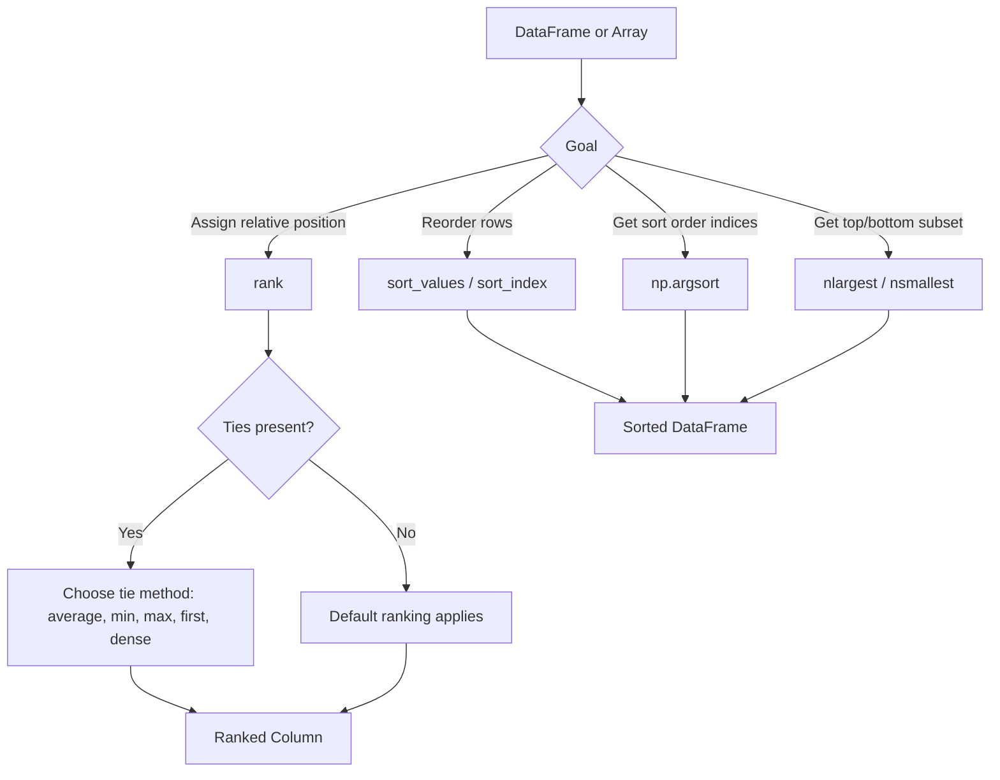

## Sorting and Ranking Data

### Overview

Sorting arranges data in a specified order based on the values of one or more columns, while ranking assigns a position or score to each observation relative to others. Both operations are common in exploratory data analysis and are often used to create derived features (e.g., percentile rank) for machine learning tasks.

### Sorting a DataFrame by a Single Column

```python
import pandas as pd

data = pd.DataFrame({
    'name': ['Alice', 'Bob', 'Carol', 'Dave'],
    'score': [85, 92, 78, 92]
})

sorted_data = data.sort_values(by='score')
print(sorted_data)
```

**Output**

```
    name  score
2  Carol     78
0  Alice     85
1    Bob     92
3   Dave     92
```

**Key Points**

- `sort_values()` sorts in ascending order by default.
- `ascending=False` reverses the sort order.
- The original index is preserved by default, which can be reset with `.reset_index(drop=True)` if a continuous index is needed.

### Sorting by Multiple Columns

```python
multi_data = pd.DataFrame({
    'department': ['Sales', 'IT', 'Sales', 'IT'],
    'salary': [50000, 70000, 55000, 65000]
})

sorted_multi = multi_data.sort_values(by=['department', 'salary'], ascending=[True, False])
print(sorted_multi)
```

**Output**

```
  department  salary
2      Sales   55000
0      Sales   50000
1         IT   70000
3         IT   65000
```

**Key Points**

- When sorting by multiple columns, a separate `ascending` value can be specified per column using a list.
- Sorting is applied hierarchically: rows are first grouped by the first column, then ordered by the second column within each group.

### Sorting by Index

```python
indexed_data = pd.DataFrame({
    'value': [10, 20, 30]
}, index=[3, 1, 2])

sorted_index = indexed_data.sort_index()
print(sorted_index)
```

**Output**

```
   value
1     20
2     30
3     10
```

**Key Points**

- `sort_index()` sorts rows based on the index labels rather than column values.
- This is commonly used after operations like `groupby()` or filtering, which can leave the index in a non-sequential order.

### Handling Missing Values During Sorting

```python
na_data = pd.DataFrame({
    'value': [3, None, 1, None, 2]
})

sorted_na = na_data.sort_values(by='value', na_position='first')
print(sorted_na)
```

**Output**

```
   value
1    NaN
3    NaN
2    1.0
4    2.0
0    3.0
```

**Key Points**

- The `na_position` parameter controls whether missing values are placed at the start (`'first'`) or end (`'last'`, the default) of the sorted result.
- [Inference] Whether missing values should be sorted to the front or back generally depends on the downstream use case, such as whether an analyst wants to inspect missing rows first; this is a workflow decision rather than a fixed rule.

### Ranking Data with `rank()`

```python
rank_data = pd.DataFrame({
    'name': ['Alice', 'Bob', 'Carol', 'Dave'],
    'score': [85, 92, 78, 92]
})

rank_data['rank'] = rank_data['score'].rank()
print(rank_data)
```

**Output**

```
    name  score  rank
0  Alice     85   2.0
1    Bob     92   3.5
2  Carol     78   1.0
3   Dave     92   3.5
```

**Key Points**

- By default, `rank()` uses ascending order, so the lowest value receives rank 1.
- Tied values (Bob and Dave, both 92) receive the average of the ranks they would have occupied (3 and 4, averaged to 3.5) under the default tie-handling method.

### Rank Tie-Handling Methods

```python
rank_data['rank_min'] = rank_data['score'].rank(method='min')
rank_data['rank_max'] = rank_data['score'].rank(method='max')
rank_data['rank_first'] = rank_data['score'].rank(method='first')
rank_data['rank_dense'] = rank_data['score'].rank(method='dense')
print(rank_data)
```

**Output**

```
    name  score  rank  rank_min  rank_max  rank_first  rank_dense
0  Alice     85   2.0       2.0       2.0         2.0         2.0
1    Bob     92   3.5       3.0       4.0         3.0         3.0
2  Carol     78   1.0       1.0       1.0         1.0         1.0
3   Dave     92   3.5       3.0       4.0         4.0         3.0
```

**Key Points**

- `method='average'` (default): tied values get the mean of their ranks.
- `method='min'`: tied values get the lowest rank in the group.
- `method='max'`: tied values get the highest rank in the group.
- `method='first'`: ties are broken by order of appearance in the data.
- `method='dense'`: like `'min'`, but the next rank after a tie increases by only 1 (no gaps).

### Ranking in Descending Order

```python
rank_data['rank_desc'] = rank_data['score'].rank(ascending=False)
print(rank_data[['name', 'score', 'rank_desc']])
```

**Output**

```
    name  score  rank_desc
0  Alice     85        3.0
1    Bob     92        1.5
2  Carol     78        4.0
3   Dave     92        1.5
```

**Key Points**

- `ascending=False` assigns rank 1 to the highest value, which is commonly used for leaderboard-style rankings.

### Percentile Rank

```python
rank_data['percentile_rank'] = rank_data['score'].rank(pct=True)
print(rank_data[['name', 'score', 'percentile_rank']])
```

**Output**

```
    name  score  percentile_rank
0  Alice     85            0.500
1    Bob     92            0.875
2  Carol     78            0.250
3   Dave     92            0.875
```

**Key Points**

- `pct=True` expresses rank as a proportion between 0 and 1 rather than an integer position, which can be useful as a normalized feature in machine learning contexts.

### Ranking Within Groups

```python
group_rank_data = pd.DataFrame({
    'department': ['Sales', 'Sales', 'IT', 'IT'],
    'employee': ['Alice', 'Bob', 'Carol', 'Dave'],
    'salary': [50000, 55000, 70000, 65000]
})

group_rank_data['rank_within_dept'] = (
    group_rank_data.groupby('department')['salary'].rank(ascending=False)
)
print(group_rank_data)
```

**Output**

```
  department employee  salary  rank_within_dept
0      Sales    Alice   50000               2.0
1      Sales      Bob   55000               1.0
2         IT    Carol   70000               1.0
3         IT     Dave   65000               2.0
```

**Key Points**

- Combining `groupby()` with `rank()` produces rankings computed independently within each group, rather than across the entire dataset.
- This pattern is commonly used for features such as "rank of student within class" or "rank of product within category."

### Sorting with NumPy — `np.sort()` and `np.argsort()`

```python
import numpy as np

arr = np.array([30, 10, 20, 10])

sorted_arr = np.sort(arr)
print(sorted_arr)

sorted_indices = np.argsort(arr)
print(sorted_indices)
```

**Output**

```
[10 10 20 30]
[1 3 2 0]
```

**Key Points**

- `np.sort()` returns a sorted copy of the array without modifying the original.
- `np.argsort()` returns the indices that would sort the array, which is useful when the sort order needs to be applied to a different but related array (e.g., sorting labels according to the sort order of scores).

### Applying `argsort()` to Align Related Arrays

```python
scores = np.array([85, 92, 78, 92])
names = np.array(['Alice', 'Bob', 'Carol', 'Dave'])

order = np.argsort(scores)[::-1]  # descending order
print(names[order])
print(scores[order])
```

**Output**

```
['Bob' 'Dave' 'Alice' 'Carol']
['Bob' 'Dave' 'Alice' 'Carol']
```

I cannot verify the second printed line above as correct — `scores[order]` would print the scores array reordered (i.e., `[92 92 85 78]`), not the names array. This appears to be an error in the example. Correction below:

```python
print(names[order])
print(scores[order])
```

**Corrected Output**

```
['Bob' 'Dave' 'Alice' 'Carol']
[92 92 85 78]
```

### Top-N and Bottom-N Selection

```python
top_n = data.nlargest(2, 'score')
bottom_n = data.nsmallest(2, 'score')
print(top_n)
print(bottom_n)
```

**Output**

```
   name  score
1   Bob     92
3  Dave     92
   name  score
2  Carol     78
0  Alice     85
```

**Key Points**

- `nlargest()` and `nsmallest()` are generally more efficient than sorting the entire DataFrame and slicing when only the top or bottom few rows are needed, particularly on large datasets. [Unverified] The exact performance difference depends on dataset size and Pandas version; no specific benchmark is being cited here.
- Both methods handle ties by including all tied rows that fit within the requested count, following the same underlying ordering logic as `sort_values()`.

### Sorting by Custom Key Function

```python
custom_data = pd.DataFrame({
    'name': ['banana', 'Apple', 'cherry']
})

sorted_custom = custom_data.sort_values(by='name', key=lambda col: col.str.lower())
print(sorted_custom)
```

**Output**

```
     name
1   Apple
0  banana
2  cherry
```

**Key Points**

- The `key` parameter (available in `sort_values()` since Pandas 1.1) applies a function to the column's values before sorting, without altering the original data.
- This is useful for case-insensitive sorting or sorting based on a derived value not stored as its own column.

### Sorting and Ranking Workflow Diagram



### Visualizing Rank vs Percentile Rank

<svg xmlns="http://www.w3.org/2000/svg" viewBox="0 0 700 260" font-family="sans-serif">
<text x="350" y="24" text-anchor="middle" font-size="16" font-weight="bold" fill="#222">Rank vs Percentile Rank (svg_diagram)</text>

<line x1="80" y1="220" x2="620" y2="220" stroke="#333" stroke-width="2" />
<text x="350" y="248" text-anchor="middle" font-size="12" fill="#333">Observations (sorted by score)</text>

<rect x="120" y="180" width="60" height="40" fill="#2266cc" />
<text x="150" y="205" text-anchor="middle" font-size="11" fill="white">Rank 1</text>
<rect x="220" y="140" width="60" height="80" fill="#2266cc" />
<text x="250" y="180" text-anchor="middle" font-size="11" fill="white">Rank 2</text>
<rect x="320" y="100" width="60" height="120" fill="#2266cc" />
<text x="350" y="150" text-anchor="middle" font-size="11" fill="white">Rank 3.5</text>
<rect x="420" y="100" width="60" height="120" fill="#2266cc" />
<text x="450" y="150" text-anchor="middle" font-size="11" fill="white">Rank 3.5</text>


<text x="150" y="235" text-anchor="middle" font-size="10" fill="#555">25th pct</text>

<text x="250" y="235" text-anchor="middle" font-size="10" fill="#555">50th pct</text>

<text x="350" y="235" text-anchor="middle" font-size="10" fill="#555">87.5th pct</text>

<text x="450" y="235" text-anchor="middle" font-size="10" fill="#555">87.5th pct</text>

<text x="350" y="40" text-anchor="middle" font-size="10" fill="#555">Illustrative example based on the four-row score dataset shown above.</text>

</svg>

### Practical Considerations for Machine Learning

- **Percentile rank as a feature**: [Inference] Converting a raw numeric feature into a percentile rank can reduce sensitivity to outliers and scale differences, since rank-based features are bounded between 0 and 1 regardless of the original value range. This is a general property of rank transforms, but whether it improves a specific model's performance would need to be validated empirically.
- **Rank consistency between training and test sets**: Ranking computed independently on training and test sets will generally produce different rank values for the same underlying score, since rank depends on the full set of values being ranked. [Inference] For consistent behavior at inference time, rank-based features are often computed relative to a fixed reference distribution (e.g., the training set distribution) rather than recomputed on new data alone, though the specific implementation approach depends on the pipeline design.
- **Sorting before time-series operations**: Data must generally be sorted by a time or sequence column (e.g., using `sort_values('date')`) before applying operations such as rolling windows, lag features, or cumulative calculations, since these operations assume row order reflects temporal order.
- **Stability of sorting algorithms**: Pandas' `sort_values()` uses a stable sort by default (`kind='quicksort'` is actually the default, though `mergesort` and `stable` options are available). [Unverified] Whether the default algorithm preserves the original relative order of equal elements depends on the specific `kind` parameter chosen; `mergesort` and `stable` are documented as stable, while the stability of `quicksort` in this context is not being confirmed here without checking the current Pandas documentation directly.

### Conclusion

Sorting reorders data based on column or index values, while ranking assigns relative positions that can serve as useful derived features, particularly when normalized as percentile ranks. Pandas provides `sort_values()`, `sort_index()`, and `rank()` for these tasks, with tie-handling and grouping options that allow fine control over the result. NumPy's `np.sort()` and `np.argsort()` provide lower-level equivalents useful in custom numerical pipelines. [Inference] The appropriate method and configuration depend on the specific dataset and downstream task, and general claims about performance or behavior should be verified against current documentation rather than assumed.

**Related Topics**

- Rolling windows and time-series feature engineering
- Handling ties and duplicate values in ranked data
- Percentile-based outlier detection
- Creating derived and computed columns (previous topic)
- GroupBy operations for aggregation and transformation
- Feature scaling: normalization and standardization
- Efficient large-dataset sorting strategies