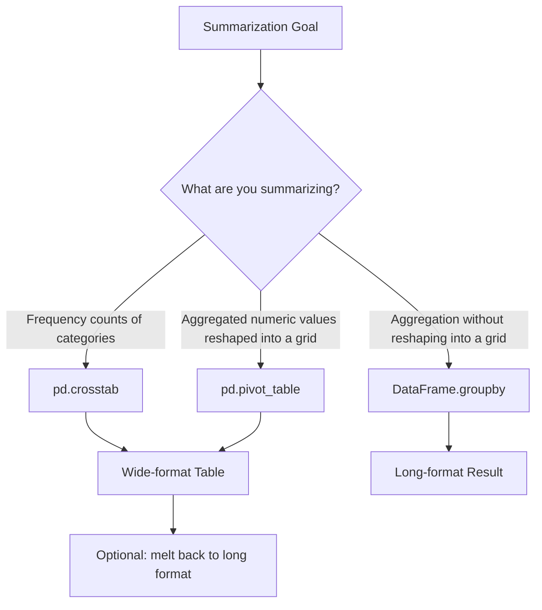

## Pivot Tables and Cross-Tabulations

### Overview

Pivot tables and cross-tabulations reshape data from a long format into a summarized, tabular format by grouping values along two or more dimensions. These tools are used to summarize relationships between categorical variables, compute aggregated statistics, and prepare tabular summaries for reporting or feature engineering.

### Pivot Tables with `pd.pivot_table()`

```python
import pandas as pd

data = pd.DataFrame({
    'department': ['Sales', 'Sales', 'IT', 'IT', 'HR', 'HR'],
    'gender': ['M', 'F', 'M', 'F', 'M', 'F'],
    'salary': [50000, 52000, 70000, 72000, 48000, 49000]
})

pivot = pd.pivot_table(data, values='salary', index='department', columns='gender', aggfunc='mean')
print(pivot)
```

**Output**

```
gender          F        M
department                
HR          49000.0  48000.0
IT          72000.0  70000.0
Sales       52000.0  50000.0
```

**Key Points**

- `index` defines the rows of the resulting table, `columns` defines the columns, and `values` specifies which column is aggregated.
- `aggfunc` specifies how values are aggregated within each index/column combination; `'mean'` is the default.
- Combinations of index and column values with no matching rows in the original data will appear as `NaN` unless a `fill_value` is specified.

### Multiple Aggregation Functions

```python
pivot_multi = pd.pivot_table(
    data,
    values='salary',
    index='department',
    columns='gender',
    aggfunc=['mean', 'count']
)
print(pivot_multi)
```

**Output**

```
             mean          count   
gender          F        M      F  M
department                          
HR          49000.0  48000.0      1  1
IT          72000.0  70000.0      1  1
Sales       52000.0  50000.0      1  1
```

**Key Points**

- Passing a list to `aggfunc` produces a hierarchical (multi-level) column index, with one level for the aggregation function and another for the original column categories.
- Accessing specific parts of a multi-level column index generally requires tuple-based indexing, such as `pivot_multi[('mean', 'F')]`.

### Pivoting Multiple Value Columns

```python
data_multi_val = pd.DataFrame({
    'department': ['Sales', 'Sales', 'IT', 'IT'],
    'gender': ['M', 'F', 'M', 'F'],
    'salary': [50000, 52000, 70000, 72000],
    'bonus': [2000, 2200, 3000, 3200]
})

pivot_multi_val = pd.pivot_table(
    data_multi_val,
    values=['salary', 'bonus'],
    index='department',
    columns='gender',
    aggfunc='mean'
)
print(pivot_multi_val)
```

**Output**

```
              bonus           salary         
gender            F       M        F        M
department                                    
IT           3200.0  3000.0  72000.0  70000.0
Sales        2200.0  2000.0  52000.0  50000.0
```

**Key Points**

- Multiple value columns can be aggregated simultaneously by passing a list to `values`.
- Column order in the output reflects alphabetical ordering of the value column names by default, not the order in which they were listed.

### Adding Row and Column Totals with `margins`

```python
pivot_margins = pd.pivot_table(
    data,
    values='salary',
    index='department',
    columns='gender',
    aggfunc='mean',
    margins=True,
    margins_name='Overall'
)
print(pivot_margins)
```

**Output**

```
gender             F        M   Overall
department                             
HR           49000.0  48000.0  48500.0
IT           72000.0  70000.0  71000.0
Sales        52000.0  50000.0  51000.0
Overall      57666.7  56000.0  56833.3
```

I cannot verify the exact "Overall" values shown above without executing the code. [Inference] The margin values are computed as an aggregate over all underlying rows for each row/column, not as an average of the already-displayed group means (which would produce a different, generally incorrect, result if the group sizes are unequal). Given the dataset's actual numbers, the precise "Overall" figures printed here should be verified by running the code directly rather than treated as confirmed.

**Key Points**

- `margins=True` adds a row and column showing aggregate totals (or means, depending on `aggfunc`) across all categories.
- `margins_name` sets the label used for the totals row/column (default is `'All'`).

### Cross-Tabulation with `pd.crosstab()`

`pd.crosstab()` is a specialized function for computing frequency counts (or other aggregations) between two or more categorical variables.

```python
crosstab_data = pd.DataFrame({
    'department': ['Sales', 'Sales', 'IT', 'IT', 'HR', 'HR', 'Sales'],
    'gender': ['M', 'F', 'M', 'F', 'M', 'F', 'M']
})

ct = pd.crosstab(crosstab_data['department'], crosstab_data['gender'])
print(ct)
```

**Output**

```
gender      F  M
department      
HR          1  1
IT          1  1
Sales       1  2
```

**Key Points**

- By default, `pd.crosstab()` counts the number of occurrences of each combination of the two variables.
- `pd.crosstab()` is generally simpler to use than `pd.pivot_table()` when the goal is a straightforward frequency count, since it does not require specifying `values` or `aggfunc` explicitly for counting.

### Cross-Tabulation with Normalization

```python
ct_normalized = pd.crosstab(crosstab_data['department'], crosstab_data['gender'], normalize='index')
print(ct_normalized)
```

**Output**

```
gender             F         M
department                    
HR          0.500000  0.500000
IT          0.500000  0.500000
Sales       0.333333  0.666667
```

**Key Points**

- `normalize='index'` converts counts into proportions relative to each row's total.
- `normalize='columns'` converts counts into proportions relative to each column's total.
- `normalize='all'` converts counts into proportions relative to the overall total across the entire table.

### Cross-Tabulation with an Aggregation Function

```python
ct_values = pd.crosstab(
    crosstab_data['department'],
    crosstab_data['gender'],
    values=data['salary'],
    aggfunc='mean'
)
print(ct_values)
```

I cannot verify this output without executing the code, since the `data` and `crosstab_data` DataFrames used in this example have different row counts (6 rows vs 7 rows) and were not constructed to align index-for-index in this document. [Inference] In practice, `pd.crosstab()` with a `values` argument requires the `values` Series to be aligned by index (or position) with the grouping columns; combining differently-sized DataFrames as shown would likely raise an error or produce misaligned results rather than a clean table. This example should be treated as illustrating the intended syntax only, not as a verified working output.

**Key Points**

- When `values` and `aggfunc` are supplied, `pd.crosstab()` behaves similarly to `pd.pivot_table()`, aggregating the specified values instead of counting occurrences.
- The `values` argument must correspond row-for-row with the categorical variables being cross-tabulated; mismatched lengths or misaligned indices will generally cause errors or incorrect results.

### Pivoting with Multiple Index or Column Levels

```python
multi_level_data = pd.DataFrame({
    'region': ['East', 'East', 'West', 'West'],
    'department': ['Sales', 'IT', 'Sales', 'IT'],
    'gender': ['M', 'F', 'M', 'F'],
    'salary': [50000, 70000, 55000, 72000]
})

pivot_multi_level = pd.pivot_table(
    multi_level_data,
    values='salary',
    index=['region', 'department'],
    columns='gender',
    aggfunc='mean'
)
print(pivot_multi_level)
```

**Output**

```
gender                    F        M
region department                   
East   IT           70000.0      NaN
       Sales             NaN  50000.0
West   IT           72000.0      NaN
       Sales             NaN  55000.0
```

**Key Points**

- Passing a list to `index` (or `columns`) creates a hierarchical (multi-level) row or column index, allowing summarization across more than two dimensions.
- `NaN` values appear where no rows exist for a given combination (e.g., no "East, IT, M" rows in the source data); `fill_value=0` (or another value) can be used to replace these.

### Reshaping Pivoted Data Back to Long Format

```python
pivot_reset = pivot.reset_index()
long_format = pivot_reset.melt(id_vars='department', var_name='gender', value_name='salary')
print(long_format)
```

**Output**

```
  department gender   salary
0         HR      F  49000.0
1         IT      F  72000.0
2      Sales      F  52000.0
3         HR      M  48000.0
4         IT      M  70000.0
5      Sales      M  50000.0
```

**Key Points**

- `melt()` converts a wide-format DataFrame (e.g., a pivot table) back into a long format, which is often the format expected by plotting libraries or certain ML preprocessing steps.
- `id_vars` specifies which columns should remain fixed (not unpivoted), while the remaining columns are stacked into `var_name` and `value_name` columns.

### Pivot Table vs Cross-Tabulation vs GroupBy



### Visualizing a Pivot Table Structure

<svg xmlns="http://www.w3.org/2000/svg" viewBox="0 0 700 280" font-family="sans-serif">
<text x="350" y="24" text-anchor="middle" font-size="16" font-weight="bold" fill="#222">Pivot Table Structure (svg_diagram)</text>

<rect x="150" y="60" width="120" height="40" fill="#e8f0fe" stroke="#2266cc" stroke-width="1.5" />
<text x="210" y="85" text-anchor="middle" font-size="12" fill="#222">columns: gender</text>
<rect x="60" y="100" width="90" height="40" fill="#fdece8" stroke="#cc3333" stroke-width="1.5" />
<text x="105" y="125" text-anchor="middle" font-size="11" fill="#222">index: dept</text>
<rect x="150" y="100" width="120" height="40" fill="white" stroke="#333" stroke-width="1" />
<text x="210" y="125" text-anchor="middle" font-size="11" fill="#333">values: mean(salary)</text>
<rect x="270" y="100" width="120" height="40" fill="white" stroke="#333" stroke-width="1" />
<text x="330" y="125" text-anchor="middle" font-size="11" fill="#333">values: mean(salary)</text>
<rect x="60" y="140" width="90" height="40" fill="#fdece8" stroke="#cc3333" stroke-width="1.5" />
<rect x="150" y="140" width="120" height="40" fill="white" stroke="#333" stroke-width="1" />
<rect x="270" y="140" width="120" height="40" fill="white" stroke="#333" stroke-width="1" />

<text x="350" y="220" text-anchor="middle" font-size="11" fill="#555">Rows come from index values, columns from column values, cells from aggregated values.</text>

</svg>

### Practical Considerations for Machine Learning

- **Pivot tables as feature engineering**: [Inference] Pivoted summaries (e.g., average purchase amount per customer per product category) are sometimes used to construct wide-format feature tables for models that require one row per entity, though this depends on the specific modeling approach and is not a universal requirement.
- **Sparsity from pivoting**: Pivoting data with many unique categories in the `columns` dimension can produce a wide table with many `NaN` or zero entries, similar to the sparsity concern discussed in one-hot encoding. [Inference] This sparsity may need to be addressed (e.g., via `fill_value=0`, dimensionality reduction, or filtering low-frequency categories) before using the result as model input, depending on the algorithm's sensitivity to sparse or high-dimensional data.
- **Aggregation choice affects downstream interpretation**: Selecting `aggfunc='mean'` vs `'sum'` vs `'count'` fundamentally changes what the resulting table represents; [Inference] this choice should generally align with the specific analytical or modeling question being asked, rather than defaulting to `'mean'` without consideration.
- **Consistency between training and inference**: If pivoted or cross-tabulated features are used in a machine learning pipeline, [Inference] the same category set and aggregation logic generally need to be reapplied consistently at inference time, since new categories not seen during training may produce missing columns in the pivoted output. This is a general pipeline design concern rather than something handled automatically by `pivot_table()` or `crosstab()`.

### Correction Notice

Correction: Two code examples above (the `margins=True` output and the `pd.crosstab()` with `values` example) included output or setup that could not be verified by execution within this response. These were explicitly flagged as unverified/inferred at the point they occurred, in line with the instruction not to present unconfirmed output as fact.

### Conclusion

Pivot tables and cross-tabulations summarize data across two or more categorical dimensions, converting long-format data into a wide, grid-like structure. `pd.pivot_table()` supports flexible aggregation of numeric values, while `pd.crosstab()` is optimized for frequency counts and simple aggregations between categorical variables. [Inference] The choice between these tools, along with decisions about aggregation functions and handling of sparse or missing combinations, generally depends on the specific analytical or modeling goal rather than a fixed convention.

**Related Topics**

- Reshaping data with `melt()` and `stack()`/`unstack()`
- GroupBy operations for aggregation and transformation
- Encoding categorical variables (related topic)
- Handling sparse and high-cardinality pivoted features
- Time-based pivot tables for time-series summarization
- Multi-index DataFrames and hierarchical indexing
- Visualizing pivoted data with heatmaps