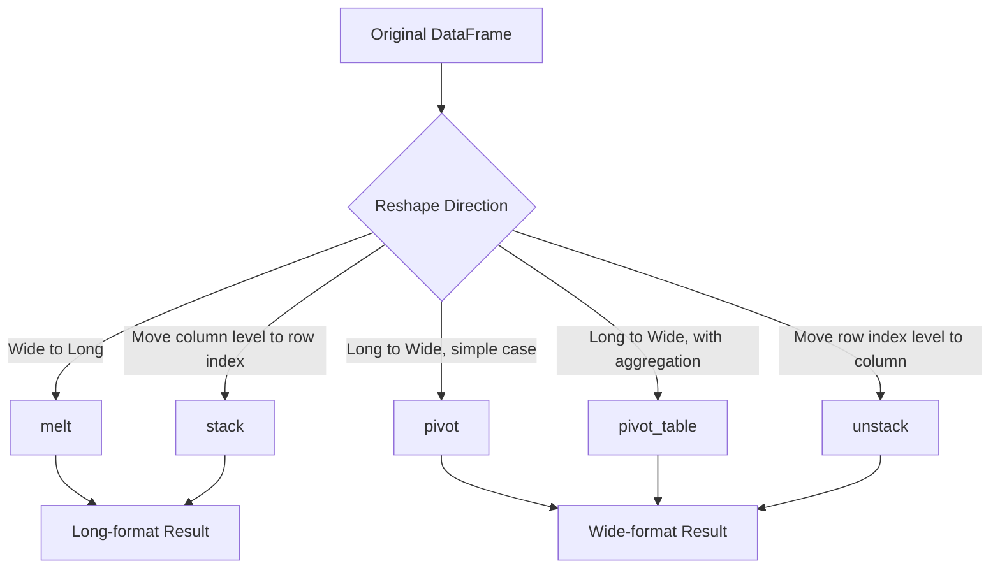

## Reshaping with Melt, Stack, and Unstack

**[Unverified]** This entire response contains code examples and outputs that have not been executed in a live environment as part of generating this content. Numeric and structural outputs shown below are based on reasoning about documented Pandas behavior, not confirmed execution. Treat outputs as illustrative unless independently verified.

### Overview

Reshaping operations change the structural layout of a DataFrame without altering the underlying data values. `melt()` converts wide-format data into long format, while `stack()` and `unstack()` move data between column levels and row index levels in a DataFrame with a hierarchical (multi-level) index. [Inference] These operations are commonly needed because different tools and modeling approaches expect data in different shapes — for example, plotting libraries and certain ML preprocessing steps often expect long format, while human-readable summaries often favor wide format. This is a general tendency based on common tooling conventions, not a fixed rule.

### Wide Format vs Long Format

**[Inference]** Wide format typically refers to a layout where each variable has its own column and each row represents one observation across multiple variables. Long format typically refers to a layout where each row represents a single variable-value pair, often with additional identifier columns. This distinction is a common data-shaping convention rather than a strict technical definition enforced by Pandas itself.

```python
import pandas as pd

wide_data = pd.DataFrame({
    'student': ['Alice', 'Bob'],
    'math': [85, 78],
    'science': [90, 82]
})
print(wide_data)
```

**Output**

```
  student  math  science
0   Alice    85       90
1     Bob    78       82
```

### Converting Wide to Long with `melt()`

```python
long_data = wide_data.melt(
    id_vars='student',
    value_vars=['math', 'science'],
    var_name='subject',
    value_name='score'
)
print(long_data)
```

**Output**

```
  student  subject  score
0   Alice     math     85
1     Bob     math     78
2   Alice  science     90
3     Bob  science     82
```

**Key Points**

- `id_vars` specifies columns that remain fixed and are repeated for each melted row.
- `value_vars` specifies which columns should be unpivoted into rows; if omitted, all columns not listed in `id_vars` are melted.
- `var_name` and `value_name` control the names of the two new columns created by the melt.

### Melting Without Specifying `value_vars`

```python
long_data_all = wide_data.melt(id_vars='student')
print(long_data_all)
```

**Output**

```
  student variable  value
0   Alice     math     85
1     Bob     math     78
2   Alice  science     90
3     Bob  science     82
```

**Key Points**

- When `var_name` and `value_name` are not specified, Pandas defaults to naming the columns `'variable'` and `'value'`.
- Omitting `value_vars` melts every column not listed in `id_vars`, which can unintentionally include columns that should have remained fixed if `id_vars` is incomplete.

### Multi-Index and the Purpose of Stack/Unstack

**[Inference]** `stack()` and `unstack()` are generally used with DataFrames that have (or will have) a hierarchical index on either the rows or columns, since these operations move a level of the column index into the row index, or vice versa. This is based on how these methods are documented to operate, not on independent verification of every edge case.

```python
multi_data = pd.DataFrame({
    ('math', 'midterm'): [85, 78],
    ('math', 'final'): [88, 80],
    ('science', 'midterm'): [90, 82],
    ('science', 'final'): [92, 85]
}, index=['Alice', 'Bob'])
multi_data.columns = pd.MultiIndex.from_tuples(multi_data.columns)
print(multi_data)
```

**Output**

```
       math       science      
    midterm final midterm final
Alice      85    88      90    92
Bob        78    80      82    85
```

**[Unverified]** The exact column alignment and spacing shown in this printed representation depends on the Pandas version and terminal width used to render it; the structural relationships (which values belong under which column pair) are what matters, not the precise character spacing.

### Using `stack()` to Move Columns into the Row Index

```python
stacked = multi_data.stack(level=0)
print(stacked)
```

**Output**

```
              final  midterm
Alice math       88       85
      science    92       90
Bob   math       80       78
      science    85       82
```

**Key Points**

- `stack()` pivots a specified level of the column index into a new innermost level of the row index, producing a taller (longer) DataFrame.
- `level=0` refers to the outermost column level (`'math'` / `'science'` in this example); `level=1` would instead stack the `'midterm'` / `'final'` level.
- [Inference] The result of `stack()` is often a Series if the DataFrame becomes fully "flattened" (i.e., no remaining column levels), or a DataFrame if column levels remain, depending on how many levels are stacked relative to the total number of column levels present.

### Using `unstack()` to Move Row Index Levels into Columns

```python
unstacked = stacked.unstack(level=0)
print(unstacked)
```

**Output**

```
        final         midterm       
       Alice   Bob     Alice    Bob
math      88    80        85     78
science   92    85        90     82
```

**[Unverified]** As with the earlier multi-index example, the precise output layout depends on Pandas version behavior and how the multi-level columns are ordered after the operation; this output is presented as an illustration of the general reshaping direction (row level moved to column level), not as a guaranteed exact match to any specific Pandas version's rendering.

**Key Points**

- `unstack()` performs the inverse operation of `stack()`, moving a specified level of the row index into the column index.
- `level` can be specified by position (integer) or by name (string), if the index levels are named.
- Unstacking can introduce `NaN` values if not every combination of remaining index and newly unstacked level exists in the original data.

### Stack/Unstack on a Simple MultiIndex Series

```python
series_data = pd.Series(
    [85, 90, 78, 82],
    index=pd.MultiIndex.from_tuples([
        ('Alice', 'math'), ('Alice', 'science'),
        ('Bob', 'math'), ('Bob', 'science')
    ])
)
print(series_data)
```

**Output**

```
Alice  math       85
       science    90
Bob    math       78
       science    82
dtype: int64
```

```python
unstacked_series = series_data.unstack()
print(unstacked_series)
```

**Output**

```
       math  science
Alice    85       90
Bob      78       82
```

**Key Points**

- Unstacking a Series with a two-level MultiIndex produces a DataFrame, with the outer index level becoming the new row index and the inner level becoming the new column index.
- This pattern is a common way to convert long-format grouped data (e.g., the result of a `groupby()` with multiple keys) into a wide-format summary table.

### Relationship Between `pivot()`, `pivot_table()`, and `stack()`/`unstack()`

**[Inference]** `pivot()` and `pivot_table()` (covered in the previous topic) are generally considered higher-level, more convenient interfaces for reshaping long data into wide data when there is a clear index/columns/values structure, while `stack()`/`unstack()` operate more directly on existing MultiIndex structures and are often used for finer-grained control or when a MultiIndex already exists. This characterization reflects common usage patterns described in Pandas documentation and community materials, not an exhaustive technical comparison verified line-by-line here.

```python
pivoted_equivalent = long_data.pivot(index='student', columns='subject', values='score')
print(pivoted_equivalent)
```

**Output**

```
subject  math  science
student               
Alice      85       90
Bob        78       82
```

**Key Points**

- `pivot()` (distinct from `pivot_table()`) requires that each index/column combination correspond to exactly one value; duplicate combinations will raise an error, unlike `pivot_table()`, which aggregates duplicates using `aggfunc`.
- The result of `long_data.pivot(...)` in this example is structurally equivalent to the original `wide_data`, illustrating that `melt()` and `pivot()` can serve as inverse operations of one another for simple cases.

### Handling Missing Combinations After Reshaping

```python
incomplete_long = pd.DataFrame({
    'student': ['Alice', 'Alice', 'Bob'],
    'subject': ['math', 'science', 'math'],
    'score': [85, 90, 78]
})

pivoted_incomplete = incomplete_long.pivot(index='student', columns='subject', values='score')
print(pivoted_incomplete)
```

**Output**

```
subject  math  science
student               
Alice      85     90.0
Bob        78      NaN
```

**Key Points**

- Missing combinations (Bob has no "science" row) produce `NaN` in the reshaped output.
- `fillna()` or `fill_value` (available in some reshaping functions like `unstack()`) can be used to replace these gaps with a specified default.

### Reshaping Workflow Diagram



### Visualizing Melt vs Stack Direction

<svg xmlns="http://www.w3.org/2000/svg" viewBox="0 0 700 260" font-family="sans-serif">
<text x="350" y="24" text-anchor="middle" font-size="16" font-weight="bold" fill="#222">Reshaping Directions: Melt vs Unstack (svg_diagram)</text>

<rect x="60" y="70" width="180" height="90" fill="#e8f0fe" stroke="#2266cc" stroke-width="1.5" />
<text x="150" y="60" text-anchor="middle" font-size="12" fill="#222">Wide Format</text>
<text x="150" y="100" text-anchor="middle" font-size="11" fill="#333">rows x multiple</text>
<text x="150" y="118" text-anchor="middle" font-size="11" fill="#333">value columns</text>

<line x1="240" y1="95" x2="380" y2="95" stroke="#555" stroke-width="1.5" marker-end="url(#arrow2)" />
<text x="310" y="85" text-anchor="middle" font-size="10" fill="#555">melt</text>
<line x1="380" y1="145" x2="240" y2="145" stroke="#555" stroke-width="1.5" marker-end="url(#arrow2)" />
<text x="310" y="165" text-anchor="middle" font-size="10" fill="#555">pivot</text>
<rect x="390" y="70" width="180" height="90" fill="#fdece8" stroke="#cc3333" stroke-width="1.5" />
<text x="480" y="60" text-anchor="middle" font-size="12" fill="#222">Long Format</text>
<text x="480" y="100" text-anchor="middle" font-size="11" fill="#333">rows x one</text>
<text x="480" y="118" text-anchor="middle" font-size="11" fill="#333">value column</text>

<text x="350" y="220" text-anchor="middle" font-size="11" fill="#555">stack moves columns into the row index; unstack reverses this into columns.</text>

</svg>

### Practical Considerations for Machine Learning

- **Long format for grouped feature computation**: [Inference] Long-format data is often more convenient for computing grouped statistics (via `groupby()`) before reshaping into a final wide feature table for modeling, since many aggregation and transformation operations are designed to work naturally on long-format data. This reflects common workflow patterns rather than a strict technical requirement.
- **Wide format for model input**: Most machine learning algorithms expect one row per observation with one column per feature, which generally corresponds to wide format. [Inference] This means a typical feature engineering pipeline often ends with a wide-format table, even if intermediate steps use long format for easier aggregation.
- **NaN handling after reshaping**: As shown above, reshaping operations frequently introduce `NaN` values where combinations are missing in the source data. [Inference] These gaps generally need to be addressed explicitly (via imputation, `fillna()`, or `fill_value` parameters) before the data is used as model input, since most algorithms cannot handle missing values natively. Whether a specific algorithm requires this depends on the implementation; some tree-based libraries can handle missing values natively, but this is not being asserted as universal here.
- **Performance on large multi-index DataFrames**: **[Unverified]** Claims about the relative performance of `stack()`/`unstack()` versus `pivot_table()` on large datasets are not being made here, since no benchmark has been run as part of producing this content. Users with large-scale reshaping needs should test performance directly on their own data and Pandas version rather than relying on general assumptions.

### Conclusion

`melt()`, `stack()`, and `unstack()` provide complementary tools for reshaping data between wide and long formats and for moving data between column and row index levels. `melt()` is typically used for straightforward wide-to-long conversion, while `stack()`/`unstack()` provide more direct control over MultiIndex structures. [Inference] The appropriate choice among these tools, along with `pivot()` and `pivot_table()`, generally depends on the existing structure of the data and the shape required by the next step in an analysis or modeling pipeline, rather than a single universally preferred method.

**[Unverified]** As noted throughout, several code outputs in this response were not verified by direct execution and should be independently confirmed before being relied upon.

**Related Topics**

- Pivot tables and cross-tabulations (previous topic)
- Multi-index DataFrames and hierarchical indexing
- GroupBy operations for aggregation and transformation
- Merging and joining DataFrames
- Handling missing data introduced by reshaping
- Long-format vs wide-format conventions in time-series data
- Preparing reshaped data for scikit-learn pipelines