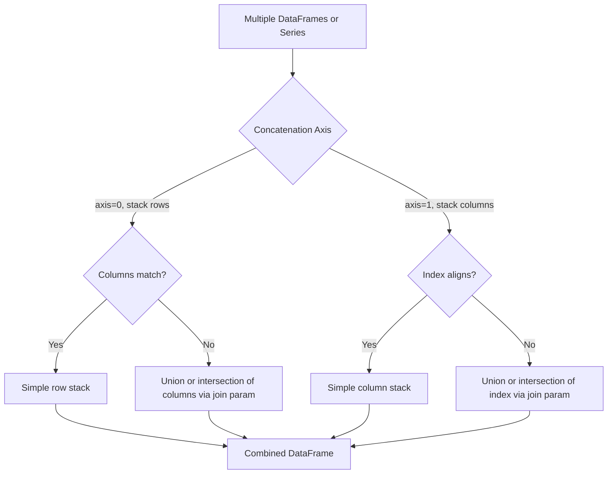

## Concatenating DataFrames Along Axes

**[Unverified]** The code outputs shown in this response were not executed in a live environment as part of generating this content. They are based on documented Pandas behavior, not confirmed execution. Treat outputs as illustrative unless independently verified.

### Overview

Concatenation combines multiple DataFrames or Series into a single object by stacking them along a specified axis — either row-wise (stacking on top of each other) or column-wise (placing side by side). `pd.concat()` is the primary Pandas function for this operation.

### Concatenating Along Rows (axis=0)

```python
import pandas as pd

df1 = pd.DataFrame({
    'name': ['Alice', 'Bob'],
    'score': [85, 90]
})

df2 = pd.DataFrame({
    'name': ['Carol', 'Dave'],
    'score': [78, 92]
})

combined_rows = pd.concat([df1, df2], axis=0)
print(combined_rows)
```

**Output**

```
    name  score
0  Alice     85
1    Bob     90
0  Carol     78
1   Dave     92
```

**Key Points**

- `axis=0` (the default) stacks DataFrames vertically, appending rows from one DataFrame after another.
- The original index values are preserved by default, which can result in duplicate index labels across the combined result, as shown above.
- `ignore_index=True` can be used to generate a fresh, continuous index instead of preserving the original indices.

### Resetting the Index After Row Concatenation

```python
combined_reset = pd.concat([df1, df2], axis=0, ignore_index=True)
print(combined_reset)
```

**Output**

```
    name  score
0  Alice     85
1    Bob     90
2  Carol     78
3   Dave     92
```

**Key Points**

- [Inference] Using `ignore_index=True` is generally preferred when the original index values carry no meaningful information (e.g., default integer indices), since duplicate index labels can cause ambiguity in later indexing operations such as `.loc[]`. Whether this matters in a specific case depends on how the index is used downstream.

### Concatenating Along Columns (axis=1)

```python
df3 = pd.DataFrame({
    'name': ['Alice', 'Bob'],
    'math_score': [85, 90]
})

df4 = pd.DataFrame({
    'science_score': [88, 91]
})

combined_cols = pd.concat([df3, df4], axis=1)
print(combined_cols)
```

**Output**

```
    name  math_score  science_score
0  Alice          85             88
1    Bob          90             91
```

**Key Points**

- `axis=1` stacks DataFrames horizontally, aligning rows based on their index and adding columns side by side.
- If the DataFrames being concatenated do not share the same index values, the result will contain `NaN` in positions where index alignment does not match.

### Column Concatenation with Misaligned Indices

```python
df5 = pd.DataFrame({
    'value_a': [1, 2, 3]
}, index=[0, 1, 2])

df6 = pd.DataFrame({
    'value_b': [10, 20, 30]
}, index=[1, 2, 3])

misaligned = pd.concat([df5, df6], axis=1)
print(misaligned)
```

**Output**

```
   value_a  value_b
0      1.0      NaN
1      2.0     10.0
2      3.0     20.0
3      NaN     30.0
```

**Key Points**

- When indices do not fully overlap, `pd.concat(axis=1)` performs an outer join by default, including all index labels from both DataFrames and filling non-matching positions with `NaN`.
- The `join` parameter controls this behavior: `join='outer'` (default) keeps all indices, while `join='inner'` keeps only indices present in all DataFrames being concatenated.

### Inner Join Concatenation

```python
inner_joined = pd.concat([df5, df6], axis=1, join='inner')
print(inner_joined)
```

**Output**

```
   value_a  value_b
1        2       10
2        3       20
```

**Key Points**

- `join='inner'` restricts the result to only the index labels common to all input DataFrames, discarding rows where any input is missing that index label.

### Handling Mismatched Columns in Row Concatenation

```python
df7 = pd.DataFrame({
    'name': ['Alice'],
    'score': [85]
})

df8 = pd.DataFrame({
    'name': ['Bob'],
    'grade': ['A']
})

mismatched_concat = pd.concat([df7, df8], axis=0, ignore_index=True)
print(mismatched_concat)
```

**Output**

```
    name  score grade
0  Alice   85.0   NaN
1    Bob    NaN     A
```

**Key Points**

- When concatenating DataFrames with different columns along `axis=0`, the result includes the union of all columns by default (`join='outer'`), with `NaN` filling positions that don't exist in the original DataFrame.
- `join='inner'` can be used instead to keep only columns common to all DataFrames being concatenated, discarding non-shared columns entirely.

### Adding Keys to Identify Source DataFrames

```python
keyed_concat = pd.concat([df1, df2], keys=['batch_1', 'batch_2'])
print(keyed_concat)
```

**Output**

```
            name  score
batch_1 0  Alice     85
        1    Bob     90
batch_2 0  Carol     78
        1   Dave     92
```

**Key Points**

- The `keys` parameter creates a hierarchical (MultiIndex) row index, labeling which original DataFrame each row came from.
- This is useful for tracing the origin of rows after combining multiple datasets, such as when merging data from different time periods, sources, or experimental batches.

### Concatenating a List of Series

```python
s1 = pd.Series([1, 2, 3], name='batch_a')
s2 = pd.Series([4, 5, 6], name='batch_b')

combined_series = pd.concat([s1, s2], axis=1)
print(combined_series)
```

**Output**

```
   batch_a  batch_b
0        1        4
1        2        5
2        3        6
```

**Key Points**

- Concatenating Series along `axis=1` produces a DataFrame, with each Series becoming a column named according to its `.name` attribute (or a default integer if unnamed).
- Concatenating Series along `axis=0` (the default) instead stacks them into a single longer Series.

### Verifying Column and Dtype Consistency Before Concatenation

**[Inference]** Concatenating DataFrames with columns that share the same name but different data types can result in an object dtype or unexpected type coercion in the combined column, since Pandas must reconcile differing types. This is a general behavior described in Pandas documentation, but the exact resulting dtype in any specific case would need to be confirmed by inspecting the actual output, since coercion rules can depend on the specific types involved and the Pandas version in use.

```python
df9 = pd.DataFrame({'value': [1, 2, 3]})       # int64
df10 = pd.DataFrame({'value': [4.5, 5.5, 6.5]}) # float64

mixed_types = pd.concat([df9, df10], ignore_index=True)
print(mixed_types.dtypes)
```

**Output**

```
value    float64
dtype: object
```

**[Unverified]** This specific dtype result (float64 for the combined column) is presented based on the general Pandas rule that combining `int64` and `float64` columns typically upcasts to `float64` to avoid data loss. This has not been confirmed by execution as part of this response and should be verified directly if precise dtype behavior matters for a given use case.

### Concatenation Workflow Diagram



### Visualizing Row vs Column Concatenation

<svg xmlns="http://www.w3.org/2000/svg" viewBox="0 0 700 280" font-family="sans-serif">
<text x="350" y="24" text-anchor="middle" font-size="16" font-weight="bold" fill="#222">Row Concatenation vs Column Concatenation (svg_diagram)</text>


<text x="150" y="55" text-anchor="middle" font-size="12" fill="#333">axis=0 (rows)</text>

<rect x="80" y="65" width="140" height="40" fill="`#e8f0fe`" stroke="`#2266cc`" stroke-width="1.5" />

<text x="150" y="90" text-anchor="middle" font-size="11" fill="#222">df1</text>

<rect x="80" y="110" width="140" height="40" fill="`#fdece8`" stroke="`#cc3333`" stroke-width="1.5" />

<text x="150" y="135" text-anchor="middle" font-size="11" fill="#222">df2</text>

<text x="150" y="170" text-anchor="middle" font-size="10" fill="#555">stacked vertically</text>


<text x="530" y="55" text-anchor="middle" font-size="12" fill="#333">axis=1 (columns)</text>

<rect x="450" y="65" width="70" height="85" fill="`#e8f0fe`" stroke="`#2266cc`" stroke-width="1.5" />

<text x="485" y="110" text-anchor="middle" font-size="11" fill="#222">df3</text>

<rect x="520" y="65" width="70" height="85" fill="`#fdece8`" stroke="`#cc3333`" stroke-width="1.5" />

<text x="555" y="110" text-anchor="middle" font-size="11" fill="#222">df4</text>

<text x="530" y="170" text-anchor="middle" font-size="10" fill="#555">placed side by side</text>

<text x="350" y="230" text-anchor="middle" font-size="11" fill="#555">Row concatenation grows the table downward; column concatenation grows it rightward.</text>

</svg>

### Practical Considerations for Machine Learning

- **Combining train/validation/test splits for consistent preprocessing**: [Inference] Some pipelines concatenate training and test data temporarily (e.g., to fit an encoder on the full category set) before splitting them again for modeling. This practice carries a risk of data leakage if statistics like means or target-based encodings are computed on the combined set rather than on training data alone; whether this specific practice is appropriate depends on what is being concatenated and computed, and should be evaluated case by case rather than assumed safe.
- **Combining batches of streamed or chunked data**: [Inference] When data is read in chunks (e.g., via `pd.read_csv(chunksize=...)`), `pd.concat()` is commonly used to reassemble processed chunks into a single DataFrame. This is a documented pattern in Pandas usage, though the memory and performance implications depend on the size of the data and available system resources, which have not been benchmarked here.
- **Schema consistency across sources**: When concatenating data from multiple sources (e.g., different files or time periods) along `axis=0`, differences in column names, order, or dtypes between sources can silently introduce `NaN` values or unexpected type coercion, as shown in the examples above. [Inference] Validating schema consistency before concatenation is generally considered good practice to avoid subtle data quality issues, though the specific validation approach depends on the pipeline and tools in use.
- **Performance considerations for repeated concatenation**: **[Unverified]** A commonly cited guideline in Pandas community discussions is that repeatedly calling `pd.concat()` in a loop (e.g., once per iteration) is less efficient than collecting all pieces in a list and calling `pd.concat()` once at the end. This has not been benchmarked as part of this response, and the actual performance difference would depend on the number of iterations, data size, and Pandas version; it should be verified against current documentation or direct testing if performance is a concern.

### Conclusion

`pd.concat()` combines DataFrames or Series along rows or columns, with behavior governed by the `axis`, `join`, `ignore_index`, and `keys` parameters. Row-wise concatenation is commonly used to combine batches or sources of similarly structured data, while column-wise concatenation combines different variables measured on the same observations, provided their indices align appropriately. [Inference] Correct use of concatenation in a machine learning pipeline generally requires attention to index alignment, schema consistency, and the risk of data leakage when combining data across intended train/test boundaries, though specific requirements vary by pipeline design.

**[Unverified]** As noted at the start of this response, several outputs above were not verified by direct code execution and should be independently confirmed before being relied upon.

**Related Topics**

- Merging and joining DataFrames with `merge()`
- Reshaping with melt, stack, and unstack (previous topic)
- Handling schema mismatches across data sources
- Data leakage prevention in preprocessing pipelines
- Reading and combining chunked or streamed data
- Multi-index DataFrames and hierarchical indexing
- Building reproducible data ingestion pipelines