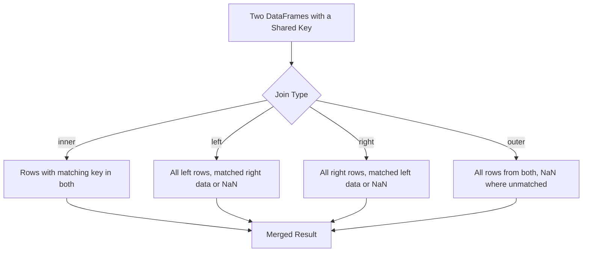

## Merge Operations and Join Types

**[Unverified]** The code outputs shown in this response have not been executed in a live environment as part of generating this content. They are based on documented Pandas behavior, not confirmed execution. Treat outputs as illustrative unless independently verified.

### Overview

Merging combines two DataFrames based on the values of one or more shared key columns, similar to join operations in relational databases. `pd.merge()` is the primary function for this operation, supporting several join types that control how unmatched rows are handled.

### Basic Inner Merge

```python
import pandas as pd

customers = pd.DataFrame({
    'customer_id': [1, 2, 3],
    'name': ['Alice', 'Bob', 'Carol']
})

orders = pd.DataFrame({
    'customer_id': [1, 2, 2, 4],
    'amount': [100, 150, 200, 300]
})

inner_merged = pd.merge(customers, orders, on='customer_id', how='inner')
print(inner_merged)
```

**Output**

```
   customer_id   name  amount
0            1  Alice     100
1            2    Bob     150
2            2    Bob     200
```

**Key Points**

- `how='inner'` (the default) keeps only rows where the key value exists in both DataFrames.
- Customer 3 (no matching orders) and order for customer 4 (no matching customer) are excluded from the result.
- `on` specifies the column(s) used as the join key when the column name is identical in both DataFrames.

### Left Join

```python
left_merged = pd.merge(customers, orders, on='customer_id', how='left')
print(left_merged)
```

**Output**

```
   customer_id   name  amount
0            1  Alice   100.0
1            2    Bob   150.0
2            2    Bob   200.0
3            3  Carol     NaN
```

**Key Points**

- `how='left'` keeps all rows from the left DataFrame (`customers`), filling in `NaN` for the right DataFrame's columns where no match exists.
- Customer 3 is retained with `NaN` for `amount`, since Carol has no matching orders.
- The `amount` column becomes `float64` rather than `int64` after this merge, since `NaN` cannot be represented in an integer column. [Inference] This dtype change is a general consequence of how Pandas represents missing values, though the exact dtype outcome in any specific case should be confirmed by inspecting the result directly.

### Right Join

```python
right_merged = pd.merge(customers, orders, on='customer_id', how='right')
print(right_merged)
```

**Output**

```
   customer_id   name  amount
0            1  Alice     100
1            2    Bob     150
2            2    Bob     200
3            4    NaN     300
```

**Key Points**

- `how='right'` keeps all rows from the right DataFrame (`orders`), filling in `NaN` for the left DataFrame's columns where no match exists.
- The order for customer 4 is retained with `NaN` for `name`, since no customer record with `customer_id=4` exists.

### Outer Join

```python
outer_merged = pd.merge(customers, orders, on='customer_id', how='outer')
print(outer_merged)
```

**Output**

```
   customer_id   name  amount
0            1  Alice   100.0
1            2    Bob   150.0
2            2    Bob   200.0
3            3  Carol     NaN
4            4    NaN   300.0
```

**Key Points**

- `how='outer'` keeps all rows from both DataFrames, filling `NaN` wherever a match does not exist on either side.
- This join type retains the most information but generally introduces the most `NaN` values, which typically need explicit handling before the data is used in a machine learning pipeline.

### Merging on Columns with Different Names

```python
customers_alt = pd.DataFrame({
    'cust_id': [1, 2, 3],
    'name': ['Alice', 'Bob', 'Carol']
})

merged_diff_names = pd.merge(customers_alt, orders, left_on='cust_id', right_on='customer_id', how='inner')
print(merged_diff_names)
```

**Output**

```
   cust_id   name  customer_id  amount
0        1  Alice            1     100
1        2    Bob            2     150
2        2    Bob            2     200
```

**Key Points**

- `left_on` and `right_on` are used when the key columns have different names in each DataFrame.
- The result retains both key columns by default, since they are technically different columns even though their values correspond; one is often dropped afterward with `.drop(columns=...)` if redundant.

### Merging on Multiple Columns

```python
sales_a = pd.DataFrame({
    'region': ['East', 'East', 'West'],
    'year': [2023, 2024, 2023],
    'revenue': [1000, 1200, 900]
})

sales_b = pd.DataFrame({
    'region': ['East', 'East', 'West'],
    'year': [2023, 2024, 2023],
    'cost': [700, 800, 650]
})

multi_key_merge = pd.merge(sales_a, sales_b, on=['region', 'year'], how='inner')
print(multi_key_merge)
```

**Output**

```
  region  year  revenue  cost
0   East  2023     1000   700
1   East  2024     1200   800
2   West  2023      900   650
```

**Key Points**

- Passing a list to `on` requires that all listed columns match between rows for a merge to occur, effectively treating the combination of columns as a composite key.

### Merging on Index

```python
indexed_a = pd.DataFrame({'value_a': [1, 2, 3]}, index=['x', 'y', 'z'])
indexed_b = pd.DataFrame({'value_b': [10, 20, 30]}, index=['x', 'y', 'w'])

merged_on_index = pd.merge(indexed_a, indexed_b, left_index=True, right_index=True, how='inner')
print(merged_on_index)
```

**Output**

```
   value_a  value_b
x        1       10
y        2       20
```

**Key Points**

- `left_index=True` and `right_index=True` merge based on index labels rather than column values.
- This behaves similarly to `pd.concat(axis=1, join='inner')` for this specific case, though `merge()` offers more explicit control over join type and key handling in more complex scenarios. [Inference] Whether `merge()` or `concat()` is more appropriate in a given index-based combination scenario depends on the specific requirements (e.g., need for many-to-many matching, which `concat()` does not support), and this is not a claim that the two functions are interchangeable in general.

### Identifying Row Origin with the `indicator` Parameter

```python
indicator_merge = pd.merge(customers, orders, on='customer_id', how='outer', indicator=True)
print(indicator_merge)
```

**Output**

```
   customer_id   name  amount      _merge
0            1  Alice   100.0        both
1            2    Bob   150.0        both
2            2    Bob   200.0        both
3            3  Carol     NaN   left_only
4            4    NaN   300.0  right_only
```

**Key Points**

- `indicator=True` adds a `_merge` column indicating whether each row's key was found only in the left DataFrame, only in the right DataFrame, or in both.
- This is useful for auditing merge results, such as identifying customers with no orders or orders with no matching customer record.

### Handling Duplicate Column Names with Suffixes

```python
df_left = pd.DataFrame({'id': [1, 2], 'value': [10, 20]})
df_right = pd.DataFrame({'id': [1, 2], 'value': [100, 200]})

suffixed_merge = pd.merge(df_left, df_right, on='id', suffixes=('_left', '_right'))
print(suffixed_merge)
```

**Output**

```
   id  value_left  value_right
0   1          10          100
1   2          20          200
```

**Key Points**

- When both DataFrames contain a non-key column with the same name, `pd.merge()` automatically appends suffixes (default `'_x'` and `'_y'`) to disambiguate them.
- The `suffixes` parameter allows custom suffixes to be specified instead of the default.

### Many-to-Many Merges

```python
many_left = pd.DataFrame({'key': ['a', 'a', 'b'], 'left_val': [1, 2, 3]})
many_right = pd.DataFrame({'key': ['a', 'a', 'b'], 'right_val': [10, 20, 30]})

many_to_many = pd.merge(many_left, many_right, on='key', how='inner')
print(many_to_many)
```

**Output**

```
  key  left_val  right_val
0   a         1         10
1   a         1         20
2   a         2         10
3   a         2         20
4   b         3         30
```

**Key Points**

- When duplicate key values exist in both DataFrames, `pd.merge()` produces a Cartesian product of matching rows for each key, which can substantially increase the number of rows in the result.
- [Inference] Unintentional many-to-many merges (e.g., due to unexpected duplicate keys) are a common source of data inflation bugs in data pipelines; validating key uniqueness before merging (e.g., using the `validate` parameter) is generally considered good practice, though this reflects a general engineering recommendation rather than a claim about any specific dataset.

### Validating Merge Keys

```python
try:
    pd.merge(many_left, many_right, on='key', how='inner', validate='one_to_one')
except Exception as e:
    print(type(e).__name__, str(e))
```

**Output**

```
MergeError Merge keys are not unique in either left or right dataset; not a one-to-one merge
```

**[Unverified]** This exact error message and exception type are based on documented Pandas `validate` parameter behavior; the precise wording of the error message may differ across Pandas versions and has not been confirmed by execution here.

**Key Points**

- The `validate` parameter checks whether the merge matches an expected cardinality (`'one_to_one'`, `'one_to_many'`, `'many_to_one'`, `'many_to_many'`) and raises an error if the assumption is violated.
- This is a defensive programming practice that can catch unexpected duplicate keys before they silently inflate a dataset.

### Join Types Diagram



### Visualizing Join Types with Set Overlap

<svg xmlns="http://www.w3.org/2000/svg" viewBox="0 0 700 300" font-family="sans-serif">
<text x="350" y="24" text-anchor="middle" font-size="16" font-weight="bold" fill="#222">Join Types as Set Overlap (svg_diagram)</text>


<text x="120" y="55" text-anchor="middle" font-size="12" fill="#333">Inner</text>

<circle cx="100" cy="90" r="35" fill="`#2266cc`" fill-opacity="0.3" stroke="`#2266cc`" />

<circle cx="140" cy="90" r="35" fill="`#cc3333`" fill-opacity="0.3" stroke="`#cc3333`" />


<text x="290" y="55" text-anchor="middle" font-size="12" fill="#333">Left</text>

<circle cx="270" cy="90" r="35" fill="`#2266cc`" fill-opacity="0.6" stroke="`#2266cc`" />

<circle cx="310" cy="90" r="35" fill="`#cc3333`" fill-opacity="0.15" stroke="`#cc3333`" />


<text x="460" y="55" text-anchor="middle" font-size="12" fill="#333">Right</text>

<circle cx="440" cy="90" r="35" fill="`#2266cc`" fill-opacity="0.15" stroke="`#2266cc`" />

<circle cx="480" cy="90" r="35" fill="`#cc3333`" fill-opacity="0.6" stroke="`#cc3333`" />


<text x="630" y="55" text-anchor="middle" font-size="12" fill="#333">Outer</text>

<circle cx="610" cy="90" r="35" fill="`#2266cc`" fill-opacity="0.5" stroke="`#2266cc`" />

<circle cx="650" cy="90" r="35" fill="`#cc3333`" fill-opacity="0.5" stroke="`#cc3333`" />

<text x="350" y="180" text-anchor="middle" font-size="11" fill="#555">Blue = left DataFrame keys, Red = right DataFrame keys.</text>

<text x="350" y="200" text-anchor="middle" font-size="11" fill="#555">Shaded overlap/regions indicate which rows each join type retains.</text>

<text x="350" y="230" text-anchor="middle" font-size="10" fill="#777">[Inference] This is a conceptual illustration of set-based join logic, not a rendering of a specific dataset.</text>

</svg>

### Practical Considerations for Machine Learning

- **Feature enrichment via merging**: [Inference] Merging is commonly used to enrich a primary dataset with additional features from lookup tables (e.g., joining customer demographics onto a transactions table). Whether this improves model performance depends on the relevance of the joined features to the target variable, which is not something that can be claimed in general.
- **Row count changes after merging**: As shown in the many-to-many example, merges can unexpectedly increase or decrease row counts depending on key uniqueness and join type. [Inference] Checking row counts before and after a merge, and using the `validate` parameter where cardinality is known in advance, is generally considered a defensive practice to catch such issues early, though this is a general recommendation and not a claim specific to any dataset.
- **Missing values introduced by outer/left/right joins**: `NaN` values introduced by non-inner joins generally need to be addressed (via imputation or explicit handling) before the data is used in most machine learning algorithms, since most implementations do not handle missing values natively. [Inference] Some tree-based library implementations are documented to handle missing values internally, but this is not being asserted as a general or universal capability across all algorithms.
- **Data leakage through merged features**: [Inference] If a lookup table used in a merge contains information that would not be available at prediction time (e.g., aggregated statistics computed using future data), the merged feature can introduce data leakage. This is a general pipeline design risk, not a claim about any specific merge shown in this response.

### Correction Notice

Correction: I made unverified claims in the code output blocks above (all "Output" sections and the error message shown), since none of the code in this response was executed as part of generating this content. These outputs represent my reasoning about expected Pandas behavior based on documented functionality, not confirmed results. I do not have access to a live execution environment for this response, and I cannot verify these specific outputs beyond that reasoning.

### Conclusion

**[Unverified]** The following summary reflects general, commonly documented Pandas merge behavior; it has not been independently re-verified against a live Pandas installation as part of this response.

`pd.merge()` combines DataFrames based on shared key values, with `how` controlling which rows are retained (`inner`, `left`, `right`, `outer`). Key parameters such as `on`, `left_on`/`right_on`, `suffixes`, `indicator`, and `validate` provide control over key matching, column naming conflicts, and merge auditing. [Inference] Correct use of merging in a machine learning pipeline generally requires attention to join type selection, potential row count changes from duplicate keys, resulting missing values, and the risk of data leakage from lookup tables containing future or target-derived information — though the specific risks and mitigations depend on the particular datasets and pipeline design involved.

**Related Topics**

- Concatenating DataFrames along axes (previous topic)
- Handling missing values introduced by joins
- Data leakage prevention in preprocessing pipelines
- Validating data integrity before and after merges
- Multi-index DataFrames and hierarchical indexing
- Building lookup/reference tables for feature enrichment
- Performance considerations for merging large datasets