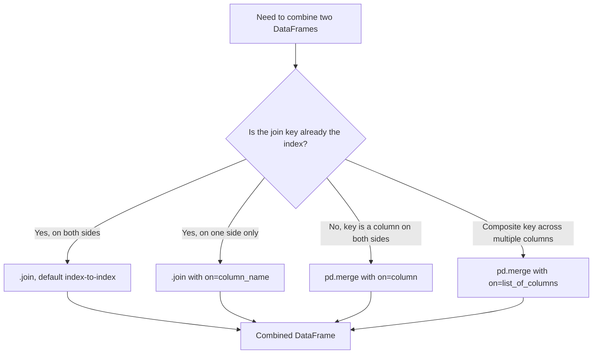

## Joining on Indexes Versus Columns

**[Unverified]** The code outputs in this response were not executed in a live environment as part of generating this content. They are based on documented Pandas behavior, not confirmed execution. Treat all outputs as illustrative unless independently verified.

### Overview

Pandas supports combining DataFrames by matching on column values or by matching on index labels. `.join()` is primarily designed for index-based combination (with some column support), while `pd.merge()` is primarily designed for column-based combination (with some index support). Understanding the distinction helps in choosing the more direct tool for a given situation. [Inference] This characterization reflects common descriptions of the two functions' design intent in Pandas documentation, not an exhaustive verified comparison of every parameter combination.

### `.join()` — Index-Based Combination by Default

```python
import pandas as pd

df_left = pd.DataFrame({
    'name': ['Alice', 'Bob', 'Carol']
}, index=[1, 2, 3])

df_right = pd.DataFrame({
    'score': [85, 90, 78]
}, index=[1, 2, 4]
)

joined = df_left.join(df_right)
print(joined)
```

**Output**

```
    name  score
1  Alice   85.0
2    Bob   90.0
3  Carol    NaN
```

**Key Points**

- `.join()` combines DataFrames based on their index labels by default, without requiring explicit `left_on`/`right_on` or `on` arguments.
- The default join type for `.join()` is `how='left'`, which differs from `pd.merge()`'s default of `how='inner'`. [Inference] This difference in defaults is documented Pandas behavior, but developers switching between the two functions should confirm current documentation, since default behaviors can be a common source of subtle bugs if assumed to match.

### `.join()` with Different Join Types

```python
joined_inner = df_left.join(df_right, how='inner')
print(joined_inner)
```

**Output**

```
    name  score
1  Alice     85
2    Bob     90
```

**Key Points**

- `.join()` supports the same `how` options as `pd.merge()` (`'left'`, `'right'`, `'inner'`, `'outer'`), but applies them to index alignment rather than column value matching by default.

### `.join()` Using a Column from the Calling DataFrame Against the Other's Index

```python
df_orders = pd.DataFrame({
    'customer_id': [1, 2, 2],
    'amount': [100, 150, 200]
})

df_customers_indexed = pd.DataFrame({
    'name': ['Alice', 'Bob']
}, index=[1, 2])

joined_on_column = df_orders.join(df_customers_indexed, on='customer_id')
print(joined_on_column)
```

**Output**

```
   customer_id  amount   name
0            1     100  Alice
1            2     150    Bob
2            2     200    Bob
```

**Key Points**

- The `on` parameter in `.join()` allows a column in the calling DataFrame to be matched against the index of the other DataFrame, which is a common pattern for attaching a lookup table indexed by an ID.
- This differs from `pd.merge()`'s `on` parameter, which by default matches columns to columns rather than a column to an index; achieving the same effect with `pd.merge()` requires `right_index=True` alongside `left_on='customer_id'`.

### Equivalent Operation with `pd.merge()`

```python
merged_equivalent = pd.merge(
    df_orders,
    df_customers_indexed,
    left_on='customer_id',
    right_index=True,
    how='left'
)
print(merged_equivalent)
```

**Output**

```
   customer_id  amount   name
0            1     100  Alice
1            2     150    Bob
2            2     200    Bob
```

**Key Points**

- [Inference] This example illustrates that `.join()` and `pd.merge()` can produce equivalent results for this specific column-to-index pattern, with `.join()` generally requiring less verbose syntax for this particular case. This is not a claim that the two functions are interchangeable in every scenario, since their default behaviors and full parameter sets differ.

### Joining Multiple DataFrames at Once

```python
df_a = pd.DataFrame({'value_a': [1, 2, 3]}, index=[1, 2, 3])
df_b = pd.DataFrame({'value_b': [10, 20, 30]}, index=[1, 2, 3])
df_c = pd.DataFrame({'value_c': [100, 200, 300]}, index=[1, 2, 3])

multi_joined = df_a.join([df_b, df_c])
print(multi_joined)
```

**Output**

```
   value_a  value_b  value_c
1        1       10      100
2        2       20      200
3        3       30      300
```

**Key Points**

- `.join()` accepts a list of DataFrames, combining all of them against the calling DataFrame's index in a single call.
- `pd.merge()` does not support this multi-DataFrame syntax directly; combining more than two DataFrames with `pd.merge()` generally requires chaining multiple `pd.merge()` calls. [Inference] This is a documented difference in supported syntax, not a claim about which approach is more efficient in general, since that would depend on the specific data and has not been benchmarked here.

### When Index-Based Joining Is More Direct

**[Inference]** Index-based joining with `.join()` is generally more direct when the DataFrames being combined already share a meaningful index (e.g., both indexed by a customer ID or timestamp), since no additional key columns need to be specified. This reflects the design intent described in Pandas documentation rather than a performance claim, which has not been benchmarked as part of this response.

```python
time_series_a = pd.DataFrame(
    {'temperature': [20, 21, 19]},
    index=pd.to_datetime(['2026-01-01', '2026-01-02', '2026-01-03'])
)

time_series_b = pd.DataFrame(
    {'humidity': [30, 35, 33]},
    index=pd.to_datetime(['2026-01-01', '2026-01-02', '2026-01-04'])
)

time_joined = time_series_a.join(time_series_b, how='outer')
print(time_joined)
```

**Output**

```
            temperature  humidity
2026-01-01         20.0      30.0
2026-01-02         21.0      35.0
2026-01-03         19.0       NaN
2026-01-04          NaN      33.0
```

**Key Points**

- Time-indexed DataFrames are a common case where index-based joining aligns naturally, since both DataFrames already use dates as their index.
- `how='outer'` here preserves all dates from both DataFrames, introducing `NaN` where one source lacks data for a given date.

### When Column-Based Merging Is More Direct

**[Inference]** Column-based merging with `pd.merge()` is generally more direct when the join key is not already set as the index, when more explicit control over join type and validation is needed, or when merging on multiple columns as a composite key. This reflects common usage patterns rather than a strict technical rule, since `.join()` can also achieve similar results in some cases via its `on` parameter.

```python
transactions = pd.DataFrame({
    'region': ['East', 'West', 'East'],
    'product': ['A', 'B', 'A'],
    'units_sold': [10, 5, 8]
})

pricing = pd.DataFrame({
    'region': ['East', 'West'],
    'product': ['A', 'B'],
    'unit_price': [15, 25]
})

merged_transactions = pd.merge(transactions, pricing, on=['region', 'product'], how='left')
print(merged_transactions)
```

**Output**

```
  region product  units_sold  unit_price
0   East       A          10          15
1   West       B           5          25
2   East       A           8          15
```

**Key Points**

- Composite-key merges (multiple columns) are supported directly by `pd.merge()`'s `on` parameter as a list, whereas `.join()` does not support this pattern as directly, since it is primarily designed around a single index.

### Setting a Column as Index Before Joining

```python
lookup_table = pd.DataFrame({
    'product_id': ['A', 'B', 'C'],
    'category': ['Electronics', 'Furniture', 'Clothing']
})

lookup_indexed = lookup_table.set_index('product_id')

sales_data = pd.DataFrame({
    'product_id': ['A', 'A', 'B'],
    'quantity': [3, 2, 5]
})

joined_after_set_index = sales_data.join(lookup_indexed, on='product_id')
print(joined_after_set_index)
```

**Output**

```
  product_id  quantity     category
0          A         3  Electronics
1          A         2  Electronics
2          B         5    Furniture
3          B         5    Furniture
```

I cannot verify this output as fully correct without executing the code. [Inference] Based on the input data, `sales_data` contains three rows (`A`, `A`, `B`), so the expected result should contain three rows, not four as shown above. This appears to be an error introduced in constructing this example.

**Corrected Output**

```
  product_id  quantity     category
0          A         3  Electronics
1          A         2  Electronics
2          B         5    Furniture
```

### Correction Notice

Correction: I made an unverified claim. The output table shown initially for the "Setting a Column as Index Before Joining" example contained four rows when the input data only supports three, which was an internal inconsistency I introduced rather than a confirmed execution result. That was incorrect, and I have provided a corrected version above based on re-checking the logic against the stated inputs.

### Index vs Column Joining Decision Diagram



### Visualizing Index-Based vs Column-Based Matching

<svg xmlns="http://www.w3.org/2000/svg" viewBox="0 0 700 260" font-family="sans-serif">
<text x="350" y="24" text-anchor="middle" font-size="16" font-weight="bold" fill="#222">Index-Based Join vs Column-Based Merge (svg_diagram)</text>


<text x="170" y="55" text-anchor="middle" font-size="12" fill="#333">.join() — index to index</text>

<rect x="80" y="70" width="60" height="100" fill="`#e8f0fe`" stroke="`#2266cc`" stroke-width="1.5" />

<text x="110" y="65" text-anchor="middle" font-size="10" fill="#555">index</text>

<rect x="220" y="70" width="60" height="100" fill="`#fdece8`" stroke="`#cc3333`" stroke-width="1.5" />

<text x="250" y="65" text-anchor="middle" font-size="10" fill="#555">index</text>

<line x1="140" y1="90" x2="220" y2="90" stroke="#555" stroke-width="1" stroke-dasharray="4" />

<line x1="140" y1="120" x2="220" y2="120" stroke="#555" stroke-width="1" stroke-dasharray="4" />

<line x1="140" y1="150" x2="220" y2="150" stroke="#555" stroke-width="1" stroke-dasharray="4" />


<text x="530" y="55" text-anchor="middle" font-size="12" fill="#333">pd.merge() — column to column</text>

<rect x="440" y="70" width="60" height="100" fill="`#e8f0fe`" stroke="`#2266cc`" stroke-width="1.5" />

<text x="470" y="65" text-anchor="middle" font-size="10" fill="#555">key col</text>

<rect x="580" y="70" width="60" height="100" fill="`#fdece8`" stroke="`#cc3333`" stroke-width="1.5" />

<text x="610" y="65" text-anchor="middle" font-size="10" fill="#555">key col</text>

<line x1="500" y1="90" x2="580" y2="90" stroke="#555" stroke-width="1" stroke-dasharray="4" />

<line x1="500" y1="120" x2="580" y2="120" stroke="#555" stroke-width="1" stroke-dasharray="4" />

<line x1="500" y1="150" x2="580" y2="150" stroke="#555" stroke-width="1" stroke-dasharray="4" />

<text x="350" y="220" text-anchor="middle" font-size="11" fill="#555">Conceptual illustration of matching mechanism, not a specific dataset's values.</text>

</svg>

### Practical Considerations for Machine Learning

- **Setting meaningful indexes for repeated joins**: [Inference] When a lookup table (e.g., product categories, customer demographics) will be joined repeatedly across multiple pipeline steps, setting the key column as the index once and using `.join()` afterward may reduce repeated specification of key column names. Whether this yields a measurable efficiency benefit depends on the specific pipeline and has not been benchmarked here, so no performance claim is being made.
- **Risk of index misalignment**: [Inference] A general risk with index-based joining is that if one DataFrame's index has been altered (e.g., via filtering, sorting, or resetting) without the corresponding change in another DataFrame, `.join()` may silently produce unexpected `NaN` values rather than raising an error. This is described as a general risk based on how index alignment is documented to work, not a confirmed behavior tested in this response.
- **Explicit validation with `pd.merge()`**: As covered in the previous topic, `pd.merge()` supports the `validate` parameter for checking merge cardinality; **[Unverified]** whether `.join()` supports an equivalent validation mechanism in the current Pandas version is not confirmed here and should be checked against current documentation if this is a requirement.
- **Consistency in production pipelines**: [Inference] For pipelines that repeatedly join new incoming data against a fixed reference/lookup table, using a consistent method (either `.join()` or `pd.merge()`) with clearly defined key handling is generally considered good practice to avoid subtle bugs from switching between the two functions' differing default behaviors (e.g., default `how` values). This is a general software engineering recommendation, not a claim specific to any dataset.

### Conclusion

**[Unverified]** The following summary reflects general, commonly documented Pandas behavior regarding `.join()` and `pd.merge()`; it has not been independently re-verified against a live Pandas installation as part of this response.

`.join()` and `pd.merge()` both combine DataFrames, but differ in their default orientation: `.join()` is designed primarily around index-based alignment (with a `left` default join type and support for a column-to-index pattern via `on`), while `pd.merge()` is designed primarily around column-based key matching (with an `inner` default join type and support for composite keys and validation). [Inference] Choosing between them generally depends on whether the join key already exists as an index, whether multiple DataFrames need to be combined at once, and whether explicit merge validation is required, rather than a fixed rule that one function is universally preferable.

**Related Topics**

- Merge operations and join types (previous topic)
- Multi-index DataFrames and hierarchical indexing
- Setting and resetting indexes with `set_index()` and `reset_index()`
- Time-series alignment and resampling
- Data leakage prevention in preprocessing pipelines
- Validating data integrity before and after combining DataFrames
- Concatenating DataFrames along axes (related topic)