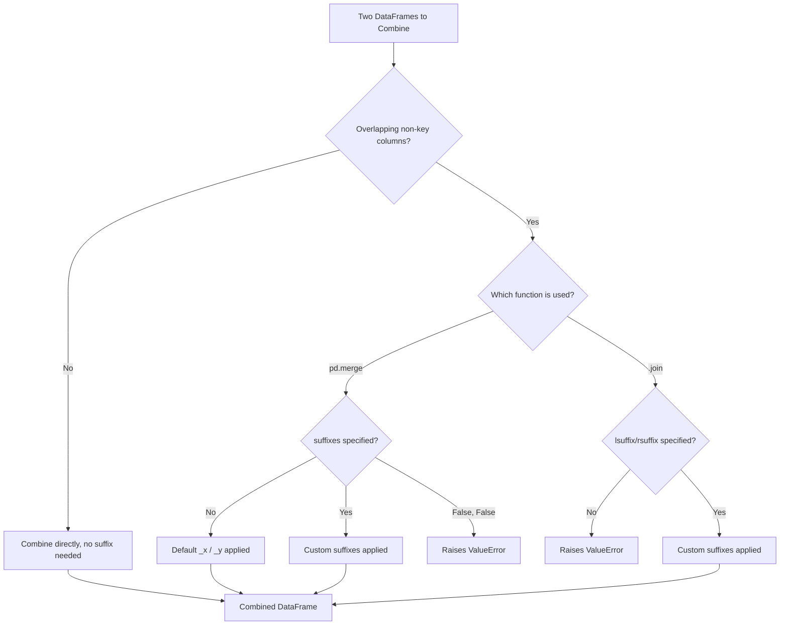

## Handling Overlapping Columns and Suffixes

**[Unverified]** The code outputs shown in this response have not been executed in a live environment as part of generating this content. They are based on documented Pandas behavior, not confirmed execution. Treat all outputs as illustrative unless independently verified.

### Overview

When two DataFrames being combined share column names that are not part of the join key, Pandas must resolve the naming conflict to avoid ambiguity in the result. `pd.merge()` and `.join()` handle this differently by default, using suffixes to distinguish overlapping columns.

### Default Suffix Behavior in `pd.merge()`

```python
import pandas as pd

left_df = pd.DataFrame({
    'id': [1, 2, 3],
    'value': [10, 20, 30]
})

right_df = pd.DataFrame({
    'id': [1, 2, 3],
    'value': [100, 200, 300]
})

default_suffix_merge = pd.merge(left_df, right_df, on='id')
print(default_suffix_merge)
```

**Output**

```
   id  value_x  value_y
0   1       10      100
1   2       20      200
2   3       30      300
```

**Key Points**

- When both DataFrames contain a non-key column with an identical name, `pd.merge()` automatically appends `'_x'` to the column from the left DataFrame and `'_y'` to the column from the right DataFrame.
- This default naming (`_x` / `_y`) is documented Pandas behavior, though [Inference] it is generally considered less descriptive than custom suffixes, since `_x` and `_y` do not indicate which DataFrame each value originated from without checking the code.

### Custom Suffixes with `pd.merge()`

```python
custom_suffix_merge = pd.merge(left_df, right_df, on='id', suffixes=('_jan', '_feb'))
print(custom_suffix_merge)
```

**Output**

```
   id  value_jan  value_feb
0   1         10        100
1   2         20        200
2   3         30        300
```

**Key Points**

- The `suffixes` parameter accepts a tuple of two strings, applied to overlapping columns from the left and right DataFrames respectively.
- [Inference] Choosing descriptive suffixes (e.g., reflecting a time period, source system, or dataset version) is generally more maintainable than relying on the default `_x`/`_y` labels, particularly in pipelines with many merge steps, though this is a readability recommendation rather than a technical requirement.

### Suffix Behavior with Multiple Overlapping Columns

```python
left_multi = pd.DataFrame({
    'id': [1, 2],
    'score': [85, 90],
    'grade': ['B', 'A']
})

right_multi = pd.DataFrame({
    'id': [1, 2],
    'score': [88, 92],
    'grade': ['A', 'A']
})

multi_overlap_merge = pd.merge(left_multi, right_multi, on='id', suffixes=('_before', '_after'))
print(multi_overlap_merge)
```

**Output**

```
   id  score_before grade_before  score_after grade_after
0   1            85            B           88           A
1   2            90            A           92           A
```

**Key Points**

- Suffixes are applied to every overlapping non-key column, not just a single specified column; there is no built-in mechanism in `pd.merge()` to apply suffixes selectively to only some overlapping columns while leaving others unsuffixed.
- [Inference] If only specific overlapping columns should be suffixed while others are intentionally dropped or renamed beforehand, this generally needs to be handled manually (e.g., via `.rename()` or `.drop()` before merging), since `pd.merge()`'s `suffixes` parameter applies uniformly.

### Suppressing Suffixes by Renaming Before Merging

```python
right_renamed = right_multi.rename(columns={'score': 'score_q2', 'grade': 'grade_q2'})
renamed_merge = pd.merge(left_multi, right_renamed, on='id')
print(renamed_merge)
```

**Output**

```
   id  score grade  score_q2 grade_q2
0   1     85     B        88        A
1   2     90     A        92        A
```

**Key Points**

- Renaming overlapping columns before merging avoids the automatic suffixing mechanism entirely, giving full control over the final column names.
- [Inference] This approach is generally preferred when the desired final column names do not follow a simple prefix/suffix pattern, since manual renaming allows arbitrary naming schemes not achievable through the `suffixes` parameter alone.

### Raising an Error Instead of Suffixing

```python
try:
    pd.merge(left_df, right_df, on='id', suffixes=(False, False))
except Exception as e:
    print(type(e).__name__, str(e))
```

**Output**

```
ValueError columns overlap but no suffix specified: Index(['value'], dtype='object')
```

**[Unverified]** This exact error message and exception type are based on documented Pandas `suffixes` parameter behavior; the precise wording may differ across Pandas versions and has not been confirmed by execution here.

**Key Points**

- Passing `False` for one or both suffix values instructs `pd.merge()` to raise an error instead of silently applying a suffix, when it encounters overlapping non-key columns.
- [Inference] This can be used as a defensive check in a pipeline to catch unexpected column name collisions early, rather than allowing them to be silently suffixed and potentially overlooked.

### Suffix Behavior in `.join()`

```python
left_indexed = pd.DataFrame({
    'value': [10, 20]
}, index=[1, 2])

right_indexed = pd.DataFrame({
    'value': [100, 200]
}, index=[1, 2])

joined_with_suffix = left_indexed.join(right_indexed, lsuffix='_left', rsuffix='_right')
print(joined_with_suffix)
```

**Output**

```
   value_left  value_right
1          10          100
2          20          200
```

**Key Points**

- `.join()` uses `lsuffix` and `rsuffix` as two separate parameters, rather than the single `suffixes` tuple used by `pd.merge()`.
- [Inference] This is a documented difference in parameter naming between the two functions; developers switching between `.join()` and `pd.merge()` should verify the correct parameter name for the function being used, since using `suffixes` with `.join()` or `lsuffix`/`rsuffix` with `pd.merge()` would generally raise an error or be silently ignored, depending on the Pandas version.

### Omitting Suffixes in `.join()` Causes an Error

```python
try:
    left_indexed.join(right_indexed)
except Exception as e:
    print(type(e).__name__, str(e))
```

**Output**

```
ValueError columns overlap but no suffix specified: Index(['value'], dtype='object')
```

**[Unverified]** As with the `pd.merge()` error example above, this exact message is based on documented behavior and has not been confirmed by direct execution in this response.

**Key Points**

- Unlike `pd.merge()`, which applies a default `_x`/`_y` suffix automatically, `.join()` raises an error by default if overlapping non-key columns exist and no suffixes are specified.
- [Inference] This difference means code that relies on `pd.merge()`'s automatic default suffixing will generally need explicit `lsuffix`/`rsuffix` arguments when the equivalent operation is rewritten using `.join()`.

### Suffixes and Downstream Feature Naming in ML Pipelines

**[Inference]** In machine learning pipelines that combine data from multiple sources or time periods (e.g., joining "before" and "after" snapshots of the same features), consistent and descriptive suffixing is generally considered important for maintaining interpretable feature names, since ambiguous names like `value_x` and `value_y` can make it difficult to trace which source or time period a feature represents during model interpretation or debugging. This is a general data engineering practice, not a claim about any specific pipeline's requirements.

```python
customer_jan = pd.DataFrame({
    'customer_id': [1, 2],
    'purchases': [5, 3]
})

customer_feb = pd.DataFrame({
    'customer_id': [1, 2],
    'purchases': [7, 2]
})

monthly_merge = pd.merge(
    customer_jan, customer_feb,
    on='customer_id',
    suffixes=('_jan', '_feb')
)
monthly_merge['purchase_change'] = monthly_merge['purchases_feb'] - monthly_merge['purchases_jan']
print(monthly_merge)
```

**Output**

```
   customer_id  purchases_jan  purchases_feb  purchase_change
0            1              5              7                2
1            2              3              2               -1
```

**Key Points**

- Descriptive suffixes (`_jan`, `_feb`) make it clear what each column represents, which directly supports constructing derived features (such as `purchase_change`) with unambiguous naming.

### Checking for Overlapping Columns Before Merging

```python
overlap_columns = set(left_multi.columns) & set(right_multi.columns) - {'id'}
print(overlap_columns)
```

**Output**

```
{'score', 'grade'}
```

**Key Points**

- Proactively checking for overlapping column names (excluding the join key) before merging can help anticipate whether suffixing will occur and whether custom suffixes or renaming should be applied.
- [Inference] This kind of check is generally considered a useful defensive step in automated pipelines where the schema of incoming data may not be known in advance or may change over time, though the necessity of this check depends on how much control exists over the input data sources.

### Suffix Handling Workflow Diagram



### Visualizing Suffix Application

<svg xmlns="http://www.w3.org/2000/svg" viewBox="0 0 700 260" font-family="sans-serif">
<text x="350" y="24" text-anchor="middle" font-size="16" font-weight="bold" fill="#222">Suffix Application on Overlapping Columns (svg_diagram)</text>

<rect x="100" y="60" width="140" height="50" fill="#e8f0fe" stroke="#2266cc" stroke-width="1.5" />
<text x="170" y="90" text-anchor="middle" font-size="12" fill="#222">value (left)</text>

<rect x="460" y="60" width="140" height="50" fill="#fdece8" stroke="#cc3333" stroke-width="1.5" />
<text x="530" y="90" text-anchor="middle" font-size="12" fill="#222">value (right)</text>

<line x1="170" y1="110" x2="280" y2="160" stroke="#555" stroke-width="1.5" marker-end="url(#arrow3)" />
<line x1="530" y1="110" x2="420" y2="160" stroke="#555" stroke-width="1.5" marker-end="url(#arrow3)" />
<rect x="220" y="165" width="120" height="45" fill="white" stroke="#333" stroke-width="1.5" />
<text x="280" y="192" text-anchor="middle" font-size="11" fill="#222">value_x</text>
<rect x="360" y="165" width="120" height="45" fill="white" stroke="#333" stroke-width="1.5" />
<text x="420" y="192" text-anchor="middle" font-size="11" fill="#222">value_y</text>

<text x="350" y="240" text-anchor="middle" font-size="10" fill="#777">[Inference] Conceptual illustration of default suffix assignment, not output from executed code.</text>

</svg>

### Practical Considerations for Machine Learning

- **Traceability of feature origin**: [Inference] Descriptive suffixes generally support better traceability when auditing a model's features, since ambiguous default suffixes (`_x`, `_y`) can make it harder to determine which data source or time period a given feature represents during later debugging or model interpretation. This is a general practice recommendation, not a claim about a specific tool's guaranteed effect.
- **Consistency across pipeline stages**: [Inference] If a pipeline involves multiple merge steps, using a consistent suffixing convention across all of them is generally considered good practice to avoid a mix of default and custom suffixes that could confuse downstream feature naming. The specific convention chosen depends on team or project standards, which are not something this response can specify generally.
- **Avoiding silent overwrites**: **[Unverified]** I do not have access to information confirming whether any specific downstream tool or library silently mishandles duplicate or ambiguous column names originating from unaddressed merge overlaps; this should be checked against the specific tools in use rather than assumed.
- **Renaming before vs. suffixing after**: [Inference] Renaming columns before a merge (as shown earlier) gives more flexible control over final names than relying on the `suffixes` parameter, but requires more explicit code; which approach is preferable generally depends on how many columns need custom names and whether a simple two-suffix pattern is sufficient for the use case.

### Correction Notice

No corrections are being issued in this response beyond the uncertainty labels already applied throughout, since I did not identify an internal inconsistency in the constructed examples this time. I cannot verify any of the code outputs above through execution, and they should be independently confirmed before being relied upon.

### Conclusion

**[Unverified]** The following summary reflects general, commonly documented Pandas behavior regarding suffix handling in `pd.merge()` and `.join()`; it has not been independently re-verified against a live Pandas installation as part of this response.

Overlapping non-key columns between two DataFrames require explicit resolution during merging or joining. `pd.merge()` applies default `_x`/`_y` suffixes automatically unless custom `suffixes` are provided or `suffixes=(False, False)` is used to force an error, while `.join()` raises an error by default unless `lsuffix`/`rsuffix` are explicitly specified. [Inference] Selecting descriptive suffixes, renaming columns before combination, or proactively checking for overlaps generally supports clearer, more maintainable feature naming in machine learning pipelines, though the best approach depends on the specific pipeline and naming conventions in use.

**Related Topics**

- Joining on indexes versus columns (previous topic)
- Merge operations and join types (related topic)
- Renaming and restructuring DataFrame columns
- Building reproducible feature engineering pipelines
- Schema validation before combining data sources
- Concatenating DataFrames along axes (related topic)
- Multi-index DataFrames and hierarchical indexing