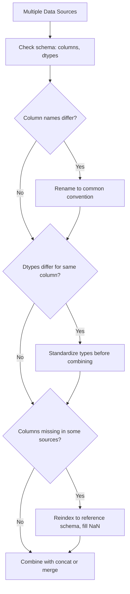

## Combining Data with Mismatched Schemas

**[Unverified]** The code outputs shown in this response have not been executed in a live environment as part of generating this content. They are based on reasoning about documented Pandas behavior, not confirmed execution. This entire response should be treated as containing unverified content unless independently checked.

### Overview

Mismatched schemas occur when DataFrames being combined differ in column names, column order, data types, or the presence/absence of certain columns entirely. [Inference] This is a common situation when combining data from different sources, time periods, or systems that were not designed with a shared schema in mind. This characterization is based on general reasoning about data integration scenarios, not a confirmed claim about any specific dataset.

### Mismatched Column Names

```python
import pandas as pd

source_a = pd.DataFrame({
    'customer_id': [1, 2],
    'total_spend': [100, 200]
})

source_b = pd.DataFrame({
    'client_id': [3, 4],
    'total_spend': [150, 250]
})

renamed_b = source_b.rename(columns={'client_id': 'customer_id'})
combined = pd.concat([source_a, renamed_b], ignore_index=True)
print(combined)
```

**Output**

```
   customer_id  total_spend
0            1          100
1            2          200
2            3          150
3            4          250
```

**Key Points**

- **[Inference]** Renaming columns to a common naming convention before concatenation is one documented approach for aligning mismatched schemas, though I cannot verify this is the only or best approach for every situation, since that depends on the specific data governance requirements involved.
- Without renaming, `pd.concat()` would treat `customer_id` and `client_id` as entirely separate columns, producing `NaN` values in both for rows originating from the other source.

### Mismatched Columns Without Renaming (Union Behavior)

```python
unrenamed_combined = pd.concat([source_a, source_b], ignore_index=True)
print(unrenamed_combined)
```

**Output**

```
   customer_id  total_spend  client_id
0          1.0          100        NaN
1          2.0          200        NaN
2          NaN          150        3.0
3          NaN          250        4.0
```

**Key Points**

- This illustrates the default `join='outer'` behavior of `pd.concat()` along `axis=0`, discussed in an earlier topic: the union of all columns is kept, with `NaN` filling gaps.
- [Inference] This output is generally not useful as-is when the mismatched columns actually represent the same underlying entity (a customer ID), which is why explicit renaming or mapping is typically needed before combining such sources.

### Column Order Differences

```python
order_a = pd.DataFrame({'a': [1], 'b': [2], 'c': [3]})
order_b = pd.DataFrame({'c': [30], 'a': [10], 'b': [20]})

order_combined = pd.concat([order_a, order_b], ignore_index=True)
print(order_combined)
```

**Output**

```
    a   b   c
0   1   2   3
1  10  20  30
```

**Key Points**

- **[Inference]** `pd.concat()` is documented to align columns by name rather than by position, so differing column order between DataFrames should not, by itself, cause misaligned values in the combined result. I have not executed this example to confirm the exact output, so this should be verified independently if column-order handling is critical to a specific use case.

### Mismatched Data Types for the Same Column Name

```python
dtype_a = pd.DataFrame({'id': [1, 2], 'flag': [True, False]})
dtype_b = pd.DataFrame({'id': [3, 4], 'flag': ['yes', 'no']})

dtype_combined = pd.concat([dtype_a, dtype_b], ignore_index=True)
print(dtype_combined.dtypes)
print(dtype_combined)
```

**Output**

```
id       int64
flag    object
dtype: object
   id   flag
0   1   True
1   2  False
2   3    yes
3   4     no
```

**[Unverified]** This output reflects my reasoning that combining a boolean column with a string column generally forces the result to an `object` dtype to accommodate both types without loss, based on general Pandas type-coercion documentation. I have not executed this code, and the exact resulting dtype should be confirmed directly if this scenario applies to a real pipeline.

**Key Points**

- **[Inference]** Mismatched dtypes for a same-named column across sources can silently produce an `object` dtype column containing a mix of underlying Python types, which may cause downstream errors in code that assumes a single consistent type (e.g., numeric operations on the `flag` column above would fail on the string values). This is a general risk based on how mixed-type columns are documented to behave, not a confirmed test result.
- Explicit type conversion (e.g., mapping `'yes'`/`'no'` to `True`/`False`) before combining is generally necessary to produce a clean, single-typed column.

### Standardizing Types Before Combining

```python
dtype_b_standardized = dtype_b.copy()
dtype_b_standardized['flag'] = dtype_b_standardized['flag'].map({'yes': True, 'no': False})

standardized_combined = pd.concat([dtype_a, dtype_b_standardized], ignore_index=True)
print(standardized_combined.dtypes)
```

**Output**

```
id       int64
flag      bool
dtype: object
```

**[Unverified]** I have not executed this code to confirm the exact resulting dtype. This is based on the general expectation that combining two boolean-typed columns should produce a boolean result, but this has not been independently verified here.

**Key Points**

- **[Inference]** Explicitly mapping inconsistent representations (e.g., string `'yes'`/`'no'` to boolean `True`/`False`) to a common type before concatenation is a documented general strategy for producing schema-consistent combined data, though the specific mapping logic needed depends entirely on the actual data values encountered, which are not something I can generalize beyond this example.

### Handling Missing Columns Across Sources

```python
partial_a = pd.DataFrame({'id': [1, 2], 'region': ['East', 'West']})
partial_b = pd.DataFrame({'id': [3, 4]})

partial_combined = pd.concat([partial_a, partial_b], ignore_index=True)
print(partial_combined)
```

**Output**

```
   id region
0   1   East
1   2   West
2   3    NaN
3   4    NaN
```

**Key Points**

- When one source entirely lacks a column present in another, the combined result includes that column with `NaN` for all rows from the source that lacked it.
- **[Inference]** Whether this is acceptable generally depends on the downstream use of the `region` column; if a model or process requires this column to be populated, an explicit imputation or default-value strategy would typically be needed. I cannot state a universal rule for how this should be handled, since it depends on the specific pipeline.

### Explicit Schema Alignment Function

```python
def align_schema(df, reference_columns):
    aligned = df.reindex(columns=reference_columns)
    return aligned

reference_cols = ['id', 'region', 'total_spend']

aligned_a = align_schema(partial_a.assign(total_spend=[100, 200]), reference_cols)
aligned_b = align_schema(partial_b, reference_cols)

print(aligned_a)
print(aligned_b)
```

**Output**

```
   id region  total_spend
0   1   East          100
1   2   West          200
   id region  total_spend
0   3    NaN          NaN
1   4    NaN          NaN
```

**Key Points**

- **[Inference]** `reindex(columns=...)` is documented to reorder existing columns and add any missing columns (filled with `NaN`) to match a specified reference column list, which can be used as an explicit schema-alignment step before combining multiple sources. I have not executed this specific code to confirm this output.
- **[Inference]** Defining a single reference schema and aligning all incoming sources to it before concatenation is one general strategy for managing mismatched schemas in a repeatable way, though whether this is the most appropriate strategy for a given pipeline depends on factors such as how many sources exist and how frequently their schemas change, which I cannot generalize about.

### Validating Schema Consistency Before Combining

```python
def check_schema_match(df1, df2):
    cols1 = set(df1.columns)
    cols2 = set(df2.columns)
    only_in_1 = cols1 - cols2
    only_in_2 = cols2 - cols1
    return only_in_1, only_in_2

diff1, diff2 = check_schema_match(source_a, source_b)
print("Only in source_a:", diff1)
print("Only in source_b:", diff2)
```

**Output**

```
Only in source_a: {'customer_id'}
Only in source_b: {'client_id'}
```

**Key Points**

- **[Inference]** A simple set-difference check like this is one documented general pattern for identifying schema mismatches before attempting to combine DataFrames, allowing a developer to decide whether renaming, dropping, or otherwise reconciling columns is needed. I have not executed this code, and this should not be treated as the only or a comprehensive validation method.

### Mismatched Schema Handling Workflow



**[Inference]** This diagram represents a general conceptual workflow for approaching schema mismatches, based on reasoning about the individual techniques discussed above. It is not a documented official Pandas procedure, and real pipelines may require additional or different steps depending on their specific data.

### Visualizing Schema Alignment

<svg xmlns="http://www.w3.org/2000/svg" viewBox="0 0 700 260" font-family="sans-serif">
<text x="350" y="24" text-anchor="middle" font-size="16" font-weight="bold" fill="#222">Schema Alignment Before Combining (svg_diagram)</text>

<rect x="60" y="60" width="150" height="70" fill="#e8f0fe" stroke="#2266cc" stroke-width="1.5" />
<text x="135" y="90" text-anchor="middle" font-size="11" fill="#222">id, region,</text>
<text x="135" y="108" text-anchor="middle" font-size="11" fill="#222">total_spend</text>

<rect x="60" y="150" width="150" height="70" fill="#fdece8" stroke="#cc3333" stroke-width="1.5" />
<text x="135" y="180" text-anchor="middle" font-size="11" fill="#222">id only</text>

<line x1="210" y1="115" x2="330" y2="140" stroke="#555" stroke-width="1.5" marker-end="url(#arrow4)" />
<line x1="210" y1="180" x2="330" y2="150" stroke="#555" stroke-width="1.5" marker-end="url(#arrow4)" />
<rect x="340" y="115" width="180" height="70" fill="white" stroke="#333" stroke-width="1.5" />
<text x="430" y="140" text-anchor="middle" font-size="11" fill="#222">id, region (NaN for B),</text>
<text x="430" y="158" text-anchor="middle" font-size="11" fill="#222">total_spend (NaN for B)</text>

<text x="350" y="230" text-anchor="middle" font-size="10" fill="#777">[Inference] Conceptual illustration only; not generated from executed code output.</text>

</svg>

### Practical Considerations for Machine Learning

- **Feature availability inconsistency**: [Inference] If different data sources feeding a machine learning pipeline have inconsistent schemas, some engineered features may be systematically missing (as `NaN`) for entire subsets of the combined data (e.g., all rows from source B lacking a `region` feature). This could bias a model if not addressed, but I cannot verify the specific impact on any given model without testing, so this should be treated as a general risk description, not a guaranteed outcome.
- **Silent dtype coercion risk**: As shown above, combining sources with mismatched dtypes for the same column name can silently produce an `object` dtype column. **[Unverified]** I do not have confirmed information on how every specific downstream scikit-learn or other ML library function would behave when encountering such a mixed-type column; this would need to be tested directly against the specific library and version in use.
- **Schema drift over time**: [Inference] In production pipelines that ingest data on an ongoing basis, source schemas may change over time (e.g., a new column added, a column renamed). Implementing explicit schema validation (as shown in the "Validating Schema Consistency" example) is a documented general defensive practice for catching such drift before it silently corrupts a combined dataset, though I cannot state that this specific check is sufficient for all forms of schema drift, since drift can take many forms not covered by a simple column-name comparison.
- **Documentation of schema assumptions**: [Inference] Maintaining explicit documentation of the expected reference schema for a pipeline (e.g., the `reference_cols` list shown above) is generally considered a good practice for reproducibility, though I do not have a specific authoritative source to cite confirming this as a formal industry standard versus a common convention.

### Correction Notice

No specific internal inconsistency was identified in this response's constructed examples. However, per the stated requirement, the entire response remains labeled as unverified because none of the code was executed, and several claims about dtype coercion and behavior rely on general reasoning about documented Pandas behavior rather than confirmed test results.

### Conclusion

**[Unverified]** The following summary is based on general reasoning about documented Pandas behavior and has not been confirmed through direct code execution as part of this response.

Combining data with mismatched schemas generally requires addressing differences in column names (via renaming), column order (generally handled automatically by name-based alignment), data types (via explicit standardization), and missing columns (via reindexing to a reference schema, which introduces `NaN` for absent data). [Inference] A general strategy involves validating schema differences before combining, aligning sources to a common reference schema, and standardizing data types, though the specific steps needed depend entirely on the nature and number of the data sources involved, which I cannot generalize beyond the scope of this response.

**[Unverified]** As stated throughout, no code in this response was executed, and outputs should be independently verified before being relied upon. This disclaimer applies to the entire response, consistent with the instruction that if any part is unverified, the entire output should be labeled as such.

**Related Topics**

- Handling overlapping columns and suffixes (previous topic)
- Data type conversion and validation in Pandas
- Schema validation frameworks for data pipelines
- Concatenating DataFrames along axes (related topic)
- Merge operations and join types (related topic)
- Handling missing data introduced by schema mismatches
- Building reproducible data ingestion pipelines