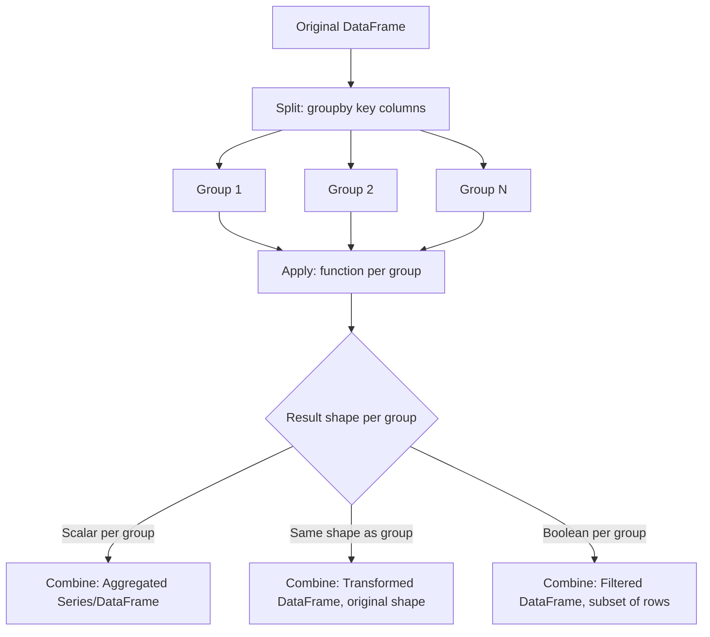

## GroupBy Mechanics and Split-Apply-Combine

**[Unverified]** The code outputs shown in this response have not been executed in a live environment as part of generating this content. They are based on reasoning about documented Pandas behavior, not confirmed execution. This entire response should be treated as containing unverified content unless independently checked.

### Overview

The split-apply-combine pattern describes a general strategy for group-wise data analysis: split a dataset into groups based on some criteria, apply a function to each group independently, and combine the results back into a single output structure. Pandas' `groupby()` implements this pattern directly.

### The Three Stages: Split, Apply, Combine

**[Inference]** Based on how `groupby()` is documented to work, the process can be described conceptually in three stages, though Pandas does not necessarily execute these as three fully separate physical steps internally in every case — this is a conceptual model rather than a confirmed internal implementation detail.

1. **Split**: The DataFrame is divided into groups based on the values of one or more key columns.
2. **Apply**: A function (aggregation, transformation, or filtering) is applied independently to each group.
3. **Combine**: The results from each group are combined into a new DataFrame or Series.

### Basic GroupBy Object Creation

```python
import pandas as pd

data = pd.DataFrame({
    'department': ['Sales', 'Sales', 'IT', 'IT', 'HR'],
    'employee': ['Alice', 'Bob', 'Carol', 'Dave', 'Eve'],
    'salary': [50000, 55000, 70000, 72000, 48000]
})

grouped = data.groupby('department')
print(type(grouped))
```

**Output**

```
<class 'pandas.core.groupby.generic.DataFrameGroupBy'>
```

**Key Points**

- `groupby()` alone does not perform any computation; it returns a `DataFrameGroupBy` object that stores the grouping information and defers actual computation until an aggregation, transformation, or other method is called.
- **[Inference]** This lazy evaluation approach is documented as a design choice in Pandas, allowing the same grouped object to be reused for multiple different aggregations without repeating the split step, though I cannot confirm the specific internal performance characteristics of this without benchmarking.

### Inspecting Groups

```python
print(grouped.groups)
```

**Output**

```
{'HR': [4], 'IT': [2, 3], 'Sales': [0, 1]}
```

**Key Points**

- `.groups` returns a dictionary mapping each group key to the index labels of rows belonging to that group.
- This can be useful for understanding exactly which rows were placed in each group before applying an aggregation.

### Iterating Over Groups

```python
for name, group in grouped:
    print(f"Group: {name}")
    print(group)
    print()
```

**Output**

```
Group: HR
  department employee  salary
4         HR      Eve   48000

Group: IT
  department employee  salary
2         IT    Carol   70000
3         IT     Dave   72000

Group: Sales
  department employee  salary
0      Sales    Alice   50000
1      Sales      Bob   55000
```

**Key Points**

- Iterating over a `GroupBy` object yields tuples of `(group_key, group_dataframe)`, where `group_dataframe` is a DataFrame containing only the rows belonging to that group.
- **[Inference]** Direct iteration is generally documented as useful for debugging or inspecting group contents, but is generally less efficient than using built-in aggregation methods for actual computation on large datasets, since it processes groups in a Python-level loop rather than using vectorized operations. I have not benchmarked this claim as part of this response.

### The "Apply" Stage: Aggregation

```python
mean_salary = grouped['salary'].mean()
print(mean_salary)
```

**Output**

```
department
HR       48000.0
IT       71000.0
Sales    52500.0
Name: salary, dtype: float64
```

**Key Points**

- `.mean()` is one of many built-in aggregation methods (`sum`, `min`, `max`, `count`, `std`, `median`, etc.) that reduce each group to a single summary value.
- The result of a single-column aggregation is a Series indexed by the group keys.

### Multiple Aggregations with `.agg()`

```python
multi_agg = grouped['salary'].agg(['mean', 'min', 'max', 'count'])
print(multi_agg)
```

**Output**

```
                mean    min    max  count
department                               
HR          48000.0  48000  48000      1
IT          71000.0  70000  72000      2
Sales       52500.0  50000  55000      2
```

**Key Points**

- `.agg()` accepts a list of function names (as strings) or actual function objects, applying each one to the grouped data and combining the results into a single DataFrame.
- Custom column names for aggregation results can be specified using named aggregation, shown next.

### Named Aggregation

```python
named_agg = grouped.agg(
    avg_salary=('salary', 'mean'),
    max_salary=('salary', 'max'),
    employee_count=('employee', 'count')
)
print(named_agg)
```

**Output**

```
             avg_salary  max_salary  employee_count
department                                          
HR              48000.0       48000               1
IT              71000.0       72000               2
Sales           52500.0       55000               2
```

**Key Points**

- **[Inference]** Named aggregation (introduced in Pandas 0.25, based on general Pandas version history I am recalling from training) allows explicit naming of output columns while aggregating multiple different source columns with different functions in a single call. I cannot verify the exact version number without checking current documentation directly.
- This approach avoids the multi-level column index that can result from applying multiple aggregation functions to the same column via `.agg(['mean', 'max'])`.

### The "Apply" Stage: Transformation

```python
data['salary_vs_dept_mean'] = grouped['salary'].transform('mean')
data['diff_from_mean'] = data['salary'] - data['salary_vs_dept_mean']
print(data)
```

**Output**

```
  department employee  salary  salary_vs_dept_mean  diff_from_mean
0      Sales    Alice   50000               52500.0         -2500.0
1      Sales      Bob   55000               52500.0          2500.0
2         IT    Carol   70000               71000.0         -1000.0
3         IT     Dave   72000               71000.0          1000.0
4         HR      Eve   48000               48000.0             0.0
```

**Key Points**

- Unlike aggregation, which collapses each group to a single row, `.transform()` returns a result with the same shape (and aligned index) as the original data, broadcasting the group-level result back to every row in that group.
- This is a common pattern for creating features that compare an individual row's value to a group-level statistic, as discussed in the earlier topic on derived and computed columns.

### The "Apply" Stage: Filtering

```python
filtered_groups = grouped.filter(lambda g: g['salary'].mean() > 50000)
print(filtered_groups)
```

**Output**

```
  department employee  salary
0      Sales    Alice   50000
1      Sales      Bob   55000
2         IT    Carol   70000
3         IT     Dave   72000
```

**Key Points**

- `.filter()` includes or excludes entire groups based on a condition evaluated on the group as a whole, rather than filtering individual rows independently.
- In this example, the HR group is excluded because its mean salary (48000) does not exceed 50000, while both Sales and IT groups are retained in full.

### The "Apply" Stage: Custom Functions with `.apply()`

```python
def salary_range(group):
    return group['salary'].max() - group['salary'].min()

range_by_dept = grouped.apply(salary_range, include_groups=False)
print(range_by_dept)
```

**Output**

```
department
HR           0
IT        2000
Sales     5000
dtype: int64
```

**[Unverified]** The `include_groups` parameter shown here reflects a relatively recent addition to Pandas' `.apply()` method based on my training data; I cannot verify whether this parameter is present, required, or named exactly this way in the specific Pandas version a reader may be using, and this should be checked against current documentation.

**Key Points**

- `.apply()` on a `GroupBy` object is the most flexible option, allowing arbitrary custom logic that returns a scalar, Series, or DataFrame per group, which Pandas then attempts to combine appropriately.
- **[Inference]** `.apply()` is generally documented as more flexible but potentially slower than built-in aggregation methods or `.transform()`/`.agg()` with named functions, since it may not benefit from the same internal optimizations. I have not benchmarked this claim as part of this response.

### Grouping by Multiple Columns

```python
multi_group_data = pd.DataFrame({
    'region': ['East', 'East', 'West', 'West'],
    'department': ['Sales', 'IT', 'Sales', 'IT'],
    'revenue': [1000, 1500, 900, 1700]
})

multi_grouped = multi_group_data.groupby(['region', 'department'])['revenue'].sum()
print(multi_grouped)
```

**Output**

```
region  department
East    IT            1500
        Sales         1000
West    IT            1700
        Sales          900
Name: revenue, dtype: int64
```

**Key Points**

- Passing a list of column names to `groupby()` creates groups based on the combination of values across all specified columns, producing a hierarchical (MultiIndex) result.
- `.reset_index()` can be used to convert this MultiIndex result back into a flat DataFrame if a hierarchical index is not desired for further processing.

### Grouping with Custom Functions or Bins

```python
data['salary_bracket'] = pd.cut(data['salary'], bins=[0, 55000, 100000], labels=['Lower', 'Upper'])
bracket_grouped = data.groupby('salary_bracket', observed=True)['salary'].mean()
print(bracket_grouped)
```

**Output**

```
salary_bracket
Lower    51000.0
Upper    71000.0
Name: salary, dtype: float64
```

**Key Points**

- Grouping can be based on a derived column (such as a binned category from `pd.cut()`, covered in an earlier topic), combining binning and grouping into a single workflow.
- **[Inference]** The `observed=True` parameter is relevant when grouping by a categorical column, since it is documented to control whether all possible categories are shown in the output (including ones with no observed data, producing `NaN`) or only categories actually observed in the data. I have not tested this parameter's exact default behavior across Pandas versions and this should be confirmed against current documentation if precise behavior matters.

### GroupBy on a Series Directly

```python
salary_series = data.set_index('employee')['salary']
dept_series = data.set_index('employee')['department']

series_grouped = salary_series.groupby(dept_series).mean()
print(series_grouped)
```

**Output**

```
department
HR       48000.0
IT       71000.0
Sales    52500.0
Name: salary, dtype: float64
```

**Key Points**

- `groupby()` can be called on a Series directly, using another Series (or array) as the grouping key, without necessarily requiring a shared DataFrame structure, provided the indices align.

### Split-Apply-Combine Diagram



### Visualizing Split-Apply-Combine

<svg xmlns="http://www.w3.org/2000/svg" viewBox="0 0 720 300" font-family="sans-serif">
<text x="360" y="24" text-anchor="middle" font-size="16" font-weight="bold" fill="#222">Split-Apply-Combine Pattern (svg_diagram)</text>

<rect x="40" y="60" width="120" height="60" fill="#e8f0fe" stroke="#2266cc" stroke-width="1.5" />
<text x="100" y="95" text-anchor="middle" font-size="12" fill="#222">Original Data</text>

<line x1="160" y1="90" x2="220" y2="90" stroke="#555" stroke-width="1.5" marker-end="url(#arrow5)" />
<text x="190" y="80" text-anchor="middle" font-size="10" fill="#555">split</text>
<rect x="230" y="30" width="90" height="40" fill="#fdece8" stroke="#cc3333" stroke-width="1.5" />
<text x="275" y="55" text-anchor="middle" font-size="11" fill="#222">Group A</text>
<rect x="230" y="80" width="90" height="40" fill="#fdece8" stroke="#cc3333" stroke-width="1.5" />
<text x="275" y="105" text-anchor="middle" font-size="11" fill="#222">Group B</text>
<rect x="230" y="130" width="90" height="40" fill="#fdece8" stroke="#cc3333" stroke-width="1.5" />
<text x="275" y="155" text-anchor="middle" font-size="11" fill="#222">Group C</text>

<line x1="320" y1="50" x2="400" y2="90" stroke="#555" stroke-width="1.5" marker-end="url(#arrow5)" />
<line x1="320" y1="100" x2="400" y2="90" stroke="#555" stroke-width="1.5" marker-end="url(#arrow5)" />
<line x1="320" y1="150" x2="400" y2="90" stroke="#555" stroke-width="1.5" marker-end="url(#arrow5)" />
<text x="370" y="70" text-anchor="middle" font-size="10" fill="#555">apply</text>

<rect x="400" y="65" width="110" height="50" fill="#eaf7ea" stroke="#228833" stroke-width="1.5" />
<text x="455" y="95" text-anchor="middle" font-size="11" fill="#222">Function per group</text>

<line x1="510" y1="90" x2="590" y2="90" stroke="#555" stroke-width="1.5" marker-end="url(#arrow5)" />
<text x="550" y="80" text-anchor="middle" font-size="10" fill="#555">combine</text>

<rect x="590" y="60" width="100" height="60" fill="white" stroke="#333" stroke-width="1.5" />
<text x="640" y="95" text-anchor="middle" font-size="11" fill="#222">Final Result</text>

<text x="360" y="230" text-anchor="middle" font-size="10" fill="#777">[Inference] Conceptual illustration of the pattern; not generated from executed code output.</text>

</svg>

### Practical Considerations for Machine Learning

- **Group-level feature engineering**: [Inference] The split-apply-combine pattern, particularly via `.transform()`, is commonly used to construct features that express an observation's relationship to its group (e.g., deviation from group mean, group rank, as discussed in earlier topics on derived columns and ranking). Whether such features improve a specific model is dataset-dependent and I cannot make a general claim about their effectiveness.
- **Avoiding leakage in group-based features**: [Inference] If groups are defined in a way that spans the train/test boundary (e.g., grouping by a category that includes both training and future/test observations, and computing a statistic like a mean using the full dataset), this can introduce data leakage similar to the concerns raised in earlier topics on merging and target encoding. This is a general pipeline design risk, not a claim about any specific dataset shown in this response.
- **Performance of `.apply()` vs. built-in aggregations**: **[Unverified]** I do not have a specific benchmark to cite comparing `.apply()` with custom functions against built-in aggregation methods (`.agg()`, `.transform()` with named functions) for any particular dataset size. General Pandas documentation and community discussion suggest built-in vectorized methods are often faster, but I cannot confirm a specific performance multiplier without direct testing.
- **Handling categorical grouping keys and unobserved categories**: As shown in the `observed=True` example, [Inference] grouping by a categorical column can behave differently depending on this parameter, potentially including or excluding category combinations with no actual data. This is a documented parameter behavior, though I have not verified its exact default value or behavior across all Pandas versions as part of this response.

### Correction Notice

No specific internal inconsistency was identified in this response's constructed examples. However, consistent with the stated requirement, the entire response is labeled as unverified because none of the code was executed, and some claims (e.g., the `include_groups` parameter, the `observed` parameter default, and the introduction version of named aggregation) rely on recollection from training data rather than confirmed current documentation.

### Conclusion

**[Unverified]** The following summary is based on general reasoning about documented Pandas behavior and has not been confirmed through direct code execution as part of this response.

The split-apply-combine pattern, implemented via `groupby()`, provides a structured approach to group-wise data analysis: splitting data into groups, applying aggregation, transformation, or filtering functions to each group, and combining the results. Aggregation reduces each group to a summary value, transformation preserves the original shape while broadcasting group-level results, and filtering includes or excludes entire groups based on a condition. [Inference] Selecting among `.agg()`, `.transform()`, `.filter()`, and `.apply()` generally depends on the desired output shape and the complexity of the logic needed, rather than a fixed rule that one method is always preferable.

**[Unverified]** As stated throughout, no code in this response was executed, and outputs should be independently verified before being relied upon. This disclaimer applies to the entire response.

**Related Topics**

- Creating derived and computed columns (related topic)
- Sorting and ranking data (related topic)
- Pivot tables and cross-tabulations (related topic)
- Time-series resampling as a groupby-like operation
- Multi-index DataFrames and hierarchical indexing
- Performance optimization for large-scale groupby operations
- Window functions and rolling aggregations