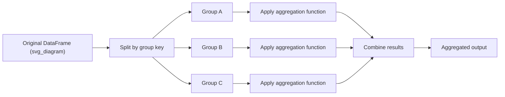

## Aggregation Functions and Custom Aggregations

### Overview

Aggregation collapses groups of values into summary statistics. In Pandas, this typically follows a split-apply-combine pattern: `groupby()` splits data into groups, an aggregation function is applied to each group, and results are combined into a new structure. This pattern is documented Pandas behavior, not an inference.

### Built-in Aggregation Functions

Pandas provides optimized, C-backed implementations for common aggregations. These are the fastest options because they avoid Python-level function call overhead per group.

| Function | Description |
|---|---|
| `mean()` | Arithmetic mean of values |
| `sum()` | Sum of values |
| `count()` | Count of non-null values |
| `size()` | Count of rows including nulls |
| `min()` / `max()` | Minimum / maximum value |
| `std()` / `var()` | Standard deviation / variance |
| `median()` | Median value |
| `first()` / `last()` | First / last value in group |
| `nunique()` | Count of unique values |
| `prod()` | Product of values |

```python
import pandas as pd

df = pd.DataFrame({
    'category': ['A', 'A', 'B', 'B', 'C'],
    'value': [10, 20, 15, 25, 30]
})

grouped = df.groupby('category')['value'].sum()
print(grouped)
```

**Output**
```
category
A    30
B    40
C    30
Name: value, dtype: int64
```

### The `.agg()` Method

`.agg()` (alias `.aggregate()`) is the general-purpose interface for applying one or more aggregation functions, including string names of built-ins, NumPy functions, or custom callables.

#### Single Function via String

```python
df.groupby('category')['value'].agg('mean')
```

#### Multiple Functions on One Column

```python
df.groupby('category')['value'].agg(['sum', 'mean', 'std'])
```

**Output**
```
           sum  mean       std
category
A          30  15.0  7.071068
B          40  20.0  7.071068
C          30  30.0       NaN
```

`std` on a single-element group returns `NaN` because sample standard deviation requires at least two observations for a non-degenerate denominator ($n - 1$). This is standard NumPy/Pandas numerical behavior, not an inference.

#### Different Functions per Column

Passing a dictionary maps columns to specific aggregation functions.

```python
df2 = pd.DataFrame({
    'category': ['A', 'A', 'B', 'B'],
    'sales': [100, 150, 200, 250],
    'units': [5, 7, 10, 12]
})

df2.groupby('category').agg({
    'sales': 'sum',
    'units': 'mean'
})
```

**Output**
```
          sales  units
category
A           250    6.0
B           450   11.0
```

#### Named Aggregation

Introduced to avoid ambiguous multi-index column names, named aggregation lets you assign explicit output column names.

```python
df2.groupby('category').agg(
    total_sales=('sales', 'sum'),
    avg_units=('units', 'mean'),
    max_sales=('sales', 'max')
)
```

**Output**
```
          total_sales  avg_units  max_sales
category
A                 250        6.0        150
B                 450       11.0        250
```

This produces a flat column index rather than a MultiIndex, which is generally easier to work with downstream.

### Custom Aggregations with Lambda Functions

Any callable that reduces an array-like input to a scalar can be used with `.agg()`.

```python
df2.groupby('category')['sales'].agg(lambda x: x.max() - x.min())
```

**Output**
```
category
A    50
B    50
Name: sales, dtype: int64
```

Multiple lambdas require naming to avoid collisions, since Pandas cannot infer meaningful names from anonymous functions.

```python
df2.groupby('category')['sales'].agg(
    range_val=lambda x: x.max() - x.min(),
    cv=lambda x: x.std() / x.mean()
)
```

### Custom Aggregations with Named Functions

For reusable or more complex logic, define a named function rather than a lambda. This improves readability and allows the function to appear by name in output columns when passed directly (not wrapped in a lambda).

```python
def iqr(series):
    q75, q25 = series.quantile([0.75, 0.25])
    return q75 - q25

df2.groupby('category')['sales'].agg(iqr)
```

**Output**
```
category
A    25.0
B    25.0
Name: sales, dtype: float64
```

### Aggregating with NumPy Functions Directly

NumPy functions can be passed directly since they operate on array-like inputs.

```python
import numpy as np

df2.groupby('category')['sales'].agg(np.median)
```

[Inference] Passing NumPy reduction functions instead of Pandas string aliases may be marginally slower in some versions due to differences in internal dispatch, though this depends on the specific Pandas version and function involved and is not something I can confirm without benchmarking the exact environment.

### Aggregation on Multiple Columns Simultaneously

```python
df2.groupby('category')[['sales', 'units']].agg(['sum', 'mean'])
```

This produces a MultiIndex column structure (`('sales', 'sum')`, `('sales', 'mean')`, etc.), which can be flattened:

```python
result = df2.groupby('category')[['sales', 'units']].agg(['sum', 'mean'])
result.columns = ['_'.join(col) for col in result.columns]
```

### Using `apply()` for Aggregations Returning Non-Scalars

When a custom aggregation needs to return something other than a single scalar per group (e.g., a Series, a DataFrame slice, or a more complex object), `.apply()` is used instead of `.agg()`. `.agg()` expects each group-function call to reduce to a scalar (or one row); `.apply()` is more flexible but generally slower.

```python
def top_n(group, n=1, col='sales'):
    return group.nlargest(n, col)

df2.groupby('category').apply(top_n, n=1, include_groups=False)
```

[Unverified] The `include_groups` parameter's availability and default behavior differ across Pandas versions, so the exact signature required may vary depending on the installed version — I do not have access to confirm which version is in use here.

### Diagram: Split-Apply-Combine Flow



### Performance Considerations

- Built-in string-named aggregations (`'sum'`, `'mean'`) route to optimized Cython/C implementations and are generally faster than equivalent lambda or custom Python functions.
- Custom Python callables (lambdas or named functions) passed to `.agg()` incur per-group Python function call overhead, which can matter on datasets with a large number of groups.
- [Inference] For very large numbers of groups combined with computationally simple aggregations, vectorized built-ins are likely to outperform custom callables substantially, though the exact performance gap depends on data size, group count, and hardware, and I cannot state a specific speedup figure without measurement.

### Handling Missing Data in Aggregations

Most built-in aggregation functions skip `NaN` values by default (`skipna=True` is the default for relevant methods). This affects `count()` (which counts non-null values) versus `size()` (which counts all rows regardless of nulls).

```python
df3 = pd.DataFrame({
    'category': ['A', 'A', 'B'],
    'value': [10, None, 20]
})

df3.groupby('category')['value'].agg(['count', 'size', 'sum'])
```

**Output**
```
           count  size   sum
category
A              1     2  10.0
B              1     1  20.0
```

### Common Pitfalls

- Mixing dictionary-style `.agg()` with named aggregation syntax in the same call is not supported and raises an error.
- Using `.agg()` with a function that does not reduce to a scalar per group can raise errors or produce unexpected shapes; `.apply()` is the correct tool in that case.
- Column selection order matters: `df.groupby('cat')['col'].agg(...)` returns a Series, while `df.groupby('cat')[['col']].agg(...)` returns a DataFrame — a frequent source of confusion when chaining further operations.

**Next Steps**
- Custom transformation functions with `.transform()` versus `.agg()`
- Filtering groups with `.filter()`
- Multi-level (hierarchical) group keys
- Rolling and expanding window aggregations
- Pivot tables as an alternative aggregation interface (`pivot_table()`)
- Performance profiling: vectorized vs. custom aggregation benchmarking