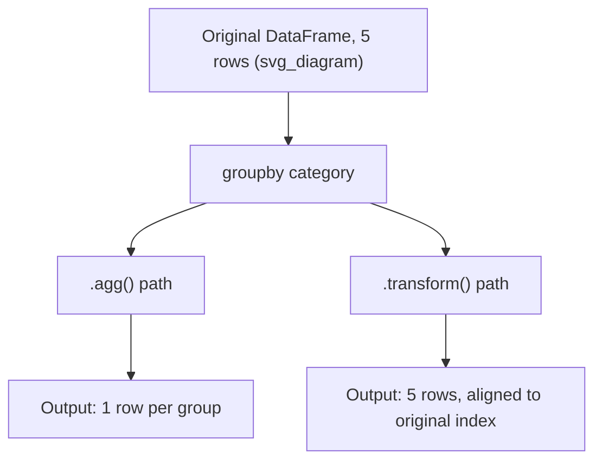

## Transform Operations Within Groups

### Overview

`.transform()` applies a function to each group and returns an output with the **same shape and index** as the original data, unlike `.agg()`, which reduces each group to a single row. This makes `.transform()` suited for operations like group-wise normalization, filling missing values with group statistics, or adding a group-level summary as a new column aligned to every original row.

### Transform vs. Aggregate vs. Apply

| Method | Output shape | Typical use |
|---|---|---|
| `.agg()` | One row per group | Summary statistics |
| `.transform()` | Same shape as input | Broadcast group stats back to rows |
| `.apply()` | Flexible (scalar, Series, or DataFrame) | General-purpose, most flexible, often slowest |

```python
import pandas as pd

df = pd.DataFrame({
    'category': ['A', 'A', 'B', 'B', 'B'],
    'value': [10, 20, 5, 15, 25]
})

df['group_mean'] = df.groupby('category')['value'].transform('mean')
print(df)
```

**Output**
```
  category  value  group_mean
0        A     10        15.0
1        A     20        15.0
2        B      5        15.0
3        B     15        15.0
4        B     25        15.0
```

Each row receives its group's mean, broadcast to match the original index — this is standard, documented Pandas behavior.

### Common Built-in Transforms

```python
df.groupby('category')['value'].transform('sum')
df.groupby('category')['value'].transform('max')
df.groupby('category')['value'].transform('std')
df.groupby('category')['value'].transform('rank')
```

### Group-Wise Normalization (Z-Score)

A frequent use case in ML preprocessing: standardizing values within each group rather than globally.

$$z = \frac{x - \mu_{group}}{\sigma_{group}}$$

```python
def zscore(x):
    return (x - x.mean()) / x.std()

df['value_zscore'] = df.groupby('category')['value'].transform(zscore)
print(df)
```

**Output**
```
  category  value  group_mean  value_zscore
0        A     10        15.0     -0.707107
1        A     20        15.0      0.707107
2        B      5        15.0     -1.000000
3        B     15        15.0      0.000000
4        B     25        15.0      1.000000
```

If a group has only one member, `x.std()` returns `NaN` (sample standard deviation is undefined for $n=1$), which propagates `NaN` into the z-score for that row. This is a mathematical consequence of the ddof=1 default in `.std()`, not something specific to `.transform()`.

### Filling Missing Values with Group Statistics

```python
df2 = pd.DataFrame({
    'category': ['A', 'A', 'B', 'B'],
    'value': [10, None, 20, None]
})

df2['value'] = df2.groupby('category')['value'].transform(lambda x: x.fillna(x.mean()))
print(df2)
```

**Output**
```
  category  value
0        A   10.0
1        A   10.0
2        B   20.0
3        B   20.0
```

If an entire group is composed of `NaN` values, `x.mean()` on that group returns `NaN`, so `fillna` has nothing valid to fill with and the values remain `NaN`. [Inference] Whether this edge case needs additional handling depends on the specific dataset, so I can't say in general whether it will actually occur in a given use case.

### Custom Transform Functions

Any function that returns an array-like of the same length as the input group is valid for `.transform()`.

```python
def cumulative_share(x):
    return x / x.sum()

df.groupby('category')['value'].transform(cumulative_share)
```

**Output**
```
0    0.333333
1    0.666667
2    0.111111
3    0.333333
4    0.555556
Name: value, dtype: float64
```

### Transform with Multiple Columns

`.transform()` can be applied to multiple columns at once when called on a `DataFrameGroupBy` object rather than a single column.

```python
df3 = pd.DataFrame({
    'category': ['A', 'A', 'B', 'B'],
    'x': [1, 2, 3, 4],
    'y': [10, 20, 30, 40]
})

df3[['x_norm', 'y_norm']] = df3.groupby('category')[['x', 'y']].transform(lambda s: s / s.max())
print(df3)
```

**Output**
```
  category  x   y  x_norm  y_norm
0        A  1  10     0.5     0.5
1        A  2  20     1.0     1.0
2        B  3  30     0.75    0.75
3        B  4  40     1.00    1.00
```

### Performance Note

Built-in string-named transforms (`'mean'`, `'sum'`, `'rank'`) are routed to optimized implementations. Custom Python callables passed to `.transform()` incur per-group function call overhead. [Inference] For large numbers of groups, this overhead is likely to be more noticeable than for a small number of groups, though I don't have a way to give a specific performance figure without benchmarking a concrete dataset and environment — this should be treated as a general expectation, not a guaranteed outcome.

### Diagram: Aggregate vs. Transform Shape Difference



### Common Pitfalls

- `.transform()` functions must return output the same length as the input group; returning a scalar that doesn't broadcast correctly, or a mismatched length, raises an error.
- Confusing `.transform()` with `.apply()`: `.apply()` allows arbitrary output shapes but does not guarantee alignment back to the original index in the same way.
- Chained operations inside a transform lambda (like `fillna` after `mean`) depend on correct handling of `NaN` groups, as shown above — this is a data-dependent edge case, not a universal rule.
- Group-wise standardization producing `NaN` for single-member groups is expected mathematical behavior from `ddof=1`, not a bug in the transform mechanism itself.

**Next Steps**
- Filtering groups with `.filter()`
- Multi-level (hierarchical) group keys
- Rolling and expanding window operations combined with groupby
- Pivot tables as an alternative to groupby-based reshaping
- Applying `.transform()` in feature engineering pipelines for ML preprocessing