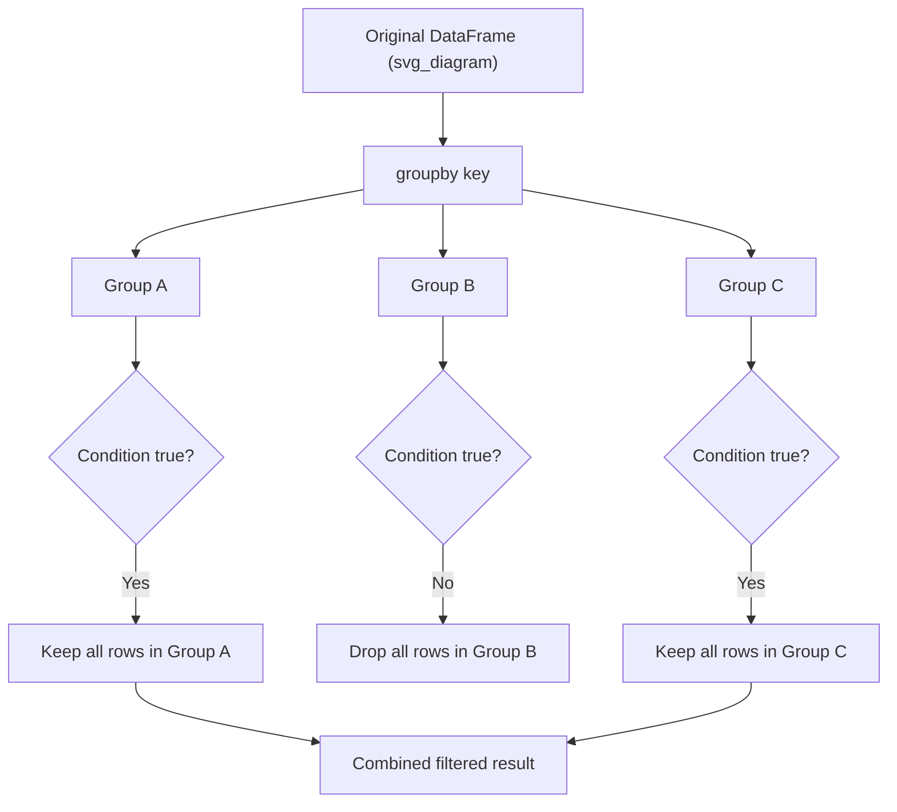

## Filtering Groups Based on Conditions

### Overview

`.filter()` operates on entire groups rather than individual rows. A function is applied to each group, and the function's return value (a single boolean) determines whether **the entire group** is kept or discarded from the result. This differs fundamentally from row-level boolean filtering with `df[condition]`.

### Filter vs. Row-Level Boolean Indexing

| Approach | Granularity | Result |
|---|---|---|
| `df[df['col'] > 5]` | Row-level | Individual rows matching condition |
| `df.groupby('key').filter(func)` | Group-level | Entire groups where `func(group)` is `True` |

```python
import pandas as pd

df = pd.DataFrame({
    'category': ['A', 'A', 'B', 'B', 'C'],
    'value': [10, 20, 5, 8, 100]
})

df.groupby('category').filter(lambda x: x['value'].sum() > 20)
```

**Output**
```
  category  value
0        A     10
1        A     20
4        C    100
```

Group `B` is dropped entirely because its summed value (13) does not exceed 20, even though individual rows within it were never evaluated against the condition directly.

### How `.filter()` Works Internally

The passed function receives each group as a DataFrame (or Series, if called on a single column) and must return a single boolean. Pandas then includes or excludes all rows belonging to that group based on the return value.

```python
def has_enough_rows(group):
    return len(group) >= 2

df.groupby('category').filter(has_enough_rows)
```

**Output**
```
  category  value
0        A     10
1        A     20
2        B      5
3        B      8
```

Category `C` is dropped because it has only one row, failing the `len(group) >= 2` condition.

### Filtering on Aggregate Statistics

Common ML preprocessing use cases include removing groups below a size threshold, or removing groups whose statistics fall outside an acceptable range.

```python
df2 = pd.DataFrame({
    'user_id': [1, 1, 1, 2, 2, 3],
    'purchase': [50, 30, 20, 100, 200, 5]
})

df2.groupby('user_id').filter(lambda x: x['purchase'].mean() > 20)
```

**Output**
```
   user_id  purchase
0        1        50
1        1        30
2        1        20
3        2       100
4        2       200
```

User `3` is excluded because their single purchase (5) does not produce a group mean above 20.

### Filtering with Multiple Conditions

Conditions can be combined within the filter function using standard Python boolean logic.

```python
df2.groupby('user_id').filter(
    lambda x: (x['purchase'].mean() > 20) and (len(x) >= 2)
)
```

**Output**
```
   user_id  purchase
0        1        50
1        1        30
2        1        20
3        2       100
4        2       200
```

### Filtering on a Single Column vs. Whole Group

`.filter()` can be called on a `SeriesGroupBy` object (via column selection before `.groupby()`, or by selecting a column after) to operate over Series groups rather than DataFrame groups.

```python
df2.groupby('user_id')['purchase'].filter(lambda x: x.sum() > 50)
```

**Output**
```
0     50
1     30
2     20
3    100
4    200
Name: purchase, dtype: int64
```

The returned object is a Series aligned to the original index (excluding filtered-out rows), rather than a DataFrame.

### Combining Filter with Subsequent Aggregation

A common pipeline pattern is filtering out small or unreliable groups before computing summary statistics, so that low-sample groups do not distort aggregate results.

```python
filtered = df2.groupby('user_id').filter(lambda x: len(x) >= 2)
result = filtered.groupby('user_id')['purchase'].mean()
print(result)
```

**Output**
```
user_id
1    33.333333
2   150.000000
Name: purchase, dtype: float64
```

### Performance Considerations

`.filter()` evaluates the passed function once per group, which involves per-group Python function call overhead similar to custom `.agg()` or `.transform()` callables. [Inference] For datasets with a very large number of groups, this per-group overhead is likely to accumulate, though the actual impact depends on the number of groups, the complexity of the filter function, and the environment, so I cannot state a specific performance figure without benchmarking a concrete case — this is a reasoned expectation, not a confirmed measurement.

[Unverified] I do not have access to benchmark data comparing `.filter()` against equivalent boolean-mask-based row filtering combined with `.groupby()` on transformed aggregate columns, so I cannot confirm which approach is faster in general; this would depend on data size, group count, and Pandas version.

### Diagram: Filter Decision Flow



### Common Pitfalls

- The filter function must return a single boolean per group; returning a Series or array of booleans (row-level) raises an error, since `.filter()` expects group-level truth values, not row-level ones.
- Confusing `.filter()` with `.transform()` or `.agg()`: `.filter()` neither reshapes nor summarizes data — it only decides inclusion or exclusion of whole groups.
- Groups with `NaN` in the column being evaluated can produce `NaN` results from aggregate functions like `.mean()`, which are falsy-adjacent but not strictly `True`/`False`; explicit handling (e.g., `dropna()` beforehand, or checking `pd.notna()`) may be necessary depending on the desired behavior. [Inference] Whether this matters for a given dataset depends on how much missing data is present and how it should be treated, which I cannot generalize without knowing the specific data.
- Empty result sets are possible if no groups satisfy the filter condition; downstream code should account for this possibility rather than assuming at least one group survives.

**Next Steps**
- Multi-level (hierarchical) group keys and filtering across levels
- Combining `.filter()`, `.transform()`, and `.agg()` in a single preprocessing pipeline
- Rolling and expanding window operations combined with groupby
- Pivot tables as an alternative reshaping approach
- Using filtered groups in train/test split strategies for ML workflows