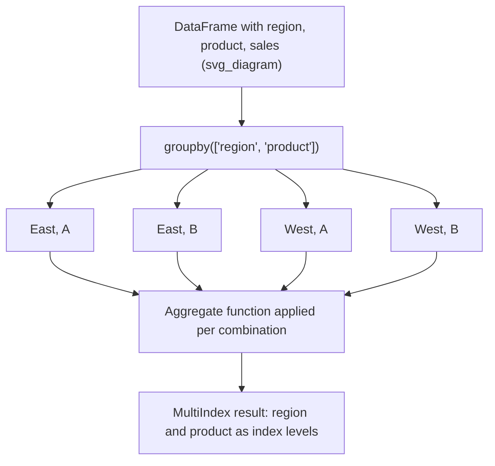

## Multi-Column and Multi-Level Grouping

### Overview

Grouping by more than one column produces a hierarchical (MultiIndex) grouping structure, where each unique combination of values across the specified columns defines a distinct group. This is standard, documented Pandas behavior.

### Basic Multi-Column Grouping

```python
import pandas as pd

df = pd.DataFrame({
    'region': ['East', 'East', 'West', 'West', 'East', 'West'],
    'product': ['A', 'B', 'A', 'B', 'A', 'A'],
    'sales': [100, 150, 200, 250, 120, 220]
})

grouped = df.groupby(['region', 'product'])['sales'].sum()
print(grouped)
```

**Output**
```
region  product
East    A          220
        B          150
West    A          420
        B          250
Name: sales, dtype: int64
```

The result has a MultiIndex composed of `region` and `product`, with one row per unique combination present in the data.

### Accessing MultiIndex Results

```python
grouped.loc['East']
grouped.loc[('East', 'A')]
grouped.loc['East', 'A']
```

**Output**
```
product
A    220
B    150
Name: sales, dtype: int64
```

```python
grouped.loc[('East', 'A')]
```

**Output**
```
220
```

### Resetting the Index for a Flat DataFrame

`reset_index()` converts grouping keys back into regular columns, producing a flat DataFrame rather than a MultiIndex Series.

```python
flat = df.groupby(['region', 'product'])['sales'].sum().reset_index()
print(flat)
```

**Output**
```
  region product  sales
0   East       A    220
1   East       B    150
2   West       A    420
3   West       B    250
```

### Multi-Column Grouping with Multiple Aggregations

```python
df.groupby(['region', 'product']).agg(
    total_sales=('sales', 'sum'),
    avg_sales=('sales', 'mean'),
    count=('sales', 'count')
)
```

**Output**
```
                 total_sales  avg_sales  count
region product
East    A                220      110.0      2
        B                150      150.0      1
West    A                420      210.0      2
        B                250      250.0      1
```

### Grouping by Column Plus Derived Value

Grouping keys are not limited to existing columns; a Series, array, or function result aligned to the DataFrame's index can also serve as a grouping key.

```python
df['sales_tier'] = pd.cut(df['sales'], bins=[0, 150, 300], labels=['low', 'high'])
df.groupby(['region', 'sales_tier'])['sales'].sum()
```

[Inference] The exact bin edges and labeling in a real use case would depend on the actual distribution of the data, so the specific tiers shown here are illustrative rather than a general recommendation for any dataset.

### Selecting Specific Levels for Aggregation

When working with a MultiIndex result, `.groupby(level=...)` allows re-aggregating by one or more index levels without reconstructing the original grouping keys.

```python
multi = df.groupby(['region', 'product'])['sales'].sum()
multi.groupby(level='region').sum()
```

**Output**
```
region
East    370
West    670
Name: sales, dtype: int64
```

### Unstacking MultiIndex Results into Wide Format

`.unstack()` pivots an inner index level into columns, which is often useful for producing a matrix-style summary table.

```python
df.groupby(['region', 'product'])['sales'].sum().unstack()
```

**Output**
```
product   A    B
region
East    220  150
West    420  250
```

`NaN` appears in place of missing combinations if a particular region-product pair does not exist in the source data; `unstack()` does not fabricate values for missing combinations.

### Multi-Column Grouping with `as_index=False`

By default, grouping keys become the index of the result. Setting `as_index=False` keeps them as regular columns instead, which can simplify downstream processing in some pipelines.

```python
df.groupby(['region', 'product'], as_index=False)['sales'].sum()
```

**Output**
```
  region product  sales
0   East       A     220
1   East       B     150
2   West       A     420
3   West       B     250
```

### Sorting Behavior in Multi-Column Grouping

By default, `groupby()` sorts group keys lexicographically. Setting `sort=False` preserves the order in which group keys first appear in the data, which [Inference] may offer a performance benefit on very large datasets when sorted output is not required — though I do not have benchmark data to confirm the magnitude of that benefit, so this should be treated as a reasoned expectation rather than a confirmed measurement.

```python
df.groupby(['region', 'product'], sort=False)['sales'].sum()
```

### Diagram: Multi-Level Grouping Structure



### Common Pitfalls

- Forgetting `reset_index()` before merging or exporting a MultiIndex result can cause unexpected join or serialization behavior in downstream code.
- Accessing a MultiIndex with a single label (e.g., `.loc['East']`) returns a cross-section across the remaining levels, which can be confused with selecting a single row.
- `.unstack()` can introduce `NaN` values for combinations absent from the original data; whether that requires `fillna()` or other handling depends on the specific analysis and is data-dependent, not something I can generalize.
- Mixing `sort=False` grouping with operations that assume sorted output downstream (such as certain plotting or merge operations) can produce results in an order the code does not otherwise account for; behavior in such downstream operations is not something I have unified information about across all Pandas versions and use cases, so I cannot confirm this holds universally — this is flagged as [Unverified].

**Next Steps**
- Combining multi-column groupby with `.filter()` and `.transform()`
- Rolling and expanding window operations on grouped multi-level data
- Pivot tables as an alternative to `groupby().unstack()`
- Cross-tabulation with `pd.crosstab()`
- Hierarchical indexing (MultiIndex) fundamentals independent of groupby