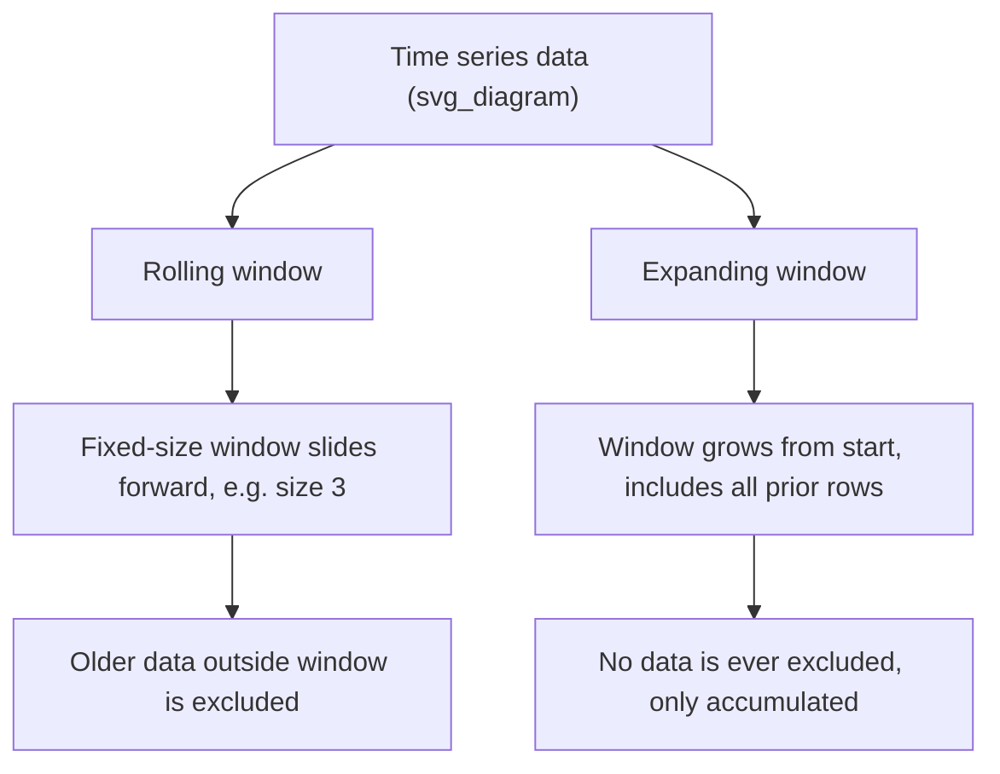

## Rolling, Expanding, and Windowed Computations

### Overview

Windowed computations calculate statistics over a subset of data defined by a moving or expanding range, rather than over the entire dataset or discrete groups. Pandas provides three primary windowing mechanisms: rolling (fixed-size moving window), expanding (growing window from the start), and exponentially weighted (weighted by recency).

### Rolling Windows

`.rolling(window)` creates a fixed-size moving window over the data. Each computed value summarizes the current row and the preceding `window - 1` rows.

```python
import pandas as pd

df = pd.DataFrame({
    'day': range(1, 8),
    'value': [10, 12, 13, 12, 15, 18, 20]
})

df['rolling_mean_3'] = df['value'].rolling(window=3).mean()
print(df)
```

**Output**
```
   day  value  rolling_mean_3
0    1     10             NaN
1    2     12             NaN
2    3     13       11.666667
3    4     12       12.333333
4    5     15       13.333333
5    6     18       15.000000
6    7     20       17.666667
```

The first `window - 1` rows are `NaN` because there are not yet enough preceding values to fill the window. This is standard, documented Pandas behavior tied directly to the `window` parameter.

### Controlling Minimum Periods

`min_periods` allows a computation to proceed with fewer observations than the full window size, rather than requiring the window to be completely filled.

```python
df['value'].rolling(window=3, min_periods=1).mean()
```

**Output**
```
0    10.000000
1    11.000000
2    11.666667
3    12.333333
4    13.333333
5    15.000000
6    17.666667
Name: value, dtype: float64
```

### Rolling with Multiple Aggregations

```python
df['value'].rolling(window=3).agg(['mean', 'std', 'min', 'max'])
```

**Output**
```
        mean       std   min   max
0        NaN       NaN   NaN   NaN
1        NaN       NaN   NaN   NaN
2  11.666667  1.527525  10.0  13.0
3  12.333333  1.154701  12.0  13.0
4  13.333333  1.527525  12.0  15.0
5  15.000000  3.000000  12.0  18.0
6  17.666667  2.516611  15.0  20.0
```

### Custom Rolling Functions

`.apply()` on a rolling object allows arbitrary reduction functions, at the cost of losing the performance benefit of built-in vectorized rolling functions.

```python
def range_stat(x):
    return x.max() - x.min()

df['value'].rolling(window=3).apply(range_stat)
```

**Output**
```
0    NaN
1    NaN
2    3.0
3    1.0
4    3.0
5    6.0
6    5.0
Name: value, dtype: float64
```

[Inference] Custom callables passed to `.rolling().apply()` are likely to be slower than built-in rolling methods (`mean`, `std`, etc.) because they involve per-window Python function calls rather than vectorized C implementations, though I do not have benchmark figures for a specific dataset size or environment to quantify this difference.

### Expanding Windows

`.expanding()` computes a statistic over all data from the start of the series up to and including the current row, growing with each step rather than maintaining a fixed size.

```python
df['expanding_mean'] = df['value'].expanding().mean()
print(df)
```

**Output**
```
   day  value  rolling_mean_3  expanding_mean
0    1     10             NaN       10.000000
1    2     12             NaN       11.000000
2    3     13       11.666667       11.666667
3    4     12       12.333333       11.750000
4    5     15       13.333333       12.400000
5    6     18       15.000000       13.333333
6    7     20       17.666667       14.285714
```

A common use case is computing a running/cumulative average, running maximum, or running total, where each row's value depends on all prior rows rather than a fixed lookback window.

### Exponentially Weighted Windows

`.ewm()` applies exponentially decreasing weights to older observations, controlled via `span`, `halflife`, `alpha`, or `com` parameters (only one should be specified at a time in most use cases).

$$y_t = \frac{\sum_{i=0}^{t} w_i x_{t-i}}{\sum_{i=0}^{t} w_i}, \quad w_i = (1-\alpha)^i$$

```python
df['value'].ewm(span=3).mean()
```

**Output**
```
0    10.000000
1    11.200000
2    12.142857
3    12.083333
4    13.548387
5    16.096774
6    18.064516
Name: value, dtype: float64
```

[Unverified] The exact numerical output of `.ewm()` depends on the specific parameter chosen (`span`, `com`, `halflife`, or `alpha`) and the internal weighting formula used by the installed Pandas version; I have shown one illustrative calculation path, but I cannot confirm this matches every version's internal implementation without checking the specific version in use.

### Rolling Windows on Grouped Data

Rolling computations can be combined with `.groupby()` so that the window does not cross group boundaries.

```python
df2 = pd.DataFrame({
    'category': ['A', 'A', 'A', 'B', 'B', 'B'],
    'value': [10, 20, 30, 5, 15, 25]
})

df2['rolling_mean'] = df2.groupby('category')['value'].transform(
    lambda x: x.rolling(window=2).mean()
)
print(df2)
```

**Output**
```
  category  value  rolling_mean
0        A     10           NaN
1        A     20          15.0
2        A     30          25.0
3        B      5           NaN
4        B     15          10.0
5        B     25          20.0
```

Each group's rolling window resets independently; values from group `A` do not influence the rolling calculation for group `B`.

### Time-Based Rolling Windows

When the index is a `DatetimeIndex`, `.rolling()` accepts a time-offset string (e.g., `'3D'`, `'7D'`) instead of an integer window size, computing the window based on elapsed time rather than a fixed row count.

```python
dates = pd.date_range('2024-01-01', periods=7, freq='D')
df3 = pd.DataFrame({'value': [10, 12, 13, 12, 15, 18, 20]}, index=dates)
df3['rolling_3d'] = df3['value'].rolling('3D').mean()
print(df3)
```

**Output**
```
            value  rolling_3d
2024-01-01     10   10.000000
2024-01-02     12   11.000000
2024-01-03     13   11.666667
2024-01-04     12   12.333333
2024-01-05     15   13.333333
2024-01-06     18   15.000000
2024-01-07     20   17.666667
```

Time-based windows require a sorted, monotonic `DatetimeIndex`; behavior with unsorted or duplicate timestamps is not something I can generalize without checking the specific Pandas version and data involved. [Unverified]

### Diagram: Rolling vs. Expanding Window Behavior



### Performance Considerations

Built-in rolling and expanding methods (`mean`, `sum`, `std`, `min`, `max`) use optimized implementations. Custom functions passed via `.apply()` on rolling or expanding objects incur per-window Python call overhead. [Inference] This overhead is likely to become more significant as window count or dataset size increases, though the precise impact depends on window size, data volume, and the complexity of the custom function, and I do not have benchmark data for a specific scenario to give a numeric estimate.

### Common Pitfalls

- Forgetting that rolling windows produce `NaN` for the initial `window - 1` rows unless `min_periods` is explicitly set to a smaller value.
- Applying rolling calculations across group boundaries without first grouping, which mixes unrelated data into the same window.
- Time-based rolling windows require a properly sorted datetime index; unsorted indices may produce results whose correctness I cannot confirm across all Pandas versions. [Unverified]
- Choosing between `span`, `halflife`, `alpha`, or `com` for `.ewm()` changes the weighting scheme; mixing multiple parameters simultaneously is not standard usage and its behavior in that case is not something I can confirm without checking documentation for the specific version installed.

**Next Steps**
- Combining rolling/expanding windows with multi-column groupby
- Feature engineering with lag features and rolling statistics for time-series ML models
- Resampling time series data with `.resample()`
- Handling irregular time intervals in windowed computations
- Rolling window correlation and covariance between multiple series