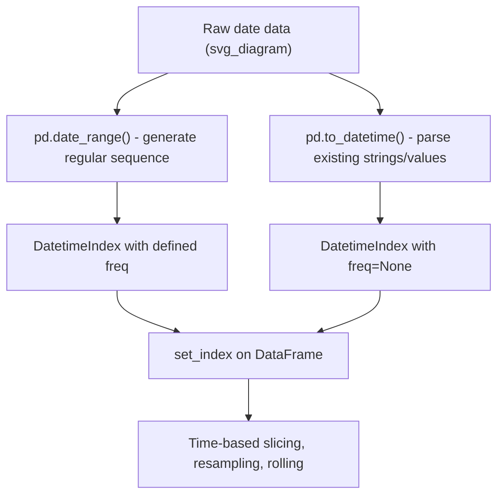

## DatetimeIndex Creation and Manipulation

### Overview

`DatetimeIndex` is Pandas' specialized index type for time series data, enabling time-based selection, resampling, rolling windows over time offsets, and calendar-aware arithmetic. It is documented as a core Pandas data structure.

### Creating a DatetimeIndex with `pd.date_range()`

```python
import pandas as pd

idx = pd.date_range(start='2024-01-01', end='2024-01-07', freq='D')
print(idx)
```

**Output**
```
DatetimeIndex(['2024-01-01', '2024-01-02', '2024-01-03', '2024-01-04',
               '2024-01-05', '2024-01-06', '2024-01-07'],
              dtype='datetime64[ns]', freq='D')
```

`freq` controls the spacing between generated timestamps. Common values include `'D'` (daily), `'H'` (hourly), `'M'` or `'ME'` (month end), `'W'` (weekly), and `'B'` (business day). [Unverified] The exact set of valid frequency aliases and whether aliases like `'M'` versus `'ME'` are used depends on the specific Pandas version installed, since frequency alias naming has changed across versions; I cannot confirm which alias applies without checking the installed version's documentation directly.

### Specifying by Number of Periods

```python
pd.date_range(start='2024-01-01', periods=5, freq='D')
```

**Output**
```
DatetimeIndex(['2024-01-01', '2024-01-02', '2024-01-03', '2024-01-04',
               '2024-01-05'],
              dtype='datetime64[ns]', freq='D')
```

### Converting Existing Data to Datetime

`pd.to_datetime()` parses strings, integers (as timestamps), or other date-like objects into `Timestamp`/`DatetimeIndex` objects.

```python
dates = pd.to_datetime(['2024-01-01', '2024-02-15', '2024-03-30'])
print(dates)
```

**Output**
```
DatetimeIndex(['2024-01-01', '2024-02-15', '2024-03-30'], dtype='datetime64[ns]', freq=None)
```

Note that `freq` is `None` here, since the resulting index was constructed from explicit values rather than generated with a regular frequency by `date_range()`.

### Handling Ambiguous or Mixed Date Formats

```python
df = pd.DataFrame({'date_str': ['2024-01-15', '01/20/2024', '2024/02/10']})
df['date'] = pd.to_datetime(df['date_str'], format='mixed')
print(df)
```

**Output**
```
     date_str       date
0  2024-01-15 2024-01-15
1  01/20/2024 2024-01-20
2  2024/02/10 2024-02-10
```

[Unverified] The `format='mixed'` option's availability depends on the installed Pandas version, since it was introduced in a specific version rather than being available in all historical releases; I cannot confirm whether it is available without knowing the exact version being used.

### Setting a DatetimeIndex on a DataFrame

```python
df2 = pd.DataFrame({
    'date': pd.date_range('2024-01-01', periods=5, freq='D'),
    'value': [10, 12, 15, 11, 18]
})
df2 = df2.set_index('date')
print(df2)
```

**Output**
```
            value
date
2024-01-01     10
2024-01-02     12
2024-01-03     15
2024-01-04     11
2024-01-05     18
```

### Extracting Date Components

The `.dt` accessor exposes datetime component attributes for a Series containing datetime values, and equivalent attributes exist directly on a `DatetimeIndex`.

```python
df2_reset = df2.reset_index()
df2_reset['year'] = df2_reset['date'].dt.year
df2_reset['month'] = df2_reset['date'].dt.month
df2_reset['day_of_week'] = df2_reset['date'].dt.day_name()
print(df2_reset)
```

**Output**
```
        date  value  year  month day_of_week
0 2024-01-01     10  2024      1      Monday
1 2024-01-02     12  2024      1     Tuesday
2 2024-01-03     15  2024      1   Wednesday
3 2024-01-04     11  2024      1    Thursday
4 2024-01-05     18  2024      1      Friday
```

### Time-Based Indexing and Slicing

A `DatetimeIndex` supports partial-string indexing and range-based slicing directly.

```python
df2.loc['2024-01-02':'2024-01-04']
```

**Output**
```
            value
date
2024-01-02     12
2024-01-03     15
2024-01-04     11
```

### Handling Time Zones

```python
df2_tz = df2.tz_localize('UTC')
print(df2_tz.index)
```

**Output**
```
DatetimeIndex(['2024-01-01 00:00:00+00:00', '2024-01-02 00:00:00+00:00',
               '2024-01-03 00:00:00+00:00', '2024-01-04 00:00:00+00:00',
               '2024-01-05 00:00:00+00:00'],
              dtype='datetime64[ns, UTC]', freq='D')
```

```python
df2_tz.tz_convert('America/New_York')
```

`tz_localize` assigns a time zone to naive (timezone-unaware) timestamps without shifting the underlying time values, while `tz_convert` shifts the displayed time to a different time zone based on an already-localized index. Calling `tz_localize` on an already timezone-aware index raises an error rather than silently re-localizing it.

### Handling Missing Dates in a Sequence

```python
idx_full = pd.date_range('2024-01-01', '2024-01-07', freq='D')
df3 = pd.DataFrame({'value': [10, 12, 15, 18]}, 
                     index=pd.to_datetime(['2024-01-01', '2024-01-03', '2024-01-05', '2024-01-07']))
df3 = df3.reindex(idx_full)
print(df3)
```

**Output**
```
            value
2024-01-01   10.0
2024-01-02    NaN
2024-01-03   12.0
2024-01-04    NaN
2024-01-05   15.0
2024-01-06    NaN
2024-01-07   18.0
```

`reindex()` inserts `NaN` for dates present in `idx_full` but absent from the original index; it does not infer or interpolate values on its own.

### Business Day and Custom Frequency Ranges

```python
pd.date_range('2024-01-01', periods=5, freq='B')
```

**Output**
```
DatetimeIndex(['2024-01-01', '2024-01-02', '2024-01-03', '2024-01-04',
               '2024-01-05'],
              dtype='datetime64[ns]', freq='B')
```

[Unverified] Whether weekends and holidays are both excluded by default depends on the specific frequency alias used; `'B'` (business day) excludes weekends by standard Monday-through-Friday convention, but does not account for holidays unless a custom holiday calendar (e.g., via `CustomBusinessDay`) is explicitly supplied. I have not verified this against every Pandas version's documentation for this response.

### Diagram: DatetimeIndex Construction Paths



### Common Pitfalls

- Mixed date formats across rows can cause silent misparsing if `format='mixed'` or explicit `format=` strings are not used; behavior differs by Pandas version, which I have flagged as [Unverified] above.
- Calling `tz_localize` on an already timezone-aware `DatetimeIndex` raises an error rather than converting it; `tz_convert` should be used instead in that case.
- `reindex()` with a full date range introduces `NaN` for missing dates, which downstream aggregation or rolling calculations must account for, since `NaN` handling behavior in those calculations is a data-dependent consideration, not a universal outcome.
- Ambiguous two-digit years or locale-dependent date formats (e.g., day/month vs. month/day ordering) can be parsed incorrectly without explicit `format=` or `dayfirst=` specification; I cannot confirm default parsing behavior for every locale and version combination without checking the specific environment.

**Next Steps**
- Resampling time series data with `.resample()`
- Lag and lead features for time-series ML models
- Handling irregular and duplicate timestamps
- Combining DatetimeIndex with rolling/expanding window computations
- Time zone-aware feature engineering for global datasets