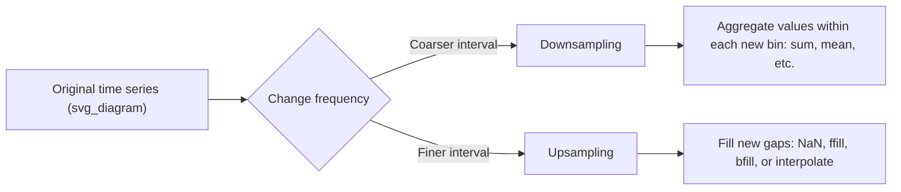

## Resampling and Frequency Conversion

### Overview

Resampling changes the frequency of time series data — either aggregating from a finer frequency to a coarser one (downsampling, e.g., daily to monthly) or converting from a coarser frequency to a finer one (upsampling, e.g., monthly to daily). This requires a `DatetimeIndex` and is a core, documented Pandas time series feature.

### Downsampling with `.resample()`

```python
import pandas as pd

dates = pd.date_range('2024-01-01', periods=10, freq='D')
df = pd.DataFrame({'value': [10, 12, 15, 11, 18, 20, 22, 19, 25, 30]}, index=dates)

weekly = df.resample('W').sum()
print(weekly)
```

**Output**
```
            value
2024-01-07     98
2024-01-14   116
```

`resample('W')` groups rows into weekly bins (week ending on Sunday by default) and `.sum()` aggregates the `value` column within each bin. This binning-then-aggregating structure is conceptually similar to `.groupby()`, but bins are defined by time intervals rather than discrete category labels.

### Common Resampling Frequencies

| Alias | Meaning |
|---|---|
| `'D'` | Calendar day |
| `'W'` | Weekly (week-ending Sunday by default) |
| `'M'` / `'ME'` | Month end |
| `'MS'` | Month start |
| `'Q'` / `'QE'` | Quarter end |
| `'A'` / `'Y'` | Year end |
| `'H'` | Hourly |
| `'B'` | Business day |

[Unverified] The exact set of valid aliases, and whether older forms like `'M'` versus newer forms like `'ME'` are used, depends on the specific Pandas version installed, since frequency alias naming has changed across releases; I cannot confirm which alias set applies without checking the installed version directly.

### Multiple Aggregations on Resampled Data

```python
df.resample('W').agg(['sum', 'mean', 'min', 'max'])
```

**Output**
```
           value
             sum  mean min max
2024-01-07    98  14.0  10  22
2024-01-14   116  23.2  19  30
```

### Different Aggregations per Column

```python
df2 = pd.DataFrame({
    'sales': [100, 150, 200, 120, 180, 220, 90, 130, 175, 210],
    'units': [5, 7, 10, 6, 9, 11, 4, 6, 8, 10]
}, index=dates)

df2.resample('W').agg({'sales': 'sum', 'units': 'mean'})
```

**Output**
```
            sales     units
2024-01-07    750  7.400000
2024-01-14    825  7.800000
```

### Upsampling and Filling Strategies

Upsampling increases frequency (e.g., daily to hourly), which introduces gaps that must be filled with an explicit strategy since Pandas does not fabricate values on its own.

```python
sparse_dates = pd.date_range('2024-01-01', periods=3, freq='D')
df3 = pd.DataFrame({'value': [10, 20, 30]}, index=sparse_dates)

hourly = df3.resample('6H').asfreq()
print(hourly)
```

**Output**
```
                     value
2024-01-01 00:00:00   10.0
2024-01-01 06:00:00    NaN
2024-01-01 12:00:00    NaN
2024-01-01 18:00:00    NaN
2024-01-02 00:00:00   20.0
2024-01-02 06:00:00    NaN
2024-01-02 12:00:00    NaN
2024-01-02 18:00:00    NaN
2024-01-03 00:00:00   30.0
```

`.asfreq()` reindexes to the new frequency and inserts `NaN` where no original observation exists, without applying any fill logic.

### Forward-Fill and Interpolation After Upsampling

```python
hourly_ffill = df3.resample('6H').ffill()
print(hourly_ffill)
```

**Output**
```
                     value
2024-01-01 00:00:00     10
2024-01-01 06:00:00     10
2024-01-01 12:00:00     10
2024-01-01 18:00:00     10
2024-01-02 00:00:00     20
2024-01-02 06:00:00     20
2024-01-02 12:00:00     20
2024-01-02 18:00:00     20
2024-01-03 00:00:00     30
```

```python
hourly_interp = df3.resample('6H').asfreq().interpolate(method='linear')
```

Linear interpolation computes intermediate values proportionally between known points, rather than repeating the last known value as `.ffill()` does. Choosing between forward-fill, backward-fill, and interpolation depends on the semantics of the underlying data (e.g., whether a value genuinely persists between observations, versus whether it changes gradually) — this is a domain-specific modeling decision, not something with a single universally correct answer.

### Resampling with Custom Origin

```python
df.resample('D', origin='start').sum()
```

The `origin` parameter controls the reference point used to determine bin edges. [Inference] Changing `origin` is most relevant when bin alignment matters for a specific downstream comparison (e.g., aligning multiple series to the same start point), though whether this is necessary depends entirely on the specific analysis and I cannot generalize a single correct setting.

### Resampling with OHLC Aggregation

A common pattern in financial time series is computing open/high/low/close values per bin.

```python
df.resample('W')['value'].ohlc()
```

**Output**
```
              open  high  low  close
2024-01-07      10    22   10     22
2024-01-14      19    30   19     30
```

### Combining Resample with Groupby

```python
df4 = pd.DataFrame({
    'category': ['A', 'A', 'B', 'B', 'A', 'B'],
    'value': [10, 20, 15, 25, 30, 35]
}, index=pd.date_range('2024-01-01', periods=6, freq='D'))

df4.groupby('category').resample('3D').sum()
```

[Unverified] The exact output structure and whether `resample()` chained after `groupby()` on a non-time column requires the DataFrame to already have a `DatetimeIndex` (as opposed to a datetime column) can differ depending on the Pandas version; some versions require using `pd.Grouper` instead of chaining directly. I have not confirmed this specific chained syntax against a specific installed version.

### Using `pd.Grouper` for Combined Time and Category Grouping

```python
df4.groupby(['category', pd.Grouper(freq='3D')])['value'].sum()
```

`pd.Grouper` provides an explicit, version-stable way to combine a time-based frequency grouping with a categorical grouping key in a single `.groupby()` call.

### Diagram: Resampling Direction



### Performance Considerations

[Inference] Resampling large time series with many bins and custom aggregation functions is likely to be slower than using built-in aggregation strings, similar to the general pattern seen with `.groupby().agg()`, though I do not have benchmark figures for resampling specifically and cannot quantify the difference without testing a concrete dataset and environment.

### Common Pitfalls

- Resampling requires a `DatetimeIndex` (or an explicit `on=` column argument pointing to a datetime column); attempting to resample without one raises an error.
- Choosing an inappropriate fill strategy (`ffill` vs. interpolation vs. leaving `NaN`) after upsampling can introduce misleading patterns into downstream analysis if the choice does not match the true behavior of the underlying process — this is a domain judgment, not a technical default that fits every dataset.
- Week-based resampling (`'W'`) defaults to weeks ending on Sunday unless a different anchor (e.g., `'W-MON'`) is specified, which can silently shift bin boundaries if not accounted for.
- Chaining `.groupby().resample()` may behave differently across Pandas versions, as noted above; `pd.Grouper` is generally the more version-stable approach for combined time and category grouping, though I have not exhaustively confirmed this across every version.

**Next Steps**
- Lag and lead feature engineering for time-series ML models
- Rolling and expanding windows combined with resampled data
- Handling irregular and duplicate timestamps before resampling
- Time zone-aware resampling across daylight saving boundaries
- Feature engineering pipelines for time-series forecasting models