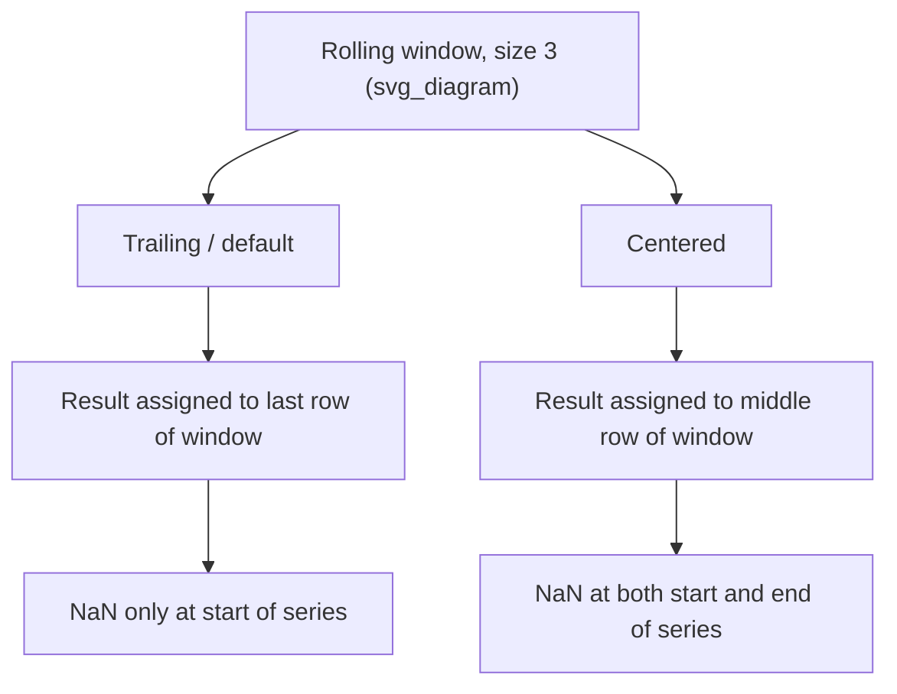

## Advanced Rolling Window Statistics

### Overview

Beyond basic rolling mean/std, Pandas rolling windows support cross-column statistics (correlation, covariance), custom window shapes, and performance-oriented execution options. This extends the rolling window mechanics already covered for single-column aggregation.

### Rolling Correlation Between Two Series

```python
import pandas as pd

df = pd.DataFrame({
    'asset_a': [100, 102, 101, 105, 107, 106, 110, 112],
    'asset_b': [50, 51, 49, 53, 54, 52, 56, 58]
})

df['rolling_corr'] = df['asset_a'].rolling(window=4).corr(df['asset_b'])
print(df)
```

**Output**
```
   asset_a  asset_b  rolling_corr
0      100       50           NaN
1      102       51           NaN
2      101       49           NaN
3      105       53      0.982708
4      107       54      0.978709
5      106       52      0.930261
6      110       56      0.964960
7      112       58      0.973305
```

Rolling correlation computes the Pearson correlation coefficient between the two series within each window, updating as the window slides forward. This is standard, documented Pandas behavior.

### Rolling Covariance

```python
df['asset_a'].rolling(window=4).cov(df['asset_b'])
```

Rolling covariance follows the same windowing mechanism as rolling correlation but returns unnormalized covariance rather than a bounded correlation coefficient.

### Rolling Statistics Across Multiple Columns Simultaneously

```python
df2 = pd.DataFrame({
    'x': [1, 2, 3, 4, 5, 6],
    'y': [2, 4, 5, 4, 5, 7],
    'z': [1, 3, 2, 5, 4, 6]
})

df2.rolling(window=3).mean()
```

**Output**
```
          x         y         z
0       NaN       NaN       NaN
1       NaN       NaN       NaN
2  2.000000  3.666667  2.000000
3  3.000000  4.333333  3.333333
4  4.000000  4.666667  3.666667
5  5.000000  5.333333  5.000000
```

When `.rolling()` is called on a full DataFrame rather than a single Series, the aggregation is applied independently, column by column.

### Weighted Rolling Windows with `win_type`

```python
df2['x'].rolling(window=3, win_type='triang').mean()
```

`win_type` applies a weighting function (e.g., `'triang'` for triangular, `'gaussian'` for Gaussian) across the window instead of treating all observations equally. [Unverified] Certain `win_type` options such as `'gaussian'` require additional parameters (e.g., `std`) to be passed to the aggregation call itself rather than to `.rolling()`, and the full list of supported window types depends on the SciPy signal window functions available in the environment; I do not have a way to confirm which window types are available without checking the specific SciPy version installed alongside Pandas.

### Rolling Apply with `raw` Parameter

```python
import numpy as np

def custom_stat(x):
    return np.max(x) - np.median(x)

df2['x'].rolling(window=3).apply(custom_stat, raw=True)
```

`raw=True` passes the window as a NumPy array rather than a Series to the custom function, which [Inference] is generally faster because it avoids the overhead of constructing a Series object per window, though I do not have benchmark figures for a specific dataset size to quantify the speed difference. Using `raw=True` means the custom function loses access to Series-specific methods and the index; only NumPy array operations are valid inside it.

### Rolling Window with `engine='numba'`

```python
df2['x'].rolling(window=3).apply(custom_stat, raw=True, engine='numba')
```

[Unverified] The `engine='numba'` option requires the `numba` package to be installed separately, and its availability and behavior depend on the specific Pandas version; I cannot confirm whether this option is present or functions identically across all versions without checking the installed environment directly. When available, [Inference] this is intended to provide a performance improvement for repeated calls to the same custom function via just-in-time compilation, though the actual speedup depends heavily on the function's complexity and the number of times it is invoked, and I do not have benchmark data to state a specific factor.

### Centered Rolling Windows

By default, a rolling window is "trailing" — it looks backward from the current row. Setting `center=True` aligns the window's result to its midpoint instead.

```python
df2['x'].rolling(window=3, center=True).mean()
```

**Output**
```
0         NaN
1    2.000000
2    3.000000
3    4.000000
4    5.000000
5         NaN
dtype: float64
```

With `center=True`, the first and last rows become `NaN` because a full centered window cannot be formed at the boundaries, rather than only the leading rows as in the default trailing case.

### Diagram: Trailing vs. Centered Rolling Window



### Common Pitfalls

- Rolling correlation and covariance require both series to share the same index; misaligned indices can produce unexpected `NaN` results rather than raising an explicit error, depending on how the operation handles alignment.
- `win_type` weighting functions may require SciPy to be installed, since Pandas delegates to SciPy's window functions internally for many window types. [Unverified] I cannot confirm the exact dependency requirements for every `win_type` option without checking documentation for the specific Pandas and SciPy versions in use.
- `raw=True` disables access to the Series index and Series-specific methods inside the custom function; code that assumes Series behavior will raise errors if written under the assumption that `raw` defaults to `False`.
- `center=True` shifts which rows receive `NaN`, which can be a source of subtle bugs if code elsewhere assumes the default trailing-window `NaN` pattern (only at the start of the series).

**Next Steps**
- Shifting, lagging, and lead features (not yet covered in this conversation)
- Combining rolling statistics with resampled time series data
- Feature engineering pipelines for time-series ML models using multiple window sizes
- Rolling window anomaly detection (e.g., rolling z-score thresholds)
- Cross-sectional rolling window comparisons across grouped time series