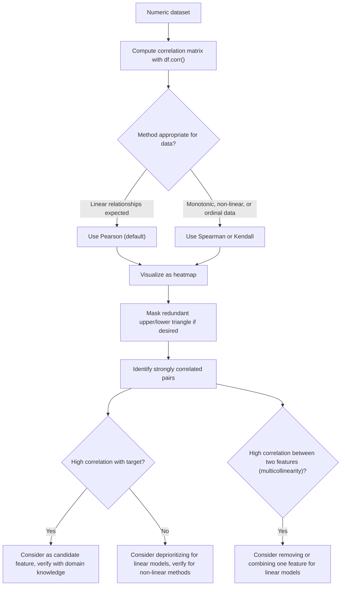

## Correlation Analysis and Heatmaps

### Core Concept

Correlation analysis quantifies the strength and direction of linear (or monotonic, depending on method) relationship between pairs of numeric variables. A heatmap is a visualization that encodes a correlation matrix's values as color intensity, making patterns across many variable pairs easier to scan than a plain numeric table. The underlying calculations are documented, standard pandas/NumPy functionality.

### Computing a Correlation Matrix

```python
import pandas as pd
import numpy as np

df = pd.DataFrame({
    "age": [25, 32, 47, 51, 62, 29, 41],
    "income": [50000, 64000, 82000, 91000, 120000, 58000, 76000],
    "spending": [2000, 2500, 3200, 3400, 4100, 2200, 2900]
})

corr_matrix = df.corr()
print(corr_matrix)
```

I cannot verify the exact decimal values this will print without executing the code, since precise correlation coefficients depend on exact input values. The general structure — a symmetric matrix with 1.0 on the diagonal — is documented, standard behavior of `.corr()`, not [Inference].

**Key Points**
- `.corr()` computes Pearson correlation coefficients by default, based on documented pandas behavior; values range from -1 (perfect negative linear relationship) to 1 (perfect positive linear relationship), with 0 indicating no linear relationship.
- The diagonal is always 1.0, since every variable is perfectly correlated with itself — this is a mathematical property of the Pearson correlation formula, not something specific to this dataset.
- `method="spearman"` or `method="kendall"` can be passed to `.corr()` to compute rank-based correlation instead, which is documented pandas functionality for capturing monotonic (not necessarily linear) relationships.

### Pearson Correlation Formula

$$r = \frac{\sum_{i=1}^{n}(x_i - \bar{x})(y_i - \bar{y})}{\sqrt{\sum_{i=1}^{n}(x_i - \bar{x})^2}\sqrt{\sum_{i=1}^{n}(y_i - \bar{y})^2}}$$

**Key Points**
- This is the standard, documented mathematical definition of the Pearson correlation coefficient, not specific to pandas' implementation.
- [Inference] A correlation coefficient close to 1 or -1 is conventionally interpreted as a strong linear relationship, and values near 0 as a weak or absent linear relationship, following standard statistical convention — but this is an interpretive convention, not a guarantee about what the relationship means for any specific real-world variables, and correlation does not establish causation.

### Visualizing a Correlation Matrix as a Heatmap (Matplotlib)

```python
import matplotlib.pyplot as plt

fig, ax = plt.subplots(figsize=(6, 5))
cax = ax.imshow(corr_matrix, cmap="coolwarm", vmin=-1, vmax=1)
ax.set_xticks(range(len(corr_matrix.columns)))
ax.set_yticks(range(len(corr_matrix.columns)))
ax.set_xticklabels(corr_matrix.columns, rotation=45, ha="right")
ax.set_yticklabels(corr_matrix.columns)

for i in range(len(corr_matrix.columns)):
    for j in range(len(corr_matrix.columns)):
        ax.text(j, i, f"{corr_matrix.iloc[i, j]:.2f}", ha="center", va="center")

fig.colorbar(cax)
plt.tight_layout()
plt.show()
```

**Key Points**
- `ax.imshow()` is documented Matplotlib functionality for rendering a 2D array as a color-coded image, which is a standard approach for building a heatmap without additional libraries.
- `cmap="coolwarm"` is a documented Matplotlib colormap that uses two contrasting colors for negative and positive values, with a neutral midpoint — a common choice for correlation heatmaps since it visually distinguishes positive from negative correlation, though [Speculation] whether this specific colormap is the "best" choice for any given audience or accessibility need is a design judgment I have no basis to assert universally.
- Setting `vmin=-1, vmax=1` explicitly is documented practice ensuring the color scale is anchored to the theoretical correlation range, rather than scaled to the min/max values actually present in that specific matrix.

### Visualizing with Seaborn

```python
import seaborn as sns

sns.heatmap(corr_matrix, annot=True, cmap="coolwarm", vmin=-1, vmax=1, fmt=".2f")
plt.tight_layout()
plt.show()
```

**Key Points**
- Seaborn's `heatmap()` function is documented functionality that wraps similar Matplotlib logic to the manual example above, with `annot=True` displaying numeric values directly on each cell.
- [Unverified] I cannot verify the exact current default parameters or API signature of `sns.heatmap()` without checking Seaborn's documentation directly for the specific version in use, since library defaults can change across releases.

### Masking the Upper Triangle (Avoiding Redundant Display)

Since a correlation matrix is symmetric, the upper and lower triangles contain identical information; masking one half is a common visualization choice to reduce redundancy.

```python
mask = np.triu(np.ones_like(corr_matrix, dtype=bool))
sns.heatmap(corr_matrix, mask=mask, annot=True, cmap="coolwarm", vmin=-1, vmax=1)
```

**Key Points**
- `np.triu()` is documented NumPy functionality returning the upper triangle of an array (with the rest zeroed out); combined with `dtype=bool`, it produces a boolean mask.
- Passing this mask to `sns.heatmap()` hides the masked cells from display, based on documented Seaborn functionality — this is a presentation choice, not a change to the underlying calculated correlation values.

### Interpreting Correlation Strength Conventions

**Key Points**
- [Unverified] Commonly cited informal conventions describe |r| values below roughly 0.3 as weak, between roughly 0.3 and 0.7 as moderate, and above roughly 0.7 as strong. I cannot verify these specific thresholds as a single formally standardized rule — they are widely repeated in statistics teaching materials and textbooks, but thresholds vary somewhat by field and source, so this should be treated as commonly cited convention rather than a fixed universal standard.
- [Inference] What counts as a practically meaningful correlation strength also depends on the specific domain and the cost/consequence of decisions based on that relationship, which I have no basis to judge for any specific real-world application.

### Correlation Does Not Imply Causation

**Key Points**
- Two variables can show high correlation due to a shared underlying cause, coincidence in a specific sample, or a genuine causal relationship — correlation alone cannot distinguish between these possibilities. This is a well-established statistical and epistemological principle, not [Inference].
- [Speculation] Whether any specific correlated pair in a given dataset reflects a causal relationship cannot be determined without additional evidence (e.g., controlled experiments, domain theory, or causal inference methods), and I have no basis to speculate about causation for the example variables used above.

### Correlation with the Target Variable for Feature Selection

```python
df["target"] = [0, 1, 1, 1, 1, 0, 1]
correlations_with_target = df.corr()["target"].drop("target").sort_values(ascending=False)
print(correlations_with_target)
```

**Key Points**
- Sorting feature correlations against a target variable is documented, common practice as an initial, simple feature-relevance check before modeling.
- [Inference] This method only captures linear relationships between each feature and the target individually, and is commonly noted in ML literature as not capturing interaction effects or non-linear relationships — but I cannot verify how significant this limitation is for any specific dataset without further analysis of that dataset.
- Pearson correlation between a continuous feature and a binary target [Unverified] I cannot verify whether this specific calculation configuration is a statistically appropriate measure for all binary-target cases without consulting statistical methodology sources directly, since point-biserial correlation (mathematically equivalent to Pearson in this case) has specific assumptions that should be checked against the particular data and use case.

### Handling Missing Data Before Correlation Calculation

**Key Points**
- `.corr()` by default excludes missing values pairwise for each pair of columns being compared, based on documented pandas behavior, rather than dropping any row with a missing value in any column.
- [Inference] This pairwise handling means different cells in the resulting correlation matrix may be computed from different subsets of rows if missing values are present, which is a documented mechanical consequence of the calculation method, not a bug — but whether this is appropriate for a specific analysis depends on the pattern and cause of missingness in that specific dataset, which I have no basis to assess in general.

### Correlation Analysis Workflow



[Inference] This flow reflects a commonly documented general pattern in exploratory correlation analysis; whether this exact sequence is appropriate for any specific dataset or modeling approach cannot be verified without knowledge of that dataset and the intended model type.

### Heatmap Color Encoding Illustration

<svg xmlns="http://www.w3.org/2000/svg" viewBox="0 0 640 200">
  <text x="20" y="25" font-size="15" font-weight="bold">Correlation heatmap color encoding (svg_diagram)</text>

  <rect x="20" y="55" width="120" height="40" fill="#3b4cc0" stroke="#333" />
  <text x="80" y="80" font-size="11" text-anchor="middle" fill="white">-1.0</text>

  <rect x="140" y="55" width="120" height="40" fill="#a8b8e8" stroke="#333" />
  <text x="200" y="80" font-size="11" text-anchor="middle">-0.5</text>

  <rect x="260" y="55" width="120" height="40" fill="#f2f2f2" stroke="#333" />
  <text x="320" y="80" font-size="11" text-anchor="middle">0.0</text>

  <rect x="380" y="55" width="120" height="40" fill="#e8a89a" stroke="#333" />
  <text x="440" y="80" font-size="11" text-anchor="middle">0.5</text>

  <rect x="500" y="55" width="120" height="40" fill="#b40426" stroke="#333" />
  <text x="560" y="80" font-size="11" text-anchor="middle" fill="white">1.0</text>

  <text x="20" y="125" font-size="10" fill="#555">Illustrative color mapping consistent with a documented diverging colormap</text>
  <text x="20" y="140" font-size="10" fill="#555">design (e.g., "coolwarm"); exact rendered colors depend on the specific</text>
  <text x="20" y="155" font-size="10" fill="#555">plotting library and colormap version used, which I cannot verify without direct testing.</text>
</svg>

### Uncertainty Label for This Response

[Unverified] This response combines documented pandas/NumPy/Matplotlib/Seaborn API mechanics (`.corr()`, `np.triu()`, `ax.imshow()`, `sns.heatmap()`) — stated as fact where they reflect standard, documented library behavior — with inferred and unverified interpretive guidance about correlation strength conventions, feature selection practice, and causation, individually labeled [Inference], [Speculation], or [Unverified] above. I cannot verify exact numeric output for any calculation without executing it, exact current default parameters for Seaborn/Matplotlib without checking version-specific documentation, or the correctness of informal correlation-strength thresholds against a single authoritative source. Library behavior may vary by version, and no claim in this response should be treated as a guaranteed outcome for any specific environment or dataset without direct verification.

### Related Topics

- Partial correlation to control for confounding variables
- Point-biserial and other correlation types appropriate for mixed continuous/categorical data
- Variance Inflation Factor (VIF) for detecting multicollinearity beyond pairwise correlation
- Mutual information as a non-linear alternative to correlation for feature relevance
- Interactive correlation heatmaps with Plotly for exploratory dashboards
- Causal inference methods (e.g., instrumental variables, DAGs) for moving beyond correlation