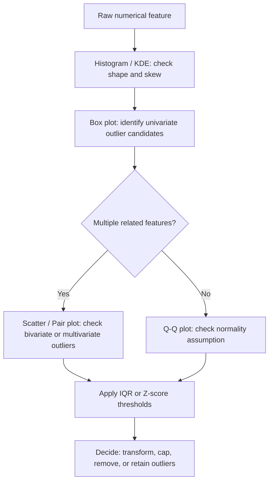

## Distribution and Outlier Visualization Techniques

### Overview

Distribution and outlier visualization forms a core part of exploratory data analysis (EDA) before feeding data into machine learning pipelines. These techniques reveal the shape, spread, central tendency, and anomalies in numerical features, which directly inform decisions about scaling, transformation, and outlier handling.

### Why Distribution Visualization Matters for ML

Machine learning models often carry assumptions about input data. Linear models and distance-based algorithms (k-NN, k-means, SVM) are sensitive to feature scale and skew. Tree-based models (Random Forest, XGBoost) are largely invariant to monotonic transformations but still benefit from outlier awareness since extreme values can dominate splits.

**Key Points**

- Skewed distributions may require log, square-root, or Box-Cox transformations before modeling
- Outliers can distort mean, standard deviation, and correlation calculations
- Visual inspection often reveals issues that summary statistics alone hide (Anscombe's quartet is a classic illustration of this)
- Distribution shape informs the choice between parametric and non-parametric methods

### Histogram

A histogram bins continuous data into intervals and displays frequency counts, giving a quick view of shape, modality, and skew.

```python
import numpy as np
import pandas as pd
import matplotlib.pyplot as plt

# Sample data
np.random.seed(42)
data = pd.Series(np.random.gamma(shape=2, scale=2, size=1000))

plt.figure(figsize=(8, 5))
plt.hist(data, bins=30, color='steelblue', edgecolor='black', alpha=0.7)
plt.title("Histogram of Gamma-Distributed Data")
plt.xlabel("Value")
plt.ylabel("Frequency")
plt.show()
```

**Key Points**

- Bin count affects interpretation heavily — too few bins hide structure, too many introduce noise
- A common default is `bins='auto'` or `bins=int(np.sqrt(n))`, though optimal bin selection depends on data characteristics [Inference]
- Pandas provides a shortcut: `df['column'].hist(bins=30)`

### Kernel Density Estimate (KDE) Plot

KDE smooths a histogram into a continuous probability density curve using a kernel function (commonly Gaussian), controlled by a bandwidth parameter.

```python
import seaborn as sns

plt.figure(figsize=(8, 5))
sns.kdeplot(data, fill=True, color='darkorange')
plt.title("KDE Plot of Gamma-Distributed Data")
plt.xlabel("Value")
plt.show()
```

The KDE at point $x$ is estimated as:

$$\hat{f}(x) = \frac{1}{nh} \sum_{i=1}^{n} K\left(\frac{x - x_i}{h}\right)$$

where $n$ is the sample size, $h$ is the bandwidth, and $K$ is the kernel function.

**Key Points**

- Bandwidth $h$ controls smoothness — smaller values reveal more detail but risk overfitting to noise; larger values oversmooth
- KDE can produce misleading density estimates near hard boundaries (e.g., data that cannot be negative), since the kernel extends past the true support [Inference]
- Overlaying KDE on a histogram (`sns.histplot(data, kde=True)`) combines both views

### Box Plot (Box-and-Whisker Plot)

Box plots summarize a distribution using five statistics: minimum (within whisker range), first quartile (Q1), median, third quartile (Q3), and maximum (within whisker range), with points beyond the whiskers flagged as potential outliers.

```python
plt.figure(figsize=(6, 5))
plt.boxplot(data, vert=True, patch_artist=True,
            boxprops=dict(facecolor='lightgreen'))
plt.title("Box Plot of Gamma-Distributed Data")
plt.ylabel("Value")
plt.show()

# Seaborn equivalent, useful for grouped comparisons
df = pd.DataFrame({'value': data, 'group': np.random.choice(['A', 'B'], size=1000)})
sns.boxplot(data=df, x='group', y='value')
plt.title("Box Plot by Group")
plt.show()
```

The whisker boundaries typically use the interquartile range (IQR):

$$\text{IQR} = Q3 - Q1$$


$$\text{Lower whisker} = Q1 - 1.5 \times \text{IQR}$$


$$\text{Upper whisker} = Q3 + 1.5 \times \text{IQR}$$

Points falling outside these bounds are plotted individually as candidate outliers.

**Key Points**

- The 1.5×IQR multiplier is a widely used convention (Tukey's method), not a universal statistical law — some domains use 3×IQR for "extreme" outliers
- Box plots are excellent for comparing distributions across categorical groups side by side
- They obscure multimodality — a bimodal distribution can produce a box plot indistinguishable from a unimodal one with similar quartiles

Below is a diagram of box plot anatomy:

<svg xmlns="http://www.w3.org/2000/svg" viewBox="0 0 640 320">
<text x="320" y="24" text-anchor="middle" font-size="16" font-weight="bold" fill="#222">Box Plot Anatomy (svg_diagram)</text>

<line x1="100" y1="280" x2="100" y2="60" stroke="#333" stroke-width="2" />
<text x="70" y="270" font-size="12" fill="#333">Value</text>

<line x1="320" y1="80" x2="320" y2="140" stroke="#333" stroke-width="2" />
<line x1="280" y1="80" x2="360" y2="80" stroke="#333" stroke-width="2" />
<line x1="320" y1="220" x2="320" y2="260" stroke="#333" stroke-width="2" />
<line x1="280" y1="260" x2="360" y2="260" stroke="#333" stroke-width="2" />

<rect x="240" y="140" width="160" height="80" fill="#a8d5ba" stroke="#333" stroke-width="2" />

<line x1="240" y1="175" x2="400" y2="175" stroke="#c0392b" stroke-width="3" />

<circle cx="320" cy="65" r="4" fill="#e74c3c" />
<circle cx="320" cy="272" r="4" fill="#e74c3c" />


<text x="410" y="82" font-size="12" fill="#333">Upper whisker (Q3 + 1.5×IQR)</text>

<text x="410" y="145" font-size="12" fill="#333">Q3 (75th percentile)</text>

<text x="410" y="178" font-size="12" fill="`#c0392b`">Median</text>

<text x="410" y="222" font-size="12" fill="#333">Q1 (25th percentile)</text>

<text x="410" y="262" font-size="12" fill="#333">Lower whisker (Q1 − 1.5×IQR)</text>

<text x="410" y="68" font-size="12" fill="`#e74c3c`">Outlier</text>

<text x="410" y="290" font-size="12" fill="`#e74c3c`">Outlier</text>

</svg>

### Violin Plot

A violin plot combines a box plot with a mirrored KDE, showing both summary statistics and the full distribution shape.

```python
plt.figure(figsize=(7, 5))
sns.violinplot(data=df, x='group', y='value', inner='quartile')
plt.title("Violin Plot by Group")
plt.show()
```

**Key Points**

- Reveals multimodality that box plots hide
- The `inner` parameter can show quartiles, individual points (`inner='point'`), or a mini box plot
- Width at a given value reflects estimated density, subject to the same bandwidth sensitivity as standalone KDE plots

### Scatter Plot for Bivariate Outliers

Univariate methods (box plot, histogram) miss outliers that only appear in the relationship between two variables. A scatter plot can expose these.

```python
x = np.random.normal(50, 10, 200)
y = 2 * x + np.random.normal(0, 10, 200)

# Inject bivariate outliers
x = np.append(x, [90, 10])
y = np.append(y, [20, 180])

plt.figure(figsize=(7, 5))
plt.scatter(x, y, alpha=0.6, color='teal')
plt.scatter([90, 10], [20, 180], color='red', label='Outliers', zorder=5)
plt.title("Scatter Plot Highlighting Bivariate Outliers")
plt.xlabel("X")
plt.ylabel("Y")
plt.legend()
plt.show()
```

**Key Points**

- A point can sit well within each variable's individual (univariate) range yet still be an outlier in the joint distribution
- Mahalanobis distance is a common quantitative technique to formalize multivariate outlier detection, since it accounts for correlation between features [Inference — the appropriateness of Mahalanobis distance depends on approximate multivariate normality, which should be checked before relying on it]

### Q-Q Plot (Quantile-Quantile Plot)

A Q-Q plot compares the quantiles of a sample distribution against a theoretical distribution (commonly normal), used to assess normality assumptions.

```python
from scipy import stats

plt.figure(figsize=(6, 6))
stats.probplot(data, dist="norm", plot=plt)
plt.title("Q-Q Plot Against Normal Distribution")
plt.show()
```

**Key Points**

- Points following the diagonal reference line suggest the sample matches the theoretical distribution
- Curved deviations at the tails typically indicate skew or heavy/light tails compared to normal
- Useful before applying models that assume normally distributed residuals (e.g., linear regression diagnostics)

### Pair Plot for Multivariate Distributions

`seaborn.pairplot` generates a grid of scatter plots (off-diagonal) and histograms/KDEs (diagonal) for every pair of numerical columns, useful for spotting outliers and relationships across many features simultaneously.

```python
iris_like = pd.DataFrame({
    'feature_1': np.random.normal(5, 1, 150),
    'feature_2': np.random.normal(3, 0.5, 150),
    'feature_3': np.random.normal(4, 1.2, 150),
    'label': np.random.choice(['A', 'B', 'C'], 150)
})

sns.pairplot(iris_like, hue='label', diag_kind='kde')
plt.show()
```

**Key Points**

- Computationally expensive for datasets with many columns — pairplot scales as $O(n^2)$ in the number of features, so it becomes impractical past roughly 10-15 columns [Inference]
- The `hue` parameter is effective for visually separating classes in classification tasks

### Statistical Outlier Detection Methods (Complementary to Visualization)

Visualization pairs well with quantitative thresholds. Two common approaches:

**Z-score method**

$$z = \frac{x - \mu}{\sigma}$$

Points with $|z| > 3$ are commonly flagged as outliers under an assumption of approximate normality.

```python
z_scores = (data - data.mean()) / data.std()
outliers_z = data[np.abs(z_scores) > 3]
```

**IQR method**

```python
Q1 = data.quantile(0.25)
Q3 = data.quantile(0.75)
IQR = Q3 - Q1
lower_bound = Q1 - 1.5 * IQR
upper_bound = Q3 + 1.5 * IQR
outliers_iqr = data[(data < lower_bound) | (data > upper_bound)]
```

**Key Points**

- The z-score method is sensitive to the very outliers it tries to detect, since extreme values inflate $\mu$ and $\sigma$ — the IQR method is more robust to this because quartiles are less influenced by extreme values
- Neither method is universally correct; choice depends on the underlying distribution shape and domain context [Inference]

### Workflow: Combining Visualization Techniques

A typical EDA workflow layers multiple views rather than relying on a single plot type.



**Key Points**

- The decision to remove versus retain outliers should be informed by domain knowledge, not automated purely from statistical thresholds [Inference]
- Some ML algorithms (e.g., Isolation Forest, DBSCAN) can perform multivariate outlier detection directly and are often used alongside — not instead of — visual EDA

### Example: Full Exploratory Snippet

```python
import numpy as np
import pandas as pd
import seaborn as sns
import matplotlib.pyplot as plt

np.random.seed(1)
df = pd.DataFrame({
    'income': np.random.exponential(scale=50000, size=500),
    'age': np.random.normal(40, 12, size=500)
})

fig, axes = plt.subplots(2, 2, figsize=(12, 8))

sns.histplot(df['income'], kde=True, ax=axes[0, 0], color='steelblue')
axes[0, 0].set_title("Income Distribution")

sns.boxplot(y=df['income'], ax=axes[0, 1], color='lightgreen')
axes[0, 1].set_title("Income Box Plot")

sns.histplot(df['age'], kde=True, ax=axes[1, 0], color='salmon')
axes[1, 0].set_title("Age Distribution")

sns.scatterplot(x='age', y='income', data=df, ax=axes[1, 1], alpha=0.5)
axes[1, 1].set_title("Age vs Income")

plt.tight_layout()
plt.show()
```

**Output**

A 2×2 grid figure: income histogram with overlaid KDE showing right skew (typical of exponential distributions), an income box plot flagging high-value outliers, a roughly symmetric age histogram, and a scatter plot for inspecting joint outliers between age and income.

### Conclusion

Distribution and outlier visualization is not a single technique but a layered set of tools — histograms and KDE for shape, box and violin plots for spread and univariate outliers, scatter and pair plots for multivariate relationships, and Q-Q plots for distributional assumptions. Effective EDA typically combines several of these views with quantitative thresholds (Z-score, IQR) before deciding how to treat outliers in a machine learning pipeline.

**Related Topics**

- Data transformation techniques (log, Box-Cox, Yeo-Johnson) for skewed distributions
- Feature scaling methods (StandardScaler, MinMaxScaler, RobustScaler) and their sensitivity to outliers
- Multivariate outlier detection algorithms (Isolation Forest, Local Outlier Factor, DBSCAN)
- Correlation heatmaps and pairwise relationship analysis
- Handling missing data as a companion step to outlier handling
- Data normalization strategies for neural network inputs