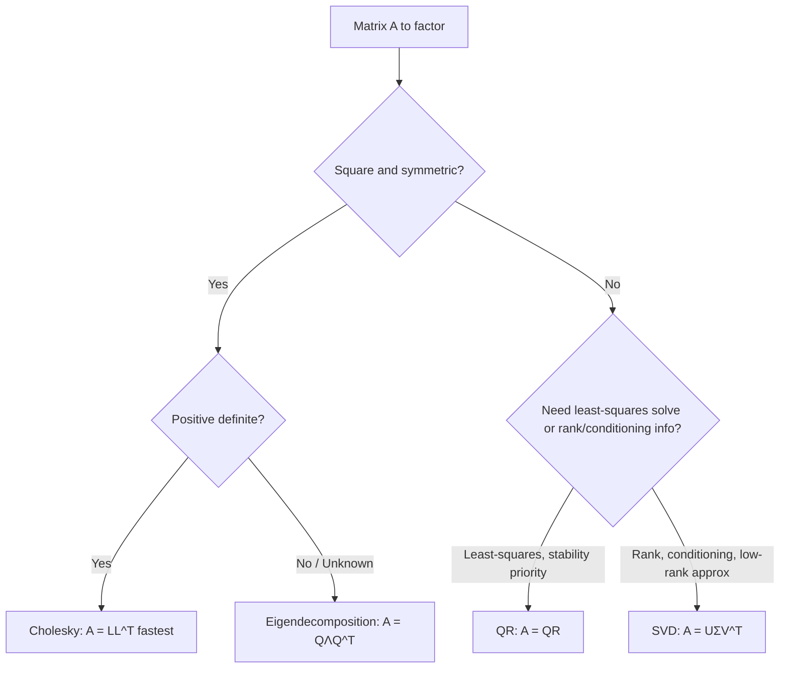

## Matrix Decompositions: Eigenvalue, Singular Value, Cholesky, and QR

### Eigenvalue Decomposition

For a square matrix $A \in \mathbb{R}^{n \times n}$, an eigenpair $(\lambda, v)$ satisfies:

$$Av = \lambda v, \quad v \neq 0$$

If $A$ has $n$ linearly independent eigenvectors, it admits the eigendecomposition:

$$A = V \Lambda V^{-1}$$

where $V = [v_1, \dots, v_n]$ collects the eigenvectors as columns and $\Lambda = \text{diag}(\lambda_1, \dots, \lambda_n)$.

**Symmetric Case**

When $A$ is symmetric ($A = A^T$), the Spectral Theorem guarantees real eigenvalues and an orthonormal eigenbasis, so the decomposition simplifies to:

$$A = Q \Lambda Q^T, \quad Q^T Q = I$$

This case dominates optimization theory because Hessian matrices of twice-differentiable functions are symmetric. The eigenvalues of the Hessian at a critical point determine the point's nature:

- All $\lambda_i > 0$: local minimum (positive definite Hessian)
- All $\lambda_i < 0$: local maximum (negative definite Hessian)
- Mixed signs: saddle point (indefinite Hessian)
- Some $\lambda_i = 0$: inconclusive from second-order information alone

**Eigenvalues and Convergence Rates**

For quadratic objectives $f(x) = \frac{1}{2}x^T A x - b^T x$, the convergence rate of gradient descent depends on the condition number:

$$\kappa(A) = \frac{\lambda_{\max}}{\lambda_{\min}}$$

A large condition number produces elongated, ill-conditioned level sets, causing gradient descent to zigzag; the linear convergence rate of steepest descent on such quadratics is governed by $\left(\frac{\kappa - 1}{\kappa + 1}\right)^2$. This is a standard result from convex optimization theory. [Inference — exact constant depends on step-size choice and problem formulation; presented here for the idealized exact-line-search case]

**Power Iteration**

The dominant eigenvalue/eigenvector pair can be approximated by repeated multiplication:

$$v_{k+1} = \frac{A v_k}{\|A v_k\|}$$

which converges when $|\lambda_1| > |\lambda_2|$ (a spectral gap exists). Power iteration underlies practical estimation of Hessian spectral properties in large-scale settings where forming $A$ explicitly is infeasible.

### Singular Value Decomposition (SVD)

For any matrix $A \in \mathbb{R}^{m \times n}$ (not necessarily square or symmetric):

$$A = U \Sigma V^T$$

where $U \in \mathbb{R}^{m \times m}$ and $V \in \mathbb{R}^{n \times n}$ are orthogonal, and $\Sigma \in \mathbb{R}^{m \times n}$ is diagonal with non-negative entries $\sigma_1 \geq \sigma_2 \geq \dots \geq 0$ (the singular values).

**Relationship to Eigendecomposition**

The singular values of $A$ are the square roots of the eigenvalues of $A^T A$ (or $AA^T$), and the columns of $V$ are eigenvectors of $A^T A$. SVD always exists, even for rectangular or rank-deficient matrices, making it more broadly applicable than eigendecomposition.

**Applications in Optimization**

- **Least-squares problems**: $\min_x \|Ax - b\|_2^2$ is solved via $x = V \Sigma^+ U^T b$, where $\Sigma^+$ is the pseudoinverse of $\Sigma$ (reciprocals of nonzero singular values). This handles rank-deficient and overdetermined systems robustly.
- **Low-rank approximation**: By the Eckart-Young theorem, truncating the SVD to the top $k$ singular values gives the best rank-$k$ approximation of $A$ in both Frobenius and spectral norm — foundational for dimensionality reduction and matrix-factorization-based optimization (PCA, recommender systems).
- **Conditioning diagnostics**: $\kappa(A) = \sigma_{\max}/\sigma_{\min}$ measures numerical sensitivity, directly informing whether an optimization subproblem (e.g., a linear system in Newton's method) is well-posed.
- **Trust-region subproblems**: SVD helps characterize the boundary solution structure when the constraint $\|d\| \leq \Delta$ is active.

### Cholesky Decomposition

For a symmetric positive-definite matrix $A$, the Cholesky decomposition factors it as:

$$A = LL^T$$

where $L$ is lower triangular with positive diagonal entries. Unlike general eigendecomposition, Cholesky exists uniquely for SPD matrices and is computed in roughly $\frac{1}{3}n^3$ flops — about half the cost of LU decomposition.

**Role in Optimization**

- **Newton's method**: Solving the Newton system $\nabla^2 f(x_k) \, d_k = -\nabla f(x_k)$ is done via Cholesky when the Hessian is positive definite, since it is both faster and more numerically stable than general Gaussian elimination.
- **Positive-definiteness verification**: Attempting a Cholesky factorization is a standard, efficient test for whether a matrix is SPD — the factorization fails (encounters a non-positive pivot) if and only if the matrix is not positive definite.
- **Modified Cholesky**: When the Hessian is indefinite (common far from a minimum), modified Cholesky variants add a diagonal perturbation to force positive definiteness, producing a well-defined, guaranteed descent direction. This is the standard mechanism inside trust-region and line-search Newton implementations for handling non-convex regions.
- **Sampling and covariance**: In stochastic optimization contexts requiring multivariate Gaussian sampling (e.g., some Bayesian optimization and evolutionary strategies like CMA-ES), Cholesky factors of the covariance matrix generate correlated samples from independent normal draws.

### QR Decomposition

Any matrix $A \in \mathbb{R}^{m \times n}$ ($m \geq n$) can be factored as:

$$A = QR$$

where $Q \in \mathbb{R}^{m \times m}$ has orthonormal columns ($Q^T Q = I$) and $R \in \mathbb{R}^{m \times n}$ is upper triangular. Common computational methods include Gram-Schmidt orthogonalization, Householder reflections, and Givens rotations, with Householder reflections generally preferred for numerical stability.

**Role in Optimization**

- **Least-squares via QR**: For $\min_x \|Ax - b\|_2$, substituting $A = QR$ reduces the normal equations to the triangular system $Rx = Q^T b$, which is solved by back-substitution and avoids forming the ill-conditioned matrix $A^T A$ explicitly.
- **Active-set methods**: QR updates efficiently track basis changes as constraints enter or leave the active set in constrained optimization, since adding/removing a column can be handled via incremental QR updates rather than full refactorization.
- **Orthogonalization of search directions**: In some constrained and conjugate-direction methods, QR ensures search directions remain linearly independent and well-conditioned across iterations.
- **Rank and null-space computation**: QR with column pivoting reveals numerical rank, useful for detecting degenerate or redundant constraints in linear programming preprocessing.

### Comparison of Decompositions

| Decomposition | Requires | Form | Primary Optimization Use |
|---|---|---|---|
| Eigendecomposition | Square (symmetric ideal) | $Q\Lambda Q^T$ | Second-order conditions, curvature analysis |
| SVD | Any matrix | $U\Sigma V^T$ | Least-squares, low-rank approximation, conditioning |
| Cholesky | Symmetric positive-definite | $LL^T$ | Fast Newton-step solves, SPD verification |
| QR | Any matrix (full column rank ideal) | $QR$ | Stable least-squares, constraint/basis updates |

### Illustration: Decomposition Selection Flow

### Related Topics

- **Positive definite and semidefinite matrices**: quadratic forms and curvature classification
- **Condition number and numerical stability**: implications for optimization algorithm robustness
- **Newton's method and quasi-Newton methods**: direct consumers of Cholesky/eigenstructure
- **Least-squares and regularized regression**: SVD/QR-based solution methods
- **Principal Component Analysis (PCA)**: SVD-driven dimensionality reduction as an optimization problem