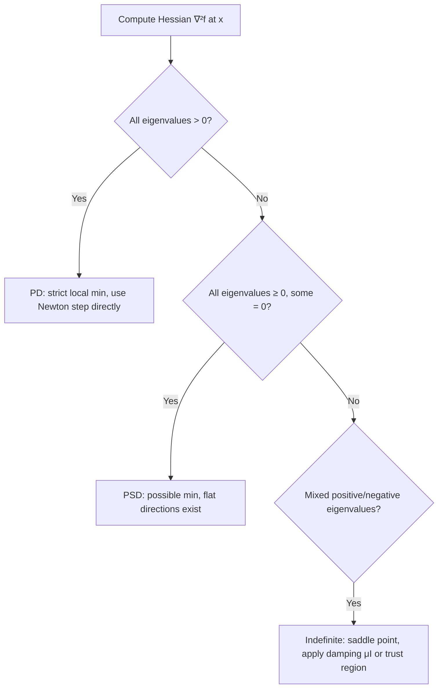

## Positive Definite and Positive Semidefinite Matrices

### Definitions

A symmetric matrix $A \in \mathbb{R}^{n \times n}$ is classified by the sign of its associated quadratic form $x^T A x$ over all nonzero $x$:

$$
\begin{aligned}
\text{Positive definite (PD)} &: \quad x^T A x > 0 \quad \forall x \neq 0 \\
\text{Positive semidefinite (PSD)} &: \quad x^T A x \geq 0 \quad \forall x \\
\text{Negative definite (ND)} &: \quad x^T A x < 0 \quad \forall x \neq 0 \\
\text{Negative semidefinite (NSD)} &: \quad x^T A x \leq 0 \quad \forall x \\
\text{Indefinite} &: \quad x^T A x \text{ takes both signs}
\end{aligned}
$$

These classifications apply specifically to symmetric matrices in the optimization context, since Hessians of twice-differentiable real-valued functions are always symmetric by Clairaut's theorem (equality of mixed partials under continuity).

### Equivalent Characterizations

A symmetric matrix $A$ is positive definite if and only if any one (and hence all) of the following hold:

- **Eigenvalue test**: all eigenvalues $\lambda_i(A) > 0$
- **Leading principal minors test**: all leading principal minors of $A$ are positive (Sylvester's criterion)
- **Cholesky test**: $A = LL^T$ exists with $L$ having strictly positive diagonal entries
- **Pivot test**: all pivots obtained from Gaussian elimination (without row exchanges) are positive

For positive semidefiniteness, the corresponding conditions relax to $\lambda_i(A) \geq 0$, all principal minors (not just leading ones) being non-negative, and existence of a (possibly non-unique) factorization $A = B^T B$ for some matrix $B$.

[Inference — standard equivalence result; the leading-principal-minors test specifically requires care for the semidefinite case, since checking only leading minors is insufficient for PSD and the full set of principal minors must be checked]

### Role in Optimality Conditions

**Second-Order Sufficient Conditions**

For unconstrained minimization of $f: \mathbb{R}^n \to \mathbb{R}$, at a stationary point $x^*$ where $\nabla f(x^*) = 0$:

$$\nabla^2 f(x^*) \succ 0 \implies x^* \text{ is a strict local minimum}$$

$$\nabla^2 f(x^*) \succeq 0 \text{ (necessary, not sufficient alone)} \implies x^* \text{ is consistent with a local minimum}$$

The notation $A \succ 0$ denotes positive definite and $A \succeq 0$ denotes positive semidefinite. Second-order necessary conditions require $\nabla^2 f(x^*) \succeq 0$ at a local minimum; second-order sufficient conditions require strict positive definiteness, which additionally guarantees the minimum is isolated.

**Convexity Characterization**

A twice-differentiable function $f$ is convex on a convex domain if and only if:

$$\nabla^2 f(x) \succeq 0 \quad \forall x \text{ in the domain}$$

and strictly (strongly, in fact — see below) convex if $\nabla^2 f(x) \succ 0$ everywhere. This is the direct bridge between linear algebra and convex optimization theory: convexity of the objective, which guarantees any local minimum is global, reduces to a positive semidefiniteness check on the Hessian.

**Strong Convexity**

A function is $m$-strongly convex if:

$$\nabla^2 f(x) \succeq mI \quad \forall x, \quad m > 0$$

i.e., $\nabla^2 f(x) - mI$ is positive semidefinite. Strong convexity is a stronger requirement than plain convexity and yields linear (geometric) convergence rates for gradient descent and related first-order methods, as opposed to the sublinear rates guaranteed under convexity alone.

### PD/PSD Matrices in Quadratic Programming

For the quadratic program:

$$\min_x \quad \frac{1}{2} x^T Q x + c^T x$$

- If $Q \succ 0$: the problem is strictly convex with a unique global minimizer, solvable by setting the gradient to zero: $Qx = -c$.
- If $Q \succeq 0$: the problem is convex; a global minimizer exists if one exists at all, but it may not be unique (a set of minimizers can form an affine subspace).
- If $Q$ is indefinite: the problem is non-convex; stationary points may be saddle points, and global optimization becomes NP-hard in general. [Inference — general non-convex QP hardness is a well-established complexity result, stated here without a specific citation]

This classification directly determines which solution algorithm is appropriate — interior-point and active-set QP solvers assume $Q \succeq 0$; indefinite $Q$ requires either non-convex solvers or convexification techniques (e.g., adding a multiple of the identity, as in Levenberg-Marquardt).

### Levenberg-Marquardt Damping

A canonical use of PD/PSD structure is regularizing an indefinite or near-singular Hessian approximation in nonlinear least-squares and trust-region methods:

$$(\nabla^2 f(x) + \mu I) d = -\nabla f(x), \quad \mu \geq 0$$

For sufficiently large $\mu$, $\nabla^2 f(x) + \mu I$ becomes positive definite, since adding $\mu I$ shifts every eigenvalue by $\mu$. This guarantees $d$ is a descent direction and the linear system is solvable via Cholesky, blending Newton's method (small $\mu$, fast local convergence) with gradient descent (large $\mu$, robust global behavior).

### Geometric Interpretation

The quadratic form $x^T A x = c$ traces level sets that are:

- **Ellipsoids** when $A \succ 0$ (bounded, closed contours)
- **Degenerate ellipsoids/cylinders** when $A \succeq 0$ but singular (unbounded along null-space directions)
- **Hyperboloids** when $A$ is indefinite (open, saddle-shaped contours)

This geometry explains algorithmic behavior directly: gradient descent on a function with PD Hessian near the minimum produces elliptical, contracting iterate paths, while indefinite Hessians produce non-converging or diverging behavior for naive Newton steps, motivating trust-region and damping safeguards.

### Illustration: Quadratic Form Classification and Level-Set Geometry (svg_diagram)

<svg xmlns="http://www.w3.org/2000/svg" viewBox="0 0 620 260">
  <text x="310" y="22" text-anchor="middle" font-size="16" font-weight="bold" fill="#111">Quadratic Form Level Sets (svg_diagram)</text>

  <g transform="translate(90,140)">
    <ellipse cx="0" cy="0" rx="60" ry="38" fill="none" stroke="#27ae60" stroke-width="2" />
    <ellipse cx="0" cy="0" rx="40" ry="25" fill="none" stroke="#27ae60" stroke-width="1.5" opacity="0.7" />
    <ellipse cx="0" cy="0" rx="20" ry="12" fill="none" stroke="#27ae60" stroke-width="1.2" opacity="0.5" />
    <circle cx="0" cy="0" r="2.5" fill="#111" />
    <text x="0" y="70" text-anchor="middle" font-size="12" fill="#111">A ≻ 0 (PD)</text>
    <text x="0" y="86" text-anchor="middle" font-size="10" fill="#555">bounded ellipses</text>
  </g>

  <g transform="translate(310,140)">
    <line x1="-60" y1="-30" x2="60" y2="30" stroke="#f39c12" stroke-width="2" />
    <line x1="-60" y1="-15" x2="60" y2="15" stroke="#f39c12" stroke-width="1.5" opacity="0.7" />
    <line x1="-60" y1="0" x2="60" y2="0" stroke="#f39c12" stroke-width="1.2" opacity="0.5" />
    <circle cx="0" cy="0" r="2.5" fill="#111" />
    <text x="0" y="70" text-anchor="middle" font-size="12" fill="#111">A ⪰ 0, singular (PSD)</text>
    <text x="0" y="86" text-anchor="middle" font-size="10" fill="#555">unbounded along null space</text>
  </g>

  <g transform="translate(520,140)">
    <path d="M -50,-40 C -20,-10 20,10 50,40" fill="none" stroke="#c0392b" stroke-width="2" />
    <path d="M -50,40 C -20,10 20,-10 50,-40" fill="none" stroke="#c0392b" stroke-width="2" />
    <path d="M -40,-40 C -15,-8 15,8 40,40" fill="none" stroke="#c0392b" stroke-width="1.3" opacity="0.6" />
    <path d="M -40,40 C -15,8 15,-8 40,-40" fill="none" stroke="#c0392b" stroke-width="1.3" opacity="0.6" />
    <circle cx="0" cy="0" r="2.5" fill="#111" />
    <text x="0" y="70" text-anchor="middle" font-size="12" fill="#111">A indefinite</text>
    <text x="0" y="86" text-anchor="middle" font-size="10" fill="#555">saddle-shaped hyperbolas</text>
  </g>
</svg>

### Illustration: Diagnostic Flow for Hessian Classification

### Related Topics

- **Convex functions and convex sets**: first- and second-order convexity characterizations
- **Newton's method and trust-region methods**: PD requirement for descent-direction guarantees
- **Quadratic programming**: solver selection based on $Q$'s definiteness
- **Strong convexity and condition number**: implications for convergence rate guarantees
- **Levenberg-Marquardt and regularization techniques**: enforcing definiteness in practice