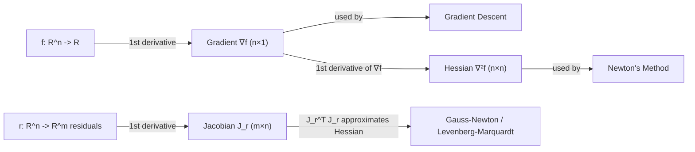

## Multivariable Calculus: Gradients, Jacobians, and Hessians

### The Gradient

For a scalar-valued function $f: \mathbb{R}^n \to \mathbb{R}$, the gradient collects all first-order partial derivatives into a vector:

$$\nabla f(x) = \begin{bmatrix} \dfrac{\partial f}{\partial x_1} \\ \vdots \\ \dfrac{\partial f}{\partial x_n} \end{bmatrix}$$

The gradient points in the direction of steepest ascent of $f$ at $x$, and $-\nabla f(x)$ points in the direction of steepest descent — the foundational fact behind gradient descent and all first-order optimization methods.

**First-Order Necessary Condition**

If $x^*$ is a local minimum (or maximum) of a differentiable $f$ over an open set, then:

$$\nabla f(x^*) = 0$$

This is Fermat's theorem generalized to multiple variables. Points satisfying $\nabla f(x) = 0$ are called stationary (or critical) points, and they may be minima, maxima, or saddle points — the gradient condition alone cannot distinguish between them, which is why second-order information (the Hessian) is needed.

**Directional Derivatives**

The rate of change of $f$ at $x$ in direction $d$ (with $\|d\| = 1$) is:

$$D_d f(x) = \nabla f(x)^T d = \langle \nabla f(x), d \rangle$$

By Cauchy-Schwarz, this is maximized when $d = \nabla f(x) / \|\nabla f(x)\|$ and minimized (most negative) when $d = -\nabla f(x) / \|\nabla f(x)\|$, formally confirming that the negative gradient is the direction of steepest local decrease.

**Gradient and Level Sets**

The gradient $\nabla f(x)$ is always orthogonal to the level set $\{y : f(y) = f(x)\}$ passing through $x$. This orthogonality underlies the geometric picture of gradient descent trajectories crossing level-set contours perpendicularly (in the idealized continuous-time limit) and is central to understanding why ill-conditioned level sets (from an ill-conditioned Hessian) cause zigzagging in discrete gradient descent.

### The Jacobian

For a vector-valued function $F: \mathbb{R}^n \to \mathbb{R}^m$, the Jacobian is the $m \times n$ matrix of all first-order partial derivatives:

$$J_F(x) = \begin{bmatrix} \dfrac{\partial F_1}{\partial x_1} & \cdots & \dfrac{\partial F_1}{\partial x_n} \\ \vdots & \ddots & \vdots \\ \dfrac{\partial F_m}{\partial x_1} & \cdots & \dfrac{\partial F_m}{\partial x_n} \end{bmatrix}$$

Row $i$ of $J_F$ is $\nabla F_i(x)^T$. When $m = 1$, the Jacobian reduces to $\nabla f(x)^T$ (a row vector), making the gradient a special case of the Jacobian.

**Role in Optimization**

- **Constraint Jacobians**: For equality constraints $h(x) = 0$ with $h: \mathbb{R}^n \to \mathbb{R}^p$, the Jacobian $J_h(x)$ appears directly in the KKT conditions and in the Linear Independence Constraint Qualification (LICQ), which requires $J_h(x^*)$ to have full row rank at a candidate solution.
- **Nonlinear least-squares**: For $\min_x \frac{1}{2}\|r(x)\|_2^2$ with residual vector $r: \mathbb{R}^n \to \mathbb{R}^m$, the Gauss-Newton and Levenberg-Marquardt methods approximate the Hessian using only the Jacobian of $r$:

$$\nabla^2 f(x) \approx J_r(x)^T J_r(x)$$

avoiding the need for second derivatives of $r$ — a major practical advantage in curve fitting and calibration problems.

- **Newton's method for systems**: Solving nonlinear equations $F(x) = 0$ via Newton's method requires $J_F(x)$ to form the update $x_{k+1} = x_k - J_F(x_k)^{-1} F(x_k)$.

**Chain Rule (Composition)**

For $F: \mathbb{R}^n \to \mathbb{R}^m$ and $G: \mathbb{R}^m \to \mathbb{R}^p$, the Jacobian of the composition $G \circ F$ is:

$$J_{G \circ F}(x) = J_G(F(x)) \, J_F(x)$$

This matrix chain rule is the mathematical basis of backpropagation in neural network training, where a long composition of layer functions has its overall Jacobian computed as a product of per-layer Jacobians.

### The Hessian

For a twice-differentiable $f: \mathbb{R}^n \to \mathbb{R}$, the Hessian is the $n \times n$ matrix of second-order partial derivatives:

$$\nabla^2 f(x) = \begin{bmatrix} \dfrac{\partial^2 f}{\partial x_1^2} & \cdots & \dfrac{\partial^2 f}{\partial x_1 \partial x_n} \\ \vdots & \ddots & \vdots \\ \dfrac{\partial^2 f}{\partial x_n \partial x_1} & \cdots & \dfrac{\partial^2 f}{\partial x_n^2} \end{bmatrix}$$

By Clairaut's/Schwarz's theorem, if the second partial derivatives are continuous, mixed partials are equal ($\partial^2 f / \partial x_i \partial x_j = \partial^2 f / \partial x_j \partial x_i$), so the Hessian is symmetric. This symmetry is what makes the entire positive-definiteness/eigenvalue machinery from the previous topic directly applicable.

**Second-Order Taylor Expansion**

The Hessian appears naturally in the local quadratic approximation of $f$ around a point $x$:

$$f(x + \Delta x) \approx f(x) + \nabla f(x)^T \Delta x + \frac{1}{2} \Delta x^T \nabla^2 f(x) \, \Delta x$$

This expansion is the theoretical basis for Newton's method: minimizing the right-hand side (a quadratic model) with respect to $\Delta x$ gives the Newton step $\Delta x = -\nabla^2 f(x)^{-1} \nabla f(x)$, exact when $f$ is itself quadratic and a local approximation otherwise.

**Second-Order Conditions Recap**

$$\nabla f(x^*) = 0 \text{ and } \nabla^2 f(x^*) \succ 0 \implies x^* \text{ is a strict local minimum}$$

$$\nabla f(x^*) = 0 \text{ and } \nabla^2 f(x^*) \text{ indefinite} \implies x^* \text{ is a saddle point}$$

covered in depth in the positive-definiteness topic; the Hessian is the object that makes this classification computable.

**Hessian-Vector Products**

In large-scale optimization, forming the full $n \times n$ Hessian is often computationally prohibitive. Many algorithms (truncated Newton, Newton-CG, trust-region-CG) instead compute Hessian-vector products $\nabla^2 f(x) \, v$ directly — via automatic differentiation or finite differences — without materializing the full matrix, reducing cost from $O(n^2)$ storage to $O(n)$ per product.

### Relationships Summary

| Object | Domain → Codomain | Shape | Order |
|---|---|---|---|
| Gradient $\nabla f$ | $\mathbb{R}^n \to \mathbb{R}$ | $n \times 1$ | 1st derivative |
| Jacobian $J_F$ | $\mathbb{R}^n \to \mathbb{R}^m$ | $m \times n$ | 1st derivative |
| Hessian $\nabla^2 f$ | $\mathbb{R}^n \to \mathbb{R}$ | $n \times n$ | 2nd derivative |

[Inference — not a labeled uncertainty in the mathematical content itself, but noted for clarity: the Hessian can equivalently be viewed as the Jacobian of the gradient map, $\nabla^2 f(x) = J_{\nabla f}(x)$, unifying the three objects under one differentiation framework]

### Illustration: Order of Differentiation and Optimization Method Dependence

### Illustration: Second-Order Taylor Approximation Geometry (svg_diagram)

<svg xmlns="http://www.w3.org/2000/svg" viewBox="0 0 500 260">
  <text x="250" y="22" text-anchor="middle" font-size="16" font-weight="bold" fill="#111">Quadratic Approximation at x (svg_diagram)</text>

  <line x1="40" y1="220" x2="460" y2="220" stroke="#ccc" />
  <line x1="40" y1="220" x2="40" y2="40" stroke="#ccc" />

  <path d="M 60,200 C 150,60 250,40 340,110 C 400,150 430,120 450,80" fill="none" stroke="#2980b9" stroke-width="2.2" />
  <text x="455" y="78" font-size="12" fill="#2980b9">f(x)</text>

  <path d="M 180,150 Q 260,95 340,150" fill="none" stroke="#c0392b" stroke-width="2" stroke-dasharray="5,3" />
  <text x="345" y="150" font-size="12" fill="#c0392b">quadratic model</text>

  <circle cx="260" cy="108" r="3.5" fill="#111" />
  <text x="266" y="104" font-size="12" fill="#111">x</text>

  <line x1="260" y1="108" x2="260" y2="220" stroke="#999" stroke-dasharray="2,2" />
</svg>

### Related Topics

- **Newton's method and quasi-Newton methods**: direct application of Hessian and Jacobian structure
- **Automatic differentiation**: computational technique for obtaining exact gradients/Jacobians/Hessians
- **Taylor series and local approximation theory**: mathematical basis for iterative optimization steps
- **Gauss-Newton and Levenberg-Marquardt algorithms**: Jacobian-based Hessian approximation
- **Backpropagation**: chain-rule-based Jacobian composition in deep learning optimization