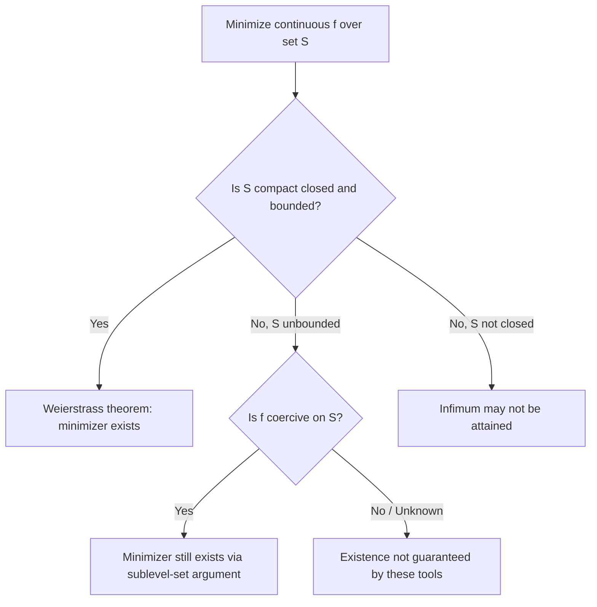

## Topology Basics: Open, Closed, Compact, and Bounded Sets

### Open Sets

A set $S \subseteq \mathbb{R}^n$ is open if every point $x \in S$ has a neighborhood entirely contained in $S$. Formally, using the open ball $B(x, \epsilon) = \{y : \|y - x\| < \epsilon\}$:

$$S \text{ is open} \iff \forall x \in S, \, \exists \epsilon > 0 \text{ such that } B(x, \epsilon) \subseteq S$$

Intuitively, an open set contains none of its "boundary" — every point has room around it that stays inside the set. In optimization, the domain of a function is frequently assumed open when stating first- and second-order necessary conditions ($\nabla f(x^*) = 0$), because these conditions rely on being able to perturb $x^*$ in *any* direction and remain in the domain — a requirement that fails at a boundary point.

**Union and Intersection Properties**

Arbitrary unions of open sets are open; only finite intersections of open sets are guaranteed open. This asymmetry matters when constructing feasible regions from multiple strict inequality constraints $g_i(x) < 0$: the interior of the feasible region (a finite intersection of open sets) is open, but care is needed if infinitely many constraints are involved.

### Closed Sets

A set $S \subseteq \mathbb{R}^n$ is closed if its complement $\mathbb{R}^n \setminus S$ is open. Equivalently, $S$ is closed if and only if it contains all its limit points: every convergent sequence $\{x_k\} \subset S$ has its limit also in $S$.

$$S \text{ is closed} \iff \left( x_k \in S, \, x_k \to x \right) \implies x \in S$$

**Relevance to Feasible Sets**

Constraint sets defined by non-strict inequalities and equalities are closed:

$$\{x : g_i(x) \leq 0, \, i = 1,\dots,m\} \cap \{x : h_j(x) = 0, \, j = 1,\dots,p\}$$

is closed whenever $g_i$ and $h_j$ are continuous, because preimages of closed sets under continuous maps are closed. This is why standard optimization problem formulations favor $\leq$ and $=$ constraints over strict inequalities: closedness, combined with boundedness, is what guarantees an optimal solution actually exists and is attained (rather than merely approached in the limit).

### Bounded Sets

A set $S \subseteq \mathbb{R}^n$ is bounded if it is contained within some ball of finite radius:

$$\exists M > 0 \text{ such that } \|x\| \leq M \quad \forall x \in S$$

Boundedness alone says nothing about whether a set contains its boundary — an open ball and a closed ball of the same radius are both bounded, but only one is closed.

### Compact Sets

In $\mathbb{R}^n$, the Heine-Borel theorem gives a clean characterization: a set $S$ is compact if and only if it is both closed and bounded.

$$S \text{ compact} \iff S \text{ closed and } S \text{ bounded} \quad (\text{in } \mathbb{R}^n)$$

[Inference — this equivalence is specific to finite-dimensional Euclidean space; in general metric or topological spaces, compactness is defined via the open-cover property (every open cover has a finite subcover), and closed-and-bounded is not sufficient in infinite dimensions]

**Sequential Compactness**

Equivalently in $\mathbb{R}^n$, $S$ is compact if and only if every sequence in $S$ has a subsequence converging to a point within $S$ (Bolzano-Weierstrass property extended to sets). This sequential characterization is the version most directly used in optimization existence proofs.

### Weierstrass Extreme Value Theorem

The single most important consequence of compactness for optimization is the Weierstrass Extreme Value Theorem:

$$f \text{ continuous on compact } S \implies f \text{ attains both a maximum and a minimum on } S$$

This theorem is the fundamental existence result underlying optimization theory: it guarantees a global minimizer *exists* (though it says nothing about uniqueness or how to find it). Without compactness, minimizers may fail to exist even for well-behaved continuous functions — for example, $f(x) = e^{-x}$ on the open, unbounded set $\mathbb{R}$ has infimum $0$ but attains no minimum.

**Why Both Closedness and Boundedness Are Needed**

- **Closed but unbounded**: $f(x) = x$ on $S = \mathbb{R}$ (closed) has no minimum — the function decreases without bound.
- **Bounded but not closed**: $f(x) = 1/x$ on $S = (0, 1]$ (bounded but not closed, missing the limit point $0$) has no maximum — it increases without bound as $x \to 0^+$ from within the set.
- **Closed and bounded (compact)**: $f(x) = x^2$ on $S = [-1, 1]$ attains both its minimum ($0$ at $x=0$) and maximum ($1$ at $x = \pm 1$).

### Coercivity as an Alternative to Compactness

When the feasible set is unbounded (e.g., all of $\mathbb{R}^n$), compactness cannot directly guarantee existence. Coercivity provides an alternative sufficient condition:

$$f \text{ is coercive} \iff \|x\| \to \infty \implies f(x) \to \infty$$

If $f$ is continuous and coercive on a closed (but possibly unbounded) set $S$, a global minimizer still exists: coercivity guarantees that the sublevel set $\{x \in S : f(x) \leq f(x_0)\}$ for any fixed $x_0$ is bounded, effectively reducing the problem back to a compact-set argument on that sublevel set. This is the standard technique for proving existence of minimizers in unconstrained problems over all of $\mathbb{R}^n}$, such as strongly convex quadratic objectives, which are coercive by construction.

### Convex Sets (Brief Connection)

Though a separate topic in its own right, it is worth noting that open, closed, bounded, and compact are topological properties independent of convexity — a set can be compact and non-convex (e.g., a closed annulus), or convex and non-compact (e.g., an open halfspace). Optimization theory frequently combines both properties: convexity for structural guarantees (local minima are global), and compactness for existence guarantees (a minimum is attained at all).

### Illustration: Set Classification Examples (svg_diagram)

<svg xmlns="http://www.w3.org/2000/svg" viewBox="0 0 600 240">
  <text x="300" y="22" text-anchor="middle" font-size="16" font-weight="bold" fill="#111">Open vs Closed vs Compact (svg_diagram)</text>

  <g transform="translate(100,140)">
    <circle cx="0" cy="0" r="55" fill="#eaf4fb" stroke="#2980b9" stroke-width="2" stroke-dasharray="4,3" />
    <text x="0" y="80" text-anchor="middle" font-size="12" fill="#111">Open ball</text>
    <text x="0" y="96" text-anchor="middle" font-size="10" fill="#555">bounded, not closed</text>
  </g>

  <g transform="translate(300,140)">
    <circle cx="0" cy="0" r="55" fill="#eafbea" stroke="#27ae60" stroke-width="2.5" />
    <text x="0" y="80" text-anchor="middle" font-size="12" fill="#111">Closed ball</text>
    <text x="0" y="96" text-anchor="middle" font-size="10" fill="#555">closed, bounded → compact</text>
  </g>

  <g transform="translate(500,140)">
    <line x1="-55" y1="0" x2="55" y2="0" stroke="#c0392b" stroke-width="3" />
    <text x="0" y="80" text-anchor="middle" font-size="12" fill="#111">Real line</text>
    <text x="0" y="96" text-anchor="middle" font-size="10" fill="#555">closed, unbounded → not compact</text>
  </g>
</svg>

### Illustration: Existence-of-Minimizer Decision Flow

### Related Topics

- **Convex sets and convex functions**: structural properties combined with topological existence results
- **Weierstrass theorem and existence of optimizers**: formal existence theory for optimization problems
- **Coercivity conditions**: existence guarantees on unbounded domains
- **Constraint qualifications**: how open/closed structure of feasible regions affects KKT validity
- **Sequential and asymptotic analysis of iterative algorithms**: convergence to points within closed sets