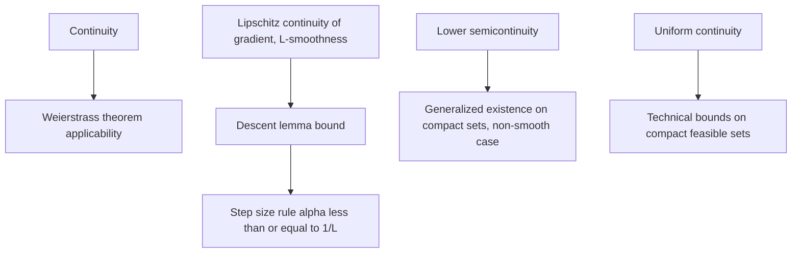

## Sequences, Limits, and Continuity in Normed Spaces

### Sequences in Normed Spaces

A sequence $\{x_k\}_{k=1}^\infty$ in $\mathbb{R}^n$ converges to a limit $x^*$ if:

$$\forall \epsilon > 0, \, \exists K \text{ such that } k \geq K \implies \|x_k - x^*\| < \epsilon$$

written $x_k \to x^*$ or $\lim_{k\to\infty} x_k = x^*$. This definition is norm-dependent in general metric spaces, but since all norms on $\mathbb{R}^n$ are equivalent, convergence in one norm implies convergence in every norm — so the choice of norm ($\ell_1$, $\ell_2$, $\ell_\infty$) does not affect *whether* a sequence converges, only the specific error bounds and constants involved.

In optimization, the entire notion of an iterative algorithm "working" is expressed through this definition: an algorithm generates a sequence of iterates $\{x_k\}$, and convergence analysis asks whether, and how fast, $x_k \to x^*$ for some optimal or stationary $x^*$.

### Cauchy Sequences and Completeness

A sequence $\{x_k\}$ is Cauchy if:

$$\forall \epsilon > 0, \, \exists K \text{ such that } j, k \geq K \implies \|x_j - x_k\| < \epsilon$$

$\mathbb{R}^n$ is complete: every Cauchy sequence converges to a limit within $\mathbb{R}^n$. This completeness property is what allows convergence to be established without knowing the limit $x^*$ in advance — an algorithm can be shown to produce a Cauchy sequence (e.g., by bounding $\|x_{k+1} - x_k\|$ and summing a convergent series), and completeness then guarantees a limit exists, even before that limit is identified as a stationary point of $f$.

### Rates of Convergence

Once convergence $x_k \to x^*$ is established, optimization theory further classifies *how fast* it occurs. Let $e_k = \|x_k - x^*\|$.

**Linear (Geometric) Convergence**

$$\lim_{k \to \infty} \frac{e_{k+1}}{e_k} = r, \quad 0 < r < 1$$

Error decreases by a roughly constant factor each iteration. Gradient descent on strongly convex functions with an appropriate step size achieves linear convergence, with $r$ typically expressed in terms of the condition number $\kappa$ of the Hessian.

**Superlinear Convergence**

$$\lim_{k \to \infty} \frac{e_{k+1}}{e_k} = 0$$

Error decreases by a factor that itself shrinks toward zero. Quasi-Newton methods (BFGS) typically achieve superlinear convergence near a solution under standard smoothness assumptions.

**Quadratic Convergence**

$$\lim_{k \to \infty} \frac{e_{k+1}}{e_k^2} = M, \quad M < \infty$$

The number of correct digits roughly doubles each iteration. Newton's method achieves quadratic convergence locally, provided the Hessian is positive definite and Lipschitz continuous near $x^*$ and the starting point is sufficiently close — a hypothesis that is essential, since Newton's method carries no such guarantee globally.

[Inference — quadratic local convergence of Newton's method is a standard textbook result; the precise smoothness/starting-point hypotheses vary slightly across formulations, so the qualifier "sufficiently close" and Lipschitz-Hessian conditions are stated generally rather than with an exact numeric radius of convergence]

### Continuity

A function $f: \mathbb{R}^n \to \mathbb{R}^m$ is continuous at $x$ if:

$$\forall \epsilon > 0, \, \exists \delta > 0 \text{ such that } \|y - x\| < \delta \implies \|f(y) - f(x)\| < \epsilon$$

**Sequential Characterization**

Equivalently, $f$ is continuous at $x$ if and only if for every sequence $x_k \to x$, $f(x_k) \to f(x)$. This sequential form is typically the more practically useful formulation in optimization proofs, since it connects directly to iterate sequences: if $x_k \to x^*$ and $f$ is continuous, then $f(x_k) \to f(x^*)$, allowing conclusions about the objective value along a converging sequence.

**Why Continuity Matters for Optimization**

- It is a prerequisite for the Weierstrass Extreme Value Theorem: existence of a minimizer over a compact set requires $f$ continuous.
- Preimages of open sets under continuous functions are open, and preimages of closed sets are closed — this is precisely why standard constraint sets $\{x : g(x) \leq 0\}$ are closed when $g$ is continuous.

### Lipschitz Continuity

A stronger regularity condition than plain continuity: $f$ is Lipschitz continuous on $S$ with constant $L$ if:

$$\|f(x) - f(y)\| \leq L \|x - y\| \quad \forall x, y \in S$$

Lipschitz continuity of the gradient, $\|\nabla f(x) - \nabla f(y)\| \leq L\|x - y\|$, is one of the most common assumptions in optimization convergence theory ("$L$-smoothness"). It bounds how quickly the gradient can change, which directly controls how large a step size can safely be taken in gradient descent — the standard step-size bound $\alpha \leq 1/L$ arises directly from this assumption via the descent lemma:

$$f(y) \leq f(x) + \nabla f(x)^T(y - x) + \frac{L}{2}\|y - x\|^2$$

This inequality — a direct consequence of $L$-smoothness combined with the second-order Taylor remainder bound — is the single most-used tool in first-order convergence proofs, since it provides a computable upper bound on the function value after a gradient step.

### Uniform Continuity

$f$ is uniformly continuous on $S$ if the $\delta$ in the continuity definition can be chosen independent of the point $x$:

$$\forall \epsilon > 0, \, \exists \delta > 0 \text{ such that } \forall x, y \in S, \, \|x - y\| < \delta \implies \|f(x) - f(y)\| < \epsilon$$

By the Heine-Cantor theorem, every continuous function on a compact set is automatically uniformly continuous. [Inference — standard analysis result; stated here for completeness, since uniform continuity is a less frequently invoked assumption in mainstream optimization theory compared to Lipschitz continuity, but it underlies some technical convergence arguments on compact feasible sets]

### Semicontinuity

Two weaker one-sided continuity notions are important in optimization, especially for non-smooth and extended-real-valued functions:

$$f \text{ is lower semicontinuous (l.s.c.) at } x \iff \liminf_{y \to x} f(y) \geq f(x)$$

$$f \text{ is upper semicontinuous (u.s.c.) at } x \iff \limsup_{y \to x} f(y) \leq f(x)$$

Lower semicontinuity is the standard regularity assumption in modern convex and non-smooth optimization (particularly for functions allowed to take the value $+\infty$, such as indicator functions of constraint sets), because a generalization of the Weierstrass theorem holds under l.s.c. plus compactness: an l.s.c. function on a compact set attains its minimum, even without full continuity.

### Illustration: Convergence Rate Comparison

<svg xmlns="http://www.w3.org/2000/svg" viewBox="0 0 560 260">
  <text x="280" y="22" text-anchor="middle" font-size="16" font-weight="bold" fill="#111">Error Decay by Convergence Rate (svg_diagram)</text>

  <line x1="60" y1="220" x2="500" y2="220" stroke="#333" stroke-width="1.3" />
  <line x1="60" y1="220" x2="60" y2="40" stroke="#333" stroke-width="1.3" />
  <text x="280" y="245" text-anchor="middle" font-size="12" fill="#333">iteration k</text>
  <text x="30" y="130" text-anchor="middle" font-size="12" fill="#333" transform="rotate(-90 30 130)">error e_k</text>

  <path d="M 70,50 L 150,110 L 230,150 L 310,175 L 390,192 L 470,203" fill="none" stroke="#c0392b" stroke-width="2" />
  <text x="475" y="200" font-size="11" fill="#c0392b">linear</text>

  <path d="M 70,50 L 150,140 L 230,185 L 310,205 L 390,214 L 470,218" fill="none" stroke="#f39c12" stroke-width="2" />
  <text x="475" y="216" font-size="11" fill="#f39c12">superlinear</text>

  <path d="M 70,50 L 150,180 L 230,213 L 310,219.5 L 390,220 L 470,220" fill="none" stroke="#27ae60" stroke-width="2" />
  <text x="475" y="223" font-size="11" fill="#27ae60">quadratic</text>
</svg>

### Illustration: Continuity Assumptions Used in Convergence Proofs

### Related Topics

- **Topology basics (open, closed, compact, bounded sets)**: prerequisite structural definitions
- **Convergence analysis of iterative algorithms**: rate classification applied to specific methods (gradient descent, Newton, quasi-Newton)
- **L-smoothness and the descent lemma**: central tool in first-order method convergence proofs
- **Non-smooth and convex analysis**: semicontinuity in the context of subgradients and extended-real-valued functions
- **Weierstrass Extreme Value Theorem**: existence results built on continuity and compactness