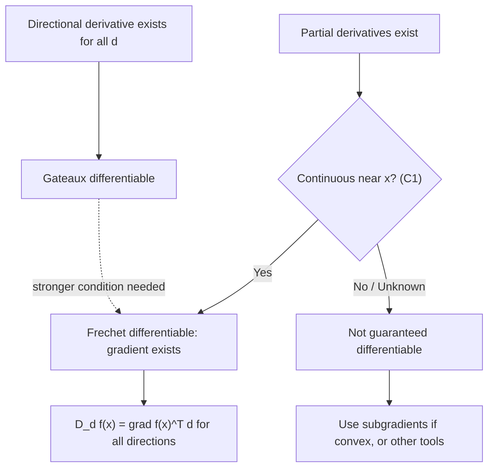

## Differentiability and Directional Derivatives

### Partial Derivatives

For $f: \mathbb{R}^n \to \mathbb{R}$, the partial derivative with respect to $x_i$ at a point $x$ measures the rate of change of $f$ holding all other coordinates fixed:

$$\frac{\partial f}{\partial x_i}(x) = \lim_{h \to 0} \frac{f(x + h e_i) - f(x)}{h}$$

where $e_i$ is the $i$-th standard basis vector. Existence of all partial derivatives at a point is necessary but **not sufficient** for full differentiability — a function can have well-defined partial derivatives along every coordinate axis while still failing to be differentiable, or even discontinuous, at that point. This gap is a common source of subtlety in optimization when gradient-based conditions are applied without verifying the underlying differentiability assumptions hold.

### Directional Derivatives

The directional derivative of $f$ at $x$ in direction $d$ (not necessarily a unit vector) generalizes the partial derivative to an arbitrary direction:

$$D_d f(x) = \lim_{t \to 0^+} \frac{f(x + td) - f(x)}{t}$$

Partial derivatives are the special case $d = e_i$. Unlike partial derivatives, directional derivatives can exist in every direction $d$ without $f$ being differentiable — a condition known as Gateaux differentiability, which is strictly weaker than full (Fréchet) differentiability.

### Fréchet Differentiability

$f: \mathbb{R}^n \to \mathbb{R}$ is (Fréchet) differentiable at $x$ if there exists a vector $\nabla f(x)$ such that:

$$\lim_{h \to 0} \frac{|f(x+h) - f(x) - \nabla f(x)^T h|}{\|h\|} = 0$$

This is the strong notion of differentiability: it requires the linear approximation $f(x) + \nabla f(x)^T h$ to approximate $f(x+h)$ well, uniformly over *all* directions $h$ simultaneously as $h \to 0$, not just along individual rays. When this condition holds, the gradient exists and:

$$D_d f(x) = \nabla f(x)^T d \quad \text{for every direction } d$$

meaning every directional derivative is recoverable as a simple inner product with the gradient — a convenience that fails when only Gateaux differentiability holds.

**Sufficient Condition in Practice**

A standard, practically verifiable sufficient condition: if all partial derivatives of $f$ exist and are continuous in a neighborhood of $x$ (i.e., $f \in C^1$), then $f$ is Fréchet differentiable at $x$. This is the condition implicitly assumed in essentially all standard first-order optimization method derivations, since continuity of the gradient is exactly what most convergence proofs require.

### Why the Distinction Matters for Optimization

**Non-Differentiable but Directionally Differentiable Functions**

Many important optimization objectives are continuous, have well-defined directional derivatives everywhere, but are not differentiable at certain points — most notably functions built from $\|\cdot\|_1$, $\max(\cdot)$, or $|\cdot|$, which are common in regularized and robust optimization (LASSO, support vector machines, minimax formulations). At non-differentiable points:

- The gradient $\nabla f(x)$ does not exist, so gradient descent's update rule breaks down as stated.
- Subgradient methods generalize the theory by replacing $\nabla f(x)$ with any vector $g$ satisfying $f(y) \geq f(x) + g^T(y-x)$ for all $y$ — a condition that reduces to the ordinary gradient when $f$ is differentiable, but remains well-defined at kinks (e.g., $x=0$ for $f(x) = |x|$, where any $g \in [-1, 1]$ is a valid subgradient).

**First-Order Optimality Condition, Directional Form**

The stationarity condition $\nabla f(x^*) = 0$ can be restated purely in terms of directional derivatives, which is useful because it generalizes to constrained and non-smooth settings where the gradient may not exist:

$$x^* \text{ is a local minimum} \implies D_d f(x^*) \geq 0 \quad \text{for every feasible direction } d$$

For unconstrained problems where every direction is feasible, this forces $D_d f(x^*) \geq 0$ for both $d$ and $-d$, which together imply $D_d f(x^*) = 0$ for all $d$ — recovering $\nabla f(x^*) = 0$ when $f$ is differentiable. For constrained problems, this directional form is the direct precursor to the KKT stationarity condition, where "feasible direction" is restricted to those directions that keep $x^* + td$ inside the constraint set for small $t > 0$.

### Continuous Differentiability ($C^1$) and Its Role

A function is $C^1$ on an open set if $\nabla f$ exists and is continuous there. $C^1$ regularity is the baseline smoothness assumption for:

- Gradient descent convergence analysis (combined with Lipschitz continuity of $\nabla f$ for quantitative rates, as covered previously).
- Validity of the first-order necessary optimality condition as a genuinely useful, checkable criterion (without continuity of $\nabla f$, gradients can behave erratically near $x^*$, undermining local search logic).

Higher smoothness classes extend this hierarchy: $C^2$ (continuous Hessian) is the standard assumption for Newton-type methods and second-order optimality conditions; $C^k$ for general $k$ appears in specialized higher-order optimization methods, though these are rarely used in mainstream practice given their computational cost. [Inference — the rarity of methods beyond second order in mainstream practice is a general practical observation, not a formally quantified claim]

### Illustration: Differentiability Hierarchy

### Illustration: A Function With a Kink — Directional Derivatives Without a Gradient (svg_diagram)

<svg xmlns="http://www.w3.org/2000/svg" viewBox="0 0 480 260">
  <text x="240" y="22" text-anchor="middle" font-size="16" font-weight="bold" fill="#111">f(x) = |x| at the Kink (svg_diagram)</text>

  <line x1="40" y1="220" x2="440" y2="220" stroke="#ccc" />
  <line x1="240" y1="220" x2="240" y2="40" stroke="#ccc" />

  <line x1="60" y1="60" x2="240" y2="220" stroke="#2980b9" stroke-width="2.5" />
  <line x1="240" y1="220" x2="420" y2="60" stroke="#2980b9" stroke-width="2.5" />

  <circle cx="240" cy="220" r="4" fill="#c0392b" />
  <text x="248" y="235" font-size="12" fill="#c0392b">x = 0 (non-differentiable point)</text>

  <text x="150" y="120" font-size="11" fill="#2980b9">D_d f = -1 (d pointing left)</text>
  <text x="270" y="120" font-size="11" fill="#2980b9">D_d f = +1 (d pointing right)</text>
</svg>

### Related Topics

- **Gradients, Jacobians, and Hessians**: the objects that exist once Fréchet differentiability holds
- **Subgradients and subdifferentials**: generalization for non-smooth convex functions
- **KKT conditions**: directional-derivative-based optimality for constrained problems
- **Convex analysis**: the framework in which subgradients are most cleanly developed
- **Lipschitz continuity and smoothness classes ($C^1$, $C^2$)**: regularity assumptions underlying convergence guarantees