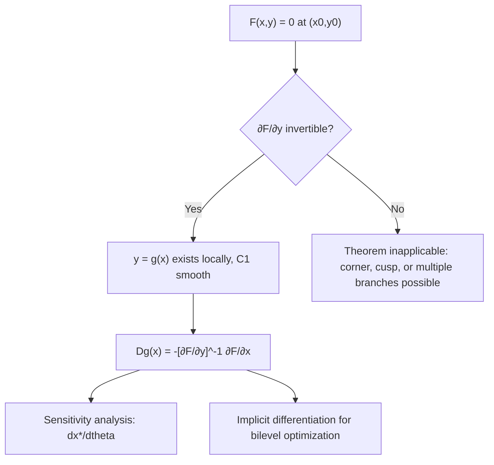

## Implicit Function Theorem

### Motivation

Many optimization problems involve constraint sets defined implicitly by equations $h(x, y) = 0$ that cannot be solved explicitly for one variable in terms of the others. The Implicit Function Theorem (IFT) provides conditions under which such an equation *locally* defines one set of variables as a differentiable function of the rest, even without an explicit closed-form solution — and, critically, provides a formula for the derivative of that implicit function without ever solving for it explicitly.

### Statement of the Theorem

Let $F: \mathbb{R}^n \times \mathbb{R}^m \to \mathbb{R}^m$ be continuously differentiable ($C^1$), and consider the equation:

$$F(x, y) = 0, \quad x \in \mathbb{R}^n, \, y \in \mathbb{R}^m$$

Suppose at a point $(x_0, y_0)$ satisfying $F(x_0, y_0) = 0$, the Jacobian of $F$ with respect to $y$ alone is invertible:

$$\det \left( \frac{\partial F}{\partial y}(x_0, y_0) \right) \neq 0$$

Then there exists a neighborhood $U$ of $x_0$ and a unique continuously differentiable function $g: U \to \mathbb{R}^m$ such that:

$$g(x_0) = y_0 \quad \text{and} \quad F(x, g(x)) = 0 \quad \forall x \in U$$

That is, near $(x_0, y_0)$, the equation $F(x,y)=0$ can be locally "solved" for $y$ as a function of $x$, and this function is guaranteed differentiable.

### The Derivative Formula

Differentiating $F(x, g(x)) = 0$ with respect to $x$ using the chain rule gives:

$$\frac{\partial F}{\partial x}(x, g(x)) + \frac{\partial F}{\partial y}(x, g(x)) \, Dg(x) = 0$$

Solving for the Jacobian of the implicit function:

$$Dg(x) = -\left[ \frac{\partial F}{\partial y}(x, g(x)) \right]^{-1} \frac{\partial F}{\partial x}(x, g(x))$$

This formula is the practical payoff of the theorem: it computes $Dg(x)$ using only the partial derivatives of $F$ at a *known* point, without ever needing an explicit formula for $g$ itself.

### Role in Constrained Optimization

**Local Parameterization of Constraint Surfaces**

For an equality-constrained problem $\min f(x)$ subject to $h(x) = 0$ with $h: \mathbb{R}^n \to \mathbb{R}^p$, if the constraint Jacobian $\nabla h(x^*)$ has full row rank $p$ at a point $x^*$ (the LICQ condition introduced earlier), the IFT guarantees that a subset of $p$ variables can be locally expressed as smooth functions of the remaining $n - p$ variables. This justifies treating the constraint surface as a smooth $(n-p)$-dimensional manifold near $x^*$, which is the geometric picture underlying Lagrange multiplier theory: the gradient $\nabla f(x^*)$ must be orthogonal to this manifold's tangent space at an optimum, expressed algebraically as $\nabla f(x^*) = \sum_j \lambda_j \nabla h_j(x^*)$.

**Sensitivity Analysis**

A central application in optimization: if $x^*(\theta)$ denotes the solution to a problem parameterized by $\theta$ (e.g., a right-hand-side constant in a constraint, or a regularization weight), the IFT applied to the first-order optimality condition $\nabla_x L(x^*(\theta), \theta) = 0$ (where $L$ is the Lagrangian or the objective itself) gives:

$$\frac{\partial x^*}{\partial \theta} = -\left[ \nabla^2_{xx} L \right]^{-1} \nabla^2_{x\theta} L$$

provided $\nabla^2_{xx} L$ is invertible at the solution. This is exactly how sensitivity of an optimal solution to problem data is computed — for example, quantifying how much the optimal portfolio weights shift as a risk-aversion parameter changes, without re-solving the entire optimization problem from scratch for each perturbed $\theta$.

**Implicit Differentiation in Bilevel and Hyperparameter Optimization**

In bilevel optimization problems of the form:

$$\min_\theta \, F(\theta, x^*(\theta)) \quad \text{subject to} \quad x^*(\theta) = \arg\min_x f(x, \theta)$$

the IFT is the standard tool for computing $\partial x^* / \partial \theta$ needed to differentiate through the inner optimization problem, applied to the inner problem's stationarity condition $\nabla_x f(x^*(\theta), \theta) = 0$. This technique underlies gradient-based hyperparameter optimization and certain meta-learning formulations, where the "implicit function" is the solution map of an entire optimization subproblem rather than a simple algebraic equation. [Inference — this is a well-established modern application area; specific algorithmic variants differ in how the resulting linear system involving $\nabla^2_{xx} f$ is solved approximately in large-scale settings]

### Connection to the Inverse Function Theorem

The Inverse Function Theorem is a special case of the IFT: setting $F(x, y) = y - f(x)$ for $f: \mathbb{R}^n \to \mathbb{R}^n$ and requiring $\partial F/\partial y = I$ (trivially invertible) reduces the IFT's invertibility condition to invertibility of $Df(x_0)$, recovering the statement that $f$ is locally invertible near $x_0$ with $D(f^{-1})(y_0) = [Df(x_0)]^{-1}$. This connection reinforces why the IFT's key hypothesis is stated as a Jacobian non-singularity condition — it is fundamentally the same nonsingularity requirement that makes local inversion possible.

### Regularity Condition Failure

When $\partial F/\partial y$ is singular at $(x_0, y_0)$, the IFT's conclusion may fail: the solution set may have a corner, a cusp, multiple branches meeting at the point, or otherwise fail to be locally describable as a single smooth function. In constrained optimization, this is precisely the scenario LICQ is designed to rule out — a point where the constraint Jacobian loses full rank is a point where the feasible set may fail to have a well-defined tangent space, and standard KKT-based analysis becomes unreliable without alternative constraint qualifications (e.g., Mangasarian-Fromovitz).

### Illustration: Implicit Curve and Local Function Branch (svg_diagram)

<svg xmlns="http://www.w3.org/2000/svg" viewBox="0 0 480 280">
  <text x="240" y="22" text-anchor="middle" font-size="16" font-weight="bold" fill="#111">F(x,y) = 0 Locally as y = g(x) (svg_diagram)</text>

  <line x1="40" y1="240" x2="440" y2="240" stroke="#ccc" />
  <line x1="40" y1="240" x2="40" y2="40" stroke="#ccc" />

  <circle cx="240" cy="140" r="100" fill="none" stroke="#2980b9" stroke-width="2.2" />

  <circle cx="240" cy="40" r="4" fill="#c0392b" />
  <text x="248" y="38" font-size="11" fill="#c0392b">(x0, y0)</text>

  <line x1="180" y1="30" x2="300" y2="30" stroke="#27ae60" stroke-width="2" stroke-dasharray="4,3" />
  <text x="305" y="33" font-size="11" fill="#27ae60">local branch y = g(x)</text>

  <circle cx="240" cy="240" r="4" fill="#f39c12" />
  <text x="200" y="258" font-size="11" fill="#f39c12">∂F/∂y = 0 here: theorem fails</text>
</svg>

### Illustration: From Implicit Equation to Sensitivity Formula

### Related Topics

- **KKT conditions and Lagrange multipliers**: geometric foundation built on implicit local parameterization
- **Constraint qualifications (LICQ, MFCQ)**: conditions ensuring the IFT's hypotheses hold
- **Sensitivity analysis in optimization**: parametric derivative formulas via the IFT
- **Bilevel optimization and hyperparameter optimization**: implicit differentiation through inner solution maps
- **Inverse Function Theorem**: the special case underlying local invertibility arguments