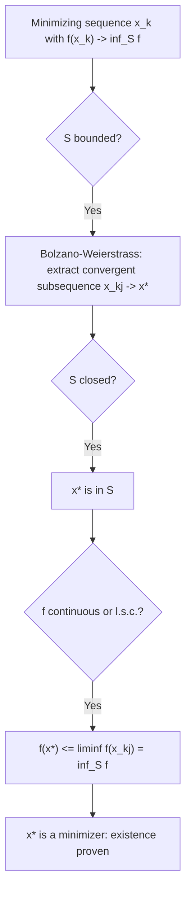

## Basic Real Analysis for Optimization Proofs

### Suprema, Infima, and the Completeness Axiom

For a set $S \subseteq \mathbb{R}$ bounded above, the supremum $\sup S$ is the least upper bound: the smallest value $u$ such that $s \leq u$ for all $s \in S$. Symmetrically, $\inf S$ is the greatest lower bound. The completeness axiom of $\mathbb{R}$ guarantees that every nonempty set bounded above has a supremum in $\mathbb{R}$ (and every set bounded below has an infimum).

This axiom is the quiet foundation beneath nearly every optimization existence argument: it guarantees the quantity $\inf_{x \in S} f(x)$ is a well-defined real number (or $-\infty$) even before any argument establishes that the infimum is actually *attained* by some point in $S$. The distinction between "infimum exists" and "minimum is attained" is exactly the gap that compactness, coercivity, or lower semicontinuity arguments are built to close.

**Infimum vs. Minimum**

$$\inf_{x \in S} f(x) \quad \text{always exists (in } \mathbb{R} \cup \{-\infty\}\text{) if } f \text{ is bounded below on } S$$

$$\min_{x \in S} f(x) \quad \text{exists only if some } x^* \in S \text{ achieves } f(x^*) = \inf_{x \in S} f(x)$$

Optimization problem statements should, strictly, be phrased with $\inf$ until existence of a minimizer has actually been established; writing $\min$ implicitly asserts attainment.

### Sequences and Subsequences

A subsequence $\{x_{k_j}\}$ of $\{x_k\}$ is formed by selecting an infinite, strictly increasing set of indices $k_1 < k_2 < \dots$. A key fact used throughout convergence analysis: if $x_k \to x^*$, then every subsequence also converges to $x^*$. The converse localizes a powerful proof technique — showing that *every* subsequence has a further sub-subsequence converging to the same limit $x^*$ is sufficient to conclude $x_k \to x^*$ for the full sequence, which is often easier than a direct argument.

**Bolzano-Weierstrass Theorem**

Every bounded sequence in $\mathbb{R}^n$ has a convergent subsequence. This theorem is the workhorse behind most existence-of-minimizer proofs that do not assume compactness outright: given a minimizing sequence $\{x_k\}$ (one satisfying $f(x_k) \to \inf_S f$) that is known to be bounded, Bolzano-Weierstrass extracts a convergent subsequence $x_{k_j} \to x^*$, and continuity of $f$ (plus closedness of $S$, so $x^* \in S$) then confirms $f(x^*) = \inf_S f$, establishing that the infimum is attained.

### Liminf and Limsup

For a sequence $\{a_k\}$ of real numbers, the limit inferior and limit superior are defined as:

$$\liminf_{k \to \infty} a_k = \lim_{k \to \infty} \left( \inf_{j \geq k} a_j \right), \qquad \limsup_{k \to \infty} a_k = \lim_{k \to \infty} \left( \sup_{j \geq k} a_j \right)$$

Both always exist in the extended reals $[-\infty, \infty]$, even when $\lim_{k\to\infty} a_k$ itself does not — making liminf/limsup indispensable in convergence proofs where monotonic decrease of the true limit cannot yet be assumed. A sequence converges if and only if $\liminf a_k = \limsup a_k$, in which case both equal $\lim a_k$.

**Use in Descent-Method Proofs**

A common proof pattern in optimization: showing that $\{f(x_k)\}$ is a monotonically non-increasing sequence bounded below (as guaranteed by a descent condition like the Armijo rule) is sufficient, via the monotone convergence theorem, to conclude $f(x_k) \to f^*$ for some limit $f^*$ — without yet knowing whether $x_k$ itself converges or whether $f^* = \inf f$.

### Monotone Convergence Theorem

A monotonically non-increasing (or non-decreasing) sequence of real numbers that is bounded below (respectively, above) converges. This is a direct consequence of the completeness axiom, and it is the standard tool for establishing objective-value convergence in descent methods: constructing the sequence $\{f(x_k)\}$ as non-increasing and bounded below by $\inf_S f$ is often the very first, easiest step of a convergence proof, well before establishing anything about the iterates $\{x_k\}$ themselves.

### Continuity and Compactness Interplay (Proof Technique Summary)

The standard three-step existence argument in optimization theory, built entirely from the results above:

1. Construct a minimizing sequence $\{x_k\} \subset S$ with $f(x_k) \to \inf_S f$ (this always exists by the definition of infimum).
2. If $S$ is bounded, apply Bolzano-Weierstrass to extract a convergent subsequence $x_{k_j} \to x^*$.
3. If $S$ is closed, $x^* \in S$; if $f$ is continuous (or merely lower semicontinuous), $f(x^*) \leq \liminf_j f(x_{k_j}) = \inf_S f$, and since also $f(x^*) \geq \inf_S f$ by definition, equality holds — so $x^*$ is a minimizer.

This argument is exactly the proof of the Weierstrass Extreme Value Theorem decomposed into its real-analysis building blocks, and the same three-step skeleton (minimizing sequence → subsequential convergence → limit-point verification) recurs across existence proofs throughout convex and non-convex optimization theory.

### Contraction Mappings and Fixed-Point Convergence

A map $T: \mathbb{R}^n \to \mathbb{R}^n$ is a contraction if there exists $\rho \in [0, 1)$ such that:

$$\|T(x) - T(y)\| \leq \rho \|x - y\| \quad \forall x, y$$

The Banach Fixed-Point Theorem guarantees that a contraction on a complete space has a unique fixed point $x^* = T(x^*)$, and that the iteration $x_{k+1} = T(x_k)$ converges to it linearly from any starting point, with rate $\rho$. This is a direct application of the completeness of $\mathbb{R}^n$ (every Cauchy sequence converges) combined with the contraction property (which is used to show $\{x_k\}$ is Cauchy in the first place). Many fixed-point-style iterative optimization schemes — including certain gradient descent formulations viewed as $x_{k+1} = x_k - \alpha \nabla f(x_k) = T(x_k)$ — can be analyzed by verifying $T$ is a contraction, directly yielding both existence, uniqueness, and a linear convergence rate in one theorem.

[Inference — the specific claim that gradient descent can be cast as a contraction mapping requires $T(x) = x - \alpha \nabla f(x)$ to itself satisfy the Lipschitz contraction bound, which holds under strong convexity and appropriate step-size selection; this is a standard but conditional application, not universal to all gradient descent settings]

### Illustration: The Three-Step Existence Proof Skeleton

### Illustration: Liminf/Limsup Bracketing a Non-Convergent Sequence (svg_diagram)

<svg xmlns="http://www.w3.org/2000/svg" viewBox="0 0 520 250">
  <text x="260" y="22" text-anchor="middle" font-size="16" font-weight="bold" fill="#111">liminf and limsup of an Oscillating Sequence (svg_diagram)</text>

  <line x1="50" y1="210" x2="470" y2="210" stroke="#333" />
  <line x1="50" y1="210" x2="50" y2="40" stroke="#333" />

  <line x1="50" y1="80" x2="470" y2="80" stroke="#c0392b" stroke-width="1.5" stroke-dasharray="5,3" />
  <text x="475" y="83" font-size="11" fill="#c0392b">limsup</text>

  <line x1="50" y1="170" x2="470" y2="170" stroke="#2980b9" stroke-width="1.5" stroke-dasharray="5,3" />
  <text x="475" y="173" font-size="11" fill="#2980b9">liminf</text>

  <polyline points="70,90 110,160 150,95 190,155 230,100 270,150 310,105 350,145 390,110 430,140" fill="none" stroke="#333" stroke-width="1.8" />
  <circle cx="70" cy="90" r="2.5" fill="#111" />
  <circle cx="110" cy="160" r="2.5" fill="#111" />
  <circle cx="150" cy="95" r="2.5" fill="#111" />
  <circle cx="190" cy="155" r="2.5" fill="#111" />
  <circle cx="230" cy="100" r="2.5" fill="#111" />
  <circle cx="270" cy="150" r="2.5" fill="#111" />
  <circle cx="310" cy="105" r="2.5" fill="#111" />
  <circle cx="350" cy="145" r="2.5" fill="#111" />
  <circle cx="390" cy="110" r="2.5" fill="#111" />
  <circle cx="430" cy="140" r="2.5" fill="#111" />
</svg>

### Related Topics

- **Topology basics (open, closed, compact, bounded sets)**: structural prerequisites for the existence-proof skeleton
- **Sequences, limits, and continuity in normed spaces**: convergence definitions this topic builds proofs upon
- **Weierstrass Extreme Value Theorem**: the flagship theorem assembled from these real-analysis tools
- **Convergence rate analysis of descent methods**: monotone convergence applied to $\{f(x_k)\}$
- **Fixed-point iteration methods**: contraction mapping theory applied to iterative optimization schemes