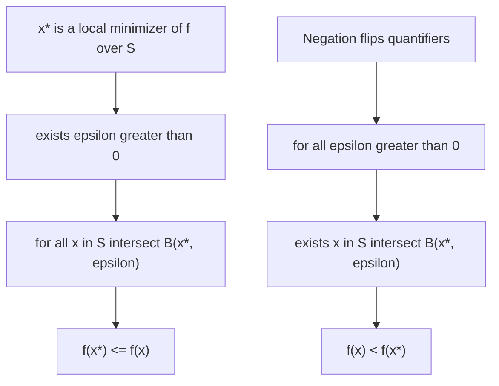

## Set Notation and Mathematical Logic for Optimization Statements

### Basic Set Notation

Standard set-theoretic notation underlies every formal optimization statement:

$$x \in S \quad \text{(membership)}, \qquad S \subseteq T \quad \text{(subset)}, \qquad S \cup T, \, S \cap T \quad \text{(union, intersection)}$$

$$S \setminus T = \{x \in S : x \notin T\} \quad \text{(set difference)}, \qquad S^c = \mathbb{R}^n \setminus S \quad \text{(complement)}$$

Set-builder notation $\{x \in \mathbb{R}^n : P(x)\}$ — read "the set of all $x$ in $\mathbb{R}^n$ such that predicate $P(x)$ holds" — is the standard way optimization problems define feasible regions:

$$\Omega = \{x \in \mathbb{R}^n : g_i(x) \leq 0, \, i=1,\dots,m, \; h_j(x) = 0, \, j=1,\dots,p\}$$

This single expression is the formal definition underlying nearly every constrained optimization problem statement encountered in the field.

### Quantifiers

**Universal Quantifier ($\forall$)**

"$\forall x \in S, \, P(x)$" means $P(x)$ holds for every element of $S$. Universal quantification appears in the definition of a global minimizer:

$$x^* \text{ is a global minimizer of } f \text{ over } S \iff f(x^*) \leq f(x) \quad \forall x \in S$$

**Existential Quantifier ($\exists$)**

"$\exists x \in S \text{ such that } P(x)$" asserts at least one element satisfying $P$ exists. Existential quantification appears, for instance, in the definition of a local minimizer:

$$x^* \text{ is a local minimizer} \iff \exists \epsilon > 0 \text{ such that } f(x^*) \leq f(x) \quad \forall x \in S \cap B(x^*, \epsilon)$$

Note the nested structure: existential quantification over the neighborhood radius $\epsilon$, followed by universal quantification over all points within that neighborhood. Misreading the order or scope of nested quantifiers is one of the most common sources of error when parsing formal optimization definitions.

**Quantifier Order Matters**

$$\forall \epsilon > 0 \, \exists \delta > 0 \, (\dots) \quad \neq \quad \exists \delta > 0 \, \forall \epsilon > 0 \, (\dots)$$

The continuity definition from the previous topic, "$\forall \epsilon > 0, \exists \delta > 0$ such that $\|y-x\|<\delta \implies \|f(y)-f(x)\|<\epsilon$," critically requires $\delta$ to be chosen *after* and *depending on* $\epsilon$ — reversing the order produces a strictly stronger (and generally false) statement. This exact quantifier-order subtlety is also what separates ordinary continuity from uniform continuity, where $\delta$ is required to work for all $x$ simultaneously.

**Negating Quantified Statements**

$$\neg \left( \forall x \in S, \, P(x) \right) \iff \exists x \in S \text{ such that } \neg P(x)$$

$$\neg \left( \exists x \in S \text{ such that } P(x) \right) \iff \forall x \in S, \, \neg P(x)$$

Negation swaps quantifier type and negates the inner predicate. This rule is used constantly to construct counterexample-style optimization arguments — for example, proving $x^*$ is *not* a local minimizer by directly negating the local-minimizer definition: showing that for every $\epsilon > 0$, there exists some point within $B(x^*,\epsilon) \cap S$ where $f$ takes a strictly smaller value.

### Logical Connectives in Optimality Conditions

**Implication and Biconditional**

$$P \implies Q \quad \text{(if } P \text{ then } Q\text{)}, \qquad P \iff Q \quad \text{(} P \text{ if and only if } Q\text{)}$$

Precision about implication direction is essential in optimization theory, where necessary and sufficient conditions are routinely distinct:

$$x^* \text{ local min (interior, differentiable)} \implies \nabla f(x^*) = 0 \quad \text{(necessary, not sufficient)}$$

$$\nabla f(x^*) = 0 \text{ and } \nabla^2 f(x^*) \succ 0 \implies x^* \text{ strict local min} \quad \text{(sufficient, not necessary)}$$

Conflating a necessary condition with a sufficient one is a common and consequential error: $\nabla f(x^*)=0$ alone does not certify optimality (it is satisfied by saddle points too), while requiring strict positive definiteness excludes legitimate minima with a flat direction (where the Hessian is merely PSD).

**Contrapositive**

$$P \implies Q \quad \text{is logically equivalent to} \quad \neg Q \implies \neg P$$

The contrapositive is frequently the more natural direction to prove. For instance, instead of directly showing "$x^*$ local min $\implies \nabla f(x^*)=0$," many textbook proofs establish the contrapositive: "if $\nabla f(x^*) \neq 0$, then $x^*$ is not a local min" — constructed explicitly by exhibiting a descent direction $d = -\nabla f(x^*)$ along which $f$ strictly decreases, directly contradicting local optimality.

### The Formal Structure of an Optimization Problem Statement

Combining the notation above, a general constrained optimization problem is formally:

$$\min_{x \in \mathbb{R}^n} f(x) \quad \text{subject to} \quad g_i(x) \leq 0 \; (i=1,\dots,m), \quad h_j(x) = 0 \; (j=1,\dots,p)$$

which unpacks, using the tools of this topic, into the request: find $x^* \in \Omega = \{x : g_i(x)\leq 0 \,\forall i, \, h_j(x)=0\, \forall j\}$ such that $\forall x \in \Omega, \, f(x^*) \leq f(x)$ — or, if such a point provably cannot be shown to exist, report $\inf_{x \in \Omega} f(x)$ instead (recalling the infimum/minimum distinction from the previous topic).

### Proof Techniques Common in Optimization Theory

**Proof by Contradiction**

Assume the negation of the desired conclusion, derive a logical inconsistency. This is the standard technique for proving first-order necessary conditions: assume $x^*$ is a local minimizer but $\nabla f(x^*) \neq 0$, then construct a direction along which $f$ strictly decreases arbitrarily close to $x^*$ — contradicting the local-minimality assumption.

**Proof by Induction**

Used less frequently in continuous optimization than in discrete/combinatorial optimization, but it appears in convergence proofs structured around iteration count $k$ — for instance, inductively bounding $\|x_{k+1} - x^*\| \leq \rho \|x_k - x^*\|$ implies by induction that $\|x_k - x^*\| \leq \rho^k \|x_0 - x^*\|$, directly yielding a linear convergence rate bound.

**Direct Construction**

Many existence-type results (e.g., constructing a KKT multiplier vector, or exhibiting a specific feasible descent direction) proceed by direct, explicit construction rather than contradiction — building the required object and verifying it satisfies the needed properties.

### Common Notational Conventions Reference

| Symbol | Meaning |
|---|---|
| $\arg\min_{x \in S} f(x)$ | the set (or a specific element) of minimizers of $f$ over $S$ |
| $f: S \to \mathbb{R}$ | $f$ is a function mapping elements of $S$ to real numbers |
| $\text{dom}(f)$ | the domain over which $f$ is defined (finite-valued) |
| $\mathbb{R}^n_+$ | the non-negative orthant $\{x \in \mathbb{R}^n : x_i \geq 0 \, \forall i\}$ |
| $\text{s.t.}$ | shorthand for "subject to" |

### Illustration: Nested Quantifier Structure of the Local Minimum Definition

### Illustration: Necessary vs Sufficient Condition Logic (svg_diagram)

<svg xmlns="http://www.w3.org/2000/svg" viewBox="0 0 520 220">
  <text x="260" y="22" text-anchor="middle" font-size="16" font-weight="bold" fill="#111">Necessary vs Sufficient Conditions (svg_diagram)</text>

  <ellipse cx="180" cy="130" rx="130" ry="70" fill="#eaf4fb" stroke="#2980b9" stroke-width="2" />
  <text x="180" y="80" text-anchor="middle" font-size="12" fill="#2980b9">∇f(x*) = 0</text>
  <text x="180" y="96" text-anchor="middle" font-size="10" fill="#555">(stationary points)</text>

  <ellipse cx="180" cy="150" rx="60" ry="35" fill="#eafbea" stroke="#27ae60" stroke-width="2" />
  <text x="180" y="150" text-anchor="middle" font-size="11" fill="#27ae60">local minima</text>

  <text x="180" y="200" text-anchor="middle" font-size="11" fill="#333">Stationary is necessary but not sufficient: saddle points also lie in outer set</text>
</svg>

### Related Topics

- **Convex sets and convex functions**: logical structure of convexity definitions
- **KKT conditions and constraint qualifications**: formal quantified statements of constrained optimality
- **Proof techniques in convergence analysis**: induction and contradiction applied to iterative algorithms
- **First- and second-order optimality conditions**: necessary vs. sufficient condition distinctions
- **Duality theory**: quantifier structure of weak and strong duality statements