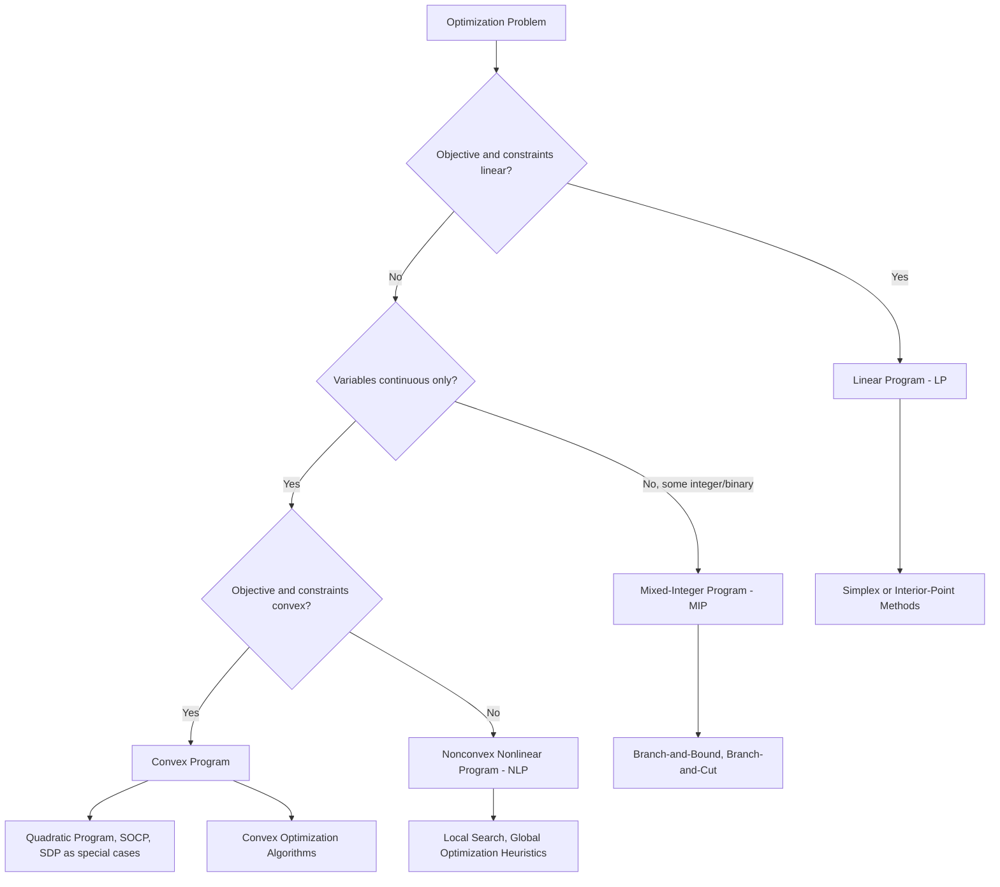

## Decision Variables, Objective Functions, and Constraints

### Overview of the Optimization Problem Structure

Every optimization problem, regardless of domain, decomposes into three fundamental components: the **decision variables** (the unknowns we control), the **objective function** (the quantity we seek to maximize or minimize), and the **constraints** (restrictions the decision variables must satisfy). Formally, a general optimization problem is written:

$$\min_{x \in \mathbb{R}^n} \ f(x) \quad \text{subject to} \quad g_i(x) \leq 0,\ i = 1,\dots,m, \qquad h_j(x) = 0,\ j = 1,\dots,p$$

Understanding how these three pieces interact — and how to correctly formulate them from a real-world problem description — is the essential first skill in optimization, prior to any discussion of algorithms.

### Decision Variables

Decision variables (also called design variables, control variables, or optimization variables) are the quantities the decision-maker can choose or adjust. They are collected into a vector $x = (x_1, x_2, \dots, x_n) \in \mathbb{R}^n$, where $n$ is the **dimensionality** of the problem.

**Key Points**

- Decision variables must be chosen so that once their values are fixed, the objective and all constraints can be evaluated unambiguously — there should be no remaining ambiguity in the problem state.
- Variables may be **continuous** (real-valued, e.g., a production quantity), **discrete/integer** (e.g., number of units, on/off decisions), or **mixed** (some continuous, some integer) — this classification determines which algorithm families apply (e.g., interior-point methods versus branch-and-bound).
- **Binary variables** ($x_i \in \{0, 1\}$) are a special discrete case used to encode yes/no decisions, such as whether to open a facility or include an item in a selection.
- The choice of variables is not unique for a given real-world problem — different formulations (e.g., using flow on edges versus flow on paths in a network) can lead to the same solution but drastically different computational tractability. Formulation quality is itself a design skill.
- The **dimension** $n$ directly affects computational cost for most algorithm classes; problems are often categorized as small-scale, medium-scale, or large-scale based on $n$.

**Example**A factory decides how many units of two products to manufacture. The decision variables are $x_1$ = units of product A, $x_2$ = units of product B. Here $n = 2$, and both variables are naturally continuous (or integer, if fractional units are not physically meaningful).

### Objective Functions

The **objective function** $f: \mathbb{R}^n \to \mathbb{R}$ maps a choice of decision variables to a single scalar value representing cost, profit, error, risk, or another quantity of interest. Optimization seeks

$$x^* = \arg\min_{x \in \mathcal{F}} f(x) \quad \text{or equivalently} \quad x^* = \arg\max_{x \in \mathcal{F}} \big(-f(x)\big)$$

where $\mathcal{F}$ denotes the feasible set defined by the constraints. Any maximization problem can be converted to a minimization problem (and vice versa) by negating the objective, so most theory is developed for the minimization case without loss of generality.

**Key Points**

- The **optimal value** $f(x^*)$ is the minimum (or maximum) achieved; the **optimal solution** $x^*$ is the point (or set of points) at which it is achieved. These are distinct concepts — an optimal value can be unique even when multiple optimal solutions exist.
- **Objective function properties** determine solvability:
  - *Linearity*: $f(x) = c^T x$, leading to linear programming.
  - *Convexity*: guarantees any local minimum is global — a property of central importance covered in later modules.
  - *Smoothness/differentiability*: determines whether gradient-based methods apply.
  - *Separability*: $f(x) = \sum_i f_i(x_i)$, which can be exploited computationally.
- **Multi-objective problems** involve several objectives $f_1(x), \dots, f_k(x)$ that may conflict (e.g., minimizing cost while maximizing quality). These require concepts like Pareto optimality rather than a single optimal solution, and are typically treated as a distinct subfield.
- The objective is sometimes called the **cost function**, **loss function** (common in machine learning), **fitness function** (common in evolutionary computation), or **utility function** (common in economics) depending on the application domain — the underlying mathematical role is identical.

**Example**Minimizing manufacturing cost: $f(x_1, x_2) = 5x_1 + 8x_2$, where $5$ and $8$ are per-unit production costs for products A and B respectively.

### Constraints

**Constraints** restrict the set of admissible decision variable values to those that are physically, logically, or practically realizable. They are typically expressed as:

- **Equality constraints**: $h_j(x) = 0$, e.g., a mass balance or budget that must be exactly met.
- **Inequality constraints**: $g_i(x) \leq 0$ (or $\geq 0$), e.g., a resource limit or minimum quality requirement.
- **Bound constraints** (a special case of inequality constraints): $\ell_i \leq x_i \leq u_i$, restricting individual variables to a range — often handled with specialized, more efficient algorithmic techniques than general inequality constraints.

The **feasible region** (or feasible set) $\mathcal{F}$ is the set of all $x$ satisfying every constraint simultaneously:

$$\mathcal{F} = \{x \in \mathbb{R}^n : g_i(x) \leq 0 \ \forall i, \ h_j(x) = 0 \ \forall j\}$$

A point $x \in \mathcal{F}$ is called a **feasible point** or **feasible solution**; the optimization problem is to find the feasible point that minimizes (or maximizes) $f$.

**Key Points**

- If $\mathcal{F} = \emptyset$ (no point satisfies all constraints), the problem is **infeasible**, and no solution exists regardless of the objective.
- If $f$ is unbounded below on $\mathcal{F}$ (for a minimization problem), the problem is **unbounded**, and no finite optimal value exists.
- Constraints qualify as **active** (or **binding**) at $x$ if $g_i(x) = 0$ exactly; **inactive** if $g_i(x) < 0$ with strict inequality. Active constraints play a central role in optimality conditions (covered under Karush–Kuhn–Tucker theory).
- **Linear constraints** ($g_i, h_j$ affine in $x$) define a **polyhedron** (or polytope, if bounded) as the feasible region — this geometric structure is exploited heavily in linear programming.
- **Nonlinear constraints** can produce feasible regions with arbitrarily complex, even disconnected or non-convex, geometry, substantially complicating both existence theory and algorithm design.
- Constraints originate from physical laws (conservation, capacity limits), resource limitations (budget, time, materials), logical requirements (mutual exclusivity, precedence), and regulatory or safety requirements.

**Example**

Continuing the factory example: production is limited by 40 hours of machine time per week, where product A requires 2 hours/unit and product B requires 4 hours/unit. Additionally, at least 5 units of product A must be produced to satisfy a contract, and production quantities cannot be negative.

$$2x_1 + 4x_2 \leq 40 \quad (\text{machine time}), \qquad x_1 \geq 5 \quad (\text{contract}), \qquad x_1, x_2 \geq 0 \quad (\text{non-negativity})$$

### Complete Problem Formulation

Assembling the running example into a full optimization problem:

$$\min_{x_1, x_2} \ 5x_1 + 8x_2$$

$$\text{subject to} \quad 2x_1 + 4x_2 \leq 40, \qquad x_1 \geq 5, \qquad x_1, x_2 \geq 0$$

This is a **linear program (LP)**: a linear objective subject to linear constraints — the simplest and most well-understood optimization problem class, covered in depth in later modules on linear programming.

### Standard and Canonical Forms

To enable systematic algorithm design, optimization problems are often rewritten into **standard forms**. A common convention:

$$\min_{x} f(x) \quad \text{s.t.} \quad g_i(x) \leq 0 \ (i=1,\dots,m), \quad h_j(x) = 0 \ (j=1,\dots,p)$$

Any problem can be converted into this form using standard transformations:

- **Maximization to minimization**: replace $\max f(x)$ with $\min -f(x)$.
- **$\geq$ to $\leq$**: replace $g(x) \geq 0$ with $-g(x) \leq 0$.
- **Equality via two inequalities**: replace $h(x) = 0$ with $h(x) \leq 0$ and $-h(x) \leq 0$ (used in some theoretical derivations, though generally avoided computationally since it can cause numerical difficulties).
- **Slack variables**: convert $g(x) \leq 0$ to $g(x) + s = 0,\ s \geq 0$ by introducing an auxiliary non-negative variable $s$, turning an inequality into an equality plus a bound — heavily used in interior-point and simplex-based methods.

**Key Points**

- [Unverified] The specific standard form convention (e.g., $\leq$ versus $\geq$, or sign of the Lagrangian) differs across textbooks and software packages; always check the convention of the specific solver or reference being used before applying formulas for optimality conditions.
- Standard forms are primarily a bookkeeping convenience for stating general theorems and algorithms once, rather than a computational requirement — most modern solvers accept problems in natural form and perform these transformations internally.

### Anatomy Diagram

<svg xmlns="http://www.w3.org/2000/svg" viewBox="0 0 900 500" font-family="Arial, sans-serif">
<text x="450" y="30" text-anchor="middle" font-size="18" font-weight="bold" fill="#1a1a1a">Anatomy of an Optimization Problem (svg_diagram)</text>
<rect x="60" y="60" width="230" height="150" rx="10" fill="#eaf2ff" stroke="#3366cc" stroke-width="2" />
<text x="175" y="90" text-anchor="middle" font-size="14" font-weight="bold" fill="#2a4d9c">Decision Variables</text>
<text x="175" y="115" text-anchor="middle" font-size="12" fill="#333">x = (x1, x2, ..., xn)</text>
<text x="175" y="140" text-anchor="middle" font-size="11" fill="#555">continuous / integer / binary</text>
<text x="175" y="160" text-anchor="middle" font-size="11" fill="#555">chosen by the decision-maker</text>
<text x="175" y="180" text-anchor="middle" font-size="11" fill="#555">defines the search space R^n</text>
<rect x="335" y="60" width="230" height="150" rx="10" fill="#fff3e6" stroke="#cc7a33" stroke-width="2" />
<text x="450" y="90" text-anchor="middle" font-size="14" font-weight="bold" fill="#994d00">Objective Function</text>
<text x="450" y="115" text-anchor="middle" font-size="12" fill="#333">f(x): R^n to R</text>
<text x="450" y="140" text-anchor="middle" font-size="11" fill="#555">min or max</text>
<text x="450" y="160" text-anchor="middle" font-size="11" fill="#555">cost, profit, loss, error</text>
<text x="450" y="180" text-anchor="middle" font-size="11" fill="#555">linear, convex, smooth (properties)</text>
<rect x="610" y="60" width="230" height="150" rx="10" fill="#eafff0" stroke="#33994d" stroke-width="2" />
<text x="725" y="90" text-anchor="middle" font-size="14" font-weight="bold" fill="#1a662e">Constraints</text>
<text x="725" y="115" text-anchor="middle" font-size="12" fill="#333">g_i(x) &lt;= 0, h_j(x) = 0</text>
<text x="725" y="140" text-anchor="middle" font-size="11" fill="#555">equality / inequality / bounds</text>
<text x="725" y="160" text-anchor="middle" font-size="11" fill="#555">defines feasible region F</text>
<text x="725" y="180" text-anchor="middle" font-size="11" fill="#555">active vs inactive at a point</text>
<line x1="290" y1="135" x2="335" y2="135" stroke="#666" stroke-width="2" marker-end="url(#arrow)" />
<line x1="565" y1="135" x2="610" y2="135" stroke="#666" stroke-width="2" marker-end="url(#arrow)" />
<rect x="150" y="260" width="600" height="180" rx="12" fill="#f7f0ff" stroke="#7a3fcc" stroke-width="2" />
<text x="450" y="290" text-anchor="middle" font-size="14" font-weight="bold" fill="#5a2a99">Combined Problem</text>
<text x="450" y="325" text-anchor="middle" font-size="13" fill="#333">min f(x)</text>
<text x="450" y="350" text-anchor="middle" font-size="13" fill="#333">subject to g_i(x) &lt;= 0, h_j(x) = 0</text>
<text x="450" y="385" text-anchor="middle" font-size="12" fill="#555">Optimal solution x* is the feasible point</text>
<text x="450" y="405" text-anchor="middle" font-size="12" fill="#555">achieving the smallest (or largest) f(x)</text>
<line x1="175" y1="210" x2="400" y2="260" stroke="#999" stroke-width="1.5" stroke-dasharray="3,3" />
<line x1="450" y1="210" x2="450" y2="260" stroke="#999" stroke-width="1.5" stroke-dasharray="3,3" />
<line x1="725" y1="210" x2="500" y2="260" stroke="#999" stroke-width="1.5" stroke-dasharray="3,3" />
</svg>

### Feasibility, Boundedness, and Solution Existence

Before applying any algorithm, three qualitative questions should be checked:

1. **Is the problem feasible?** ($\mathcal{F} \neq \emptyset$) — determined by checking whether the constraints can be satisfied simultaneously; for linear constraints, this itself is a linear feasibility problem solvable via, e.g., Phase I of the simplex method.
2. **Is the problem bounded?** — for a minimization problem, is $f$ bounded below on $\mathcal{F}$? An unbounded feasible region combined with an objective that keeps improving in some direction yields an unbounded problem.
3. **Does an optimal solution exist (is it attained)?** — feasibility and boundedness together do not guarantee the optimal value is actually *achieved* at some point (as opposed to merely approached in a limit); this requires additional structure (e.g., compactness of $\mathcal{F}$ and continuity of $f$, per the Weierstrass Extreme Value Theorem covered in the prior functional-analysis module).

**Key Points**

- These three checks correspond precisely to the three possible outcomes a solver reports: infeasible, unbounded, or optimal (with a solution).
- [Inference] In practice, well-posedness is often not verified analytically but discovered empirically from solver status codes; rigorous verification is reserved for problems where correctness guarantees are critical (e.g., safety-related engineering design).

### Problem Classification Overview

### Common Formulation Pitfalls

**Key Points**

- **Under-specifying variables**: omitting a decision variable that the real problem actually allows to vary, leading to a suboptimal or invalid model.
- **Conflicting constraints**: introducing constraints that are jointly infeasible, often revealed only after solving returns an infeasibility certificate.
- **Ignoring implicit bounds**: forgetting non-negativity or other implicit physical bounds (e.g., a probability must lie in $[0,1]$), producing solutions that are mathematically optimal but physically meaningless.
- **Poor scaling**: using variables or constraints with wildly different numerical magnitudes (e.g., one variable in units of millions, another in thousandths), which does not change the true optimal solution but can severely degrade the numerical performance of gradient- and Hessian-based algorithms.
- **Confusing necessary model realism with tractability**: an extremely faithful model may be computationally intractable, while a simplified model may be solvable and still adequate for decision-making — model fidelity and solvability must be balanced deliberately rather than defaulting to either extreme.

**Conclusion**

Decision variables, objective functions, and constraints form the universal grammar of optimization: every problem, from linear programs to deep learning training to optimal control, is expressed in terms of these three components. Correct formulation — choosing variables that fully determine the problem state, an objective that faithfully captures the true goal, and constraints that faithfully capture true restrictions — is frequently the most consequential step in solving a real-world optimization problem, often mattering more than the choice of algorithm itself.

**Related Topics**

- Convexity of sets and functions
- Linear programming: standard form, simplex method, duality
- Karush–Kuhn–Tucker (KKT) optimality conditions
- Feasibility problems and Phase I methods
- Multi-objective optimization and Pareto frontiers
- Mixed-integer programming and branch-and-bound
- Sensitivity analysis and shadow prices
- Problem scaling and numerical conditioning