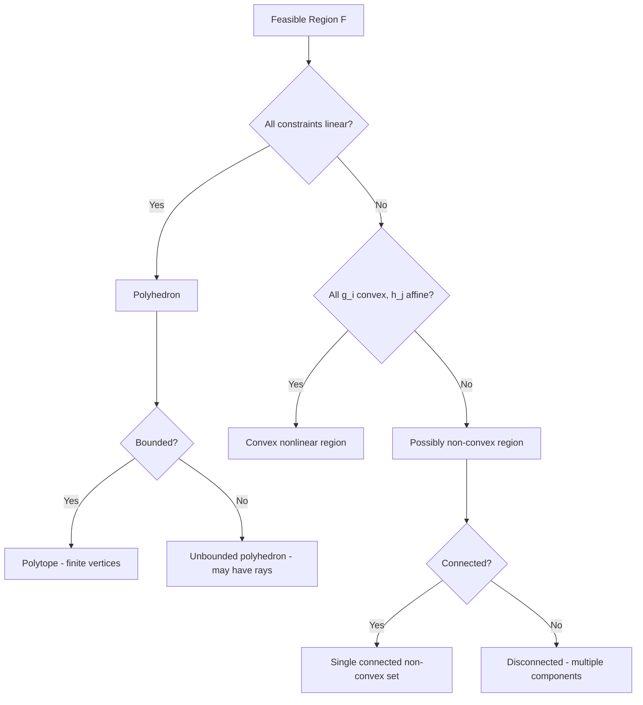

## Feasible Region and Feasible Set Characterization

### Definition and Basic Notation

The **feasible region** (also called the **feasible set** or **constraint set**), denoted $\mathcal{F}$, is the collection of all points in the decision space that satisfy every constraint of an optimization problem simultaneously:

$$\mathcal{F} = \{x \in \mathbb{R}^n : g_i(x) \leq 0 \ (i = 1,\dots,m), \ h_j(x) = 0 \ (j = 1,\dots,p)\}$$

Equivalently, $\mathcal{F}$ can be written as an intersection of individual constraint sets:

$$\mathcal{F} = \bigcap_{i=1}^m \{x : g_i(x) \leq 0\} \ \cap \ \bigcap_{j=1}^p \{x : h_j(x) = 0\}$$

This intersection perspective is central to characterizing $\mathcal{F}$: since intersections of sets with certain properties (closedness, convexity) inherit those properties, the geometry of $\mathcal{F}$ can often be deduced directly from the geometry of each individual constraint, without solving the problem.

### Feasible Points and Feasibility

A point $x \in \mathbb{R}^n$ is called **feasible** if $x \in \mathcal{F}$, and **infeasible** otherwise. Optimization restricts attention to feasible points only — the objective function's value at an infeasible point is irrelevant to the problem, even if that value happens to be numerically better than the true optimum.

**Key Points**

- A problem is **feasible** if $\mathcal{F} \neq \emptyset$, and **infeasible** if $\mathcal{F} = \emptyset$.
- Determining feasibility is itself a computational problem: for linear constraints, this reduces to solving a linear feasibility system (e.g., via Phase I of the simplex method or a linear programming relaxation with a zero objective); for nonlinear constraints, feasibility may be as hard as the optimization problem itself.
- A **strictly feasible** point satisfies all inequality constraints with strict inequality ($g_i(x) < 0$ for all $i$) — such points are important in interior-point methods and in verifying constraint qualifications (covered in later modules on KKT conditions).

### Geometric Classification of Feasible Regions

The shape of $\mathcal{F}$ depends entirely on the functional form of the constraints defining it.

**Linear constraints (Polyhedra)**

When every $g_i$ and $h_j$ is affine (linear plus a constant), $\mathcal{F}$ is a **polyhedron**:

$$\mathcal{F} = \{x \in \mathbb{R}^n : Ax \leq b, \ Cx = d\}$$

A **bounded** polyhedron is called a **polytope**. Polyhedra are always convex (proven below) and are characterized by flat faces, edges, and vertices.

**Nonlinear constraints (general regions)**

When constraints are nonlinear, $\mathcal{F}$ can take essentially any shape: curved boundaries, disconnected components, regions with holes, or regions that are neither open nor closed in complicated ways.

**Key Points**

- Linear equality constraints restrict $\mathcal{F}$ to an **affine subspace** (a shifted linear subspace) intersected with the inequality-defined region — each equality constraint typically reduces the effective dimensionality of $\mathcal{F}$ by one, assuming the constraints are independent.
- Convex nonlinear constraints (e.g., $g_i$ convex) still produce a convex $\mathcal{F}$, even though the boundary is curved rather than flat — this is a broader and more useful class than linear constraints alone for guaranteeing tractability.
- Non-convex constraints can produce feasible regions with multiple disconnected "islands," making even feasibility-checking and global optimization substantially harder, since local search near one feasible component provides no information about others.

**Example**

- Linear program feasible region: $\mathcal{F} = \{(x_1, x_2) : 2x_1 + 4x_2 \leq 40,\ x_1 \geq 5,\ x_1, x_2 \geq 0\}$ — a convex polygon (polytope) with a finite number of vertices.
- Nonlinear, non-convex feasible region: $\mathcal{F} = \{(x_1, x_2) : x_1^2 + x_2^2 \geq 1\}$ — the exterior of a disk, which is a connected but non-convex region.
- Disconnected feasible region: $\mathcal{F} = \{x \in \mathbb{R} : (x-1)(x-3)(x-5)(x-7) \leq 0\}$ — a union of disjoint closed intervals $[1,3] \cup [5,7]$.

### Convexity of the Feasible Set

A set $\mathcal{F}$ is **convex** if for every pair of points $x, y \in \mathcal{F}$ and every $\lambda \in [0,1]$, the line segment connecting them lies entirely within $\mathcal{F}$:

$$\lambda x + (1 - \lambda) y \in \mathcal{F} \quad \forall x, y \in \mathcal{F}, \ \lambda \in [0, 1]$$

**Key Points**

- The feasible region of a **linear program** is always convex, since each individual half-space $\{x : a_i^T x \leq b_i\}$ is convex, and the intersection of any collection of convex sets is convex.
- More generally, $\mathcal{F}$ is convex whenever each $g_i$ is a convex function and each $h_j$ is affine — this is the precise condition under which an optimization problem qualifies as a **convex optimization problem**, a distinction of major practical importance since convex problems admit efficient global-optimality guarantees while non-convex problems generally do not.
- Convexity of $\mathcal{F}$ alone does not make the overall optimization problem convex; the objective function must also be convex (for minimization) for the problem as a whole to be classified as convex.
- [Unverified] Verifying convexity of a feasible region defined by complicated nonlinear constraints can itself require nontrivial analysis (e.g., checking the Hessian of each $g_i$ is positive semidefinite); this is not always immediately apparent from the constraint's algebraic form.

### Topological Properties: Open, Closed, Bounded, Compact

Several topological properties of $\mathcal{F}$ have direct algorithmic consequences.

- **Closed**: $\mathcal{F}$ is closed if it contains all its boundary points. Feasible regions defined by non-strict inequalities ($\leq$, $\geq$, $=$) and continuous constraint functions are always closed, since each individual constraint set is closed and arbitrary intersections of closed sets are closed.
- **Open**: $\mathcal{F}$ is open if strict inequalities ($<$, $>$) are used; open feasible regions are problematic in optimization because an optimal point may not exist even when the objective is bounded — the infimum can be approached but never attained as $x$ approaches the (excluded) boundary.
- **Bounded**: $\mathcal{F}$ is bounded if it is contained within some ball of finite radius, i.e., $\exists R < \infty$ such that $\|x\| \leq R$ for all $x \in \mathcal{F}$.
- **Compact**: In $\mathbb{R}^n$, $\mathcal{F}$ is compact if and only if it is both closed and bounded (Heine–Borel theorem).

**Key Points**

- Compactness of $\mathcal{F}$ combined with continuity of $f$ guarantees, via the **Weierstrass Extreme Value Theorem**, that a global minimizer (and maximizer) actually exists and is attained — this is the single most important topological fact connecting feasible-set geometry to solution existence.
- An unbounded $\mathcal{F}$ does not automatically mean the problem is unbounded or has no solution; if $f$ grows without bound as $\|x\| \to \infty$ within $\mathcal{F}$ (a property called **coercivity**), a minimizer can still exist even over an unbounded region.
- Practitioners generally prefer formulating problems with closed feasible regions (using $\leq/\geq/=$ rather than strict inequalities) specifically to avoid the existence pathologies associated with open sets.

### Interior, Boundary, and Active Constraints

For a feasible point $x \in \mathcal{F}$:

- The **interior** of $\mathcal{F}$, $\text{int}(\mathcal{F})$, consists of points with a small neighborhood entirely contained in $\mathcal{F}$.
- The **boundary** of $\mathcal{F}$, $\partial \mathcal{F}$, consists of points where every neighborhood contains both feasible and infeasible points.
- At a point $x$, an inequality constraint $g_i(x) \leq 0$ is **active** if $g_i(x) = 0$ (the point lies exactly on that constraint's boundary) and **inactive** if $g_i(x) < 0$ (strict satisfaction, interior to that particular constraint).
- Equality constraints $h_j(x) = 0$ are, by definition, always active at every feasible point.

The set of active constraints at $x$ is denoted $\mathcal{A}(x) = \{i : g_i(x) = 0\}$. This set plays a central role in first-order optimality conditions (KKT conditions), since only active inequality constraints can restrict the feasible directions of movement at $x$ — inactive constraints have no local effect and can be temporarily ignored near that point.

**Example**For $\mathcal{F} = \{(x_1,x_2) : 2x_1 + 4x_2 \leq 40,\ x_1 \geq 5,\ x_2 \geq 0\}$, the point $(5, 0)$ lies at a vertex where both $x_1 \geq 5$ and $x_2 \geq 0$ are active, while $2x_1+4x_2 \leq 40$ is inactive (since $10 \leq 40$ strictly).

### Vertices, Edges, and Extreme Points of Polyhedra

For polyhedral feasible regions, several structural concepts underpin algorithms like the simplex method:

- An **extreme point** (or **vertex**) of a convex set $\mathcal{F}$ is a point that cannot be written as a strict convex combination of two other distinct points in $\mathcal{F}$ — informally, a "corner" of the region.
- A **basic feasible solution** (in the linear programming context) corresponds precisely to a vertex of the polyhedron, defined algebraically by having $n$ linearly independent active constraints (in $\mathbb{R}^n$).
- The **Fundamental Theorem of Linear Programming** states that if a linear program has an optimal solution, at least one optimal solution occurs at a vertex of the feasible polytope — this fact is what allows the simplex method to search only among vertices rather than the (infinite) full feasible region.

**Key Points**

- Not every convex feasible region has vertices — e.g., a disk or a half-space has no extreme points in the polyhedral sense (a disk's boundary is a curve of extreme points, but it has no "corners").
- The number of vertices of a polytope defined by $m$ linear inequalities in $\mathbb{R}^n$ can grow combinatorially with $m$ and $n$ in the worst case, which is one motivation for interior-point methods as an alternative to vertex-enumeration approaches like simplex.

### Visualization of Feasible Region Types

<svg xmlns="http://www.w3.org/2000/svg" viewBox="0 0 900 480" font-family="Arial, sans-serif">
<text x="450" y="30" text-anchor="middle" font-size="18" font-weight="bold" fill="#1a1a1a">Feasible Region Geometries (svg_diagram)</text>

<text x="150" y="65" text-anchor="middle" font-size="13" font-weight="bold" fill="`#2a4d9c`">Convex Polytope (LP)</text>

<polygon points="80,220 220,150 260,220 190,290 100,270" fill="`#cfe0ff`" stroke="`#3366cc`" stroke-width="2" />

<circle cx="80" cy="220" r="3" fill="`#1a2d66`" />

<circle cx="220" cy="150" r="3" fill="`#1a2d66`" />

<circle cx="260" cy="220" r="3" fill="`#1a2d66`" />

<circle cx="190" cy="290" r="3" fill="`#1a2d66`" />

<circle cx="100" cy="270" r="3" fill="`#1a2d66`" />

<text x="150" y="330" text-anchor="middle" font-size="11" fill="#555">Flat faces, finite vertices</text>

<text x="150" y="348" text-anchor="middle" font-size="11" fill="#555">Always convex</text>

<text x="450" y="65" text-anchor="middle" font-size="13" font-weight="bold" fill="`#994d00`">Convex Nonlinear Region</text>

<ellipse cx="450" cy="220" rx="100" ry="75" fill="`#ffe6cc`" stroke="`#cc7a33`" stroke-width="2" />

<text x="450" y="330" text-anchor="middle" font-size="11" fill="#555">Curved boundary</text>

<text x="450" y="348" text-anchor="middle" font-size="11" fill="#555">No vertices, still convex</text>

<text x="750" y="65" text-anchor="middle" font-size="13" font-weight="bold" fill="`#994d1a`">Non-convex / Disconnected</text>

<ellipse cx="700" cy="200" rx="55" ry="45" fill="`#ffd6d6`" stroke="`#cc3333`" stroke-width="2" />

<ellipse cx="810" cy="250" rx="45" ry="40" fill="`#ffd6d6`" stroke="`#cc3333`" stroke-width="2" />

<line x1="740" y1="210" x2="775" y2="235" stroke="`#cc3333`" stroke-width="2" stroke-dasharray="5,4" />

<text x="755" y="230" font-size="10" fill="`#cc3333`">infeasible gap</text>

<text x="750" y="330" text-anchor="middle" font-size="11" fill="#555">Two disjoint components</text>

<text x="750" y="348" text-anchor="middle" font-size="11" fill="#555">Local search can miss global optimum</text>

<rect x="40" y="390" width="820" height="70" rx="8" fill="#f5f5f5" stroke="#999" stroke-width="1" />
<text x="450" y="415" text-anchor="middle" font-size="12" fill="#333">Interior point: small neighborhood fully inside F (all constraints inactive)</text>
<text x="450" y="438" text-anchor="middle" font-size="12" fill="#333">Boundary point: at least one active constraint (g_i(x) = 0)</text>
</svg>

### Constraint Qualifications: Why Characterization Matters

The way $\mathcal{F}$ is characterized near a candidate solution affects whether standard optimality conditions can even be applied. A **constraint qualification** is a regularity condition on the active constraints at a point ensuring that the geometric feasible directions (tangent cone) match the directions predicted by linearizing the active constraints.

**Key Points**

- Without a constraint qualification, the KKT conditions (covered in a later module) may fail to correctly characterize optimality, since the linear approximation of the feasible region at that point can misrepresent its true local geometry.
- The most commonly invoked qualification is the **Linear Independence Constraint Qualification (LICQ)**: the gradients of all active constraints at $x$ are linearly independent.
- [Unverified] Different constraint qualifications (LICQ, Mangasarian–Fromovitz, Slater's condition for convex problems) trade off strength versus ease of verification; the appropriate choice depends on problem structure and is typically determined case-by-case rather than by a universal default.

### Special Feasible Region Structures

### Characterizing Empty and Degenerate Feasible Sets

**Key Points**

- $\mathcal{F} = \emptyset$ can arise from directly conflicting constraints (e.g., $x \geq 5$ and $x \leq 3$) or from more subtle combinations that are only jointly infeasible (e.g., three pairwise-feasible linear constraints in higher dimensions with no common intersection).
- A **degenerate** feasible region in linear programming refers to a vertex where more than $n$ constraints are active simultaneously (more than the minimum needed to define that vertex) — this does not make $\mathcal{F}$ empty, but can cause numerical and algorithmic difficulties (e.g., cycling in the simplex method).
- A feasible region consisting of a **single point** (e.g., fully determined by $n$ independent equality constraints in $\mathbb{R}^n$) makes the optimization problem trivial — the objective function is irrelevant, since there is exactly one feasible solution.

**Conclusion**

The feasible region is the geometric heart of an optimization problem: its shape — convex or non-convex, bounded or unbounded, open or closed, connected or disconnected — determines which theoretical guarantees apply and which algorithms are appropriate. Characterizing $\mathcal{F}$ before selecting a solution method is not a formality; convexity determines whether local optimality implies global optimality, compactness determines whether a solution is guaranteed to exist, and the active-constraint structure at candidate points underlies the first-order optimality conditions used throughout the field.

**Related Topics**

- Convex sets and convex functions
- Karush–Kuhn–Tucker (KKT) conditions and constraint qualifications
- The simplex method and basic feasible solutions
- Interior-point methods
- Phase I methods for feasibility detection
- Duality theory and infeasibility certificates
- Polyhedral theory: extreme points, faces, and facets
- Global optimization for non-convex and disconnected feasible regions