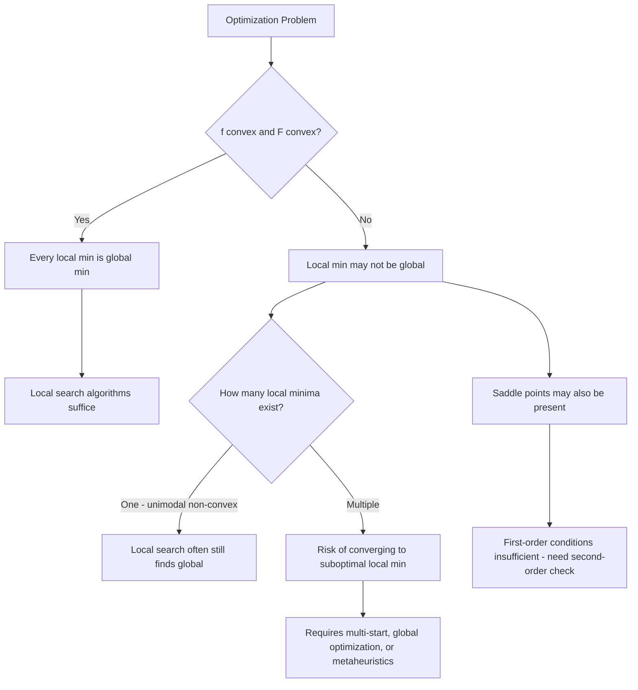

## Local Versus Global Optima Definitions

### Overview

Distinguishing local from global optima is one of the most consequential distinctions in optimization theory, since most practical algorithms only guarantee convergence to a local optimum, while the actual goal of an optimization problem is almost always to find the global optimum. Understanding precisely what each term means — and under what conditions the two coincide — determines how much confidence can be placed in a solution returned by any given algorithm.

### Formal Definition of Global Optima

Given an optimization problem $\min_{x \in \mathcal{F}} f(x)$, a point $x^* \in \mathcal{F}$ is a **global minimizer** if

$$f(x^*) \leq f(x) \quad \forall x \in \mathcal{F}$$

If the inequality is strict for all $x \neq x^*$, $x^*$ is a **strict (or unique) global minimizer**. The value $f(x^*)$ is then called the **global minimum value**, and this value is unique even when multiple global minimizers exist (the global minimum *value* is always unique; the *set* of minimizers achieving it need not be).

**Key Points**

- A global minimizer must be compared against every other feasible point, not just nearby ones — this is what makes global optimality a statement about the entire feasible region $\mathcal{F}$.
- The **global maximizer** is defined symmetrically with the inequality reversed, and every maximization problem can be restated as minimizing $-f(x)$, so the two cases are mathematically interchangeable.
- Existence of a global minimizer is not guaranteed in general — it depends on properties of $\mathcal{F}$ and $f$ established via the Weierstrass Extreme Value Theorem (compactness of $\mathcal{F}$, continuity of $f$), as covered in the feasible-region module.

### Formal Definition of Local Optima

A point $x^* \in \mathcal{F}$ is a **local minimizer** if there exists a neighborhood radius $\epsilon > 0$ such that

$$f(x^*) \leq f(x) \quad \forall x \in \mathcal{F} \cap B(x^*, \epsilon)$$

where $B(x^*, \epsilon) = \{x : \|x - x^*\| < \epsilon\}$ is the open ball of radius $\epsilon$ centered at $x^*$. In words: $x^*$ beats every feasible point sufficiently close to it, but may be beaten by points farther away.

**Key Points**

- A **strict local minimizer** satisfies $f(x^*) < f(x)$ for all $x \neq x^*$ in $\mathcal{F} \cap B(x^*, \epsilon)$ for some $\epsilon > 0$.
- Local optimality is a statement about a *neighborhood*, so it can be verified (in principle) using only local information about $f$ near $x^*$ — this is precisely why derivative-based conditions (covered in the next module on first- and second-order optimality) can characterize local optima using only gradients and Hessians evaluated at the point itself.
- Every global minimizer is automatically a local minimizer (take $\epsilon$ large enough to contain the whole feasible set, or note the global condition trivially implies the local one), but the converse is false in general — a local minimizer need not be global.

### The Relationship Between Local and Global Optima

$$\{\text{Global Minimizers}\} \subseteq \{\text{Local Minimizers}\}$$

This containment is generally strict: most non-convex functions possess multiple local minima, only some (possibly just one) of which are also global. The central practical challenge of non-convex optimization is that gradient-based and other local-search algorithms can only detect local optimality conditions, and therefore may terminate at a local minimizer that is far from globally optimal, with no signal from local information alone indicating this has happened.

**Example**Consider $f(x) = x^4 - 4x^2 + x$ on $\mathbb{R}$. This function has two local minima (near $x \approx -1.5$ and $x \approx 1.4$) and one local maximum between them. Evaluating $f$ at both local minima and comparing determines which is global; a gradient-descent algorithm initialized near the shallower local minimum will converge there and report it as optimal, without any indication that a deeper minimum exists elsewhere.

### Convexity: The Condition Under Which Local Implies Global

The single most important structural result connecting local and global optimality is:

**Theorem.** If $f$ is a convex function and $\mathcal{F}$ is a convex set, then every local minimizer of $f$ over $\mathcal{F}$ is also a global minimizer.

**Sketch of reasoning**: Suppose $x^*$ is a local but not global minimizer, so some $y \in \mathcal{F}$ has $f(y) < f(x^*)$. By convexity of $\mathcal{F}$, every point on the segment $\lambda y + (1-\lambda)x^*$ for $\lambda \in [0,1]$ is feasible. By convexity of $f$, $f(\lambda y + (1-\lambda)x^*) \leq \lambda f(y) + (1-\lambda)f(x^*) < f(x^*)$ for any $\lambda \in (0,1]$. Taking $\lambda \to 0^+$, this produces feasible points arbitrarily close to $x^*$ with strictly smaller objective value — contradicting the assumption that $x^*$ is a local minimizer.

**Key Points**

- This theorem is the foundational reason **convex optimization** is treated as a distinct, especially tractable subfield: any local-search algorithm that finds *a* local minimum of a convex problem has automatically found *the* global minimum (or one of possibly several global minimizers achieving the same, unique, global minimum value).
- **Strict convexity** of $f$ (rather than mere convexity) additionally guarantees the global minimizer, if it exists, is unique.
- This result underlies why so much of optimization theory and practice is organized around the question "is this problem convex?" before any algorithm is chosen — the answer determines whether local search suffices or global techniques are required.

**Example**$f(x) = x^2$ is convex on $\mathbb{R}$; its unique local minimizer at $x=0$ is also the unique global minimizer. In contrast, $f(x) = x^4 - 4x^2 + x$ (from the earlier example) is non-convex — it has an inflection in curvature — which is precisely why it can support multiple, non-equivalent local minima.

### Visualization of Local Versus Global Minima

<svg xmlns="http://www.w3.org/2000/svg" viewBox="0 0 900 420" font-family="Arial, sans-serif">
<text x="450" y="30" text-anchor="middle" font-size="18" font-weight="bold" fill="#1a1a1a">Local vs. Global Minima on a Non-Convex Function (svg_diagram)</text>
<line x1="60" y1="350" x2="840" y2="350" stroke="#333" stroke-width="1.5" />
<text x="850" y="355" font-size="12" fill="#333">x</text>
<line x1="60" y1="350" x2="60" y2="50" stroke="#333" stroke-width="1.5" />
<text x="45" y="45" font-size="12" fill="#333">f(x)</text>

<path d="M 80,120 C 150,300 220,320 280,260 C 340,200 360,160 420,150 C 480,140 500,180 540,280 C 580,340 640,345 700,300 C 760,260 800,230 820,180" fill="none" stroke="`#3366cc`" stroke-width="3" />

<circle cx="240" cy="288" r="6" fill="#cc3333" />
<text x="240" y="315" text-anchor="middle" font-size="12" fill="#cc3333" font-weight="bold">Local min A</text>
<text x="240" y="332" text-anchor="middle" font-size="11" fill="#555">(shallower)</text>
<circle cx="670" cy="330" r="6" fill="#1a8f3c" />
<text x="670" y="300" text-anchor="middle" font-size="12" fill="#1a8f3c" font-weight="bold">Global min B</text>
<text x="670" y="283" text-anchor="middle" font-size="11" fill="#555">(deepest overall)</text>
<circle cx="450" cy="145" r="5" fill="#994d00" />
<text x="450" y="120" text-anchor="middle" font-size="12" fill="#994d00">Local max</text>
<rect x="150" y="220" width="180" height="90" fill="none" stroke="#999" stroke-width="1" stroke-dasharray="4,3" />
<text x="240" y="240" text-anchor="middle" font-size="10" fill="#777">epsilon-neighborhood</text>
<text x="240" y="252" text-anchor="middle" font-size="10" fill="#777">where A beats all nearby points</text>
<line x1="240" y1="288" x2="670" y2="330" stroke="#cc3333" stroke-width="1" stroke-dasharray="2,2" opacity="0.5" />
<text x="455" y="395" text-anchor="middle" font-size="12" fill="#555">A is locally optimal but globally suboptimal since f(B) &lt; f(A)</text>
</svg>

### Saddle Points and Other Non-Optimal Stationary Points

A **stationary point** (or critical point) satisfies $\nabla f(x) = 0$ but is not necessarily a local minimizer or maximizer. A **saddle point** is a stationary point that is a local minimum along some directions and a local maximum along others.

**Key Points**

- Saddle points satisfy first-order optimality conditions ($\nabla f = 0$) without being any kind of local optimum, which is why first-order conditions alone are only *necessary*, not *sufficient*, for local optimality — second-order conditions (covered in the next module) are needed to distinguish minima, maxima, and saddle points.
- [Unverified] In high-dimensional non-convex optimization (e.g., deep neural network training), some empirical and theoretical work suggests saddle points may be more numerous than poor local minima and may pose a more significant obstacle to optimization algorithms than local minima themselves; this remains an active and problem-dependent area of study rather than a settled universal claim.
- Distinguishing a saddle point from a true local minimum requires examining the Hessian's eigenvalue structure (or equivalent second-order information) at the stationary point.

### Local and Global Optima Under Constraints

The presence of constraints changes where local and global optima can occur but does not change the underlying definitions — both are still evaluated relative to the feasible set $\mathcal{F}$, not the unconstrained domain of $f$.

**Key Points**

- A point that is a local minimizer of $f$ over $\mathcal{F}$ need not be a local minimizer of $f$ over all of $\mathbb{R}^n$ (unconstrained) — constraints can "trap" the objective at a boundary point that would otherwise not be optimal if the constraint were removed.
- Constrained local optima frequently occur at boundary points of $\mathcal{F}$ where one or more inequality constraints are active, since the feasible region prevents further improvement in the unconstrained-improving direction.
- For **convex constrained problems** (convex $f$, convex $\mathcal{F}$), the local-implies-global theorem still holds exactly as in the unconstrained case, since the proof relies only on convexity of the feasible set and the objective, not on the absence of constraints.

### Classification of Optimization Landscapes

### Practical Implications for Algorithm Selection

**Key Points**

- **Gradient descent, Newton's method, and most classical iterative methods** are inherently local: they use only local derivative information and converge to whichever stationary point is "downhill" from their starting point, with no built-in mechanism to escape a local basin of attraction.
- **Multi-start strategies** (running local optimization from many different initial points and keeping the best result) are a simple, widely used heuristic to increase the chance of finding a global optimum in non-convex problems, though they provide no formal guarantee of success.
- **Global optimization methods** (e.g., branch-and-bound with valid bounds, simulated annealing, genetic algorithms, Bayesian optimization) are specifically designed to escape local optima, generally at substantially higher computational cost than local methods.
- **Convexification** — reformulating or relaxing a non-convex problem into a convex approximation (e.g., convex relaxations in mixed-integer programming) — is a common strategy to obtain provable bounds on the true global optimum even when the original problem is non-convex.
- [Inference] The practical decision of whether to invest in global optimization techniques versus accepting a local solution typically depends on the cost of computation relative to the cost of suboptimality in the specific application, rather than on a universal rule.

**Conclusion**

Local optimality is a statement about a neighborhood; global optimality is a statement about the entire feasible region. The two coincide precisely when the problem is convex — a fact that makes convexity checking one of the first and most valuable diagnostic steps in any optimization problem. Where convexity fails, the existence of multiple local optima becomes a genuine algorithmic obstacle, and awareness of this gap directly informs the choice between fast local methods and more expensive global search strategies.

**Related Topics**

- First-order and second-order optimality conditions (KKT, Hessian tests)
- Convex functions and convex sets
- Saddle point analysis and Hessian eigenvalue structure
- Multi-start and global optimization heuristics
- Simulated annealing and genetic algorithms
- Convex relaxations of non-convex problems
- Basins of attraction in gradient-based methods
- Non-convex optimization in deep learning