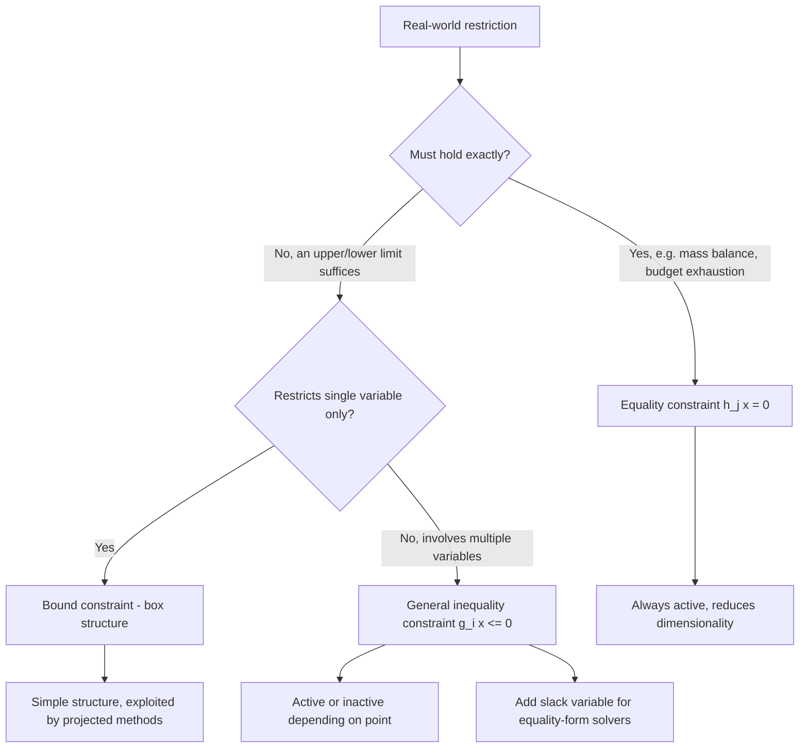

## Equality and Inequality Constraint Types

### Overview

Constraints determine which points in the decision space are admissible solutions to an optimization problem. They divide into two fundamental categories — **equality constraints**, which force decision variables onto a lower-dimensional surface, and **inequality constraints**, which restrict decision variables to one side of a boundary. The mathematical treatment of each type differs substantially in optimality theory (each contributes differently to the Lagrangian and KKT conditions) and in algorithm design, making a precise understanding of their structural differences essential before studying constrained optimization methods.

### Equality Constraints

An **equality constraint** takes the form

$$h_j(x) = 0, \quad j = 1, \dots, p$$

and requires the decision variable to satisfy the condition exactly, with no tolerance in either direction. Geometrically, a single equality constraint $h_j(x) = 0$ restricts $x$ to a **level set** (or hypersurface) of $h_j$ — typically an $(n-1)$-dimensional surface within $\mathbb{R}^n$, assuming $h_j$ is sufficiently well-behaved (specifically, that $\nabla h_j(x) \neq 0$ on the surface, so the level set does not degenerate).

**Key Points**

- Each independent equality constraint typically reduces the effective dimensionality of the feasible region by one; $p$ independent equality constraints in $\mathbb{R}^n$ generically leave an $(n-p)$-dimensional feasible manifold, assuming $p \leq n$ and the constraint gradients are linearly independent.
- Equality constraints are **always active** at every feasible point by definition, since $h_j(x) = 0$ must hold everywhere in $\mathcal{F}$ — there is no notion of an "inactive" equality constraint.
- **Linear equality constraints** ($h_j(x) = a_j^T x - b_j$) restrict $\mathcal{F}$ to an affine subspace; **nonlinear equality constraints** restrict $\mathcal{F}$ to a (possibly curved) manifold.
- A set of equality constraints is **redundant** if one can be derived from the others (e.g., $h_1 + h_2 = h_3$), in which case the effective dimensionality reduction is less than $p$ — recognizing redundancy matters both for correctly counting degrees of freedom and for avoiding numerical rank-deficiency in solvers.

**Example**A resource-allocation problem requiring that budget be spent exactly (not merely at most): $h(x_1, x_2, x_3) = x_1 + x_2 + x_3 - 100 = 0$, forcing the three allocations to sum exactly to 100 regardless of individual values.

### Inequality Constraints

An **inequality constraint** takes the form

$$g_i(x) \leq 0, \quad i = 1, \dots, m$$

(or equivalently $g_i(x) \geq 0$ after sign flip) and restricts $x$ to one side of a boundary surface, including the boundary itself. Geometrically, $g_i(x) \leq 0$ defines a **half-space** (in the linear case) or a more general region bounded by the surface $g_i(x) = 0$ (in the nonlinear case), together with its entire interior side.

**Key Points**

- Unlike equality constraints, inequality constraints partition the feasible point's relationship to each constraint into two cases: **active** ($g_i(x) = 0$, the point lies exactly on the boundary) and **inactive** ($g_i(x) < 0$, the point lies strictly within the permitted region).
- An inactive inequality constraint at a given point has no local effect on that point's optimality — it can be temporarily disregarded when analyzing local behavior near that specific point, since a small perturbation will not violate it.
- Inequality constraints do not necessarily reduce dimensionality; a single inequality constraint in $\mathbb{R}^n$ still permits an $n$-dimensional feasible region (a half-space is still full-dimensional), unlike an equality constraint which collapses to $(n-1)$ dimensions.
- **Strict inequalities** ($g_i(x) < 0$) are generally avoided in formal problem statements because they produce open feasible regions, which can cause the infimum to be unattained (as covered in the feasible-region module) — most formulations use non-strict inequalities ($\leq$) even when the underlying real-world restriction is conceptually strict.

**Example**A production capacity limit: $g(x_1, x_2) = 2x_1 + 4x_2 - 40 \leq 0$, permitting any combination of $x_1, x_2$ using at most 40 hours of machine time, including combinations that use less.

### Bound Constraints as a Special Case

**Bound constraints** restrict a single variable directly:

$$\ell_i \leq x_i \leq u_i$$

These are technically a pair of inequality constraints ($x_i - u_i \leq 0$ and $\ell_i - x_i \leq 0$) but are treated as a distinct category in most optimization software because of their simple structure.

**Key Points**

- Bound constraints define a **box** (or hyperrectangle) when applied to all variables simultaneously — one of the simplest possible feasible region shapes.
- Many algorithms exploit bound constraints specially (e.g., **projected gradient methods**, which clip iterates back into the box after each step), since enforcing a bound is computationally trivial compared to enforcing a general inequality constraint.
- **Non-negativity constraints** ($x_i \geq 0$) are the most common bound constraint in practice, arising naturally whenever a decision variable represents a physical quantity (mass, time, money, count) that cannot be negative.
- A **one-sided bound** (only $\ell_i \leq x_i$ or only $x_i \leq u_i$, not both) is also common and is treated identically to a general single inequality constraint by most solvers.

### Converting Between Equality and Inequality Forms

Equality and inequality constraints are related through standard transformations that are useful both for theoretical derivations and for adapting a problem to a specific solver's required input form.

**Equality via two inequalities**: Any equality constraint can be rewritten as two simultaneous inequality constraints:

$$h(x) = 0 \quad \Longleftrightarrow \quad h(x) \leq 0 \ \text{ and } \ -h(x) \leq 0$$

**Inequality via equality plus a slack variable**: Any inequality constraint can be converted to an equality constraint by introducing a non-negative **slack variable** $s_i \geq 0$:

$$g_i(x) \leq 0 \quad \Longleftrightarrow \quad g_i(x) + s_i = 0, \ s_i \geq 0$$

**Key Points**

- The two-inequality representation of equality constraints is primarily a theoretical device (e.g., used in some derivations of general first-order optimality conditions treating all constraints uniformly as inequalities) and is generally avoided computationally, since it can introduce numerical difficulties and redundancy that dedicated equality-handling routines avoid.
- The slack-variable transformation is heavily used in practice — it underlies the **standard form** of linear programming used by the simplex method, and is also used in interior-point methods to reformulate inequality-constrained problems as equality-constrained problems with additional non-negativity bounds on the slacks.
- After introducing a slack variable, the original inequality constraint's active/inactive status is directly readable from the slack: $s_i = 0$ means the constraint is active (binding), while $s_i > 0$ means it is inactive (slack remains).

**Example**Converting $2x_1 + 4x_2 \leq 40$ to standard equality form: introduce $s \geq 0$ such that $2x_1 + 4x_2 + s = 40. If the optimal solution has $s^* = 0
, the machine-time constraint is binding at optimality; if $s^* = 6$, only 34 hours are used and 6 hours of slack capacity remain.

### Role in the Lagrangian and KKT Conditions

Equality and inequality constraints enter the Lagrangian function differently, reflecting their distinct structural roles, though full treatment of the KKT conditions is covered in a dedicated later module. Briefly:

$$\mathcal{L}(x, \lambda, \mu) = f(x) + \sum_{i=1}^m \lambda_i g_i(x) + \sum_{j=1}^p \mu_j h_j(x)$$

**Key Points**

- Multipliers $\lambda_i$ associated with inequality constraints are restricted to $\lambda_i \geq 0$ (for a minimization problem in this sign convention), reflecting that inequality constraints can only push the solution away from the unconstrained optimum in one direction.
- Multipliers $\mu_j$ associated with equality constraints are **unrestricted in sign** ($\mu_j \in \mathbb{R}$), since an equality constraint can push the solution in either direction relative to the unconstrained optimum.
- **Complementary slackness**, $\lambda_i g_i(x^*) = 0$ for each $i$, formalizes the active/inactive distinction: at optimality, either the constraint is active ($g_i(x^*) = 0$) or its multiplier is zero ($\lambda_i = 0$, meaning the constraint has no local effect on the solution) — this condition has no equality-constraint analogue, since equality constraints are always active and their multipliers need not vanish.
- [Unverified] The specific sign convention for $\lambda_i$ (some texts use $\lambda_i \leq 0$, or define the Lagrangian with a minus sign in front of the multiplier terms) varies across references; the underlying complementary slackness and stationarity logic is equivalent across conventions, but formulas should not be mixed across sources without checking consistency.

### Geometric Comparison Diagram

<svg viewBox="0 0 900 460" xmlns="http://www.w3.org/2000/svg" font-family="Arial, sans-serif">
<text x="450" y="30" text-anchor="middle" font-size="18" font-weight="bold" fill="#1a1a1a">Equality vs. Inequality Constraint Geometry (svg_diagram)</text>

<text x="220" y="65" text-anchor="middle" font-size="14" font-weight="bold" fill="`#2a4d9c`">Equality Constraint</text>

<text x="220" y="83" text-anchor="middle" font-size="12" fill="#555">h(x) = 0</text>

<rect x="100" y="110" width="240" height="240" fill="`#f5f5f5`" stroke="#ccc" stroke-width="1"/>

<path d="M 120,320 C 180,220 260,180 330,130" stroke="`#3366cc`" stroke-width="4" fill="none"/>

<text x="220" y="365" text-anchor="middle" font-size="11" fill="#555">Feasible set = curve only</text>

<text x="220" y="382" text-anchor="middle" font-size="11" fill="#555">(n-1 dimensional)</text>

<text x="220" y="399" text-anchor="middle" font-size="11" fill="#555">every point on curve is active</text>

<text x="670" y="65" text-anchor="middle" font-size="14" font-weight="bold" fill="`#994d00`">Inequality Constraint</text>

<text x="670" y="83" text-anchor="middle" font-size="12" fill="#555">g(x) <= 0</text>

<rect x="550" y="110" width="240" height="240" fill="`#f5f5f5`" stroke="#ccc" stroke-width="1"/>

<path d="M 570,220 C 630,150 710,140 770,180 L 770,350 L 570,350 Z" fill="`#ffe6cc`" stroke="`#cc7a33`" stroke-width="3"/>

<text x="670" y="200" text-anchor="middle" font-size="11" fill="`#994d00`">g(x) < 0</text>

<text x="670" y="216" text-anchor="middle" font-size="11" fill="`#994d00`">(inactive region)</text>

<path d="M 570,220 C 630,150 710,140 770,180" stroke="`#cc3333`" stroke-width="3" fill="none"/>

<text x="720" y="155" font-size="10" fill="`#cc3333`">g(x) = 0 (active boundary)</text>

<text x="670" y="365" text-anchor="middle" font-size="11" fill="#555">Feasible set = full region</text>

<text x="670" y="382" text-anchor="middle" font-size="11" fill="#555">(n dimensional, includes boundary)</text>

<text x="670" y="399" text-anchor="middle" font-size="11" fill="#555">only boundary points are active</text>

</svg>

### Constraint Type Decision Overview

### Common Practical Distinctions

**Key Points**

- **Physical conservation laws** (mass balance, energy balance, flow conservation in networks) are almost always modeled as equality constraints, since these must hold exactly for the model to be physically meaningful.
- **Resource limits, quality thresholds, and safety margins** are almost always modeled as inequality constraints, since being strictly better than the minimum requirement is generally acceptable (using less of a resource than the cap, or exceeding a minimum quality bar).
- Overly aggressive use of equality constraints where an inequality would suffice can unnecessarily shrink the feasible region and eliminate genuinely better solutions; conversely, replacing a true equality requirement with an inequality can permit solutions that violate real-world necessity.
- [Inference] In practice, many modeling errors in early-stage formulations stem from misclassifying a constraint as equality when inequality was intended (or vice versa), making a deliberate check of "does this truly need to hold exactly, or just as a bound?" a useful step in problem formulation.

**Conclusion**

Equality and inequality constraints serve structurally distinct roles: equality constraints pin the feasible region to a lower-dimensional surface and are always active, while inequality constraints carve out a full-dimensional region whose boundary points alone are active. This distinction propagates through every layer of optimization theory — from the dimensionality of the feasible set, to the sign restrictions on Lagrange multipliers, to the complementary slackness conditions that characterize optimality — making correct constraint-type classification a prerequisite for applying the theory covered in subsequent modules on optimality conditions.

**Related Topics**

- Karush–Kuhn–Tucker (KKT) conditions and complementary slackness
- Lagrangian duality and multiplier sign conventions
- Slack and surplus variables in linear programming standard form
- Constraint qualifications (LICQ, Slater's condition)
- Projected gradient methods for bound-constrained problems
- Active-set methods for inequality-constrained optimization
- Interior-point methods and barrier functions
- Degenerate and redundant constraint detection