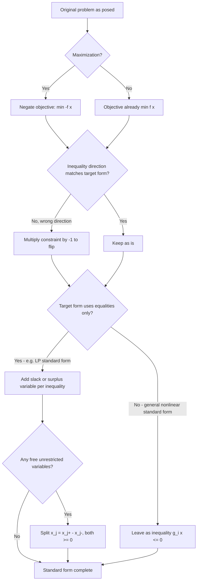

## Standard Form and Canonical Form Conversions

### Overview

Optimization problems arising from real-world descriptions rarely match the exact input format required by a theoretical proof or a specific solver. **Standard form** and **canonical form** are conventions that normalize a problem's presentation so that general algorithms and theorems can be stated once and applied uniformly, rather than requiring separate treatment for every combination of $\leq$, $\geq$, $=$, minimization, and maximization. Mastering the transformations between these forms is a practical prerequisite for using optimization software correctly and for following derivations in the optimization literature.

### Why Standardization Matters

**Key Points**

- Different textbooks, solvers, and algorithm derivations adopt different conventions for which direction of inequality, which sign of objective, and which multiplier sign is treated as canonical — without a clear standard form, formulas for optimality conditions or duality cannot be applied consistently.
- Standardization is primarily a **bookkeeping and derivation convenience**: it allows a single version of an algorithm (e.g., simplex, interior-point) or a single statement of a theorem (e.g., KKT conditions) to cover every problem in a class, after the user performs a mechanical translation step.
- [Unverified] Most modern solvers accept problems in a fairly natural, un-standardized form and perform the necessary internal transformations automatically; understanding standard form remains important primarily for reading theory, derivations, and lower-level algorithm implementations rather than for everyday solver usage.

### General (Inequality) Standard Form

The most common standard form used in nonlinear and general optimization theory is:

$$\min_{x \in \mathbb{R}^n} f(x) \quad \text{subject to} \quad g_i(x) \leq 0 \ (i=1,\dots,m), \quad h_j(x) = 0 \ (j=1,\dots,p)$$

Every optimization problem, regardless of its original presentation, can be mechanically converted into this form using the transformations below.

### Transformation 1: Maximization to Minimization

Since $\max_x f(x)$ and $\min_x -f(x)$ share the same optimal solution set $x^*$ (only the optimal *value* differs in sign), any maximization problem converts directly:

$$\max_{x \in \mathcal{F}} f(x) \quad \Longleftrightarrow \quad \min_{x \in \mathcal{F}} -f(x), \qquad f(x^*)_{\max} = -\big(-f(x^*)\big)_{\min}$$

**Key Points**

- This transformation preserves the feasible region entirely — only the objective function is negated, and all constraints remain unchanged.
- After solving the minimization form, the true (maximized) objective value is recovered by negating the reported optimal value back.

### Transformation 2: Inequality Direction Reversal

An inequality in the "wrong" direction is converted by multiplying through by $-1$, which flips the inequality:

$$g(x) \geq 0 \quad \Longleftrightarrow \quad -g(x) \leq 0$$

**Key Points**

- This is purely algebraic and changes nothing about the feasible region — the same set of points satisfies both forms.
- Care must be taken with the sign of any associated Lagrange multiplier after this transformation, since flipping the constraint's sign flips the sign convention needed for a nonnegative multiplier in the KKT conditions.

### Transformation 3: Equality via Two Inequalities

Any equality constraint can be represented as a pair of inequality constraints:

$$h(x) = 0 \quad \Longleftrightarrow \quad h(x) \leq 0 \ \text{ and } \ -h(x) \leq 0$$

**Key Points**

- This transformation is primarily a theoretical device, used when a derivation wants to treat all constraints uniformly as inequalities (e.g., some general first-order condition derivations).
- It is generally **avoided in computational practice**: introducing two inequality constraints for one equality creates redundancy and can degrade numerical conditioning, since both constraints must be simultaneously active at every feasible point, which increases the likelihood of degeneracy at solutions.

### Transformation 4: Inequality to Equality via Slack Variables

An inequality constraint is converted to an equality constraint by introducing a non-negative **slack variable**:

$$g_i(x) \leq 0 \quad \Longleftrightarrow \quad g_i(x) + s_i = 0, \ s_i \geq 0$$

For a $\geq$ constraint, a non-negative **surplus variable** is subtracted instead:

$$g_i(x) \geq 0 \quad \Longleftrightarrow \quad g_i(x) - s_i = 0, \ s_i \geq 0$$

**Key Points**

- This is the **primary transformation used in computational practice** — it underlies the standard form required by the simplex method and is used in interior-point methods to convert inequality-constrained problems into equality-constrained problems with bound constraints on the slacks.
- The slack variable's value at a solution directly indicates whether the original inequality is active: $s_i^* = 0$ means binding, $s_i^* > 0$ means strictly satisfied with room to spare.
- Each slack/surplus variable adds one dimension to the problem, trading an inequality constraint for an additional variable plus a simple non-negativity bound — a favorable trade for algorithms (like simplex) that handle bound constraints and equality constraints very efficiently.

### Linear Programming Standard Form

Linear programming has its own widely used standard form, distinct from (but a special case of) the general nonlinear standard form above:

$$\min_x \ c^T x \quad \text{subject to} \quad Ax = b, \quad x \geq 0$$

where $A \in \mathbb{R}^{m \times n}$, $b \in \mathbb{R}^m$, and $c \in \mathbb{R}^n$. This form requires **all constraints to be equalities** (via slack/surplus variables) and **all variables to be non-negative**.

**Key Points**

- Converting a general linear program to this standard form requires: (1) converting any maximization to minimization by negation, (2) adding a slack or surplus variable to convert each inequality to an equality, and (3) handling **free variables** (unrestricted in sign) by splitting each into the difference of two non-negative variables, $x_j = x_j^+ - x_j^-$ with $x_j^+, x_j^- \geq 0$.
- This standard form is exactly what the **simplex method** operates on internally; understanding this conversion is prerequisite to understanding how simplex identifies basic feasible solutions (vertices) algebraically.
- [Unverified] Some references use a variant standard form with $Ax \leq b$ and $x \geq 0$ directly (sometimes distinguished as "canonical form" for LP specifically, versus "standard form" using equalities) — terminology for LP forms is not perfectly uniform across sources, so the specific convention should be checked against the reference or solver being used.

**Example**Converting $\max 5x_1 + 8x_2$ subject to $2x_1 + 4x_2 \leq 40, $x_1 \geq 5
, $x_1, x_2 \geq 0$ to LP standard form:

1. Minimize instead: $\min -5x_1 - 8x_2$
2. Convert $x_1 \geq 5$ to $\leq$ form: $-x_1 \leq -5$
3. Add slacks: $2x_1 + 4x_2 + s_1 = 40$ and $-x_1 + s_2 = -5$, with $s_1, s_2 \geq 0$
4. Final standard form: $\min -5x_1 - 8x_2$ s.t. $2x_1+4x_2+s_1 = 40,\ -x_1+s_2=-5,\ x_1,x_2,s_1,s_2 \geq 0$

### Canonical Form (LP-Specific Usage)

In the specific context of linear programming, **canonical form** is sometimes used (with some variation across sources) to refer to:

$$\min_x \ c^T x \quad \text{subject to} \quad Ax \leq b, \quad x \geq 0$$

— i.e., all inequality constraints retained explicitly (no slack variables added), contrasted with the equality-based **standard form** above.

**Key Points**

- [Unverified] The terms "standard form" and "canonical form" are used inconsistently across optimization textbooks — some use them interchangeably, others reserve "canonical" specifically for the inequality-based representation and "standard" for the equality-based one; always verify the specific text's convention rather than assuming universality.
- Canonical form (inequality-based) is often the more natural form to state an LP duality theorem in — the dual of an LP in this form has a particularly clean symmetric structure, which is one reason it is favored in duality derivations even though standard (equality) form is what the simplex algorithm computationally operates on.

### Quadratic Programming Standard Form

Quadratic programs (QPs), where the objective is quadratic and constraints are linear, have their own standard form:

$$\min_x \ \tfrac{1}{2} x^T Q x + c^T x \quad \text{subject to} \quad Ax \leq b, \quad A_{eq} x = b_{eq}$$

**Key Points**

- $Q$ is conventionally taken to be symmetric (any quadratic form $x^TQx$ can be rewritten using a symmetric matrix without loss of generality, since only the symmetric part of $Q$ contributes to the value of $x^TQx$).
- The problem is a **convex QP** if $Q$ is positive semidefinite, in which case the local-implies-global optimality result applies; if $Q$ is indefinite, the QP is generally non-convex and can have multiple local minima.
- Most QP solver interfaces (e.g., in optimization libraries) expect problem data supplied directly in this $(Q, c, A, b, A_{eq}, b_{eq})$ form, making this conversion a common practical necessity when using such software.

### Conversion Workflow Summary

### Worked Comparison Table

| Original Form | Transformation Applied | Standardized Form |
| --- | --- | --- |
| $\max f(x)$ | Negate objective | $\min -f(x)$ |
| $g(x) \geq 0$ | Multiply by $-1$ | $-g(x) \leq 0$ |
| $h(x) = 0$ | Split into two inequalities | $h(x)\leq 0,\ -h(x)\leq 0$ |
| $g(x) \leq 0$ | Add slack variable | $g(x)+s=0,\ s\geq 0$ |
| $x_j$ free (unrestricted) | Split into difference | $x_j = x_j^+ - x_j^-,\ x_j^+,x_j^- \geq 0$ |
| $Ax \leq b,\ x\geq 0$ (LP canonical) | Add slack vector | $Ax+s=b,\ x,s\geq 0$ (LP standard) |

### Practical Considerations When Converting

**Key Points**

- **Numerical scaling**: introducing slack variables or splitting free variables increases problem dimension, which can affect the conditioning and performance of some algorithms — this is a computational cost that should be weighed against the benefit of a uniform representation, particularly for large-scale problems.
- **Sparsity preservation**: transformations should ideally be applied in a way that preserves the sparsity structure of $A$ where possible, since sparse-matrix techniques are central to the efficiency of large-scale linear and quadratic programming solvers; naive transformations can inadvertently densify a previously sparse constraint matrix.
- **Multiplier sign tracking**: each sign-flip or direction-reversal transformation changes the sign convention required for the corresponding Lagrange multiplier to remain consistent with the KKT nonnegativity condition — this bookkeeping is easy to lose track of across several transformations and is a common source of error when manually deriving optimality conditions.
- [Inference] In applied workflows, these conversions are most often performed automatically by modeling languages and solver interfaces (which accept a natural problem formulation and internally translate it), so manual conversion is primarily a skill needed for theoretical work, algorithm implementation from scratch, or debugging solver behavior rather than for routine problem-solving.

**Conclusion**

Standard form and canonical form conversions are mechanical but essential translations that allow optimization theory and algorithms to be stated once and applied to any problem in a given class. The specific transformations — negating for maximization, flipping inequality direction, introducing slack or surplus variables, and splitting free variables — are each individually simple, but together they form the bridge between how a problem is naturally described and how a solver or theorem actually processes it. Because terminology (particularly "standard" versus "canonical") is not perfectly consistent across the field, the specific convention of any reference or software being used should always be confirmed before applying formulas that depend on it.

**Related Topics**

- The simplex method and basic feasible solutions
- Linear programming duality and the dual simplex method
- Interior-point methods and barrier reformulations
- Karush–Kuhn–Tucker (KKT) conditions and multiplier sign conventions
- Quadratic programming solvers and convexity of Q
- Sparse matrix techniques in large-scale optimization
- Modeling languages (e.g., algebraic modeling systems) and automatic form conversion
- Sensitivity analysis using slack variable values