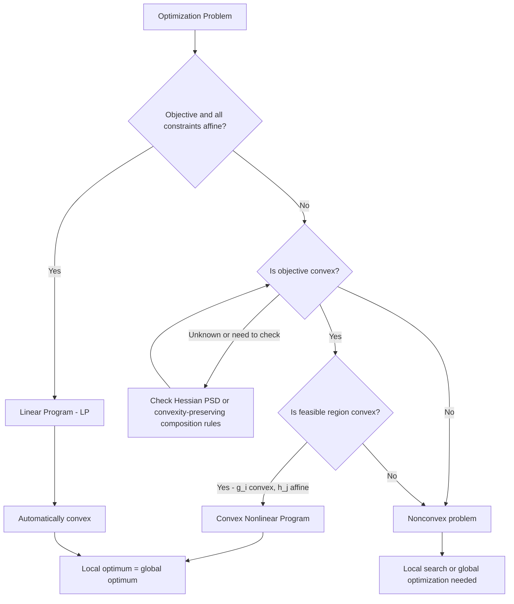

## Classification: Linear, Nonlinear, Convex, Nonconvex

### Overview

Classifying an optimization problem along these axes is arguably the single most consequential step before choosing a solution method, since each classification carries direct implications for solvability guarantees, algorithm choice, and expected computational cost. This module organizes the classification hierarchy, states the precise mathematical criteria for each category, and clarifies how the categories relate to (and are frequently confused with) one another — most notably, that "nonlinear" and "nonconvex" are not synonyms.

### Linear Problems

A problem is **linear** if both the objective function and every constraint function are **affine** in the decision variables:

$$f(x) = c^T x + d, \qquad g_i(x) = a_i^T x - b_i, \qquad h_j(x) = e_j^T x - f_j$$

A **linear program (LP)** is written:

$$\min_x \ c^T x \quad \text{subject to} \quad Ax \leq b, \quad Cx = d$$

**Key Points**

- Strictly speaking, "linear" in this context typically means **affine** (linear plus a constant offset), since a true linear function must satisfy $f(0) = 0$, whereas affine functions permit a nonzero constant term — the field's terminology uses "linear programming" for what is technically affine programming, and this usage is universal and well-established rather than a source of ambiguity in practice.
- Linear programs are always **convex** (both the objective and feasible region), since affine functions are simultaneously convex and concave — this makes LP the most structurally favorable problem class in the entire field.
- LPs are solvable to global optimality efficiently in practice via the simplex method or interior-point methods, and are solvable in polynomial time in the worst case via interior-point methods specifically.
- The feasible region of an LP is a polyhedron (or polytope, if bounded), as covered in the feasible-region module.

### Nonlinear Problems

A problem is **nonlinear** if the objective function or any constraint function is not affine. This is an extremely broad category — encompassing everything from mild nonlinearity (a single quadratic term) to highly irregular, discontinuous, or oscillatory functions — and is defined purely by the *absence* of the linear/affine property, not by any positive structural claim.

**Key Points**

- "Nonlinear programming" (NLP) is the general term covering this entire broad category; it is not itself a single algorithmic class but rather a superset containing many structurally distinct subclasses (convex NLP, quadratic programming, general non-convex NLP, etc.).
- Nonlinearity alone says nothing about solvability — a nonlinear problem may be very easy (e.g., a convex quadratic) or extremely difficult (e.g., a highly oscillatory non-convex function), which is precisely why the linear/nonlinear axis is treated as separate from the convex/nonconvex axis rather than as a proxy for difficulty.
- Common structured nonlinear subclasses with their own dedicated theory include quadratic programming (QP), quadratically constrained quadratic programming (QCQP), second-order cone programming (SOCP), and semidefinite programming (SDP) — several of which are convex despite being nonlinear.

**Example**$f(x) = x^2$ is nonlinear (it is not affine) but convex. $f(x) = \sin(x)$ is nonlinear and non-convex (it oscillates between concave and convex regions). Both are members of the broad "nonlinear" category, but they have almost nothing in common in terms of solvability.

### Convex Problems

A problem is **convex** if the objective function $f$ is convex (for minimization) and the feasible region $\mathcal{F}$ is convex — the latter holding whenever each inequality constraint function $g_i$ is convex and each equality constraint function $h_j$ is affine.

$$f(\lambda x + (1-\lambda)y) \leq \lambda f(x) + (1-\lambda) f(y) \quad \forall x,y \in \text{dom}(f),\ \lambda \in [0,1]$$

**Key Points**

- Convexity is defined **independently** of linearity: a problem can be convex and nonlinear simultaneously (e.g., minimizing a convex quadratic subject to convex quadratic constraints), which is why convex optimization is treated as its own subfield rather than as a mere special case of linear programming.
- The central theoretical payoff of convexity, established in the earlier module on local versus global optima, is that **every local minimum is a global minimum** — this single property is what makes convex problems tractable in a way that general nonconvex problems are not.
- Convex problems admit strong duality results (under mild conditions such as Slater's condition), efficient interior-point algorithms, and — critically — a certificate of global optimality that can be checked and trusted, rather than merely a report that a local search terminated.
- Recognizing convexity is not always visually obvious from a problem's algebraic form; standard techniques include checking that the Hessian of $f$ is positive semidefinite everywhere on the domain, or verifying that $f$ is built from convexity-preserving operations (sums, nonnegative scalings, pointwise maxima, and compositions satisfying specific monotonicity/convexity rules) applied to known convex functions.

**Example**$\min x_1^2 + x_2^2$ subject to $x_1^2 + x_2^2 \leq 4$ and $x_1 + x_2 = 1$ is convex: the objective is a convex quadratic, the inequality constraint function is convex, and the equality constraint is affine — despite every function involved being nonlinear.

### Nonconvex Problems

A problem is **nonconvex** if the objective is non-convex, or the feasible region is non-convex, or both. This includes the vast majority of nonlinear problems encountered in practice, particularly those arising from physical simulations, combinatorial structure, or highly interactive multi-variable relationships.

**Key Points**

- Nonconvex problems generally admit **no efficient algorithm with a global optimality guarantee** in the worst case; solvers either restrict to finding a local optimum (fast but unguaranteed globally), or use exponential-worst-case global methods (guaranteed but potentially very slow), or use heuristics with no formal guarantee at all.
- A problem can be nonconvex due to a nonconvex objective alone (over an otherwise convex feasible region), a nonconvex feasible region alone (over a convex objective), or both simultaneously — each source of nonconvexity has somewhat different practical implications, though all forfeit the local-implies-global guarantee.
- Nonconvexity commonly arises from: products or ratios of decision variables (bilinear or fractional terms), trigonometric or other oscillatory functions, integer/binary variable requirements (which make the feasible set discrete, hence trivially non-convex as a subset of $\mathbb{R}^n$ before relaxation), and non-convex physical models (e.g., certain non-convex energy functions in structural design).
- [Unverified] The practical difficulty of a specific nonconvex problem varies enormously and is not reliably predictable from the mere fact of nonconvexity alone; some nonconvex problems are efficiently solvable via specialized structure-exploiting methods (e.g., DC programming, certain polynomial optimization techniques), while others are provably NP-hard — the classification "nonconvex" is a necessary but not sufficient condition for assessing difficulty.

**Example**$\min x_1 x_2$ subject to $x_1 + x_2 = 1$, $x_1, x_2 \geq 0$ is nonconvex: the objective $x_1 x_2$ is a bilinear term that is neither convex nor concave over the full feasible region, even though every constraint here happens to be linear (illustrating that nonconvexity can originate purely from the objective).

### The Two Independent Axes

A common conceptual error is treating "linear vs. nonlinear" and "convex vs. nonconvex" as the same distinction, or assuming nonlinear implies nonconvex. They are **independent axes**, producing four genuinely distinct combinations:

|  | Convex | Nonconvex |
| --- | --- | --- |
| **Linear** | Linear Programs (always convex) | *(empty — linear/affine functions and polyhedra are always convex)* |
| **Nonlinear** | Convex QP, SOCP, SDP, general convex NLP | General NLP, bilinear/combinatorial problems, most non-convex engineering models |

**Key Points**

- The "Linear + Nonconvex" cell is structurally empty: affine objective functions are always convex (and concave), and polyhedral feasible regions (defined by linear constraints) are always convex — so a problem with every function affine cannot be non-convex under the standard definitions used here.
- This makes clear that **convexity, not linearity, is the property that actually governs solvability guarantees** — linearity is best understood as a special (particularly favorable) case within the broader convex category, rather than as a separate axis of difficulty.
- Practically, the question "is this problem convex?" is almost always more important to ask early than "is this problem linear?", since a nonlinear convex problem (e.g., a well-posed convex QP) can be far more tractable than a linear-looking problem with hidden non-convex structure (e.g., a linear objective over a feasible region restricted to integers, i.e., integer programming, which is generally NP-hard despite linear-looking constraints).

### Visual Overview of the Classification Space

<svg xmlns="http://www.w3.org/2000/svg" viewBox="0 0 900 460" font-family="Arial, sans-serif">
<text x="450" y="30" text-anchor="middle" font-size="18" font-weight="bold" fill="#1a1a1a">Linear/Nonlinear vs. Convex/Nonconvex Classification Space (svg_diagram)</text>
<line x1="150" y1="80" x2="150" y2="420" stroke="#333" stroke-width="1.5" />
<line x1="150" y1="420" x2="820" y2="420" stroke="#333" stroke-width="1.5" />
<text x="90" y="250" font-size="13" fill="#333" transform="rotate(-90 90 250)">Convex ←→ Nonconvex</text>
<text x="480" y="450" text-anchor="middle" font-size="13" fill="#333">Linear ←→ Nonlinear</text>
<rect x="180" y="100" width="280" height="140" fill="#cfe0ff" stroke="#3366cc" stroke-width="2" />
<text x="320" y="130" text-anchor="middle" font-size="13" font-weight="bold" fill="#1a2d66">Linear Programs</text>
<text x="320" y="155" text-anchor="middle" font-size="11" fill="#333">min c'x s.t. Ax&lt;=b</text>
<text x="320" y="175" text-anchor="middle" font-size="11" fill="#333">Always convex</text>
<text x="320" y="195" text-anchor="middle" font-size="11" fill="#333">Simplex, interior-point</text>
<text x="320" y="215" text-anchor="middle" font-size="11" fill="#333">Global optimum guaranteed</text>
<rect x="480" y="100" width="300" height="140" fill="#d6f5d6" stroke="#33994d" stroke-width="2" />
<text x="630" y="130" text-anchor="middle" font-size="13" font-weight="bold" fill="#1a662e">Convex Nonlinear</text>
<text x="630" y="155" text-anchor="middle" font-size="11" fill="#333">Convex QP, SOCP, SDP</text>
<text x="630" y="175" text-anchor="middle" font-size="11" fill="#333">Convex NLP</text>
<text x="630" y="195" text-anchor="middle" font-size="11" fill="#333">Interior-point, convex solvers</text>
<text x="630" y="215" text-anchor="middle" font-size="11" fill="#333">Global optimum guaranteed</text>
<rect x="180" y="260" width="280" height="30" fill="#eeeeee" stroke="#999" stroke-width="1" stroke-dasharray="4,3" />
<text x="320" y="280" text-anchor="middle" font-size="11" fill="#777">(empty region - not structurally possible)</text>
<rect x="480" y="260" width="300" height="140" fill="#ffd6d6" stroke="#cc3333" stroke-width="2" />
<text x="630" y="290" text-anchor="middle" font-size="13" font-weight="bold" fill="#7a1a1a">Nonconvex Nonlinear</text>
<text x="630" y="315" text-anchor="middle" font-size="11" fill="#333">General NLP, bilinear terms</text>
<text x="630" y="335" text-anchor="middle" font-size="11" fill="#333">Local search, multi-start,</text>
<text x="630" y="355" text-anchor="middle" font-size="11" fill="#333">global optimization heuristics</text>
<text x="630" y="375" text-anchor="middle" font-size="11" fill="#333">No general global guarantee</text>
</svg>

### Classification Decision Process

### Additional Structured Subclasses Worth Recognizing

**Key Points**

- **Quadratic Programming (QP)**: quadratic objective, linear constraints; convex if the quadratic form's matrix $Q$ is positive semidefinite.
- **Quadratically Constrained Quadratic Programming (QCQP)**: quadratic objective and quadratic constraints; convex if all quadratic forms involved are appropriately (positive/negative) semidefinite.
- **Second-Order Cone Programming (SOCP)**: constraints involve norms of affine expressions being bounded by another affine expression; always convex, and generalizes both LP and convex QP.
- **Semidefinite Programming (SDP)**: decision variables are matrices constrained to be positive semidefinite; always convex, and used heavily in control theory, combinatorial relaxations, and robust optimization.
- **Mixed-Integer Programming (MIP)**: some or all variables restricted to integers; the feasible region is inherently non-convex (as a subset of $\mathbb{R}^n$) due to the discreteness, even when the continuous relaxation (ignoring integrality) is convex — this is precisely why MIP problems are generally solved via branch-and-bound rather than direct convex methods.

**Conclusion**

Linearity and convexity are related but genuinely distinct classification axes: all linear problems are convex, but convexity extends well beyond linearity to cover a large and practically important class of nonlinear problems (QP, SOCP, SDP, and general convex NLP) that retain the crucial local-implies-global guarantee. The convex/nonconvex distinction — not the linear/nonlinear one — is what most directly determines whether an efficient, globally-guaranteed algorithm exists, making an early, deliberate check for convexity one of the highest-value steps in approaching any new optimization problem.

**Related Topics**

- Convex functions and convexity-preserving operations
- Karush–Kuhn–Tucker (KKT) conditions and constraint qualifications
- Interior-point methods for convex and linear programming
- Semidefinite programming and conic optimization
- Mixed-integer programming and branch-and-bound
- Duality theory and Slater's condition
- Global optimization methods for nonconvex problems
- DC programming and structured nonconvex optimization