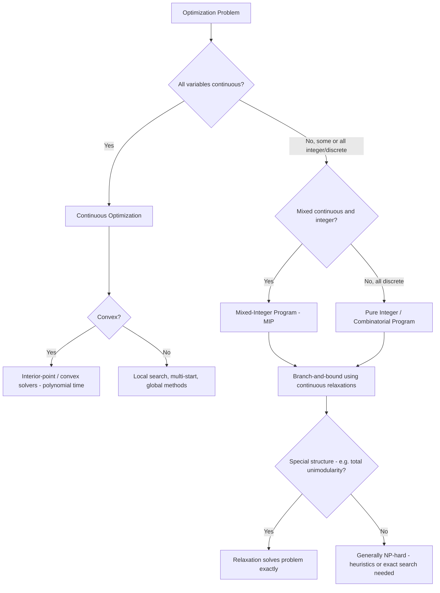

## Classification: Continuous Versus Discrete Optimization

### Overview

Alongside the linear/nonlinear and convex/nonconvex axes covered previously, the **continuous versus discrete** distinction is a third, largely independent classification axis based on the nature of the decision variables' domain rather than the shape of the objective or constraint functions. This distinction has arguably the largest single impact on algorithm choice and worst-case computational complexity of any classification covered so far, since it determines whether calculus-based tools (derivatives, gradients) are even applicable to the decision variables themselves.

### Continuous Optimization

In **continuous optimization**, decision variables are permitted to take any real value within their domain (subject to the constraints):

$$x \in \mathbb{R}^n \quad \text{(or a continuous subset thereof)}$$

**Key Points**

- Continuous optimization is the natural setting for calculus-based analysis: derivatives, gradients, and Hessians are well-defined with respect to continuous variables, enabling the entire apparatus of first- and second-order optimality conditions covered in earlier and later modules.
- All the problem classes discussed in the linear/nonlinear/convex/nonconvex module (LP, QP, SOCP, SDP, general NLP) are continuous optimization problems by default, since their variables range over $\mathbb{R}^n$ or subsets thereof.
- Continuous problems can still be extremely difficult if non-convex (as covered previously) — continuity of the domain does not by itself imply tractability; it only implies that derivative-based local tools are applicable.
- The feasible region in continuous optimization can be any of the geometric shapes discussed in the feasible-region module: polyhedra, curved convex regions, or complicated non-convex, possibly disconnected regions.

### Discrete Optimization

In **discrete optimization**, some or all decision variables are restricted to a discrete (typically finite or countable) set of values, most commonly integers:

$$x_i \in \mathbb{Z} \quad \text{or} \quad x_i \in \{0, 1\} \quad \text{or} \quad x_i \in \{v_1, v_2, \dots, v_k\}$$

**Key Points**

- **Integer programming (IP)** restricts all variables to integers; **binary (0-1) programming** restricts variables to $\{0,1\}$, typically encoding yes/no or selection decisions.
- Discrete feasible sets are inherently **non-convex** as subsets of $\mathbb{R}^n$ (a set of isolated points, or points confined to a lattice, cannot contain the line segment between two of its members in general) — this is precisely why discrete problems forfeit the convexity-based tractability results covered in the previous module, even when the underlying objective and continuous relaxation are convex.
- Because the feasible set is not a continuum, gradients and derivatives with respect to the discrete variables are not meaningful in the usual sense — there is no "small perturbation" of an integer variable that remains feasible and close by, which rules out direct application of continuous first-order optimality conditions to the discrete variables.
- **Combinatorial optimization** is a closely related term, generally referring to discrete problems where the feasible set has an explicit combinatorial structure (e.g., subsets, permutations, graphs, matchings) rather than simply "integer-valued vectors" — problems like the traveling salesman problem, minimum spanning tree, and graph coloring fall under this heading.

**Example**A facility-location problem where $y_i \in \{0,1\}$ indicates whether facility $i$ is opened is a binary program; a production-scheduling problem where $x_i \in \mathbb{Z}_{\geq 0}$ represents whole units of an indivisible product is a (nonnegative) integer program.

### Mixed-Integer Programming

**Mixed-Integer Programming (MIP)** combines both variable types in a single problem: some variables are continuous, others are restricted to integers.

$$\min_{x, y} \ f(x, y) \quad \text{subject to} \quad g(x,y) \leq 0, \quad h(x,y) = 0, \quad x \in \mathbb{R}^{n_1}, \quad y \in \mathbb{Z}^{n_2}$$

**Key Points**

- **Mixed-Integer Linear Programming (MILP)** — linear objective and constraints, with some integer variables — is the most widely used and best-supported discrete optimization class in commercial and open-source solvers, due to decades of algorithmic development.
- **Mixed-Integer Nonlinear Programming (MINLP)** combines both nonlinearity and integrality, and is generally the most computationally demanding class discussed in this module, since it inherits the difficulties of nonconvexity (if present) and the combinatorial explosion of discreteness simultaneously.
- MIP problems are typically solved via **branch-and-bound**, which recursively partitions the problem into subproblems with tighter integer restrictions, solving a continuous relaxation at each node to obtain a bound, and pruning subproblems whose bound cannot improve on the best known integer solution.

### The Continuous Relaxation

A central technique connecting continuous and discrete optimization is the **continuous (or LP) relaxation**: temporarily dropping the integrality restriction on discrete variables, solving the resulting continuous problem, and using its solution to guide or bound the discrete problem.

$$\text{Relaxation of } x \in \mathbb{Z} \ \text{ is } \ x \in \mathbb{R} \ \text{ with the same bounds}$$

**Key Points**

- The optimal value of the continuous relaxation always provides a **bound** on the optimal value of the original discrete problem (for a minimization problem, the relaxation's optimal value is less than or equal to the true integer-restricted optimal value, since the relaxation's feasible region strictly contains the discrete one).
- If the relaxation's optimal solution happens to already satisfy the integrality restrictions, it is automatically optimal for the discrete problem as well — no further discrete search is needed in that case.
- This relaxation-and-bound idea is the computational engine underlying branch-and-bound: at each node of the search tree, the relaxation provides a bound used to decide whether that branch can be pruned without being fully explored.
- [Unverified] How tight a continuous relaxation's bound is (how close the relaxed optimal value is to the true integer optimal value) varies enormously by problem structure and formulation; some formulations of the same underlying discrete problem produce much tighter relaxations than others, which is why formulation quality (discussed in the decision-variables module) is especially consequential in discrete optimization.

**Example**For a binary variable $y \in \{0,1\}$, the continuous relaxation is $0 \leq y \leq 1. If the relaxed LP solution naturally returns $y^* = 1
 or $y^* = 0$ at that variable, no branching is needed on it; if it returns a fractional value like $y^* = 0.6$, branching creates two subproblems — one fixing $y=0$, one fixing $y=1$ — for further exploration.

### Computational Complexity Implications

**Key Points**

- Continuous convex optimization problems (LP, convex QP, SOCP, SDP) are generally solvable in polynomial time using interior-point methods, meaning the computational effort scales manageably with problem size.
- Discrete optimization problems are, in general, **NP-hard**: no known algorithm solves all instances in polynomial time in the worst case, and it is widely (though not universally, given the unresolved P vs. NP question) believed that no such algorithm exists. This holds even for problems with a purely linear objective and linear constraints, once integrality is imposed — illustrating that the continuous/discrete axis, like the convex/nonconvex axis, governs solvability more fundamentally than the linear/nonlinear axis alone.
- [Unverified] "NP-hard in general" does not mean every individual discrete optimization instance is intractable in practice — many large-scale MILP instances arising from real applications are solved routinely and quickly by modern solvers due to problem-specific structure, effective heuristics, and decades of algorithmic engineering; worst-case complexity and typical-case practical performance are distinct notions that should not be conflated.
- Some discrete problems have special structure guaranteeing they are solvable in polynomial time despite integrality — for example, problems whose constraint matrix is **totally unimodular** (a specific combinatorial matrix property) have LP relaxations whose vertices are automatically integer-valued, meaning the continuous relaxation directly solves the discrete problem with no gap.

### Visual Comparison

<svg xmlns="http://www.w3.org/2000/svg" viewBox="0 0 900 440" font-family="Arial, sans-serif">
<text x="450" y="30" text-anchor="middle" font-size="18" font-weight="bold" fill="#1a1a1a">Continuous vs. Discrete Feasible Regions (svg_diagram)</text>

<text x="220" y="65" text-anchor="middle" font-size="14" font-weight="bold" fill="`#2a4d9c`">Continuous Feasible Region</text>

<rect x="100" y="90" width="240" height="240" fill="`#f5f5f5`" stroke="#ccc" stroke-width="1" />

<polygon points="120,290 200,120 320,150 300,300 150,310" fill="`#cfe0ff`" stroke="`#3366cc`" stroke-width="2" />

<text x="220" y="355" text-anchor="middle" font-size="11" fill="#555">Every point in the shaded</text>

<text x="220" y="372" text-anchor="middle" font-size="11" fill="#555">region is feasible</text>

<text x="220" y="389" text-anchor="middle" font-size="11" fill="#555">Gradients well-defined everywhere</text>

<text x="670" y="65" text-anchor="middle" font-size="14" font-weight="bold" fill="`#994d00`">Discrete (Integer) Feasible Set</text>

<rect x="550" y="90" width="240" height="240" fill="`#f5f5f5`" stroke="#ccc" stroke-width="1" />

<polygon points="570,290 650,120 770,150 750,300 600,310" fill="none" stroke="`#cccccc`" stroke-width="1.5" stroke-dasharray="4,3" />

<circle cx="600" cy="270" r="4" fill="`#cc7a33`" />

<circle cx="620" cy="230" r="4" fill="`#cc7a33`" />

<circle cx="640" cy="190" r="4" fill="`#cc7a33`" />

<circle cx="660" cy="270" r="4" fill="`#cc7a33`" />

<circle cx="680" cy="230" r="4" fill="`#cc7a33`" />

<circle cx="700" cy="180" r="4" fill="`#cc7a33`" />

<circle cx="720" cy="250" r="4" fill="`#cc7a33`" />

<circle cx="700" cy="290" r="4" fill="`#cc7a33`" />

<text x="670" y="355" text-anchor="middle" font-size="11" fill="#555">Only isolated lattice points</text>

<text x="670" y="372" text-anchor="middle" font-size="11" fill="#555">are feasible (dashed = relaxation)</text>

<text x="670" y="389" text-anchor="middle" font-size="11" fill="#555">No meaningful local gradient</text>

</svg>

### Classification and Algorithm Selection

### Solution Method Families by Category

**Key Points**

- **Continuous, convex**: interior-point methods, first-order methods (gradient descent, accelerated gradient), specialized conic solvers for SOCP/SDP — generally the most computationally favorable category discussed across all three classification modules.
- **Continuous, nonconvex**: gradient-based local search combined with multi-start, simulated annealing, genetic algorithms, or specialized global optimization techniques (e.g., branch-and-bound adapted to continuous variables with valid convex relaxations at each node).
- **Discrete (MILP/MINLP)**: branch-and-bound, branch-and-cut (adding valid inequalities to tighten relaxations), branch-and-price (column generation for large-scale problems), and metaheuristics (genetic algorithms, tabu search) for problems too large for exact methods.
- **Pure combinatorial structure** (graphs, permutations, matchings): often benefit from specialized polynomial-time algorithms exploiting the specific combinatorial structure (e.g., network simplex for flow problems, Kruskal's or Prim's algorithm for minimum spanning trees) rather than general-purpose MIP solvers.

### Interaction with the Other Classification Axes

**Key Points**

- The continuous/discrete axis is **largely independent** of the linear/nonlinear and convex/nonconvex axes discussed previously: a problem can be linear-and-discrete (MILP), nonlinear-and-discrete (MINLP), linear-and-continuous (LP), or nonlinear-and-continuous (general NLP, convex or not).
- A useful way to synthesize all three axes: linearity/convexity describe the *shape* of the objective and constraints, while continuity/discreteness describe the *nature of the domain* — both must be assessed, since favorable structure on one axis does not compensate for unfavorable structure on the other (e.g., a linear objective over a discrete feasible set is still generally NP-hard, despite the objective being maximally simple).
- [Inference] In practice, the discrete/continuous classification is often the first practical question asked when scoping a new optimization problem, since it determines whether the problem falls into the polynomial-time-solvable convex-continuous regime or the generally NP-hard discrete regime — a distinction with major implications for expected solve time and the realistic scale of problem that can be tackled.

**Conclusion**

The continuous versus discrete classification governs whether calculus-based optimality tools apply directly to the decision variables, and — together with convexity — is one of the two most important determinants of a problem's fundamental computational tractability. While continuous convex problems generally admit efficient, globally-guaranteed solution methods, the introduction of integer or combinatorial restrictions typically forfeits polynomial-time solvability in the worst case, shifting the computational burden toward relaxation-based bounding techniques like branch-and-bound. Recognizing which regime a problem falls into — and whether it possesses special structure (such as total unimodularity) that restores tractability — is essential for setting realistic expectations about solvability before selecting an algorithm.

**Related Topics**

- Branch-and-bound and branch-and-cut algorithms
- Total unimodularity and integral polyhedra
- Combinatorial optimization: graphs, matchings, and network flows
- Cutting-plane methods and valid inequalities
- Column generation and branch-and-price
- NP-hardness and computational complexity theory
- Heuristics and metaheuristics for large-scale discrete problems
- Lagrangian relaxation for integer programming bounds