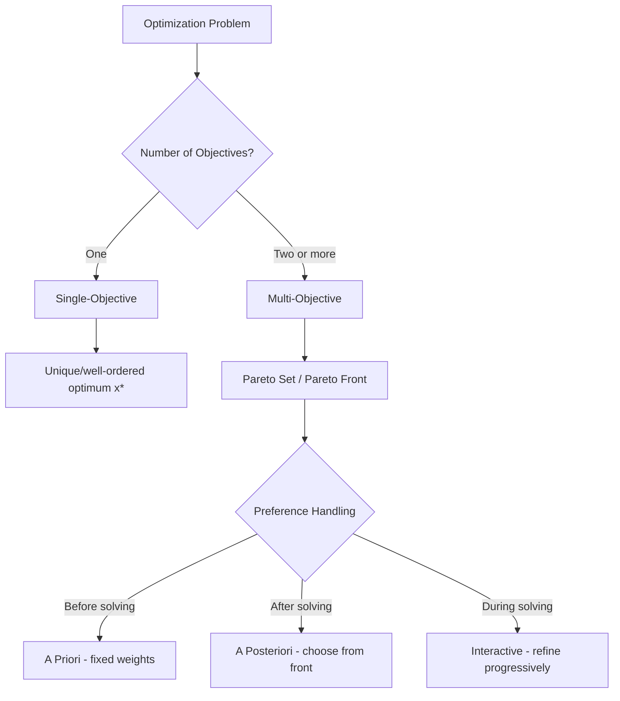

## Single-Objective versus Multi-Objective Optimization

### Overview

Optimization problems are classified by the number of objective functions being optimized simultaneously. This classification determines the mathematical structure of the solution set, the algorithms applicable, and how a "best" solution is even defined.

### Single-Objective Optimization

**Definition**

A single-objective optimization problem seeks to minimize or maximize exactly one scalar-valued objective function, subject to a set of constraints:

$$\min_{x \in \Omega} f(x), \quad \text{subject to } g_i(x) \leq 0, \; h_j(x) = 0$$

where $f: \mathbb{R}^n \to \mathbb{R}$ is the objective function, $x$ is the decision variable vector, and $\Omega$ is the feasible region defined by constraints $g_i$ (inequality) and $h_j$ (equality).

**Key Points**

- The solution is a well-ordered comparison: for any two feasible points $x_1, x_2$, one can always say $f(x_1) \leq f(x_2)$, $f(x_1) \geq f(x_2)$, or $f(x_1) = f(x_2)$.
- The goal is a single optimal point $x^*$ (or a set of points sharing the same optimal value, in degenerate cases).
- Optimality conditions such as the Karush-Kuhn-Tucker (KKT) conditions apply directly, without modification.
- Convergence of an algorithm can be measured by tracking a single scalar value across iterations.

**Example**

Minimizing manufacturing cost $C(x)$ where $x$ represents production quantities:

$$\min_{x} C(x) = 50x_1 + 30x_2, \quad \text{subject to } x_1 + x_2 \leq 100, \; x_1, x_2 \geq 0$$

This has one measure of success (cost), so any feasible point can be directly ranked against any other.

### Multi-Objective Optimization

**Definition**

A multi-objective optimization problem (also called vector optimization) involves two or more objective functions evaluated simultaneously:

$$\min_{x \in \Omega} \mathbf{F}(x) = [f_1(x), f_2(x), \ldots, f_k(x)]^T, \quad k \geq 2$$

Because $\mathbf{F}(x)$ is vector-valued, there is generally no single $x$ that minimizes all $f_i(x)$ at once, since objectives frequently conflict.

**Key Points**

- Objectives are typically in tension. Improving one (e.g., minimizing cost) often worsens another (e.g., minimizing delivery time).
- Because a strict total ordering of solutions does not generally exist, the standard notion of "the optimum" is replaced by **Pareto optimality**.
- A solution $x^*$ is **Pareto optimal** (non-dominated) if no other feasible $x$ exists such that $f_i(x) \leq f_i(x^*)$ for all $i$, with strict inequality for at least one $i$. [Inference: whether this is the exact definition applied depends on the convention (weak vs. strict Pareto dominance) used in a given source or solver.]
- The set of all Pareto-optimal solutions in decision space is the **Pareto set**; its image in objective space is the **Pareto front**.
- The output of a multi-objective solver is generally not one point but an entire front of mutually non-dominated trade-off solutions.

**Example**

Designing a bridge with two competing objectives: minimize material cost $f_1(x)$ and minimize structural deflection $f_2(x)$:

$$\min_{x} [f_1(x), f_2(x)]$$

A cheaper design typically deflects more under load; a stiffer design typically costs more. Neither objective can be improved without degrading the other at the Pareto-optimal boundary, so the solver returns a range of designs (the Pareto front) rather than a single "best" bridge.

### Structural Comparison

<svg xmlns="http://www.w3.org/2000/svg" viewBox="0 0 760 380">
  \<style\>
    .title { font: bold 16px sans-serif; fill: #1a1a1a; }
    .label { font: 13px sans-serif; fill: #1a1a1a; }
    .small { font: 11px sans-serif; fill: #555; }
    .axis { stroke: #444; stroke-width: 1.5; }
    .pareto { stroke: #c0392b; stroke-width: 2.5; fill: none; }
    .dot { fill: #2980b9; }
    .dominated { fill: #aaa; }
    .box { fill: #f4f4f4; stroke: #999; stroke-width: 1; }
  \</style\>

  <text x="20" y="24" class="title">Single-Objective vs Multi-Objective Optimization (svg_diagram)</text>

  
  <rect x="20" y="50" width="330" height="300" class="box" />
  <text x="35" y="75" class="label" font-weight="bold">Single-Objective</text>
  <line x1="60" y1="300" x2="60" y2="90" class="axis" />
  <line x1="60" y1="300" x2="320" y2="300" class="axis" />
  <text x="30" y="90" class="small">f(x)</text>
  <text x="290" y="320" class="small">x</text>
  <path d="M 60 260 Q 130 100 190 260 Q 250 380 320 200" fill="none" stroke="#2980b9" stroke-width="2.5" />
  <circle cx="190" cy="260" r="6" class="dot" />
  <text x="200" y="255" class="small">x* (unique optimum)</text>

  
  <rect x="400" y="50" width="330" height="300" class="box" />
  <text x="415" y="75" class="label" font-weight="bold">Multi-Objective</text>
  <line x1="440" y1="300" x2="440" y2="90" class="axis" />
  <line x1="440" y1="300" x2="700" y2="300" class="axis" />
  <text x="410" y="90" class="small">f2(x)</text>
  <text x="670" y="320" class="small">f1(x)</text>

  
  <circle cx="560" cy="230" r="5" class="dominated" />
  <circle cx="600" cy="200" r="5" class="dominated" />
  <circle cx="520" cy="180" r="5" class="dominated" />
  <text x="565" y="245" class="small">dominated solutions</text>

  
  <path d="M 470 110 Q 520 130 560 170 Q 610 220 670 280" class="pareto" />
  <circle cx="480" cy="115" r="4" fill="#c0392b" />
  <circle cx="540" cy="150" r="4" fill="#c0392b" />
  <circle cx="600" cy="205" r="4" fill="#c0392b" />
  <circle cx="660" cy="270" r="4" fill="#c0392b" />
  <text x="470" y="100" class="small" fill="#c0392b">Pareto front</text>
</svg>

### Decision-Making Implications

**Key Points**

- Single-objective problems terminate in an algorithmic decision: the solver returns $x^*$, and no further human judgment on trade-offs is required (only judgment on model correctness).
- Multi-objective problems terminate in a *choice*: after the Pareto front is computed, a decision-maker must select one point from it based on preferences, priorities, or downstream criteria not encoded in $f_1, \ldots, f_k$.
- This preference articulation can happen at three different stages relative to the optimization run: **a priori** (weights or preferences fixed before solving), **a posteriori** (the full Pareto front is generated first, then a point is chosen), or **interactive** (preferences are refined progressively during solving). [Unverified: terminology for these three modes is fairly standard across the multi-objective optimization literature, but exact phase boundaries can vary by source.]
- A common technique for converting a multi-objective problem into a single-objective one is **scalarization** — e.g., the weighted sum method $f(x) = \sum_i w_i f_i(x)$ — but this requires the decision-maker to fix trade-off weights $w_i$ in advance, which reintroduces the a priori choice problem it was meant to sidestep.

### Relationship Diagram

### Conclusion

The single- versus multi-objective distinction is foundational to problem formulation because it determines whether "optimal" refers to one point or a whole trade-off frontier. Correctly identifying which category a real-world problem falls into — rather than forcing a multi-objective situation into a single scalarized objective without acknowledging the trade-off being made — is a prerequisite for choosing appropriate solution methods later in the course.

**Related Topics**

- Pareto dominance and Pareto optimality (formal definitions and properties)
- Scalarization techniques (weighted sum, ε-constraint method, goal programming)
- Evolutionary multi-objective algorithms (NSGA-II, MOEA/D)
- Convexity and its role in guaranteeing global optimality
- Constrained versus unconstrained optimization
- Continuous versus discrete/combinatorial optimization