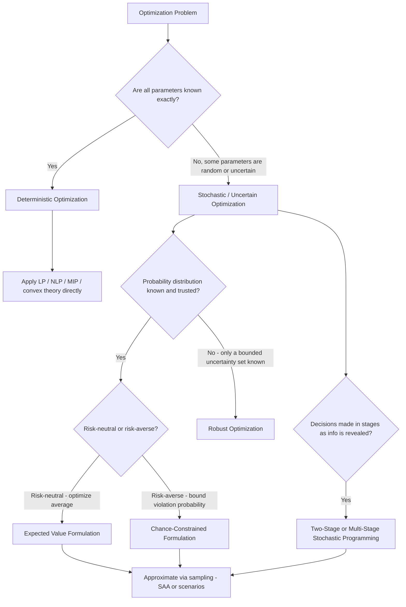

## Classification: Deterministic Versus Stochastic Problems

### Overview

The final classification axis in this foundational sequence concerns whether the data defining an optimization problem — objective coefficients, constraint parameters, or the environment itself — is known exactly in advance, or subject to uncertainty. This distinction is largely independent of the linear/nonlinear, convex/nonconvex, continuous/discrete, and single/multi-objective axes covered previously, and determines whether the classical machinery developed so far applies directly or must be extended to explicitly account for randomness, incomplete information, or a decision-maker's attitude toward risk.

### Deterministic Optimization

A **deterministic optimization problem** is one in which every parameter — objective coefficients, constraint bounds, and constraint functions — is known exactly and fixed at the time the problem is solved:

$$\min_{x \in \mathcal{F}} f(x), \qquad \mathcal{F} = \{x : g_i(x) \leq 0,\ h_j(x) = 0\}$$

with no randomness anywhere in $f$, $g_i$, or $h_j$.

**Key Points**

- All problem classes and theory developed in the preceding modules (LP, convex optimization, KKT conditions, MIP, multi-objective optimization) are implicitly deterministic unless explicitly stated otherwise — determinism is the default assumption underlying most classical optimization theory.
- Determinism does not imply simplicity: a deterministic problem can still be highly nonlinear, non-convex, or discrete and thus computationally difficult; the deterministic/stochastic axis concerns the *nature of the input data*, not the *difficulty of the resulting problem*.
- A solved deterministic problem yields a single, reproducible optimal solution and optimal value — running the same solver on the same deterministic inputs always produces the same answer (modulo numerical tie-breaking or solver-specific behavior in degenerate cases).

### Stochastic Optimization

A **stochastic optimization problem** involves parameters that are random variables with a known (or estimated) probability distribution, rather than fixed known values. The decision-maker must choose $x$ while accounting for this uncertainty, typically before the random outcome is revealed.

**Key Points**

- Stochastic optimization requires an explicit choice of **how** to handle the randomness in the objective and constraints, since "minimize $f(x, \xi)$" is not well-defined on its own when $\xi$ is random — $f(x,\xi)$ takes a different value for each possible realization of $\xi$, so the problem must specify what scalar summary of this randomness is actually being optimized.
- The randomness can enter in several places: uncertain objective coefficients (e.g., uncertain future prices), uncertain constraint parameters (e.g., uncertain resource availability), or an uncertain constraint structure itself (e.g., a random subset of constraints being active, as in chance-constrained problems below).
- Two major fields sit under this heading: **stochastic programming** (which typically assumes a known probability distribution for the uncertain parameters, often via a finite set of discrete scenarios) and **stochastic optimization/approximation** more broadly (which includes methods like stochastic gradient descent that operate on noisy estimates of the objective or its gradient rather than requiring an explicit distributional model).

### Common Formulations for Handling Uncertainty

**Expected value formulation** replaces the random objective with its expectation:

$$\min_{x \in \mathcal{F}} \ \mathbb{E}_\xi[f(x, \xi)]$$

This is the most common approach when the decision-maker is optimizing average long-run performance and is risk-neutral.

**Key Points**

- The expected-value approach is computationally convenient because, for many distributions, $\mathbb{E}_\xi[f(x,\xi)]$ can be approximated via a finite sum over sampled or discretized scenarios, converting the stochastic problem into a large but deterministic optimization problem.
- Expected-value optimization by itself provides no protection against poor outcomes in unlikely but severe scenarios — a solution can have excellent average performance while performing very badly in the tail of the distribution, which motivates the risk-aware formulations discussed below.

**Chance-constrained formulation** requires a constraint to hold with at least a specified probability, rather than with certainty:

$$\min_{x \in \mathcal{F}} \ f(x) \quad \text{subject to} \quad \mathbb{P}\big(g(x, \xi) \leq 0\big) \geq 1 - \alpha$$

where $\alpha \in (0,1)$ is a small tolerance for constraint violation (e.g., $\alpha = 0.05$ permits violation in at most 5% of outcomes).

**Key Points**

- Chance constraints are natural whenever absolute guaranteed feasibility is either impossible (due to unbounded-support randomness) or unnecessarily conservative relative to the real-world tolerance for occasional violation (e.g., a power grid capacity constraint that can be exceeded rarely without catastrophic failure).
- [Unverified] Chance constraints are generally non-convex even when $g(x,\xi)$ is convex in $x$ for each fixed $\xi$, except under specific distributional assumptions (e.g., certain formulations with jointly normal random parameters and appropriate structure) — convexity of chance-constrained problems must be verified case-by-case rather than assumed.

**Robust optimization formulation** protects against the worst case within a defined uncertainty set $\mathcal{U}$, without requiring a probability distribution at all:

$$\min_{x \in \mathcal{F}} \ \max_{\xi \in \mathcal{U}} f(x, \xi)$$

**Key Points**

- Robust optimization is appropriate when a reliable probability distribution for the uncertainty is unavailable or untrustworthy, and the decision-maker instead specifies only a bounded set of plausible parameter values (e.g., an interval or ellipsoid) that must all be protected against.
- Robust formulations tend to be more conservative than expected-value or chance-constrained formulations, since they optimize for the single worst realization within $\mathcal{U}$ rather than for typical or probable outcomes — this conservatism is a deliberate trade-off for not requiring distributional assumptions.
- The size and shape of the uncertainty set $\mathcal{U}$ directly controls the trade-off between robustness and performance: a larger $\mathcal{U}$ yields a more conservative (worse average-case, better worst-case) solution.

### Two-Stage and Multi-Stage Stochastic Programming

Many stochastic problems involve a sequence of decisions interspersed with the revelation of uncertain information. **Two-stage stochastic programming** separates decisions into a **first-stage** decision made before uncertainty is revealed, and a **second-stage (recourse)** decision made after:

$$\min_{x} \ c^T x + \mathbb{E}_\xi\big[Q(x, \xi)\big], \qquad Q(x,\xi) = \min_{y} \ q(\xi)^T y \ \text{ s.t. } \ W y = h(\xi) - Tx,\ y \geq 0$$

**Key Points**

- The first-stage variable $x$ must be fixed identically across all possible future scenarios (a "here-and-now" decision), while the second-stage variable $y$ can adapt to whichever scenario $\xi$ actually occurs (a "wait-and-see" or **recourse** decision).
- $Q(x,\xi)$, the optimal recourse cost given first-stage decision $x$ and realized scenario $\xi$, is called the **recourse function**; its expectation over all scenarios is what makes the outer problem stochastic even though each inner (second-stage) problem is itself a deterministic optimization problem.
- **Multi-stage stochastic programming** generalizes this to more than two decision points, with uncertainty revealed incrementally and decisions at each stage able to adapt to all information revealed so far — common in multi-period financial planning and inventory management, though the resulting problems grow rapidly in size with the number of stages and scenarios (a phenomenon sometimes described as the "curse of dimensionality" in this context).
- In practice, the continuous probability distribution of $\xi$ is frequently approximated by a finite set of discrete **scenarios**, each with an associated probability, turning the expectation into a finite weighted sum and the overall problem into a large-scale but deterministic optimization problem solvable with standard techniques.

### Visual Comparison of Uncertainty-Handling Approaches

<svg xmlns="http://www.w3.org/2000/svg" viewBox="0 0 900 460" font-family="Arial, sans-serif">
<text x="450" y="30" text-anchor="middle" font-size="18" font-weight="bold" fill="#1a1a1a">Approaches to Optimization Under Uncertainty (svg_diagram)</text>
<rect x="60" y="70" width="240" height="160" rx="10" fill="#cfe0ff" stroke="#3366cc" stroke-width="2" />
<text x="180" y="98" text-anchor="middle" font-size="13" font-weight="bold" fill="#1a2d66">Expected Value</text>
<text x="180" y="122" text-anchor="middle" font-size="11" fill="#333">min E[f(x, xi)]</text>
<text x="180" y="150" text-anchor="middle" font-size="11" fill="#333">Optimizes average</text>
<text x="180" y="168" text-anchor="middle" font-size="11" fill="#333">performance</text>
<text x="180" y="196" text-anchor="middle" font-size="11" fill="#333">Risk-neutral assumption</text>
<text x="180" y="214" text-anchor="middle" font-size="11" fill="#333">No tail protection</text>
<rect x="330" y="70" width="240" height="160" rx="10" fill="#fff3e6" stroke="#cc7a33" stroke-width="2" />
<text x="450" y="98" text-anchor="middle" font-size="13" font-weight="bold" fill="#994d00">Chance-Constrained</text>
<text x="450" y="122" text-anchor="middle" font-size="11" fill="#333">P(g(x,xi) &lt;= 0) &gt;= 1-a</text>
<text x="450" y="150" text-anchor="middle" font-size="11" fill="#333">Allows rare violation</text>
<text x="450" y="168" text-anchor="middle" font-size="11" fill="#333">up to tolerance alpha</text>
<text x="450" y="196" text-anchor="middle" font-size="11" fill="#333">Requires probability</text>
<text x="450" y="214" text-anchor="middle" font-size="11" fill="#333">distribution of xi</text>
<rect x="600" y="70" width="240" height="160" rx="10" fill="#ffd6d6" stroke="#cc3333" stroke-width="2" />
<text x="720" y="98" text-anchor="middle" font-size="13" font-weight="bold" fill="#7a1a1a">Robust Optimization</text>
<text x="720" y="122" text-anchor="middle" font-size="11" fill="#333">min max f(x, xi)</text>
<text x="720" y="122" font-size="11" />
<text x="720" y="150" text-anchor="middle" font-size="11" fill="#333">Protects worst case</text>
<text x="720" y="168" text-anchor="middle" font-size="11" fill="#333">within uncertainty set U</text>
<text x="720" y="196" text-anchor="middle" font-size="11" fill="#333">No distribution needed,</text>
<text x="720" y="214" text-anchor="middle" font-size="11" fill="#333">but most conservative</text>
<rect x="150" y="280" width="600" height="130" rx="10" fill="#f5f5f5" stroke="#999" stroke-width="1" />
<text x="450" y="305" text-anchor="middle" font-size="12" font-weight="bold" fill="#333">Common trade-off spectrum</text>
<text x="450" y="330" text-anchor="middle" font-size="11" fill="#555">Expected value: best average performance, weakest guarantees</text>
<text x="450" y="352" text-anchor="middle" font-size="11" fill="#555">Chance-constrained: tunable middle ground via tolerance alpha</text>
<text x="450" y="374" text-anchor="middle" font-size="11" fill="#555">Robust: strongest guarantee, most conservative / costly solution</text>
<text x="450" y="396" text-anchor="middle" font-size="11" fill="#555">Choice depends on available distributional information and risk tolerance</text>
</svg>

### Sample Average Approximation and Simulation-Based Methods

**Key Points**

- **Sample Average Approximation (SAA)** replaces the true expectation $\mathbb{E}_\xi[f(x,\xi)]$ with an average over a finite set of Monte Carlo samples drawn from the distribution of $\xi$, converting the stochastic problem into a deterministic (but potentially large) approximation solvable with standard techniques.
- **Stochastic gradient methods** (including stochastic gradient descent and its variants) do not require an explicit distributional model at all; instead, they use noisy, unbiased estimates of the gradient (often from a single sample or mini-batch) at each iteration — this approach underlies the training of most modern machine learning models, where the "distribution" is effectively the empirical data-generating process rather than an explicitly modeled random variable.
- [Unverified] The number of samples or scenarios needed for a sample-average or scenario-based approximation to reliably approximate the true stochastic problem depends on the variance of the underlying randomness and the desired solution accuracy; this is typically assessed empirically (e.g., via out-of-sample validation) rather than through a single universal formula.

### Classification and Formulation Selection

### Practical Considerations in Choosing an Uncertainty Approach

**Key Points**

- **Data availability** is often the deciding factor: a reliable historical dataset supports fitting a probability distribution (favoring expected-value or chance-constrained formulations), while sparse or untrustworthy data favors robust optimization's distribution-free guarantees.
- **Consequence severity** matters independently of probability: even a low-probability event may warrant robust or chance-constrained treatment if its consequences are severe (e.g., structural failure, safety violations), whereas a purely cost-driven application may reasonably accept expected-value optimization.
- **Computational cost** scales differently across approaches: expected-value formulations via scenario sampling can become very large (many scenarios), robust formulations can require solving a nested min-max structure, and multi-stage stochastic programs can grow combinatorially with the number of stages — the appropriate method often depends on what is computationally tractable at the required problem scale, not solely on which is theoretically most appropriate.
- [Inference] In applied practice, many organizations start with a deterministic formulation using point estimates (e.g., expected or nominal values) for planning purposes, and only introduce explicit stochastic or robust modeling once deterministic solutions are found to be insufficiently reliable or when uncertainty is judged to be a first-order concern for the specific decision at hand.

**Conclusion**

The deterministic/stochastic classification determines whether an optimization problem's inputs are treated as fixed and known, or as uncertain quantities requiring an explicit choice of formulation — expected value, chance-constrained, robust, or staged recourse — before classical optimization theory can be applied. Because this axis is independent of linearity, convexity, discreteness, and the number of objectives, a real-world problem's full classification typically requires assessing all of these axes together: a stochastic problem can still be linear, convex, discrete, and single- or multi-objective, with the uncertainty-handling method layered on top of whichever underlying structure the deterministic version of the problem would otherwise have.

**Related Topics**

- Stochastic programming and scenario generation
- Robust optimization and uncertainty set design
- Chance-constrained programming and convexity conditions
- Two-stage and multi-stage recourse models
- Stochastic gradient descent and online optimization
- Sample average approximation and out-of-sample validation
- Risk measures: Value-at-Risk and Conditional Value-at-Risk
- Distributionally robust optimization