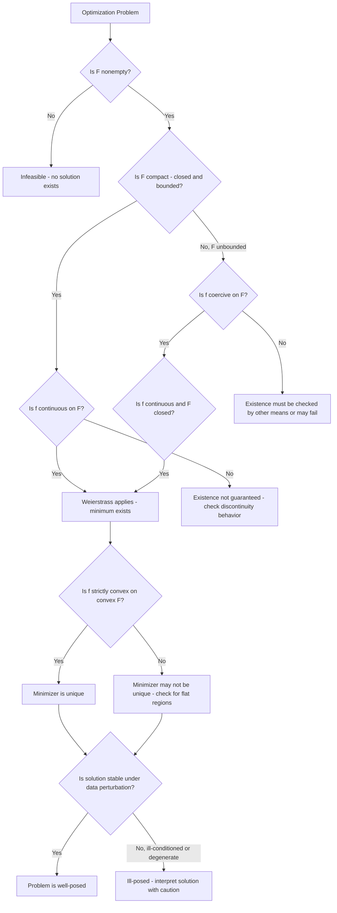

## Well-Posedness and Existence of Solutions

### Overview

Before applying any algorithm to an optimization problem, a foundational question must be answered: does a solution actually exist, and is the problem "well-behaved" enough that a solution — if found — can be trusted as meaningful? This module synthesizes concepts introduced across the preceding modules (feasibility, boundedness, compactness, convexity, functional-analytic existence theory) into a unified treatment of **well-posedness**, closing out the foundational classification sequence before optimality conditions are addressed in the next set of modules.

### Hadamard's Definition of Well-Posedness

A problem is classically defined (following Jacques Hadamard's original formulation for differential equations, later adapted to optimization) to be **well-posed** if it satisfies three conditions:

1. **Existence**: a solution exists.
2. **Uniqueness**: the solution is unique.
3. **Stability**: the solution depends continuously on the problem's data (small changes in the input produce small changes in the solution).

A problem failing any of these three conditions is called **ill-posed**.

**Key Points**

- In optimization specifically, "solution" in this definition refers to the optimal value and/or the optimal solution set, and each of the three conditions can fail independently of the other two — a problem can have existence and stability without uniqueness (e.g., multiple global minimizers achieving the same optimal value), or existence and uniqueness without stability.
- Hadamard's original three conditions were developed for differential equations, and the optimization community has adapted them with some variation in emphasis; in practice, existence and stability tend to receive the most direct attention in optimization theory, since uniqueness is often explicitly not required (many practical problems are content with finding *an* optimal solution among possibly several).
- [Unverified] Some references relax the well-posedness definition for optimization specifically to require only existence and a suitable stability/continuity property, treating uniqueness as a separate, optional refinement rather than a strict requirement — terminology and emphasis vary somewhat by source.

### Existence of Solutions: The Weierstrass Extreme Value Theorem

The single most important classical existence result, previewed in the functional-analysis and feasible-region modules, is the **Weierstrass Extreme Value Theorem**:

**Theorem.** If $\mathcal{F} \subseteq \mathbb{R}^n$ is nonempty and compact, and $f: \mathcal{F} \to \mathbb{R}$ is continuous, then $f$ attains a global minimum and a global maximum on $\mathcal{F}$.

**Key Points**

- Compactness in $\mathbb{R}^n$ is equivalent to being closed and bounded (Heine–Borel theorem, covered in the feasible-region module), so verifying existence via this theorem reduces to three checks: (1) $\mathcal{F} \neq \emptyset$ (feasibility), (2) $\mathcal{F}$ is closed, and (3) $\mathcal{F}$ is bounded, together with (4) $f$ continuous on $\mathcal{F}$.
- This theorem provides only a **sufficient** condition for existence, not a necessary one — many problems with unbounded or non-compact feasible regions still have solutions, so failing this theorem's hypotheses does not by itself prove non-existence; it simply means a different argument is required.
- The theorem guarantees existence but says nothing about uniqueness or how to find the minimizer computationally — it is a pure existence result, complementary to (not a substitute for) the algorithmic machinery covered elsewhere in this course.

### Existence Without Compactness: Coercivity

Many practical problems have unbounded feasible regions (e.g., $\mathcal{F} = \mathbb{R}^n$ or a half-space), where the Weierstrass theorem's hypotheses do not directly apply. Existence can still be guaranteed if the objective function is **coercive**:

$$f(x) \to +\infty \quad \text{as} \quad \|x\| \to \infty, \ x \in \mathcal{F}$$

**Theorem.** If $\mathcal{F}$ is nonempty and closed, $f$ is continuous on $\mathcal{F}$, and $f$ is coercive on $\mathcal{F}$, then $f$ attains a global minimum on $\mathcal{F}$.

**Key Points**

- The reasoning behind this result: coercivity guarantees that points far from the origin have arbitrarily large objective value, so the minimum (if it exists at all in a bounded neighborhood) cannot be "pushed to infinity" — effectively, coercivity allows restricting attention to a sufficiently large closed and bounded (hence compact) subset of $\mathcal{F}$, then applying Weierstrass on that subset.
- Coercivity is a common and checkable sufficient condition in convex optimization — for example, a strictly convex quadratic $f(x) = x^T Q x$ with $Q$ positive definite is coercive on all of $\mathbb{R}^n$, guaranteeing a minimizer exists even though $\mathbb{R}^n$ itself is unbounded.
- Without coercivity (or compactness), an objective can be bounded below on an unbounded feasible region yet still fail to attain its infimum — for example, $f(x) = e^{-x}$ on $\mathcal{F} = [0, \infty)$ is bounded below by $0$ but never actually equals $0$ for any finite $x$, so no minimizer exists despite the infimum being well-defined.

**Example**$\min_{x \in \mathbb{R}^2} x_1^2 + x_2^2$ (no constraints) has feasible region $\mathbb{R}^2$, which is closed but not bounded, so Weierstrass alone does not apply directly. However, $f$ is coercive (it grows without bound as $\|x\| \to \infty$), so a global minimizer exists — in this case, at $x = (0,0)$.

### Failure Modes: How Existence Can Fail

**Key Points**

- **Infeasibility** ($\mathcal{F} = \emptyset$): trivially, no solution exists if no point satisfies the constraints — the most basic and easily checked existence failure.
- **Unboundedness of the objective**: if $f$ is unbounded below on $\mathcal{F}$ (for a minimization problem), no finite optimal value exists — e.g., minimizing $f(x) = -x$ over $\mathcal{F} = \mathbb{R}$ has no solution since $f \to -\infty$ as $x \to \infty$.
- **Unattained infimum**: the infimum of $f$ over $\mathcal{F}$ can be finite yet never actually achieved at any feasible point, typically because the feasible region is open (excludes its own boundary) or non-compact in a way that lets a minimizing sequence "escape" — as illustrated by the $e^{-x}$ example above, and by open feasible regions discussed in the feasible-region module.
- **Discontinuity of the objective**: if $f$ is discontinuous, even a compact feasible region does not guarantee attainment of a minimum — for example, a function with a removable-looking jump discontinuity can have its infimum approached but not attained at the discontinuity point, since Weierstrass's theorem explicitly requires continuity as a hypothesis.

### Uniqueness of Solutions

Even when existence is established, the optimal solution need not be unique. Two distinct conditions govern uniqueness of the optimal *value* versus the optimal *solution set*:

**Key Points**

- The **optimal value** $f(x^*)$ is always unique whenever it exists (by definition, there is only one minimum value, even if multiple points achieve it) — uniqueness concerns specifically apply to the optimal *solution* (the location $x^*$), not the optimal value itself.
- **Strict convexity** of $f$ over a convex feasible set $\mathcal{F}$ guarantees that if a global minimizer exists, it is unique — this follows because strict convexity rules out the possibility of a flat region where two distinct points could tie for the minimum value.
- Ordinary (non-strict) convexity does **not** guarantee uniqueness: a convex (but not strictly convex) function can have an entire flat face of tied global minimizers, as in $f(x_1,x_2) = x_1^2$ over $\mathbb{R}^2$, where every point on the line $x_1 = 0$ is a global minimizer.
- For non-convex problems, multiple, non-equivalent local minima (as covered in the local-versus-global module) commonly coexist with multiple, potentially non-equivalent global minima as well — non-convexity offers no structural guarantee of uniqueness in either direction.

**Example**$\min_{x} (x-2)^2$ has the unique global minimizer $x^* = 2$ (strictly convex). $\min_{x_1,x_2} (x_1 - 2)^2$ (unconstrained in $x_2$) has infinitely many global minimizers, $\{(2, x_2) : x_2 \in \mathbb{R}\}$, since the objective is convex but not strictly convex in $x_2$ (indeed, constant in that direction).

### Stability: Sensitivity to Problem Data

The third Hadamard condition, **stability**, concerns whether small perturbations to the problem's input data (objective coefficients, constraint bounds, or constraint functions) produce correspondingly small changes in the optimal solution and optimal value.

**Key Points**

- Stability is closely related to, but distinct from, **sensitivity analysis** (covered in later modules), which quantifies precisely *how much* the solution changes in response to specific data perturbations, typically via shadow prices or Lagrange multipliers at the optimum.
- **Ill-conditioned** problems — where the optimal solution changes drastically in response to tiny data perturbations — are practically problematic even when existence and uniqueness both formally hold, since real-world data is rarely known with infinite precision, and numerical solvers themselves introduce floating-point rounding at every step.
- Degeneracy in linear programming (multiple sets of active constraints identifying the same vertex, as covered in the feasible-region module) is a common source of instability, since infinitesimal perturbations to the data can cause the optimal *solution* to jump between distinct vertices even while the optimal *value* changes only slightly or not at all.
- [Unverified] The specific numerical threshold at which a problem should be considered "ill-conditioned" in practice is solver- and context-dependent (often assessed via a condition number or similar diagnostic specific to the algorithm being used) rather than governed by a single universal criterion.

### Existence Theory Beyond Finite Dimensions

Connecting back to the earlier functional-analysis module, existence theory becomes substantially more delicate in infinite-dimensional settings (optimal control, calculus of variations, PDE-constrained optimization), since closed and bounded sets are no longer automatically compact.

**Key Points**

- The finite-dimensional Weierstrass theorem's infinite-dimensional analogue requires the **direct method in the calculus of variations**: replacing norm compactness (which typically fails) with weak compactness of bounded sets in reflexive Banach spaces, combined with weak lower semicontinuity of the objective functional, as detailed in the functional-analysis module.
- Coercivity plays an even more central role in infinite dimensions than in $\mathbb{R}^n$, since it is often the only practical way to extract a bounded (and hence, via reflexivity, weakly compact) minimizing sequence from an a priori unbounded function space.
- [Unverified] Establishing well-posedness for infinite-dimensional problems (e.g., certain PDE-constrained optimization problems) can require substantially more specialized functional-analytic machinery than the finite-dimensional case, and existence results are often problem-specific rather than governed by a single universal theorem analogous to Weierstrass.

### Well-Posedness Verification Workflow

### Illustrating the Three Conditions Together

<svg xmlns="http://www.w3.org/2000/svg" viewBox="0 0 900 400" font-family="Arial, sans-serif">
<text x="450" y="30" text-anchor="middle" font-size="18" font-weight="bold" fill="#1a1a1a">The Three Hadamard Conditions for Well-Posedness (svg_diagram)</text>
<rect x="60" y="70" width="240" height="180" rx="10" fill="#cfe0ff" stroke="#3366cc" stroke-width="2" />
<text x="180" y="100" text-anchor="middle" font-size="14" font-weight="bold" fill="#1a2d66">Existence</text>
<text x="180" y="130" text-anchor="middle" font-size="11" fill="#333">A solution exists</text>
<text x="180" y="155" text-anchor="middle" font-size="11" fill="#333">Weierstrass theorem</text>
<text x="180" y="175" text-anchor="middle" font-size="11" fill="#333">(compactness + continuity)</text>
<text x="180" y="200" text-anchor="middle" font-size="11" fill="#333">or coercivity argument</text>
<text x="180" y="225" text-anchor="middle" font-size="11" fill="#cc3333">Fails: infeasible, unbounded,</text>
<text x="180" y="242" text-anchor="middle" font-size="11" fill="#cc3333">unattained infimum</text>
<rect x="330" y="70" width="240" height="180" rx="10" fill="#fff3e6" stroke="#cc7a33" stroke-width="2" />
<text x="450" y="100" text-anchor="middle" font-size="14" font-weight="bold" fill="#994d00">Uniqueness</text>
<text x="450" y="130" text-anchor="middle" font-size="11" fill="#333">The solution is unique</text>
<text x="450" y="155" text-anchor="middle" font-size="11" fill="#333">Strict convexity of f</text>
<text x="450" y="175" text-anchor="middle" font-size="11" fill="#333">over convex F guarantees</text>
<text x="450" y="200" text-anchor="middle" font-size="11" fill="#333">this</text>
<text x="450" y="225" text-anchor="middle" font-size="11" fill="#cc3333">Fails: flat regions,</text>
<text x="450" y="242" text-anchor="middle" font-size="11" fill="#cc3333">multiple global minima</text>
<rect x="600" y="70" width="240" height="180" rx="10" fill="#d6f5d6" stroke="#33994d" stroke-width="2" />
<text x="720" y="100" text-anchor="middle" font-size="14" font-weight="bold" fill="#1a662e">Stability</text>
<text x="720" y="130" text-anchor="middle" font-size="11" fill="#333">Solution depends</text>
<text x="720" y="150" text-anchor="middle" font-size="11" fill="#333">continuously on data</text>
<text x="720" y="175" text-anchor="middle" font-size="11" fill="#333">Related to sensitivity</text>
<text x="720" y="195" text-anchor="middle" font-size="11" fill="#333">analysis and conditioning</text>
<text x="720" y="225" text-anchor="middle" font-size="11" fill="#cc3333">Fails: degeneracy,</text>
<text x="720" y="242" text-anchor="middle" font-size="11" fill="#cc3333">ill-conditioning</text>

<text x="450" y="300" text-anchor="middle" font-size="13" font-weight="bold" fill="#333">All three conditions together = well-posed problem</text>

<text x="450" y="325" text-anchor="middle" font-size="12" fill="#555">A solution can then be found, trusted as unique, and trusted to be robust to small data errors</text>

</svg>

### Practical Implications for Problem Formulation

**Key Points**

- Verifying well-posedness before solving is not merely academic: an algorithm applied to an ill-posed problem can return a numerically plausible-looking answer that is meaningless — for instance, a "solution" from a solver hitting an iteration limit on an unbounded problem, or a solution to a badly ill-conditioned problem that would change entirely under a negligible data correction.
- Many practical modeling fixes for ill-posedness mirror the failure modes identified above: adding reasonable bound constraints to prevent unboundedness, adding a small strictly convex regularization term (e.g., $\epsilon \|x\|^2$) to induce uniqueness and improve stability, or reformulating open constraints as closed ones to guarantee attainment.
- [Inference] In applied optimization workflows, well-posedness is often checked implicitly through solver diagnostics (infeasible/unbounded status codes, condition number warnings) rather than through a prior formal proof, though for high-stakes applications (safety-critical engineering, financial risk models) explicit analytical verification of existence and stability is generally warranted before trusting solver output.

**Conclusion**

Well-posedness — existence, uniqueness, and stability — is the theoretical foundation that must be established, at least implicitly, before an optimization algorithm's output can be trusted as a meaningful answer to the original problem. The Weierstrass theorem and its coercivity-based extension provide the primary tools for establishing existence in finite dimensions, strict convexity provides the primary tool for establishing uniqueness, and sensitivity/conditioning analysis addresses stability. This closes the foundational classification sequence: with feasibility, optimality types, problem classification, and well-posedness now established, the next modules turn to the first- and second-order conditions used to actually characterize and locate optimal solutions.

**Related Topics**

- First-order necessary conditions (KKT conditions)
- Second-order sufficient conditions and Hessian tests
- Sensitivity analysis and shadow prices
- Regularization techniques for ill-posed problems
- Condition numbers and numerical stability in optimization solvers
- The direct method in the calculus of variations
- Degeneracy in linear programming
- Strict versus non-strict convexity and solution set structure