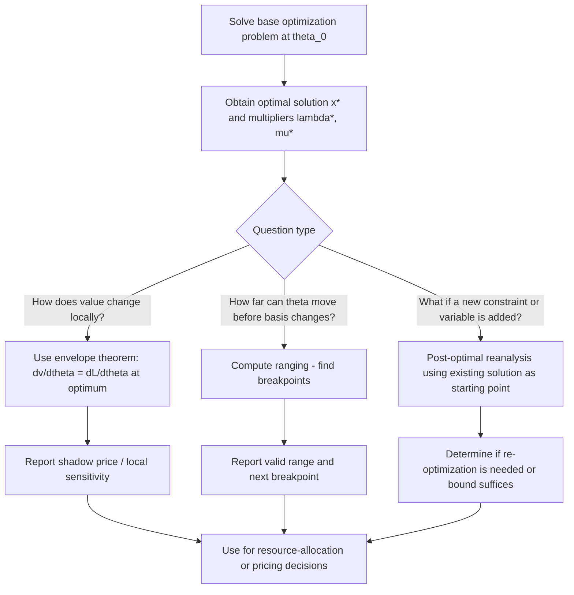

## Sensitivity and Parametric Formulations

### Overview

Real-world optimization problems rarely stand alone as a single fixed instance — objective coefficients, resource limits, and constraint parameters often represent estimates, forecasts, or values subject to managerial control. **Sensitivity analysis** and **parametric optimization** provide the theoretical and computational tools to understand how the optimal solution and optimal value respond to changes in problem data, without needing to re-solve the problem from scratch for every possible variation. This module closes the foundational sequence by connecting the well-posedness and stability concepts from the previous module to their practical, quantitative counterpart.

### The Parametric Optimization Problem

A **parametric optimization problem** treats the problem data explicitly as a function of a parameter (or parameter vector) $\theta$:

$$\min_{x \in \mathbb{R}^n} \ f(x, \theta) \quad \text{subject to} \quad g_i(x, \theta) \leq 0,\ h_j(x, \theta) = 0$$

The **optimal value function** (also called the **marginal value function** or **perturbation function**) and the **optimal solution mapping** are then defined as functions of $\theta$:

$$v(\theta) = \min_{x \in \mathcal{F}(\theta)} f(x, \theta), \qquad x^*(\theta) \in \arg\min_{x \in \mathcal{F}(\theta)} f(x, \theta)$$

**Key Points**

- $v(\theta)$ is a genuine function (single-valued) whenever a minimizer exists, since the optimal value is always unique even when the minimizer is not (as established in the well-posedness module); $x^*(\theta)$, in contrast, is generally a **set-valued mapping**, since multiple optimal solutions can tie at the same parameter value.
- The central questions of sensitivity analysis are: how does $v(\theta)$ change as $\theta$ varies (its derivative, if it exists, and over what range this derivative remains valid), and how does $x^*(\theta)$ move or jump as $\theta$ crosses critical values.
- Parametric formulations generalize the deterministic, fixed-data problems studied throughout the earlier modules — every specific problem instance is simply $v(\theta_0)$ and $x^*(\theta_0)$ evaluated at one particular parameter value $\theta_0$.

### Sensitivity Analysis in Linear Programming

Linear programming offers the most complete and widely used sensitivity theory, due to the polyhedral structure of its feasible region. Given the LP $\min c^T x$ s.t. $Ax \leq b$, $x \geq 0$, sensitivity analysis addresses three classical questions:

1. **Right-hand-side (RHS) sensitivity**: how does the optimal value change as $b$ varies?
2. **Objective coefficient sensitivity**: how does the optimal value (and solution) change as $c$ varies?
3. **Range of validity**: over what interval of a given parameter does the current optimal basis remain optimal?

**Key Points**

- The **shadow price** (or **dual value**) of a constraint is the rate of change of the optimal objective value with respect to a small change in that constraint's right-hand side, holding the optimal basis fixed: $\text{shadow price}_i = \partial v / \partial b_i$.
- Shadow prices are directly given by the **optimal values of the dual variables** (Lagrange multipliers) associated with each constraint — this is one of the most practically valuable outputs of solving an LP, since it directly answers "how much would relaxing this resource limit by one unit improve the objective?"
- Shadow prices are only valid **locally**: they hold exactly over a specific range of the parameter (the **range of feasibility** or **range of optimality**) within which the optimal basis does not change; outside this range, a different vertex becomes optimal and the shadow price itself changes.
- For a non-binding (inactive) constraint, the shadow price is always zero — a direct LP manifestation of the complementary slackness condition covered in the equality/inequality constraints module: relaxing a constraint that is not currently limiting the solution cannot improve the objective.

**Example**In the factory example from earlier modules ($\min -5x_1 - 8x_2$ s.t. $2x_1+4x_2\leq 40, $x_1\geq 5
), if the machine-time constraint's shadow price is $2$, this means each additional hour of machine capacity (beyond 40) would improve profit by approximately $2, valid up to some upper limit on additional capacity before a different constraint becomes binding instead.

### The Optimal Value Function: Convexity Property

A structurally important result connects convexity (from the classification module) to sensitivity analysis directly:

**Theorem.** If $f(x,\theta)$ is jointly convex in $(x, \theta)$ and the constraint set $\mathcal{F}(\theta)$ is defined by constraints that are jointly convex in $(x,\theta)$, then the optimal value function $v(\theta)$ is convex in $\theta$.

**Key Points**

- This result explains why, in convex problems (including LP), the optimal value function is typically piecewise linear or piecewise smooth and convex as a function of the RHS parameters — the "kinks" correspond precisely to points where the optimal basis (in LP) or active constraint set (in NLP) changes.
- Convexity of $v(\theta)$ has a direct economic interpretation in resource-allocation contexts: it implies **diminishing returns** are not what's observed — rather, the marginal value of relaxing a constraint (the shadow price) is non-decreasing as the constraint is relaxed further is not generally true; more precisely, for a minimization problem with convex $v$, the marginal *cost reduction* from relaxing a constraint is non-increasing, consistent with typical diminishing-returns economic intuition.
- [Unverified] The precise direction of this monotonicity (increasing vs. decreasing marginal value) depends on whether the problem is a minimization or maximization and on the specific sign conventions used for the parameter and constraint; the qualitative point — that $v(\theta)$ has a well-defined convex/concave shape reflecting systematically diminishing or increasing marginal effects — is the generalizable takeaway, while the specific direction should be re-derived per formulation.

### Local Sensitivity: Derivatives of the Value Function

When $v(\theta)$ is differentiable at $\theta_0$, its derivative provides the local, first-order rate of change of the optimal value with respect to the parameter. Under appropriate regularity conditions (constraint qualifications, as introduced in the equality/inequality constraints module), a foundational result — a form of the **Envelope Theorem**, closely related to results attributed to Danskin — gives:

$$\frac{\partial v}{\partial \theta_k}\bigg|_{\theta_0} = \frac{\partial \mathcal{L}}{\partial \theta_k}\bigg(x^*(\theta_0), \lambda^*(\theta_0), \mu^*(\theta_0), \theta_0\bigg)$$

where $\mathcal{L}$ is the Lagrangian (introduced in the equality/inequality constraints module) and $\lambda^*, \mu^*$ are the optimal Lagrange multipliers.

**Key Points**

- The practical significance of this result — sometimes summarized informally as "the envelope theorem" — is that the sensitivity of the optimal value to a parameter can be computed directly from the Lagrange multipliers **at the current optimal solution**, without needing to re-solve the problem at nearby parameter values or explicitly differentiate the (generally complicated, implicitly-defined) function $x^*(\theta)$ itself.
- This is precisely the origin of the shadow-price interpretation in LP: the Lagrange multiplier on a constraint literally **is** the local sensitivity of the optimal value to that constraint's right-hand side.
- The result requires the optimal solution $x^*(\theta)$ to vary smoothly (differentiably) with $\theta$ near $\theta_0$, and requires an appropriate constraint qualification to hold — at points where the optimal basis or active-constraint set changes (kinks in $v(\theta)$), the derivative may not exist, though one-sided derivatives typically still do.

### Ranging Analysis and Breakpoints

**Ranging analysis** determines the interval of a parameter over which a given qualitative feature of the solution (e.g., the optimal basis in LP, or the active constraint set in NLP) remains unchanged. The endpoints of this interval are called **breakpoints** (or **critical values**).

**Key Points**

- Within a single range (between consecutive breakpoints), the optimal value function is typically linear (in LP) or smooth (in convex NLP), and the shadow price / local derivative is constant.
- At a breakpoint, the optimal basis or active set changes — a different vertex becomes optimal in LP, or a different constraint becomes active in NLP — and the shadow price itself typically changes discontinuously (a "kink" in $v(\theta)$, consistent with the convexity/piecewise-linear structure discussed above).
- Ranging analysis is standard output from LP solvers (often reported alongside shadow prices) and answers questions like "over what range of machine-hour capacity does the current production plan remain optimal, and by how much does profit change per additional hour within that range?"

### Visualization of a Parametric Value Function

<svg xmlns="http://www.w3.org/2000/svg" viewBox="0 0 900 440" font-family="Arial, sans-serif">
<text x="450" y="30" text-anchor="middle" font-size="18" font-weight="bold" fill="#1a1a1a">Optimal Value Function v(theta) - Piecewise Structure (svg_diagram)</text>
<line x1="100" y1="360" x2="800" y2="360" stroke="#333" stroke-width="1.5" />
<text x="810" y="365" font-size="12" fill="#333">theta (e.g. RHS parameter b)</text>
<line x1="100" y1="360" x2="100" y2="60" stroke="#333" stroke-width="1.5" />
<text x="60" y="55" font-size="12" fill="#333">v(theta)</text>
<path d="M 150,320 L 320,220 L 480,160 L 650,140 L 750,135" fill="none" stroke="#3366cc" stroke-width="3" />
<circle cx="320" cy="220" r="5" fill="#cc3333" />
<circle cx="480" cy="160" r="5" fill="#cc3333" />
<circle cx="650" cy="140" r="5" fill="#cc3333" />

<text x="320" y="205" text-anchor="middle" font-size="10" fill="`#cc3333`">breakpoint</text>

<text x="480" y="145" text-anchor="middle" font-size="10" fill="`#cc3333`">breakpoint</text>

<text x="650" y="125" text-anchor="middle" font-size="10" fill="`#cc3333`">breakpoint</text>

<text x="230" y="290" text-anchor="middle" font-size="10" fill="#555">slope = shadow price</text>

<text x="230" y="305" text-anchor="middle" font-size="10" fill="#555">(range 1, basis A)</text>

<text x="400" y="200" text-anchor="middle" font-size="10" fill="#555">slope changes</text>

<text x="400" y="215" text-anchor="middle" font-size="10" fill="#555">(range 2, basis B)</text>

<rect x="500" y="280" width="280" height="80" fill="#f5f5f5" stroke="#999" stroke-width="1" />
<text x="640" y="300" text-anchor="middle" font-size="11" fill="#333">v(theta) is convex and piecewise linear</text>
<text x="640" y="318" text-anchor="middle" font-size="11" fill="#333">Each segment corresponds to one</text>
<text x="640" y="336" text-anchor="middle" font-size="11" fill="#333">optimal basis; slope = shadow price</text>
<text x="640" y="354" text-anchor="middle" font-size="11" fill="#333">for that range</text>
</svg>

### Sensitivity in Nonlinear Programming

For nonlinear (but sufficiently smooth) constrained problems, sensitivity analysis extends the LP shadow-price concept via the Lagrange multipliers associated with the KKT conditions (formally developed in a later module, previewed here for context):

**Key Points**

- Under regularity conditions (constraint qualifications and second-order sufficient conditions), the KKT multiplier $\lambda_i^*$ associated with an active inequality constraint $g_i(x) \leq 0$ gives the local rate of change of the optimal value with respect to a perturbation of that constraint's bound — the direct nonlinear analogue of the LP shadow price.
- Unlike LP, where the value function is exactly piecewise linear, the NLP value function $v(\theta)$ is generally only piecewise smooth (curved within each region between breakpoints, rather than linear), since the underlying objective and constraint functions are themselves nonlinear.
- [Unverified] Extending sensitivity results rigorously to NLP requires stronger regularity assumptions than LP (constraint qualifications plus, often, second-order sufficient conditions and strict complementarity) to ensure $x^*(\theta)$ and $v(\theta)$ vary smoothly; without these assumptions, the envelope-theorem-style formula may not hold exactly, and specific conditions should be checked against the relevant theorem statement being applied.

### Post-Optimal (What-If) Analysis

**Sensitivity analysis** is often used interchangeably with **post-optimal analysis** or **"what-if" analysis** in applied contexts, referring to the practical exercise of exploring how the optimal solution would change under various hypothetical data modifications, without re-solving the entire problem from scratch each time.

**Key Points**

- Common post-optimal questions include: how much can an objective coefficient change before the optimal solution itself changes (rather than merely the optimal value); how much RHS slack exists before a new constraint becomes binding; and what happens if a new variable or constraint is added to an already-solved problem.
- Many LP and NLP solvers report sensitivity ranges and shadow prices automatically as part of standard solution output, making this analysis available essentially "for free" alongside the primary optimal solution, without requiring separate re-optimization for small, common what-if questions.
- Sensitivity analysis is distinct from — but complementary to — the robust and stochastic optimization approaches from the prior module: sensitivity analysis characterizes how a *given, already-computed* deterministic solution responds to small data changes after the fact, while robust/stochastic optimization builds uncertainty directly into the *original* problem formulation before solving.

### Sensitivity Analysis Workflow

### Practical Applications of Sensitivity Analysis

**Key Points**

- **Resource pricing and allocation**: shadow prices directly answer how much a decision-maker should be willing to pay for additional units of a scarce resource, forming the basis of internal transfer pricing and make-or-buy decisions in operations research applications.
- **Robustness assessment of a solution**: even outside a formal robust-optimization framework, examining how sensitive the optimal solution is to small data errors provides a practical (though local and approximate) check on how much confidence to place in a solution derived from uncertain or estimated data.
- **Guiding data collection effort**: parameters with high sensitivity (large shadow prices or steep local derivatives of $v(\theta)$) are the parameters most worth refining or measuring more precisely, since errors in those parameters have outsized impact on the optimal value — parameters with near-zero sensitivity can typically be estimated more loosely without materially affecting the solution's quality.
- [Inference] In applied operations research and engineering design workflows, sensitivity analysis is frequently used as a lightweight first pass before committing to the more computationally expensive stochastic or robust reformulations covered in the previous module, since it reveals which parameters actually matter before deciding where to invest in explicit uncertainty modeling.

**Conclusion**

Sensitivity analysis and parametric formulations extend the static, single-instance view of optimization developed throughout this foundational sequence into a dynamic understanding of how solutions respond to changing data. The optimal value function $v(\theta)$ — convex and piecewise-structured under standard regularity conditions, with derivatives given by Lagrange multipliers via the envelope theorem — provides the theoretical backbone connecting shadow prices, ranging analysis, and post-optimal what-if questions into a single coherent framework. This closes the Mathematical Foundations and Prerequisites sequence: the next set of modules turns to first-order and second-order optimality conditions, which formally characterize the optimal points whose sensitivity behavior has been described here.

**Related Topics**

- Karush–Kuhn–Tucker (KKT) conditions and Lagrange multipliers
- The Envelope Theorem and Danskin's theorem
- Duality theory in linear and nonlinear programming
- Degeneracy and its effect on shadow price uniqueness
- Parametric linear programming and the simplex method's ranging output
- Robust and stochastic optimization (contrasted with local sensitivity)
- Second-order sufficient conditions and smooth dependence of solutions on parameters
- Applications in resource pricing, transfer pricing, and capacity planning