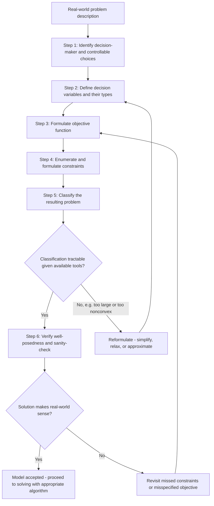

## Modeling Real-World Problems as Optimization Programs

### Overview

Every concept developed across the preceding foundational modules — decision variables, objective functions, constraints, feasible regions, convexity, well-posedness, and sensitivity — exists to support a single practical skill: translating a messy, ambiguous, real-world situation into a precise mathematical optimization program. This module treats **modeling** itself as the subject, synthesizing the prior theory into a systematic process for problem formulation, and closing out the Mathematical Foundations and Prerequisites sequence before the course turns to solving these formulated problems.

### Why Modeling Is Its Own Skill

**Key Points**

- Algorithms operate on precisely stated mathematical problems; they cannot resolve ambiguity in a verbal problem description, so any ambiguity left unresolved at the modeling stage becomes either an implicit (and possibly wrong) assumption baked into the model, or an error discovered only after solving.
- The same real-world situation can typically be formulated in multiple mathematically valid ways that are not computationally equivalent — a poor formulation of a correct idea can be intractable, while a well-chosen formulation of the same idea can be efficiently solvable, as previewed in the decision-variables module's discussion of flow-on-edges versus flow-on-paths formulations.
- Modeling errors are frequently more consequential than algorithmic errors: an algorithm that perfectly solves the wrong model produces a confidently wrong answer, whereas an approximate algorithm applied to a correct model at least approximates the right answer.
- [Inference] Experienced practitioners generally treat modeling as an iterative process rather than a one-time step — an initial formulation is solved, its solution is checked against real-world intuition and stakeholder expectations, and the model is refined based on discrepancies, rather than being finalized purely from the initial problem description.

### A Systematic Modeling Process

**Step 1: Identify the decision-maker and their controllable choices.** Determine precisely what can be changed and who is choosing it. This defines the candidate decision variables (covered in the decision-variables module).

**Step 2: Define decision variables precisely.** Assign explicit mathematical symbols and specify their type (continuous, integer, binary) and units. Ambiguity here — e.g., "amount produced" without specifying units or a time period — propagates errors through the entire model.

**Step 3: Formulate the objective function.** Translate the stated goal (minimize cost, maximize profit, minimize error, etc.) into a precise mathematical expression of the decision variables, checking whether the true goal is genuinely single-objective or whether competing goals require the multi-objective treatment covered earlier.

**Step 4: Identify and formulate constraints.** Systematically enumerate every restriction — physical, logical, regulatory, and resource-based — and express each as an equality or inequality in the decision variables, using the equality/inequality distinction covered previously to classify each correctly.

**Step 5: Classify the resulting problem.** Determine linearity, convexity, continuity/discreteness, and objective count using the classification framework from the preceding modules — this classification directly determines which solution methods are applicable.

**Step 6: Verify well-posedness and sanity-check the model.** Check feasibility, boundedness, and whether the formulation's optimal solution (once computed) makes real-world sense, iterating back to earlier steps if it does not.

**Key Points**

- This process is not strictly linear in practice — discovering an intractable classification at Step 5 often motivates returning to Step 2 or Step 4 to reformulate variables or constraints in a more favorable way (e.g., replacing a non-convex constraint with a convex approximation, or reformulating integer variables to reduce combinatorial complexity).
- Steps 1–2 (identifying variables) are frequently underestimated in difficulty; real problems often have implicit decisions embedded in the description that are easy to overlook — for instance, a "scheduling" problem may implicitly also involve a resource-assignment decision that is separate from the timing decision.
- [Inference] In practice, Step 6 (sanity-checking against real-world intuition) is what most often reveals modeling errors — a mathematically valid but practically nonsensical optimal solution (e.g., using a resource in a way that could never actually work operationally) is usually a sign that a constraint was missed at Step 4, not that the algorithm failed.

### Worked Example: From Description to Formulation

**Problem description**: "A bakery makes bread and cakes. Each loaf of bread requires 1 hour of oven time and 2 units of flour, and sells for a profit of $3. Each cake requires 3 hours of oven time and 1 unit of flour, and sells for a profit of $8. The bakery has 30 hours of oven time and 20 units of flour available per day, and can produce at most 12 cakes per day due to limited cake-pan availability. How much of each should be produced to maximize profit?"

**Applying the process:**

- *Step 1–2 (variables)*: $x_1$ = loaves of bread produced per day (continuous or integer), $x_2$ = cakes produced per day (continuous or integer).
- *Step 3 (objective)*: Maximize profit: $\max\ 3x_1 + 8x_2$.
- *Step 4 (constraints)*: Oven time: $x_1 + 3x_2 \leq 30$. Flour: $2x_1 + x_2 \leq 20. Cake-pan limit: $x_2 \leq 12
  . Non-negativity: $x_1, x_2 \geq 0$.
- *Step 5 (classification)*: Linear objective, linear constraints $\Rightarrow$ Linear Program; convex (as established in the classification module, all LPs are convex); continuous if fractional loaves/cakes are acceptable in the model (e.g., as a daily-average planning approximation), or integer if whole-unit production is strictly required.
- *Step 6 (well-posedness)*: Feasible region is a bounded polygon (bounded by the three inequalities and non-negativity) — nonempty (e.g., $x_1=x_2=0$ is feasible) and bounded, so by Weierstrass a maximum exists; the LP is convex, so any local optimum found is global.

**Key Points**

- This example illustrates that even a short verbal description requires several explicit, separately justified modeling decisions (continuous versus integer treatment, unit consistency, complete constraint enumeration) that are easy to gloss over informally but must be made precise for a solver.
- Notice the "at most 12 cakes" constraint could easily be missed if the modeler focuses only on the explicitly quantified resources (oven time, flour) and overlooks a resource mentioned only implicitly (cake-pan availability) — a common real-world modeling pitfall.

### Common Modeling Patterns and Idioms

Certain real-world situations recur across many application domains and have well-established standard formulations, which experienced modelers recognize and reuse rather than deriving from scratch.

**Key Points**

- **Resource allocation**: maximize value/profit subject to limited quantities of shared resources — the canonical LP structure illustrated in the bakery example, and in the factory example used throughout earlier modules.
- **Assignment and matching**: binary variables $x_{ij} \in \{0,1\}$ indicating whether agent $i$ is assigned to task $j$, with constraints ensuring each agent is assigned at most once and each task is covered — a discrete/combinatorial pattern relevant to the continuous-versus-discrete classification module.
- **Network flow**: continuous or integer variables representing flow along edges of a graph, with flow-conservation equality constraints at each node — a pattern where the specific choice of variables (edge-flow versus path-flow, as noted earlier) substantially affects tractability.
- **Blending and mixing**: continuous variables representing proportions or quantities of ingredients/components, with constraints ensuring proportions sum to a required total and meet quality/composition requirements — common in the chemical, agricultural, and food industries.
- **Covering and packing**: binary variables indicating whether an item/facility/set is selected, with constraints ensuring a target is fully "covered" (covering) or that selected items respect a capacity (packing) — recurring patterns in facility location, scheduling, and logistics.
- Recognizing that a new problem matches one of these established patterns (or a hybrid of several) substantially accelerates formulation, since the general structure and typical pitfalls of the pattern are already well understood in the literature.

### Formulation Trade-offs: Realism Versus Tractability

**Key Points**

- A maximally realistic model that captures every real-world nuance is often computationally intractable (highly non-convex, extremely high-dimensional, or requiring integer variables at a scale beyond practical solvability); conversely, an overly simplified model may be efficiently solvable but produce solutions that are unreliable or irrelevant in practice.
- Common simplification strategies include: relaxing integer requirements to continuous variables when fractional solutions can be reasonably rounded or interpreted as averages; approximating non-convex relationships with convex or piecewise-linear approximations; and aggregating many similar decision variables into fewer representative ones when the loss of granularity is acceptable for the decision at hand.
- Each simplification is a deliberate modeling trade-off that should be made consciously and documented, not an accidental byproduct of reaching for a familiar problem class — the appropriate degree of simplification depends on the specific decision being supported, the cost of computation, and the cost of a suboptimal or infeasible real-world outcome.
- [Unverified] There is no universal rule dictating the "right" balance between realism and tractability; this determination is inherently problem- and context-specific, and is typically resolved through iterative testing (solving both a simplified and a more detailed version where feasible, and comparing solution quality and stakeholder confidence) rather than by an a priori formula.

### Modeling Process Flow

### Anatomy of a Complete Formulation

<svg xmlns="http://www.w3.org/2000/svg" viewBox="0 0 900 480" font-family="Arial, sans-serif">
<text x="450" y="30" text-anchor="middle" font-size="18" font-weight="bold" fill="#1a1a1a">From Real-World Description to Mathematical Program (svg_diagram)</text>
<rect x="60" y="60" width="780" height="90" rx="10" fill="#f5f5f5" stroke="#999" stroke-width="1.5" />
<text x="450" y="90" text-anchor="middle" font-size="13" fill="#333">"A bakery makes bread and cakes... how much of each should be produced to maximize profit?"</text>
<text x="450" y="115" text-anchor="middle" font-size="12" fill="#777">(ambiguous, verbal, incomplete without further specification)</text>
<text x="450" y="135" text-anchor="middle" font-size="11" fill="#999">Step 1-4 applied below</text>
<line x1="450" y1="150" x2="450" y2="180" stroke="#666" stroke-width="2" marker-end="url(#arrow2)" />
<rect x="60" y="190" width="240" height="120" rx="10" fill="#eaf2ff" stroke="#3366cc" stroke-width="2" />
<text x="180" y="215" text-anchor="middle" font-size="12" font-weight="bold" fill="#1a2d66">Variables</text>
<text x="180" y="240" text-anchor="middle" font-size="11" fill="#333">x1 = loaves/day</text>
<text x="180" y="260" text-anchor="middle" font-size="11" fill="#333">x2 = cakes/day</text>
<text x="180" y="285" text-anchor="middle" font-size="10" fill="#777">precise, typed, unit-specified</text>
<rect x="330" y="190" width="240" height="120" rx="10" fill="#fff3e6" stroke="#cc7a33" stroke-width="2" />
<text x="450" y="215" text-anchor="middle" font-size="12" font-weight="bold" fill="#994d00">Objective</text>
<text x="450" y="245" text-anchor="middle" font-size="12" fill="#333">max 3x1 + 8x2</text>
<text x="450" y="285" text-anchor="middle" font-size="10" fill="#777">translated from "maximize profit"</text>
<rect x="600" y="190" width="240" height="120" rx="10" fill="#eafff0" stroke="#33994d" stroke-width="2" />
<text x="720" y="215" text-anchor="middle" font-size="12" font-weight="bold" fill="#1a662e">Constraints</text>
<text x="720" y="238" text-anchor="middle" font-size="10" fill="#333">x1+3x2 &lt;= 30 (oven)</text>
<text x="720" y="256" text-anchor="middle" font-size="10" fill="#333">2x1+x2 &lt;= 20 (flour)</text>
<text x="720" y="274" text-anchor="middle" font-size="10" fill="#333">x2 &lt;= 12 (pans)</text>
<text x="720" y="292" text-anchor="middle" font-size="10" fill="#333">x1,x2 &gt;= 0</text>
<line x1="450" y1="310" x2="450" y2="340" stroke="#666" stroke-width="2" marker-end="url(#arrow2)" />
<rect x="150" y="350" width="600" height="110" rx="10" fill="#f7f0ff" stroke="#7a3fcc" stroke-width="2" />
<text x="450" y="378" text-anchor="middle" font-size="13" font-weight="bold" fill="#5a2a99">Complete Mathematical Program</text>
<text x="450" y="405" text-anchor="middle" font-size="12" fill="#333">max 3x1 + 8x2</text>
<text x="450" y="428" text-anchor="middle" font-size="12" fill="#333">s.t. x1+3x2&lt;=30, 2x1+x2&lt;=20, x2&lt;=12, x1,x2&gt;=0</text>
<text x="450" y="448" text-anchor="middle" font-size="11" fill="#777">Classified: Linear Program, convex, bounded, well-posed</text>
</svg>

### Common Pitfalls Revisited in the Modeling Context

**Key Points**

- **Missing implicit constraints**: real-world descriptions often mention resource limits only implicitly or in passing (as with the cake-pan constraint above) — systematically re-reading the description specifically hunting for unstated restrictions is a practical safeguard.
- **Conflating the objective with a constraint**: a goal stated as "keep cost under budget while maximizing quality" is genuinely two different roles for cost and quality (one as a hard constraint, one as the objective) — misreading which quantity plays which role produces a materially different, incorrect model.
- **Inconsistent units or time periods**: mixing daily and weekly rates, or per-unit and total quantities, without careful conversion is a frequent, easily overlooked source of formulation error, particularly in larger models with many variables sourced from different data tables.
- **Premature commitment to a familiar pattern**: forcing a genuinely novel problem into a recognized idiom (resource allocation, assignment, etc.) before verifying the fit can silently drop or distort real requirements that don't match the idiom's standard assumptions.
- **Ignoring problem classification until after formulation is "finished"**: checking convexity, linearity, and discreteness only after a full model is built (rather than being aware of these implications while making modeling choices at Steps 2–4) can lead to discovering intractability only very late in the modeling process.

**Conclusion**

Modeling is the bridge between a real-world decision problem and the mathematical machinery developed throughout this foundational sequence — decision variables, objective functions, constraints, feasible regions, classification, and well-posedness all serve this translation process. A systematic approach (identifying decisions, defining variables precisely, formulating the objective, enumerating constraints, classifying the result, and sanity-checking against real-world intuition) reduces the risk of the modeling errors that most commonly undermine optimization projects in practice — errors that no algorithm, however sophisticated, can correct after the fact. This concludes the Mathematical Foundations and Prerequisites sequence; the course now turns to the first- and second-order optimality conditions that characterize solutions to the well-posed, correctly classified problems this module has shown how to construct.

**Related Topics**

- First-order necessary conditions (KKT conditions) for the formulated problem
- Algebraic modeling languages and automated form conversion
- Case studies in linear programming, network flow, and assignment problems
- Model validation and verification techniques
- Data quality and parameter estimation for optimization models
- Reformulation techniques for non-convex and combinatorial problems
- Multi-objective formulation versus scalarized single-objective formulation
- Transitioning from formulation to algorithm selection