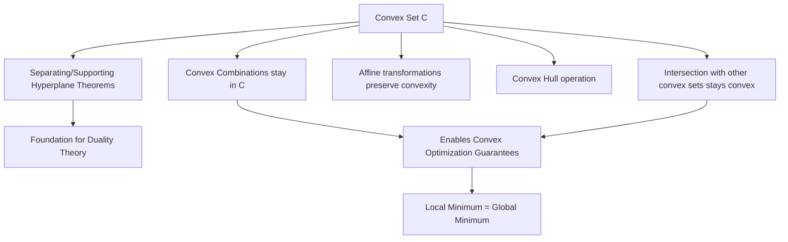

## Convex Sets and Their Properties

### Definition

A set $C \subseteq \mathbb{R}^n$ is **convex** if, for any two points $x_1, x_2 \in C$ and any $\theta \in [0, 1]$, the point

$$\theta x_1 + (1-\theta) x_2$$

also belongs to $C$. Geometrically, this means the entire line segment connecting any two points in the set lies within the set — no "indentations" or "gaps" are permitted.

### Key Points

- The expression $\theta x_1 + (1-\theta) x_2$ for $\theta \in [0,1]$ is called a **convex combination** of $x_1$ and $x_2$.
- More generally, a convex combination of $k$ points is $\sum_{i=1}^{k} \theta_i x_i$ where $\theta_i \geq 0$ and $\sum_i \theta_i = 1$.
- Convexity is a purely geometric property of the set itself — it says nothing about any function defined over it (that distinction belongs to convex *functions*, built on top of convex *sets*).
- The empty set and any single point are trivially convex.
- Convexity is essential in optimization because it guarantees that any local minimum of a convex function over a convex set is also a global minimum, which underlies why convex problems are considered "efficiently solvable" in a way non-convex problems generally are not.

### Visual Intuition

<svg xmlns="http://www.w3.org/2000/svg" viewBox="0 0 760 320">
  \<style\>
    .title { font: bold 16px sans-serif; fill: #1a1a1a; }
    .label { font: 13px sans-serif; fill: #1a1a1a; }
    .small { font: 11px sans-serif; fill: #555; }
    .shape { fill: #dbe9f7; stroke: #2980b9; stroke-width: 2; }
    .badshape { fill: #f9d6d5; stroke: #c0392b; stroke-width: 2; }
    .seg { stroke: #27ae60; stroke-width: 2.5; }
    .badseg { stroke: #c0392b; stroke-width: 2.5; stroke-dasharray: 5,3; }
    .pt { fill: #1a1a1a; }
  \</style\>

  <text x="20" y="24" class="title">Convex vs Non-Convex Sets (svg_diagram)</text>

  
  <text x="60" y="60" class="label" font-weight="bold">Convex</text>
  <ellipse cx="170" cy="180" rx="130" ry="90" class="shape" />
  <circle cx="90" cy="150" r="4" class="pt" />
  <circle cx="260" cy="210" r="4" class="pt" />
  <line x1="90" y1="150" x2="260" y2="210" class="seg" />
  <text x="70" y="270" class="small">Segment stays entirely inside the set</text>

  
  <text x="480" y="60" class="label" font-weight="bold">Non-Convex</text>
  <path d="M 420 120             Q 560 90 620 150            Q 590 180 540 180            Q 590 200 620 240            Q 560 290 420 260            Q 460 190 420 120 Z" class="badshape" />
  <circle cx="450" cy="150" r="4" class="pt" />
  <circle cx="590" cy="230" r="4" class="pt" />
  <line x1="450" y1="150" x2="590" y2="230" class="badseg" />
  <text x="440" y="300" class="small">Segment exits the set (notch region)</text>
</svg>

### Examples of Convex Sets

**Example**

- **Hyperplanes**: $\{x \mid a^T x = b\}$ — both convex and affine.
- **Halfspaces**: $\{x \mid a^T x \leq b\}$ — convex but not affine.
- **Balls**: $\{x \mid \|x - x_c\| \leq r\}$ for any norm — convex.
- **Polyhedra**: intersections of finitely many halfspaces and hyperplanes, $\{x \mid Ax \leq b, \; Cx = d\}$ — convex.
- **Ellipsoids**: $\{x \mid (x - x_c)^T P^{-1} (x - x_c) \leq 1\}$ with $P \succ 0$ — convex.
- The entire space $\mathbb{R}^n$ and any single point are convex (degenerate cases).

### Examples of Non-Convex Sets

**Example**

- Any set with a "hole" or an indentation, such as an annulus (ring shape) $\{x \mid r_1 \leq \|x\| \leq r_2\}$.
- The union of two disjoint disks.
- Discrete sets such as $\{0, 1\}^n$ (used in combinatorial/integer optimization), since a line segment between two of its points contains non-integer values not in the set.

### Key Operations That Preserve Convexity

**Key Points**

- **Intersection**: The intersection of any (even infinite) collection of convex sets is convex. This is the property underlying why polyhedra — built from intersections of halfspaces — are convex.
- **Affine images**: If $C$ is convex and $f(x) = Ax + b$ is an affine map, then $f(C) = \{Ax + b \mid x \in C\}$ is convex. The same holds for the inverse image $f^{-1}(C)$.
- **Scaling and translation**: For convex $C$, both $\alpha C = \{\alpha x \mid x \in C\}$ and $C + a = \{x + a \mid x \in C\}$ are convex.
- **Minkowski sum**: If $C_1, C_2$ are convex, then $C_1 + C_2 = \{x_1 + x_2 \mid x_1 \in C_1, x_2 \in C_2\}$ is convex.
- **Cartesian product**: If $C_1, C_2$ are convex, then $C_1 \times C_2$ is convex.
- Note that **union** does *not* generally preserve convexity — the union of two convex sets is typically not convex (see the two-disjoint-disks example above).

### Convex Hull

**Key Points**

- The **convex hull** of an arbitrary set $S$, denoted $\text{conv}(S)$, is the smallest convex set containing $S$ — equivalently, the set of all convex combinations of points in $S$.
- Formally: $\text{conv}(S) = \left\{ \sum_{i=1}^{k} \theta_i x_i \;\middle|\; x_i \in S, \; \theta_i \geq 0, \; \sum_i \theta_i = 1, \; k \in \mathbb{N} \right\}$.
- This concept matters computationally: many optimization algorithms operating over a non-convex discrete set (e.g., integer programming) work instead with the convex hull of that set (or a relaxation approximating it) to obtain tractable bounds. [Inference: the specific relaxation strategy used depends heavily on the algorithm family — e.g., LP relaxation in branch-and-bound versus cutting-plane methods — so this statement describes the general motivation rather than one specific technique.]

### Separating and Supporting Hyperplanes

**Key Points**

- The **separating hyperplane theorem** states that if $C_1$ and $C_2$ are disjoint convex sets, there exists a hyperplane $a^T x = b$ such that $a^T x \leq b$ for all $x \in C_1$ and $a^T x \geq b$ for all $x \in C_2$.
- A **supporting hyperplane** at a boundary point $x_0$ of a convex set $C$ is a hyperplane that touches $C$ at $x_0$ while keeping the entire set on one side: $\{x \mid a^T x = a^T x_0\}$ with $a^T x \leq a^T x_0$ for all $x \in C$.
- These theorems form the theoretical foundation for **duality theory** in convex optimization, since dual variables can be interpreted as the normal vectors of separating/supporting hyperplanes.

### Relationship to Optimization

### Conclusion

Convex sets form the geometric backbone of convex optimization: the feasible region $\Omega$ of a problem must be a convex set (alongside a convex objective function) for the strong global-optimality guarantees of convex optimization to hold. Recognizing standard convex sets (halfspaces, polyhedra, balls, ellipsoids) and knowing which operations preserve convexity allows a problem's feasible region to be verified as convex — or reformulated into one — before applying convex solution methods.

**Related Topics**

- Convex functions and their characterizations (first-order, second-order conditions)
- Convex optimization problem structure (objective + constraint requirements)
- Duality theory and Lagrangian duality
- Cone and conic optimization (second-order cones, semidefinite cones)
- LP relaxation in integer programming
- KKT conditions for constrained optimization