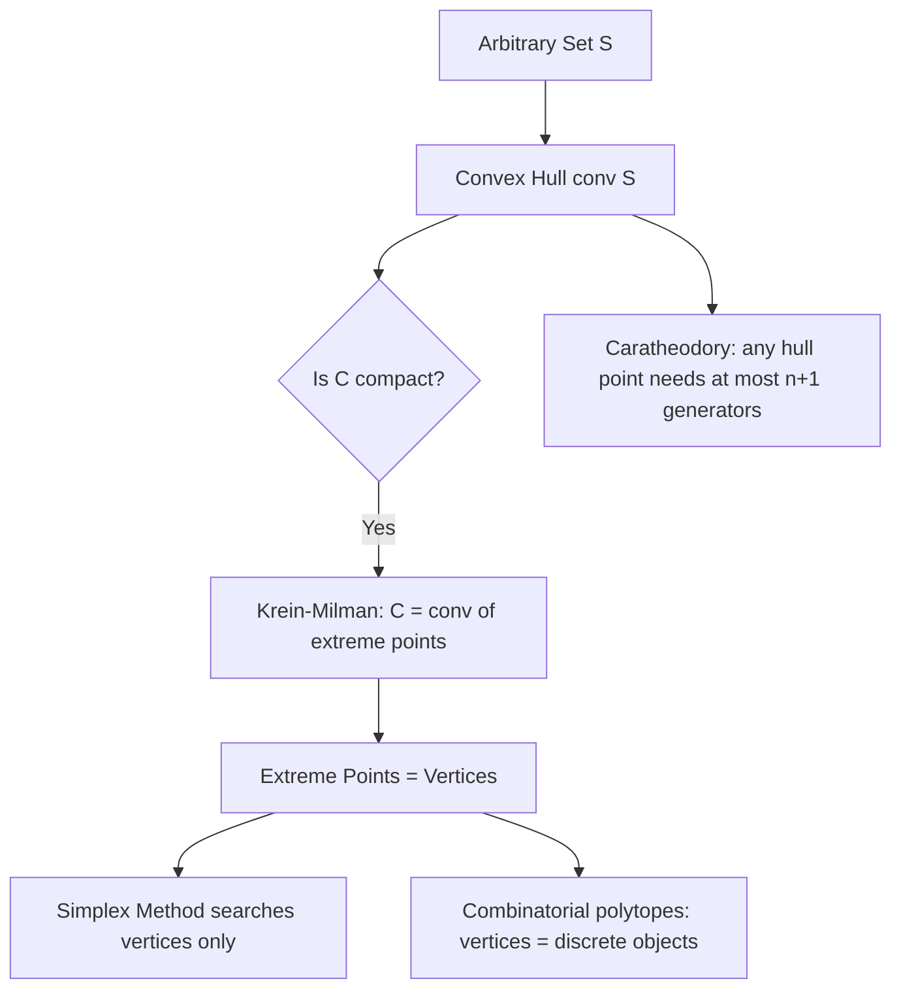

## Convex Hulls and Extreme Points

### Definition — Convex Hull

Given an arbitrary set $S \subseteq \mathbb{R}^n$, the **convex hull** of $S$, denoted $\text{conv}(S)$, is the smallest convex set containing $S$. Equivalently, it is the set of all convex combinations of points drawn from $S$:

$$\text{conv}(S) = \left\{ \sum_{i=1}^{k} \theta_i x_i \;\middle|\; x_i \in S, \; \theta_i \geq 0, \; \sum_{i=1}^{k} \theta_i = 1, \; k \in \mathbb{N} \right\}$$

Intuitively, $\text{conv}(S)$ is the shape formed by stretching a rubber band around all points of $S$ and taking everything enclosed.

### Key Points

- $\text{conv}(S)$ is always convex, regardless of whether $S$ itself is convex.
- If $S$ is already convex, then $\text{conv}(S) = S$.
- $\text{conv}(S)$ is the intersection of all convex sets containing $S$ — this gives an equivalent, non-constructive definition.
- **Carathéodory's theorem**: any point in $\text{conv}(S)$ for $S \subseteq \mathbb{R}^n$ can be expressed as a convex combination of at most $n+1$ points of $S$. This bounds how many points are ever needed to represent any hull point, regardless of how large $S$ is.

### Definition — Extreme Point

A point $x \in C$ (for convex set $C$) is an **extreme point** if it cannot be expressed as a convex combination of two *other* distinct points in $C$. Formally, $x$ is extreme if:

$$x = \theta x_1 + (1-\theta) x_2, \quad x_1, x_2 \in C, \; \theta \in (0,1) \implies x_1 = x_2 = x$$

In other words, an extreme point cannot be written as lying strictly between two distinct points of the set — it sits only "on its own," typically at a corner or vertex.

### Key Points

- For a polygon or polyhedron, extreme points correspond exactly to **vertices** (corners).
- For a disk or ball, every point on the boundary is an extreme point — there are infinitely many.
- Interior points of a convex set are never extreme points, since any interior point can be written as the midpoint of some segment lying inside the set.
- Points on a flat face (but not at a corner) of a polyhedron are typically not extreme, since they lie strictly between two other boundary points on that face. [Inference: this holds for a face with more than one point, i.e., any face that is not itself a single vertex.]

### Krein–Milman / Minkowski's Theorem

**Key Points**

- For a **compact** (closed and bounded) convex set $C \subseteq \mathbb{R}^n$, $C$ equals the convex hull of its extreme points:
$$C = \text{conv}(\text{ext}(C))$$
- This means any point in a compact convex set can be reconstructed as a convex combination of extreme points alone — the extreme points fully determine the set.
- This result is the theoretical basis for why optimization algorithms over polyhedra (such as the simplex method) only need to search **vertices**, rather than the entire (infinite) feasible region.

### Visual Intuition

<svg xmlns="http://www.w3.org/2000/svg" viewBox="0 0 760 340">
  \<style\>
    .title { font: bold 16px sans-serif; fill: #1a1a1a; }
    .label { font: 13px sans-serif; fill: #1a1a1a; }
    .small { font: 11px sans-serif; fill: #555; }
    .cloud { fill: #ddd; }
    .hull { fill: #dbe9f7; stroke: #2980b9; stroke-width: 2; }
    .ext { fill: #c0392b; }
    .nonext { fill: #888; }
    .box { fill: #f4f4f4; stroke: #999; stroke-width: 1; }
  \</style\>

  <text x="20" y="24" class="title">Convex Hull and Extreme Points (svg_diagram)</text>

  
  <rect x="20" y="50" width="330" height="270" class="box" />
  <text x="35" y="75" class="label" font-weight="bold">Point Set S</text>
  <circle cx="90" cy="150" r="4" class="cloud" />
  <circle cx="140" cy="120" r="4" class="cloud" />
  <circle cx="200" cy="110" r="4" class="cloud" />
  <circle cx="260" cy="140" r="4" class="cloud" />
  <circle cx="290" cy="200" r="4" class="cloud" />
  <circle cx="250" cy="260" r="4" class="cloud" />
  <circle cx="170" cy="270" r="4" class="cloud" />
  <circle cx="100" cy="220" r="4" class="cloud" />
  <circle cx="180" cy="180" r="4" class="cloud" />
  <circle cx="150" cy="190" r="4" class="cloud" />
  <circle cx="210" cy="170" r="4" class="cloud" />
  <text x="60" y="310" class="small">Arbitrary scattered points</text>

  
  <rect x="400" y="50" width="330" height="270" class="box" />
  <text x="415" y="75" class="label" font-weight="bold">conv(S)</text>
  <polygon points="470,160 520,110 600,120 660,180 640,250 550,290 480,240" class="hull" />
  <circle cx="470" cy="160" r="5" class="ext" />
  <circle cx="520" cy="110" r="5" class="ext" />
  <circle cx="600" cy="120" r="5" class="ext" />
  <circle cx="660" cy="180" r="5" class="ext" />
  <circle cx="640" cy="250" r="5" class="ext" />
  <circle cx="550" cy="290" r="5" class="ext" />
  <circle cx="480" cy="240" r="5" class="ext" />
  <circle cx="560" cy="190" r="4" class="nonext" />
  <text x="410" y="310" class="small">Red = extreme points (vertices); gray interior point is not extreme</text>
</svg>

### Worked Example

**Example**

Let $S = \{(0,0), (2,0), (2,2), (0,2), (1,1)\}$ in $\mathbb{R}^2$.

- $\text{conv}(S)$ is the square with corners $(0,0)$, $(2,0)$, $(2,2)$, $(0,2)$.
- The point $(1,1)$ is the center of the square — it lies strictly inside the hull and can be written as a convex combination of the four corners (e.g., the average with $\theta_i = 1/4$ each), so it contributes nothing new to the hull and is **not** an extreme point.
- The four corner points are the extreme points; $\text{conv}(S) = \text{conv}(\{(0,0),(2,0),(2,2),(0,2)\})$, meaning $(1,1)$ can be dropped from $S$ without changing the hull.

### Relevance to Optimization

**Key Points**

- **Linear programming**: The fundamental theorem of linear programming states that if an LP has an optimal solution and the feasible region is a polyhedron with at least one extreme point, then an optimal solution exists at an extreme point (vertex). This is why the **simplex method** moves from vertex to adjacent vertex rather than searching the interior.
- **Combinatorial optimization**: Many integer/combinatorial problems are formulated by showing that the extreme points of a particular polyhedron correspond exactly to the combinatorial objects of interest (e.g., extreme points of the assignment polytope correspond to permutation matrices). [Unverified: whether a given polytope's extreme points correspond cleanly to integer solutions — i.e., whether the polytope is "integral" — depends on the specific formulation and is not automatic.]
- **Redundant point removal**: Since only extreme points are needed to reconstruct $\text{conv}(S)$ (Krein–Milman), any non-extreme point of $S$ can be discarded from a hull-computation algorithm without loss.

### Relationship Diagram

### Conclusion

Convex hulls and extreme points together explain why many optimization algorithms can restrict their search to a finite (or at least lower-dimensional) subset of an otherwise infinite feasible region. Recognizing that a feasible region is a polyhedron whose extreme points coincide with the objects of interest is the conceptual link between continuous convex optimization (simplex method) and discrete combinatorial optimization (integer/combinatorial polytopes).

**Related Topics**

- Fundamental theorem of linear programming
- Simplex method mechanics (vertex traversal, basic feasible solutions)
- Polytopes and polyhedral combinatorics
- Integrality of polyhedra and totally unimodular matrices
- Carathéodory's theorem and its computational implications
- Farkas' lemma and theorems of the alternative