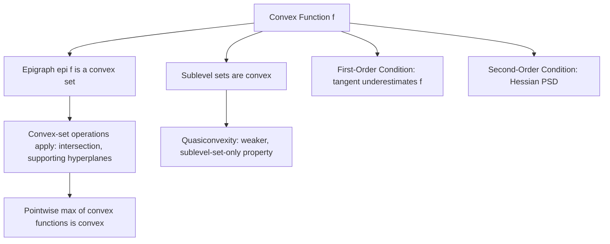

## Convex Functions and Epigraphs

### Definition — Convex Function

A function $f: \mathbb{R}^n \to \mathbb{R}$ defined on a convex set $\text{dom}(f)$ is **convex** if, for all $x_1, x_2 \in \text{dom}(f)$ and $\theta \in [0,1]$:

$$f(\theta x_1 + (1-\theta) x_2) \leq \theta f(x_1) + (1-\theta) f(x_2)$$

Geometrically, the line segment (chord) connecting any two points on the graph of $f$ lies on or above the graph itself. If the inequality is strict for $x_1 \neq x_2$ and $\theta \in (0,1)$, $f$ is **strictly convex**. If $-f$ is convex, $f$ is **concave**.

### Key Points

- The domain $\text{dom}(f)$ must itself be a convex set for the definition to even make sense — the inequality is only required to hold for pairs of points within the domain.
- **Affine functions** $f(x) = a^T x + b$ satisfy the inequality with equality for all $\theta$, making them both convex and concave simultaneously.
- Strict convexity guarantees a *unique* global minimizer (if one exists), whereas plain convexity only guarantees that any local minimum is global, without uniqueness. [Inference: uniqueness follows from strict convexity ruling out flat segments between distinct minimizers, but this is a general consequence rather than a claim about a specific solver's behavior.]

### Definition — Epigraph

The **epigraph** of a function $f: \mathbb{R}^n \to \mathbb{R}$, denoted $\text{epi}(f)$, is the set of points lying on or above the graph of $f$:

$$\text{epi}(f) = \{(x, t) \in \mathbb{R}^{n+1} \mid x \in \text{dom}(f), \; t \geq f(x)\}$$

### The Epigraph Characterization of Convexity

**Key Points**

- **Fundamental theorem**: $f$ is a convex function if and only if $\text{epi}(f)$ is a convex set.
- This is one of the most important bridges in convex analysis: it converts a statement about function *values* (an algebraic inequality) into a statement about a *set* (a geometric property), allowing all convex-set machinery (intersections, supporting hyperplanes, etc.) to be applied to functions.
- Consequently, many operations that preserve convexity of sets (via their epigraphs) yield corresponding rules for preserving convexity of functions.

### Visual Intuition

<svg xmlns="http://www.w3.org/2000/svg" viewBox="0 0 760 340">
  \<style\>
    .title { font: bold 16px sans-serif; fill: #1a1a1a; }
    .label { font: 13px sans-serif; fill: #1a1a1a; }
    .small { font: 11px sans-serif; fill: #555; }
    .axis { stroke: #444; stroke-width: 1.5; }
    .curve { stroke: #2980b9; stroke-width: 2.5; fill: none; }
    .epi { fill: #dbe9f7; opacity: 0.7; }
    .chord { stroke: #27ae60; stroke-width: 2; }
    .pt { fill: #1a1a1a; }
    .box { fill: #f4f4f4; stroke: #999; stroke-width: 1; }
  \</style\>

  <text x="20" y="24" class="title">Epigraph of a Convex Function (svg_diagram)</text>

  <rect x="20" y="50" width="720" height="270" class="box" />

  <line x1="80" y1="290" x2="80" y2="70" class="axis" />
  <line x1="80" y1="290" x2="700" y2="290" class="axis" />
  <text x="55" y="70" class="small">t</text>
  <text x="680" y="310" class="small">x</text>

  
  <path d="M 130 220 Q 300 60 470 220 Q 550 300 680 130 L 680 80 L 130 80 Z" class="epi" />

  
  <path d="M 130 220 Q 300 60 470 220 Q 550 300 680 130" class="curve" />

  
  <circle cx="200" cy="150" r="4" class="pt" />
  <circle cx="420" cy="200" r="4" class="pt" />
  <line x1="200" y1="150" x2="420" y2="200" class="chord" />

  <text x="440" y="140" class="small" fill="#27ae60">chord lies above graph</text>
  <text x="150" y="100" class="small" fill="#2980b9">epi(f): shaded region</text>
</svg>

### First-Order and Second-Order Conditions

**Key Points**

- **First-order condition** (for differentiable $f$): $f$ is convex if and only if $\text{dom}(f)$ is convex and
$$f(y) \geq f(x) + \nabla f(x)^T (y - x) \quad \text{for all } x, y \in \text{dom}(f)$$
This states that the first-order Taylor approximation (tangent hyperplane) at any point is a global underestimator of $f$.
- **Second-order condition** (for twice-differentiable $f$): $f$ is convex if and only if $\text{dom}(f)$ is convex and the Hessian is positive semidefinite everywhere:
$$\nabla^2 f(x) \succeq 0 \quad \text{for all } x \in \text{dom}(f)$$
- If $\nabla^2 f(x) \succ 0$ (positive definite) for all $x$, $f$ is strictly convex, though the converse does not always hold — $f(x) = x^4$ is strictly convex but has $\nabla^2 f(0) = 0$. [Fact, but worth flagging as a common point of confusion rather than a general rule of thumb.]

### Sublevel Sets

**Key Points**

- The **$\alpha$-sublevel set** of $f$ is $C_\alpha = \{x \in \text{dom}(f) \mid f(x) \leq \alpha\}$.
- If $f$ is convex, every sublevel set $C_\alpha$ is convex — this follows directly from the epigraph being convex, since $C_\alpha$ is a "slice" of $\text{epi}(f)$.
- The converse is **not** true: a function can have all convex sublevel sets without being convex itself. Such functions are called **quasiconvex** — a strictly weaker property than convexity.

### Operations Preserving Convexity

**Key Points**

- **Nonnegative weighted sum**: If $f_1, f_2$ are convex and $w_1, w_2 \geq 0$, then $w_1 f_1 + w_2 f_2$ is convex.
- **Composition with affine map**: If $f$ is convex, then $g(x) = f(Ax + b)$ is convex.
- **Pointwise maximum**: If $f_1, \ldots, f_k$ are convex, then $f(x) = \max\{f_1(x), \ldots, f_k(x)\}$ is convex (the epigraph is the intersection of the individual epigraphs, and intersections of convex sets are convex).
- **Partial minimization**: If $f(x,y)$ is jointly convex in $(x,y)$ and $C$ is convex, then $g(x) = \inf_{y \in C} f(x,y)$ is convex, provided the infimum is finite for the $x$ values of interest.
- **Composition rules**: If $h$ is convex and nondecreasing and $g$ is convex, then $h(g(x))$ is convex; other composition combinations (convex-concave, nondecreasing-nonincreasing) have their own specific rules. [Unverified: the full composition rule table has several cases and sign conditions — stated here at the level of the most commonly cited case rather than the complete enumeration.]

### Worked Example

**Example**

Show $f(x) = x^2$ is convex using the second-order condition:

$$f'(x) = 2x, \quad f''(x) = 2 \geq 0 \text{ for all } x$$

Since the second derivative is nonnegative everywhere, $f$ is convex (in fact strictly convex, since $f''(x) > 0$). Equivalently, checking the definition directly:

$$f(\theta x_1 + (1-\theta)x_2) = (\theta x_1 + (1-\theta)x_2)^2$$

Expanding and comparing to $\theta x_1^2 + (1-\theta)x_2^2$ gives a difference of $\theta(1-\theta)(x_1 - x_2)^2 \geq 0$, confirming the inequality holds.

### Relationship Diagram

### Conclusion

The epigraph characterization is the conceptual pivot connecting convex sets and convex functions: any theorem about convex sets translates automatically into a theorem about convex functions once phrased in terms of the epigraph. Combined with the first- and second-order conditions, this gives both a geometric and an algebraic toolkit for verifying convexity — a prerequisite for applying the strong optimality guarantees of convex optimization to a specific problem's objective function.

**Related Topics**

- Quasiconvex and quasiconcave functions
- Conjugate functions and the Legendre-Fenchel transform
- Convex optimization problem structure (objective + constraint requirements)
- Subgradients and subdifferentials for non-differentiable convex functions
- Jensen's inequality and its relation to convexity
- Strong convexity and its role in convergence rate guarantees