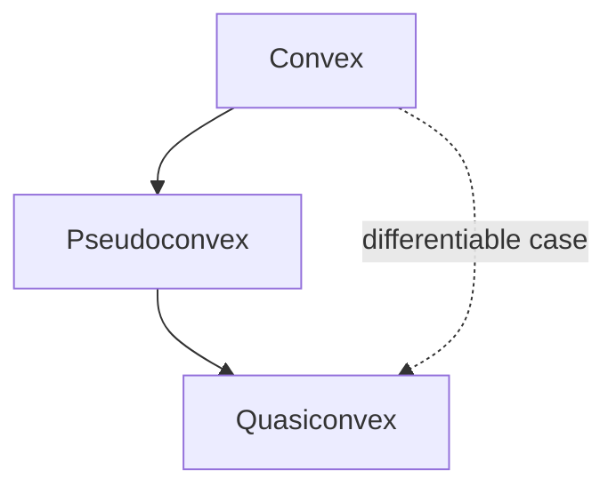

## Quasiconvexity and Pseudoconvexity

### Overview

Quasiconvexity and pseudoconvexity are generalizations of convexity that preserve much of its algorithmic usefulness (unimodality, favorable optimality conditions) while relaxing the strict structural requirements. They matter because many functions arising in economics, fractional programming, and engineering design are not convex but still behave well enough for local-search and gradient-based methods to succeed.

### Quasiconvexity

**Definition**

A function $f: \mathcal{D} \to \mathbb{R}$, with $\mathcal{D} \subseteq \mathbb{R}^n$ convex, is **quasiconvex** if every sublevel set is convex:

$$S_\alpha = \{x \in \mathcal{D} : f(x) \leq \alpha\} \text{ is convex for every } \alpha \in \mathbb{R}$$

**Equivalent line-segment definition**

$$f(\lambda x + (1-\lambda) y) \leq \max\{f(x), f(y)\} \quad \forall x, y \in \mathcal{D}, \, \lambda \in [0,1]$$

**Key Points**

- Every convex function is quasiconvex, but the converse is false.
- Quasiconvexity is preserved under composition with a nondecreasing scalar function: if $f$ is quasiconvex and $g$ is nondecreasing, $g \circ f$ is quasiconvex. Convexity does not enjoy this property in general.
- Quasiconcavity is defined symmetrically via superlevel sets being convex, or $f(\lambda x + (1-\lambda)y) \geq \min\{f(x), f(y)\}$.
- A function that is both quasiconvex and quasiconcave is called **quasilinear**.

**Canonical example**

$f(x) = \sqrt{|x|}$ on $\mathbb{R}$ is quasiconvex (every sublevel set $\{x : \sqrt{|x|} \leq \alpha\} = [-\alpha^2, \alpha^2]$ is an interval, hence convex) but is not convex, since it is concave on $(0, \infty)$.

Another standard example: $f(x) = -e^{-x^2}$ is quasiconvex on $\mathbb{R}$ but not convex — it has an inverted-bell shape, decreasing then increasing, with a single minimum.

### First-Order Condition for Quasiconvexity

**Statement**

Let $f$ be differentiable on convex $\mathcal{D}$. Then $f$ is quasiconvex on $\mathcal{D}$ if and only if:

$$f(y) \leq f(x) \implies \nabla f(x)^T (y - x) \leq 0 \quad \forall x, y \in \mathcal{D}$$

**Interpretation**

If moving from $x$ to $y$ does not increase the function value, then $y - x$ cannot be a strict ascent direction at $x$. Geometrically, the gradient at $x$ defines a supporting hyperplane to the sublevel set $S_{f(x)}$ at $x$ — a weaker requirement than the convex case, where the tangent plane lies below the *entire graph*, not just below the sublevel set boundary.

This is strictly weaker than the convex first-order condition $f(y) \geq f(x) + \nabla f(x)^T(y-x)$. Convexity's condition implies this one; the reverse implication does not hold.

### Second-Order Condition for Quasiconvexity

**Statement**

For twice-differentiable $f$ on open convex $\mathcal{D} \subseteq \mathbb{R}^n$, a **necessary** condition for quasiconvexity is:

$$y^T \nabla^2 f(x) y \geq 0 \quad \text{whenever } y^T \nabla f(x) = 0$$

i.e., the Hessian is positive semidefinite restricted to the subspace orthogonal to the gradient (the tangent space of the level set at $x$).

**Sufficient condition (bordered Hessian test)**

A commonly used sufficient condition involves the bordered Hessian:

$$B(x) = \begin{bmatrix} 0 & \nabla f(x)^T \\ \nabla f(x) & \nabla^2 f(x) \end{bmatrix}$$

If the last $n-1$ leading principal minors of $B(x)$ alternate in sign appropriately (with the sign pattern determined by $n$), $f$ is quasiconvex on $\mathcal{D}$. [Unverified: the exact sign convention and minor-ordering differs across references (some index from the top-left, some from the bottom-right, some state it for quasiconcavity instead and require sign-flipping); this test is notoriously easy to misstate, and I am flagging the general shape of the test rather than committing to one specific sign table without a source in front of me.]

**Why the plain Hessian test fails here**

Unlike ordinary convexity, quasiconvexity does **not** correspond to $\nabla^2 f(x) \succeq 0$ globally — the Hessian is only required to be PSD on the restricted subspace tangent to the level set, not on all of $\mathbb{R}^n$. A quasiconvex function's Hessian can have negative eigenvalues in directions that are not tangent to the sublevel set boundary.

### Sublevel Set Visualization

<svg xmlns="http://www.w3.org/2000/svg" viewBox="0 0 520 300">
<text x="260" y="20" text-anchor="middle" font-size="14" font-weight="bold" fill="#222">Quasiconvexity via Sublevel Sets (svg_diagram)</text>
<text x="130" y="45" text-anchor="middle" font-size="12" fill="#333">Quasiconvex</text>
<path d="M 40 220 Q 130 60 220 220" stroke="#1f6feb" stroke-width="2.5" fill="none" />
<line x1="40" y1="180" x2="220" y2="180" stroke="#e05252" stroke-width="1.5" stroke-dasharray="4,3" />
<text x="230" y="184" font-size="10" fill="#e05252">α</text>
<line x1="30" y1="245" x2="230" y2="245" stroke="#444" stroke-width="1" />
<text x="130" y="260" text-anchor="middle" font-size="10" fill="#555">sublevel set = convex interval</text>
<text x="390" y="45" text-anchor="middle" font-size="12" fill="#333">Not Quasiconvex</text>
<path d="M 300 220 Q 340 100 380 190 Q 420 260 460 90" stroke="#1f6feb" stroke-width="2.5" fill="none" />
<line x1="300" y1="180" x2="480" y2="180" stroke="#e05252" stroke-width="1.5" stroke-dasharray="4,3" />
<text x="490" y="184" font-size="10" fill="#e05252">α</text>
<line x1="290" y1="245" x2="490" y2="245" stroke="#444" stroke-width="1" />
<text x="390" y="260" text-anchor="middle" font-size="10" fill="#555">sublevel set = disconnected</text>
</svg>

### Pseudoconvexity

**Definition**

Let $f$ be differentiable on open convex $\mathcal{D}$. $f$ is **pseudoconvex** if:

$$\nabla f(x)^T (y - x) \geq 0 \implies f(y) \geq f(x) \quad \forall x, y \in \mathcal{D}$$

Equivalently, by contrapositive:

$$f(y) < f(x) \implies \nabla f(x)^T (y-x) < 0$$

**Interpretation**

Pseudoconvexity says that any point with zero directional derivative in a given direction cannot be a direction of decrease — in particular, **any stationary point ($\nabla f(x) = 0$) is a global minimizer**. This is the property that makes pseudoconvexity so useful in optimization: it recovers the single most valuable practical consequence of convexity (first-order stationarity implies global optimality) without requiring full convexity.

### Hierarchy: Convex ⊃ Pseudoconvex ⊃ Quasiconvex (for differentiable functions)

**Key Points**

- Every differentiable convex function is pseudoconvex.
- Every pseudoconvex function is quasiconvex.
- The reverse containments fail in general: quasiconvex does not imply pseudoconvex (quasiconvex functions can have non-stationary local minima that are not global, or "flat" regions violating the pseudoconvex stationarity guarantee), and pseudoconvex does not imply convex.
- Pseudoconvexity requires differentiability by definition; quasiconvexity does not.

**Canonical example distinguishing the classes**

$f(x) = x + x^3$ is strictly increasing, hence quasiconvex (actually quasilinear) and pseudoconvex on $\mathbb{R}$, but $f''(x) = 6x$ changes sign, so it is **not convex**.

A example separating quasiconvex from pseudoconvex: consider a quasiconvex function with a "flat plateau" where $f$ is constant on an interval — $\nabla f = 0$ throughout the plateau (satisfying the antecedent of the pseudoconvexity condition trivially at every plateau point), but only the points at the actual minimum satisfy $f(y) \geq f(x)$ for all comparisons if the plateau is not the global minimum region. [Inference: constructing an explicit closed-form counterexample here requires care to keep it both simple and rigorous; the mechanism — stationary non-minimizing plateau points — is the standard textbook argument for why quasiconvexity alone does not guarantee stationary points are global minima.]

### Worked Example: Fractional Function

**Example**

$f(x) = \dfrac{x}{x^2 + 1}$ on $\mathcal{D} = (-1, \infty)$, a form common in fractional programming.

Compute the derivative:

$$f'(x) = \frac{(x^2+1) - x(2x)}{(x^2+1)^2} = \frac{1 - x^2}{(x^2+1)^2}$$

$f'(x) = 0$ at $x = 1$ (within the domain), $f'(x) > 0$ for $x < 1$, $f'(x) < 0$ for $x > 1$. So $f$ increases then decreases — it is **not** quasiconvex (it is quasi**concave**, since its superlevel sets are intervals), single-peaked with maximum at $x=1$.

**Output**

This function is quasiconcave, not quasiconvex, on $\mathcal{D}$. It illustrates that ratios of a linear and convex quadratic function are frequently quasiconcave or quasiconvex — a property exploited heavily in fractional programming, where objectives like profit/cost ratios are optimized via quasiconvex reformulation techniques (e.g., the Charnes–Cooper transformation).

### Common Pitfalls

**Key Points**

- Assuming quasiconvexity implies stationary points are global minima — this is a pseudoconvexity guarantee, not a quasiconvexity one.
- Applying sum rules from convexity to quasiconvex functions: the **sum of two quasiconvex functions is not generally quasiconvex** (unlike convexity, which is closed under nonnegative sums). Quasiconvexity is preserved under maximization, nondecreasing composition, and some other specific operations, but not addition.
- Confusing quasiconvexity's sublevel-set definition with convexity's epigraph definition — they look structurally similar but describe different objects.
- Treating "unimodal" as synonymous with "quasiconvex" without checking differentiability/domain assumptions; unimodality is the intuitive picture but quasiconvexity is the precise algebraic condition.

### Related Topics

- Strict quasiconvexity and strong quasiconvexity as further refinements
- Fractional programming and the Charnes–Cooper transformation
- Generalized convexity in economic theory (quasiconcave utility and production functions)
- Optimality conditions under pseudoconvexity (KKT sufficiency without full convexity)
- Convex composition rules vs. quasiconvex composition rules
- Log-concavity and its relationship to quasiconcavity