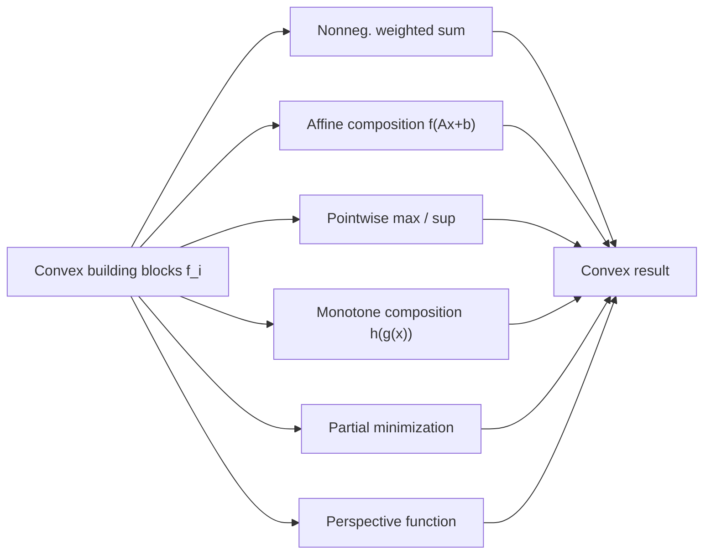

## Operations Preserving Convexity

### Overview

Rather than verifying convexity from the definition or checking Hessians for every new function, most convexity results in practice follow from recognizing that a function is built out of simpler convex pieces via operations known to preserve convexity. This calculus of convexity is the practical backbone of convex optimization modeling — it's how tools like disciplined convex programming (e.g., CVX) verify convexity automatically.

### Nonnegative Weighted Sums

**Statement**

If $f_1, \dots, f_k$ are convex functions and $w_1, \dots, w_k \geq 0$, then:

$$f(x) = \sum_{i=1}^k w_i f_i(x)$$

is convex. If at least one $f_i$ with $w_i > 0$ is strictly convex, $f$ is strictly convex.

**Proof sketch**

Directly from the definition: for $\lambda \in [0,1]$,

$$f(\lambda x + (1-\lambda)y) = \sum_i w_i f_i(\lambda x + (1-\lambda)y) \leq \sum_i w_i \left[\lambda f_i(x) + (1-\lambda) f_i(y)\right] = \lambda f(x) + (1-\lambda) f(y)$$

using convexity of each $f_i$ and $w_i \geq 0$ to preserve the inequality direction termwise.

**Extension to infinite sums / integrals**

If $f(x, y)$ is convex in $x$ for each $y \in \mathcal{Y}$ and $w(y) \geq 0$, then:

$$g(x) = \int_{\mathcal{Y}} w(y) f(x, y) \, dy$$

is convex in $x$, provided the integral exists. This underlies convexity results for expectations: $\mathbb{E}_Y[f(x, Y)]$ is convex in $x$ if $f(x, y)$ is convex in $x$ for every realization of $Y$.

### Composition with Affine Mapping

**Statement**

If $f: \mathbb{R}^m \to \mathbb{R}$ is convex, and $A \in \mathbb{R}^{m \times n}$, $b \in \mathbb{R}^m$, then:

$$g(x) = f(Ax + b)$$

is convex on $\{x : Ax + b \in \text{dom}(f)\}$.

**Key Points**

- This is one of the most heavily used rules in practice: it justifies convexity of linear regression losses, regularization terms with linear transformations, and many constraint reformulations.
- No convexity requirement on $A$ or $b$ is needed — affine maps preserve convexity regardless of direction, unlike general compositions (see below).
- Strict convexity of $f$ does **not** guarantee strict convexity of $g$ unless $A$ has full column rank (otherwise $g$ can be constant along the null space of $A$).

### Pointwise Maximum and Supremum

**Statement**

If $f_1, \dots, f_k$ are convex, then:

$$f(x) = \max\{f_1(x), \dots, f_k(x)\}$$

is convex. More generally, if $f(x, y)$ is convex in $x$ for each $y \in \mathcal{Y}$, then:

$$g(x) = \sup_{y \in \mathcal{Y}} f(x, y)$$

is convex in $x$ (the supremum over an arbitrary, even infinite, index set).

**Interpretation**

Geometrically, the epigraph of a pointwise max is the intersection of the epigraphs of $f_1, \dots, f_k$, and an intersection of convex sets is convex.

**Example**

The dual norm, spectral norm as $\sup$ over unit vectors of a bilinear form, and piecewise-linear functions such as $f(x) = \max\{a_1^Tx + b_1, \dots, a_k^Tx + b_k\}$ are all convex by this rule. This last case is significant: **every piecewise-linear convex function can be represented as a pointwise maximum of affine functions**, and conversely.

**Key Points**

- Pointwise minimum does **not** preserve convexity in general (it preserves concavity instead, by the symmetric argument).
- This rule is the theoretical basis for epigraph-based reformulations in convex optimization, where a nonsmooth convex objective like $\max_i f_i(x)$ is converted into a smooth objective plus constraints via an auxiliary variable $t \geq f_i(x) \, \forall i$.

### Composition Rules (Scalar Case)

**Statement**

Let $h: \mathbb{R} \to \mathbb{R}$ and $g: \mathbb{R}^n \to \mathbb{R}$, and define $f(x) = h(g(x))$. Then $f$ is convex if any of the following hold:

| Condition on $h$ | Condition on $g$ | Result |
| --- | --- | --- |
| $h$ convex, nondecreasing | $g$ convex | $f$ convex |
| $h$ convex, nonincreasing | $g$ concave | $f$ convex |
| $h$ concave, nondecreasing | $g$ concave | $f$ concave |
| $h$ concave, nonincreasing | $g$ convex | $f$ concave |

**Why monotonicity matters**

The intuitive reason: composing a convex increasing outer function with a convex inner function "amplifies convexity in a consistent direction." If $h$ were convex but *decreasing*, composing with a convex (increasing-curvature) $g$ could flip the net curvature, so the inner function needs to be concave to compensate.

**Proof sketch (case 1: $h$ convex nondecreasing, $g$ convex)**

$$f(\lambda x + (1-\lambda) y) = h(g(\lambda x + (1-\lambda)y)) \leq h(\lambda g(x) + (1-\lambda) g(y))$$

using convexity of $g$ and $h$ nondecreasing (so the inequality direction on the *argument* of $h$ carries through). Then:

$$h(\lambda g(x) + (1-\lambda) g(y)) \leq \lambda h(g(x)) + (1-\lambda) h(g(y)) = \lambda f(x) + (1-\lambda) f(y)$$

using convexity of $h$ directly.

**Second-order verification (1D, when twice differentiable)**

$$f''(x) = h''(g(x)) \, g'(x)^2 + h'(g(x)) \, g''(x)$$

This formula makes the table's conditions transparent: both terms are nonnegative exactly when the corresponding table row's sign conditions hold ($h'' \geq 0$ always needed since it's multiplied by a square; $h'(g(x))$'s sign combined with $g''(x)$'s sign determines the second term).

### Vector Composition Rule

**Statement**

If $h: \mathbb{R}^k \to \mathbb{R}$ is convex and nondecreasing in each argument, and $g_i: \mathbb{R}^n \to \mathbb{R}$ are convex for $i = 1, \dots, k$, then:

$$f(x) = h(g_1(x), \dots, g_k(x))$$

is convex.

**Example**

$f(x) = \log\left(\sum_i e^{g_i(x)}\right)$ is convex whenever each $g_i$ is convex, since log-sum-exp is convex and nondecreasing in each coordinate.

### Partial Minimization

**Statement**

If $f(x, y)$ is jointly convex in $(x, y)$ over convex set $C$, and $C$'s projection is such that the minimization is over a convex set, then:

$$g(x) = \inf_{y \in \mathcal{S}} f(x, y)$$

is convex in $x$, provided $g(x) > -\infty$ for all relevant $x$ and $\mathcal{S}$ is convex.

**Interpretation**

This is the dual mechanism to pointwise supremum: minimizing out variables from a jointly convex function preserves convexity in the remaining variables, whereas maximizing over an index set preserves convexity when the family is convex in the free variable. Partial minimization is what justifies convexity of value functions in many two-stage optimization and control problems, and underlies Moreau envelope / infimal convolution constructions.

**Example**

The Euclidean distance to a convex set $\mathcal{S}$,

$$\text{dist}(x, \mathcal{S}) = \inf_{y \in \mathcal{S}} \|x - y\|_2$$

is convex in $x$, since $\|x-y\|_2$ is jointly convex in $(x,y)$ and $\mathcal{S}$ is convex.

### Perspective Function

**Statement**

If $f: \mathbb{R}^n \to \mathbb{R}$ is convex, its **perspective**:

$$g(x, t) = t \, f(x/t), \quad t > 0$$

is jointly convex in $(x, t)$.

**Example**

The perspective of $f(x) = x^Tx$ is $g(x,t) = \dfrac{\|x\|_2^2}{t}$, which is jointly convex in $(x, t)$ for $t > 0$ — a fact used directly in second-order cone and semidefinite programming reformulations.

### Composition Operations Summary

### Common Pitfalls

**Key Points**

- Applying the composition table without checking the monotonicity condition on $h$ — convexity of $h$ alone is not sufficient; the direction of monotonicity must match $g$'s convexity/concavity as shown in the table.
- Assuming pointwise minimum preserves convexity — it does not, in general; only pointwise maximum/supremum does.
- Forgetting that partial minimization requires *joint* convexity in $(x,y)$, not just convexity in $y$ for fixed $x$.
- Assuming products of convex functions are convex — this is **false in general** (e.g., $x^2$ and $x^2$ are both convex on $\mathbb{R}$, but their product $x^4$ is still convex, whereas $x$ and $x$ are both convex/affine but $x \cdot x = x^2$... the correct general caution is that products of convex functions are convex only under additional conditions, such as both being nonnegative, nondecreasing, and convex — unlike sums, there is no unconditional product rule).

### Related Topics

- Disciplined convex programming (DCP) rule sets used in solvers like CVX/CVXPY
- Conjugate functions and how convexity-preserving operations interact with duality
- Infimal convolution and Moreau envelopes
- Convexity of value functions in dynamic programming
- Log-convexity and its own separate composition calculus
- Matrix convexity (operator convex functions) as a generalization beyond scalar composition