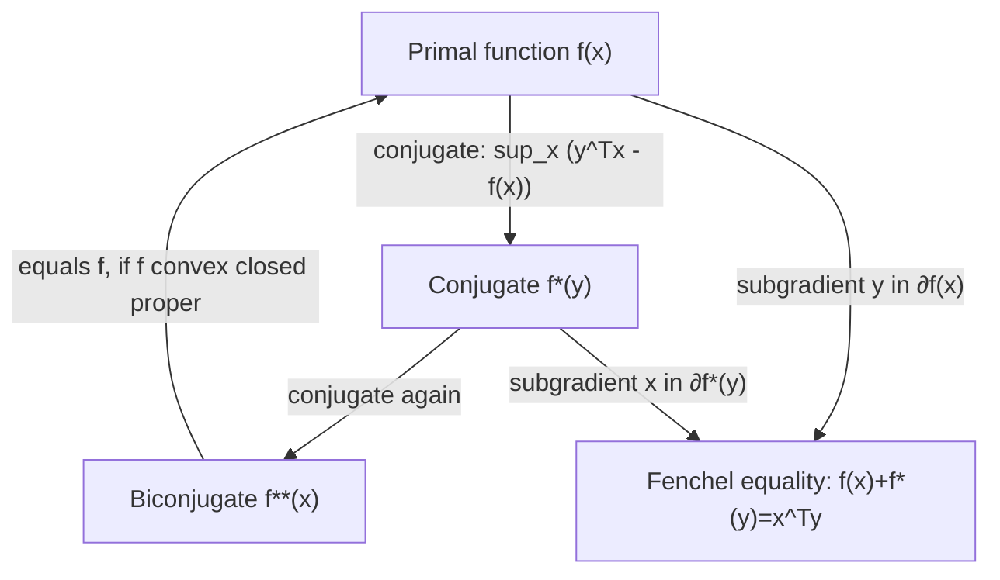

## Conjugate Functions and Legendre Transform

### Overview

The convex conjugate (Fenchel conjugate) generalizes the Legendre transform to arbitrary functions, providing a duality mapping that underlies Lagrangian duality, dual optimization algorithms, and the geometric interpretation of subgradients. It converts a function into a new function whose graph encodes tangent-hyperplane information about the original.

### The Legendre Transform (Classical, Smooth Case)

**Definition**

For a strictly convex, differentiable function $f: \mathbb{R} \to \mathbb{R}$ with $f'$ invertible, the Legendre transform is:

$$f^*(y) = y \, x(y) - f(x(y))$$

where $x(y)$ is defined implicitly by $y = f'(x(y))$, i.e., $x(y) = (f')^{-1}(y)$.

**Interpretation**

$f^*(y)$ measures, at slope $y$, the maximum vertical gap between the line $yx$ and the graph of $f$. The transform re-parametrizes the function by its slope rather than its argument — this is exactly the change of variables used to pass from Lagrangian to Hamiltonian mechanics, and from Lagrangian to Hamiltonian formulations in classical mechanics and thermodynamics.

### The Convex (Fenchel) Conjugate

**Definition**

For any function $f: \mathbb{R}^n \to \mathbb{R} \cup \{+\infty\}$ (not necessarily convex or differentiable), the **convex conjugate** is:

$$f^*(y) = \sup_{x \in \text{dom}(f)} \left( y^T x - f(x) \right)$$

This is defined for **every** function $f$, regardless of whether $f$ itself is convex — this is the key generalization over the classical Legendre transform, which required differentiability and strict convexity.

**Key Points**

- $f^*$ is always convex, even when $f$ is not — it is a pointwise supremum of affine functions of $y$ (one affine function $y \mapsto y^Tx - f(x)$ for each fixed $x$), and pointwise suprema of affine (hence convex) functions are convex.
- $\text{dom}(f^*)$ consists of those $y$ for which the supremum is finite, i.e., where the hyperplane with slope $y$ can be shifted to touch the epigraph of $f$ from below.
- $f^*$ is a proper, closed convex function whenever $f$ is proper (not identically $+\infty$ and never $-\infty$).

### Fenchel's Inequality (Young–Fenchel Inequality)

**Statement**

Directly from the definition of supremum:

$$f(x) + f^*(y) \geq x^T y \quad \forall x, y$$

**Interpretation**

Equality holds precisely when $y$ is a subgradient of $f$ at $x$ (equivalently, when $x$ achieves the supremum defining $f^*(y)$). This inequality is the general form of several classical inequalities: for $f(x) = \frac{1}{p}|x|^p$, Fenchel's inequality specializes to **Young's inequality**, $xy \leq \frac{|x|^p}{p} + \frac{|y|^q}{q}$ for conjugate exponents $\frac{1}{p} + \frac{1}{q} = 1$.

### Geometric Interpretation

<svg xmlns="http://www.w3.org/2000/svg" viewBox="0 0 520 320">
<text x="260" y="20" text-anchor="middle" font-size="14" font-weight="bold" fill="#222">Conjugate as Max Gap Between Line and Curve (svg_diagram)</text>
<line x1="40" y1="280" x2="480" y2="280" stroke="#444" stroke-width="1.5" />
<line x1="60" y1="300" x2="60" y2="40" stroke="#444" stroke-width="1.5" />
<path d="M 80 260 Q 220 60 440 250" stroke="#1f6feb" stroke-width="2.5" fill="none" />
<line x1="80" y1="270" x2="440" y2="90" stroke="#e05252" stroke-width="2" />
<line x1="270" y1="130" x2="270" y2="178" stroke="#2ea44f" stroke-width="2" stroke-dasharray="3,2" />
<text x="280" y="155" font-size="11" fill="#2ea44f">f*(y) = gap</text>
<text x="150" y="240" font-size="11" fill="#1f6feb">f(x)</text>
<text x="400" y="100" font-size="11" fill="#e05252">line: yx</text>
</svg>

The red line has slope $y$; the green dashed segment shows the maximum vertical distance $yx - f(x)$ over all $x$, achieved where the tangent to $f$ has slope exactly $y$ (for smooth $f$).

### Biconjugation and the Fenchel–Moreau Theorem

**Statement**

The conjugate of the conjugate, $f^{**} = (f^*)^*$, satisfies:

$$f^{**}(x) \leq f(x) \quad \forall x$$

always, with **equality** if and only if $f$ is a proper, closed (lower semicontinuous), convex function. This is the **Fenchel–Moreau theorem**.

**Interpretation**

$f^{**}$ is the tightest convex, lower-semicontinuous function that lies at or below $f$ — it is precisely the **convex envelope** (convex hull of the epigraph) of $f$. Biconjugation acts as a convexifying operation: if $f$ is not convex, taking the conjugate twice does not recover $f$, but instead recovers its convex relaxation.

**Consequence**

For convex, closed, proper $f$, conjugation is an involution: $f^{**} = f$. This symmetry is what makes Fenchel duality theory well-posed — dualizing twice returns the original convex problem.

### Worked Example 1: Quadratic Function

**Example**

$f(x) = \frac{1}{2} x^T A x$ with $A \succ 0$ symmetric.

$$f^*(y) = \sup_x \left( y^Tx - \tfrac{1}{2}x^TAx \right)$$

Setting the gradient of the objective in $x$ to zero: $y - Ax = 0 \implies x^* = A^{-1}y$. Substituting:

$$f^*(y) = y^T A^{-1} y - \tfrac{1}{2}(A^{-1}y)^T A (A^{-1}y) = y^T A^{-1}y - \tfrac{1}{2} y^T A^{-1} y = \tfrac{1}{2} y^T A^{-1} y$$

**Output**

$f^*(y) = \frac{1}{2} y^T A^{-1} y$. The conjugate of a quadratic form is a quadratic form in the inverse matrix — this self-dual structure (up to matrix inversion) is a hallmark of quadratic convex functions and is directly exploited in dual formulations of quadratic programs.

### Worked Example 2: Negative Entropy

**Example**

$f(x) = x \log x$ for $x > 0$ (with $f(0) = 0$), the negative entropy function, common in information-theoretic and maximum-entropy formulations.

$$f^*(y) = \sup_{x > 0} (yx - x\log x)$$

Differentiate with respect to $x$: $y - \log x - 1 = 0 \implies x^* = e^{y-1}$. Substituting:

$$f^*(y) = y \, e^{y-1} - e^{y-1}(y-1) = e^{y-1}\left[y - (y-1)\right] = e^{y-1}$$

**Output**

$f^*(y) = e^{y-1}$, defined for all $y \in \mathbb{R}$. This conjugate pair (negative entropy / exponential) underlies the derivation of the softmax function as the gradient map of the conjugate, and appears throughout exponential-family statistics and the derivation of the KL divergence as a Bregman divergence.

### Worked Example 3: Indicator Function and Support Function

**Example**

Let $\mathcal{C} \subseteq \mathbb{R}^n$ be convex, and define the indicator function:

$$I_{\mathcal{C}}(x) = \begin{cases} 0 & x \in \mathcal{C} \\ +\infty & x \notin \mathcal{C} \end{cases}$$

$$I_{\mathcal{C}}^*(y) = \sup_{x \in \mathcal{C}} y^T x =: S_{\mathcal{C}}(y)$$

**Output**

The conjugate of the indicator function is the **support function** $S_{\mathcal{C}}(y)$ of the set $\mathcal{C}$. This pairing is central to convex geometry: it converts questions about a set's shape into questions about a convex function, and appears directly in the derivation of convex-set separation results and in defining dual norms (the dual norm $\|\cdot\|_*$ is the support function of the unit ball of $\|\cdot\|$).

### Relationship to Subgradients

**Statement**

For convex $f$, $y \in \partial f(x)$ (the subdifferential at $x$) if and only if equality holds in Fenchel's inequality:

$$f(x) + f^*(y) = x^Ty$$

Equivalently:

$$y \in \partial f(x) \iff x \in \partial f^*(y)$$

**Interpretation**

This is a precise duality between the subdifferentials of $f$ and $f^*$ — it generalizes the classical relationship $y = f'(x) \iff x = (f')^{-1}(y)$ from the smooth Legendre transform to the nonsmooth, non-strictly-convex setting, replacing single-valued derivative inverses with set-valued subdifferential correspondences.

### Properties Under Operations

| Operation on $f$ | Effect on $f^*$ |
| --- | --- |
| Scaling: $g(x) = \alpha f(x)$, $\alpha > 0$ | $g^*(y) = \alpha f^*(y/\alpha)$ |
| Translation: $g(x) = f(x - a)$ | $g^*(y) = f^*(y) + a^Ty$ |
| Linear perturbation: $g(x) = f(x) + b^Tx$ | $g^*(y) = f^*(y - b)$ |
| Scaling argument: $g(x) = f(\lambda x)$, $\lambda \neq 0$ | $g^*(y) = f^*(y/\lambda)$ |
| Infimal convolution: $(f_1 \square f_2)(x) = \inf_{u} f_1(u) + f_2(x-u)$ | $(f_1 \square f_2)^* = f_1^* + f_2^*$ |

**Key Points**

- The last row's dual — sums become infimal convolutions under conjugation — is the key identity behind Fenchel duality and behind Moreau envelope constructions ($f^*$ of the Moreau envelope of $f$ relates to $f^*$ plus a quadratic).
- These rules make conjugates of composite functions tractable to compute without redoing the supremum from scratch every time.

### Fenchel Duality Diagram

### Common Pitfalls

**Key Points**

- Assuming $f^{**} = f$ always — this only holds for proper, closed, convex $f$; for nonconvex or non-lower-semicontinuous $f$, $f^{**}$ is strictly below $f$ somewhere (it gives the convex envelope instead).
- Forgetting that $\text{dom}(f^*)$ can be a strict subset of $\mathbb{R}^n$, or even just $\{0\}$ for very rapidly growing $f$ — the supremum defining $f^*(y)$ may be $+\infty$ for many $y$.
- Confusing the classical Legendre transform's requirement (differentiability, invertible derivative) with the Fenchel conjugate's generality (defined for any function) — the two coincide only in the smooth, strictly convex case.
- Sign errors in the definition — some references use $\sup_x(x^Ty - f(x))$ and others define related but distinct objects (e.g., $\inf$ versions for concave functions); always confirm the convention in context.

### Related Topics

- Lagrangian duality and the derivation of dual optimization problems via conjugates
- Bregman divergences generated by convex conjugate pairs
- Moreau envelope and proximal operators as conjugate-related smoothing techniques
- Dual norms and their construction via support functions
- Fenchel–Rockafellar duality theorem for constrained optimization
- Exponential family distributions and conjugate duality with cumulant generating functions